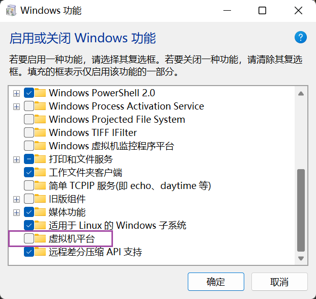

KVM 学习笔记


# 虚拟化介绍
- 什么是虚拟化


# 虚拟化用处
- 为什么用虚拟化技术


# 不同对象虚拟化类型


# 虚拟机

# 虚拟机监视器 VMM
- 也叫 Hypervisor
- 运行在物理服务器和操作系统之间的中间层
- 允许多个操作系统共享底层的内存、CPU、磁盘等硬件

## VMM 类型

### 裸金属型
- 裸机虚拟化环境（Bare-Metal Hardware）
- VMM 在硬件上，在 VMM 上安装多个虚拟机（VM）


### 宿主型
- 主机虚拟化环境（Hosted Virtualization）
- 硬件上原本有操作系统，在操作系统上安装 VMM，虚拟机再装在 VMM 上
- 类似 windows 系统中装 VMWare，然后 VMWare 上装虚拟机


# 虚拟化技术实现类型

## 全虚拟化
- GuestOS 并不知道自己是虚拟机，以为自己是运行在计算机物理硬件上的 HostOS
- 全虚拟化的 GuestOS 有完全的物理机特性
- 全虚拟化的 VMM 会将一个 OS 能操作的 CPU、内存、外设等物理设备逻辑抽象为虚拟
内存、虚拟外设等虚拟设备后交给 GuestOS 来操作
- VMM 给GuestOS 创造了一种假象，让 GuestOS 以为自己操作硬件
- 全虚拟化不做 CPU 和内存模拟，只对 CPU 和内存做相应的分配等操作


### 软件辅助的全虚拟化
- 如 VMWare 

### 硬件辅助的全虚拟化 HVM
- 如 KVM


## 半虚拟化
- 运行在 VMM 中的 GuestOS 需要修改内核源码
- GuestOS 知道自己运行在虚拟化环境中
- 处理一些特权指令，让 HostOS 在捕获到 GuestOS 内核指令或敏感指令时，
  HostOS 能准确判断出该指令是否属于 GuestOS


# KVM
- KVM 已成为 Linux 内核中集成的功能
- KVM 中的每个虚拟机被当作常规的 Linux 进程，由标准的 Linux 调度程序进行调度
- 单机运行，如果需要跨主机统一管理多个虚拟机，需要其他的虚拟化管理平台


## KVM 虚拟化实现
- KVM 内核模块
初始化 CPU 硬件，打开虚拟机模式，负责 CPU、内存、中断控制器、时钟
有内核模块实现
字符设备 /dev/kvm
工作于 VMM 


- QEMU 进程
工作在用户空间
实现模拟 IO 设备，如显卡、网卡、硬盘等

- qemu-kvm 
工作在用户空间
用于实现一个虚拟机实例

- libvirt
提供统一的 API，守护进程 libvirtd 和相关工具，如 virsh,virt-manager 等


## VMWare 的虚拟机中使用 KVM
- VMWare 安装在 Windows 系统上，windows 上要开启虚拟化功能
- windows 上打开 `虚拟机平台` 后 VMWare 不能开启虚拟化引擎


- VMWare 选一个虚拟机，开启虚拟化引擎


### 验证是否开启虚拟化支持

```bash
root@Rocky8 ~ $ grep -Em 1 "vmx|svm" /proc/cpuinfo
flags           : fpu vme de pse tsc msr pae mce cx8 apic sep mtrr pge mca cmov pat pse36 clflush mmx fxsr sse sse2 ss syscall nx pdpe1gb rdtscp lm constant_tsc arch_perfmon rep_good nopl xtopology tsc_reliable nonstop_tsc cpuid pni pclmulqdq vmx ssse3 fma cx16 pcid sse4_1 sse4_2 x2apic movbe popcnt tsc_deadline_timer aes xsave avx f16c rdrand hypervisor lahf_lm abm 3dnowprefetch cpuid_fault invpcid_single ssbd ibrs ibpb stibp ibrs_enhanced tpr_shadow vnmi ept vpid ept_ad fsgsbase tsc_adjust bmi1 avx2 smep bmi2 erms invpcid rdseed adx smap clflushopt clwb sha_ni xsaveopt xsavec xgetbv1 xsaves arat umip pku ospke gfni vaes vpclmulqdq rdpid movdiri movdir64b fsrm md_clear flush_l1d arch_capabilities
```

```bash
root@Rocky8 ~ $ lscpu | grep -Eim 1 "svm|vmx"
Flags:               fpu vme de pse tsc msr pae mce cx8 apic sep mtrr pge mca cmov pat pse36 clflush mmx fxsr sse sse2 ss syscall nx pdpe1gb rdtscp lm constant_tsc arch_perfmon rep_good nopl xtopology tsc_reliable nonstop_tsc cpuid pni pclmulqdq vmx ssse3 fma cx16 pcid sse4_1 sse4_2 x2apic movbe popcnt tsc_deadline_timer aes xsave avx f16c rdrand hypervisor lahf_lm abm 3dnowprefetch cpuid_fault invpcid_single ssbd ibrs ibpb stibp ibrs_enhanced tpr_shadow vnmi ept vpid ept_ad fsgsbase tsc_adjust bmi1 avx2 smep bmi2 erms invpcid rdseed adx smap clflushopt clwb sha_ni xsaveopt xsavec xgetbv1 xsaves arat umip pku ospke gfni vaes vpclmulqdq rdpid movdiri movdir64b fsrm md_clear flush_l1d arch_capabilities
```

```bash
root@Rocky8 ~ $ lsmod | grep -Ei "kvm"
kvm_intel             344064  0
kvm                   954368  1 kvm_intel
irqbypass              16384  1 kvm
```

```bash
root@Rocky8 ~ $ ll /dev/kvm
crw-rw-rw- 1 root kvm 10, 232 Jun  6 11:18 /dev/kvm
```


### 安装 KVM 工具包


- qemu-kvm
为 KVM 提供底层仿真支持

- libvirt
KVM 虚拟化管理工具和应用程序接口，通过 libvirt 调用 KVM 创建虚拟机
libvirt 是 KVM 通用的访问 API

- virt-manager
管理 KVM 中虚拟机的图形化工具
```bash
root@Rocky8 ~ $ rpm -q virt-manager
package virt-manager is not installed
root@Rocky8 ~ $ yum info virt-manager
Last metadata expiration check: 1:01:00 ago on Tue 06 Jun 2023 01:59:45 PM CST.
Available Packages
Name         : virt-manager
Version      : 3.2.0
Release      : 4.el8
Architecture : noarch
Size         : 620 k
Source       : virt-manager-3.2.0-4.el8.src.rpm
Repository   : appstream
Summary      : Desktop tool for managing virtual machines via libvirt
URL          : https://virt-manager.org/
License      : GPLv2+
Description  : Virtual Machine Manager provides a graphical tool for administering virtual
             : machines for KVM, Xen, and LXC. Start, stop, add or remove virtual devices,
             : connect to a graphical or serial console, and see resource usage statistics
             : for existing VMs on local or remote machines. Uses libvirt as the backend
             : management API.
```


# 虚拟化管理平台

## OpenStack

