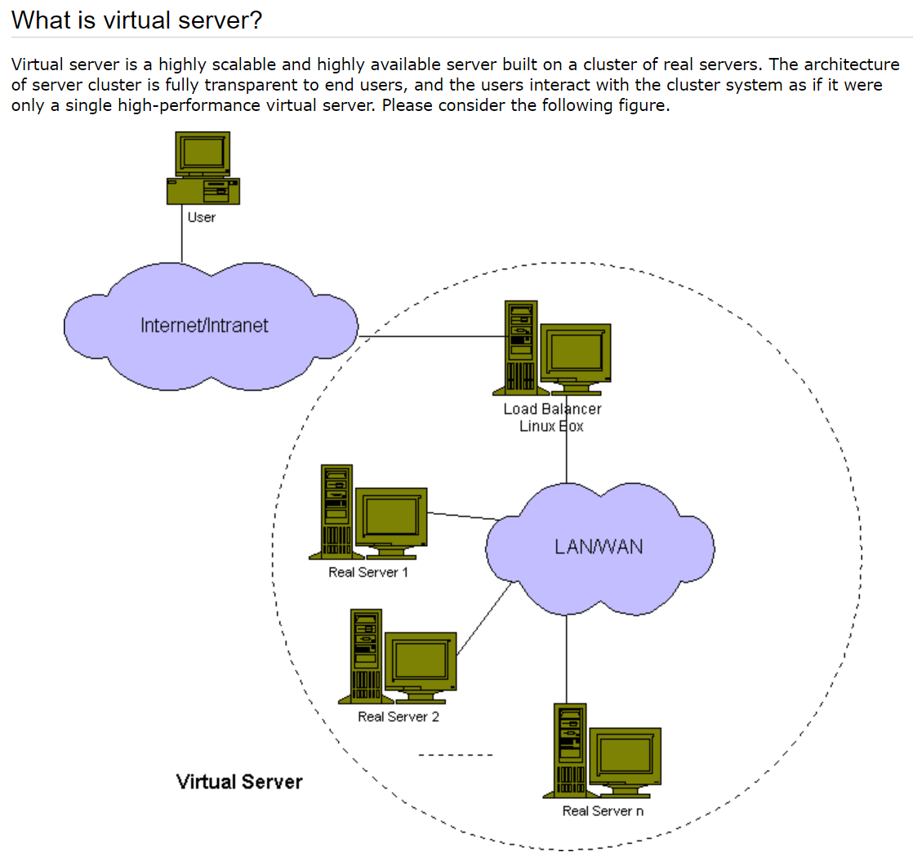

开源负载均衡器 Linux Virtual Server


# 资源
> 维基百科介绍：[Linux Virtual Server](https://en.wikipedia.org/wiki/Linux_Virtual_Server)
> 红帽介绍文档：[Virtual Server Administration](https://access.redhat.com/documentation/en-us/red_hat_enterprise_linux/4/html/virtual_server_administration/index)

> [5. LVS-NAT](https://docs.huihoo.com/hpc-cluster/linux-virtual-server/HOWTO/LVS-HOWTO.LVS-NAT.html)
> [The Linux Enterprise Cluster: Build a Highly Available Cluster with Commodity Hardware and Free Software](https://books.google.co.jp/books?id=wiCGoCq8n4oC&pg=PA196&lpg=PA196&dq=LVS-NAT&source=bl&ots=NsZuExpQ3q&sig=ACfU3U2oy5ADOp1o8KTUTiiXlELmxqlfSQ&hl=zh-CN&sa=X&ved=2ahUKEwjo-cbF1vj-AhW6gVYBHd-uDgMQ6AF6BAgYEAM#v=onepage&q=LVS-NAT&f=false)


# 提升性能的两种方式 —— Scaling UP and Scaling out
> [Growing compute by scaling up and scaling out](https://developer.ibm.com/articles/scale-up-and-scale-out-vms-vs-containers/)


- Scaling up 
垂直扩展，即提升机器的性能
例如普通的马换成汗血宝马

- Scaling out
水平扩展，即增加机器的数量
如原来一匹马变为一群马


两种方式看具体场景选择

# 分布式系统
> [Distributed computing](https://en.wikipedia.org/wiki/Distributed_computing) 

分布式系统是由多个相互协作的计算机组成的计算机系统，这些计算机通过网络或其他通信媒介互相连接和通信，
以协调它们的行为来提供一个统一的服务或执行一个共同的任务。

分布式系统可以分为以下几类：

1. 客户端-服务器系统：客户端发送请求，服务器响应请求并提供服务，常见的应用包括Web应用、数据库系统等。
2. 对等式系统：对等式系统由多个节点组成，每个节点都可以提供服务并请求其他节点提供服务，常见的应用包括文件共享、P2P 网络等。
3. 事件驱动系统：事件驱动系统由多个组件组成，每个组件都有自己的状态和事件，通过事件的触发和处理来实现系统的功能，常见的应用包括传感器网络、电力系统等。
4. 分布式计算系统：分布式计算系统是一种将大规模的计算任务分解为小的计算子任务并分配到多个计算节点上进行计算的系统，常见的应用包括科学计算、数据分析等。

分布式系统的优点包括可扩展性、可靠性和容错性等。
但是，分布式系统在设计、实现和管理方面存在一些挑战，例如，一致性、并发性、性能和安全等问题，需要采用适当的技术和策略来解决。


# 集群 Cluster
> [Computer cluster](https://en.wikipedia.org/wiki/Computer_cluster)
> [An Overview of Cluster Computing](https://www.geeksforgeeks.org/an-overview-of-cluster-computing/)


- 多个计算机组合起来形成单个系统
- 集群中的每个节点（node）执行相同的任务，由软件控制和调度
- 集群中的各节点通常在一个局域网（fast LANs）中
- 通常集群中的各节点有相同的硬件和操作系统（不是一定的）

## 集群的作用
> [Benefits](https://en.wikipedia.org/wiki/Computer_cluster#Benefits)


> In terms of scalability, clusters provide this in their ability to add nodes horizontally. This means that more computers may be added to the cluster, to improve its performance, redundancy and fault tolerance. 

- 水平扩展改善性能
- 冗余（redundancy） 
- 容错（fault tolerance）


### 冗余（redundancy）和容错（tolerance）
- 来自 ChatGPT v3.5 回答

Redundancy and fault tolerance both refer to the ability of a system to continue operating normally even in the face of failures or faults. 

However, they are not the same thing.  

Redundancy refers to the use of extra or backup resources or components that provide redundancy in case of failures or downtime. 
For example, adding extra hard drives to a server as a RAID configuration or using multiple power supplies.
Redundancy aims to prevent failure or downtime by ensuring that there are backup resources available in case of a failure.

Fault tolerance, on the other hand, refers to a system's ability to continue operating normally in the event of a failure or fault in one or more components, without any disruption to the normal operation of the system. Fault tolerance typically involves designing a system with redundancy, load balancing, and failover mechanisms so that if one component fails or becomes unavailable, the system can continue to operate with no noticeable impact on users or applications.

In summary, redundancy is the provision of extra or backup resources to prevent failure or downtime, while fault tolerance is the ability of a system to continue operating normally even in the presence of component failures or faults. Redundancy is a technology or approach used to achieve fault tolerance, but it is not the same thing as fault tolerance itself.


- 冗余在于提供一些备份资源，可以在一个资源出问题时替代
- 容错则是在出问题后能在不影响正常操作时恢复正常，
一个有容错能力的系统通常会做 redundancy，load balancing 和 failover machanisms
- 冗余是实现容错的一种方法，但不是容错


## 集群的类型
> [An Overview of Cluster Computing](https://www.geeksforgeeks.org/an-overview-of-cluster-computing/)


### High performance (HP) clusters
> HP clusters use computer clusters and supercomputers to solve advance computational problems.
> They are designed to take benefit of the parallel processing power of several nodes.

通常用于解决高计算能力需求的场景，并行处理需求


### Load-balancing clusters
> This type of distribution is generally used in a web-hosting environment.

避免单个节点接受大量的任务，通常用于 web 服务，可以分担任务


### High Availability (HA) Clusters
高可用集群，避免单点失败（single point of failure）
增加冗余节点来避免失败


# SLA (Service level agreement)

- 服务等级协议
- 服务提供商和用户间定义的一种双方认可的协议，来约定服务的可用性
- 例如定义服务保持多久在线


计划外停机时间是指系统或服务在未经预先安排的维护期之外无法提供服务的时间。
以下是常见的三个SLA可用性级别以及对应的计划外停机时间：

1. 90%的可用性：计划外停机时间为36.5天（即，365天中有36.5天无法提供服务）。
2. 99%的可用性：计划外停机时间为3.65天（即，365天中有3.65天无法提供服务）。
3. 99.9%的可用性：计划外停机时间为8.76小时（即，365天中有8.76小时无法提供服务）。

计算公式：Total downtime = (100% - Availability%) x Total time in the period
例如：90 = (1-90%)*365 = 36.5

注意，这三个级别仅供参考，实际的SLA级别和计划外停机时间将取决于具体的服务类型、应用场景和客户需求等因素。


# LB Cluster 负载均衡集群

## 按实现方式分类

### 硬件
> [F5 Big-IP](https://community.f5.com/t5/technical-articles/what-is-big-ip/ta-p/279398)

- F5 Big-IP

### 软件
- lvs
- [SLB](https://developer.aliyun.com/article/1803)
- nginx
- haproxy
- ats
- perlbal
  
## 按工作的协议层次划分

### 传输层（运输层）
LB Cluster是一种基于协议层次划分的负载均衡集群，可以分为传输层和应用层的负载均衡集群。

传输层负载均衡主要是基于传输层协议（如TCP、UDP等）实现负载均衡，通过端口和IP地址等信息将请求分发到不同的负载均衡节点。
传输层负载均衡集群可以实现基本的负载均衡功能，如可靠性、容错性、服务质量等，但对于应用层的负载均衡功能支持相对较弱，对于某些特定的应用场景可能无法满足需求。

应用层负载均衡主要是基于应用层协议（如HTTP、SMTP等）实现负载均衡，通过解析HTTP请求头、URL、Cookie等信息将请求分发到不同的负载均衡节点。
应用层负载均衡集群可以实现更加细粒度的负载均衡和应用层面的优化，如会话保持、内容缓存、动态路由、应用防火墙等高级功能，可以满足各种复杂的应用场景。

LB Cluster可以根据实际业务需求和技术特点选择不同的负载均衡方案，如基于传输层负载均衡的LB Cluster适用于简单的网络服务，如DNS、SMTP、FTP等服务；基于应用层负载均衡的LB Cluster适用于Web应用、API服务、微服务等具有复杂业务逻辑和交互模式的应用场景。


常见的基于传输层的负载均衡集群包括：

1. LVS（Linux Virtual Server）：基于Linux内核实现的负载均衡软件，支持四层（IP/TCP/UDP）负载均衡及基于IP隧道的三层负载均衡。

2. F5 BIG-IP：商业负载均衡硬件设备和软件，支持四层和七层负载均衡，具有高可用性、高性能、可扩展性和灵活性等优势。

3. Citrix ADC：商业负载均衡硬件设备和软件，支持四层和七层负载均衡，具有高可用性、灵活性、安全性和性能优势。

### 应用层

1. Nginx：开源Web服务器和反向代理软件，支持HTTP、HTTPS、SMTP、POP3等协议的七层负载均衡和反向代理，具有高性能、高可靠性和高可扩展性等优势。

2. Apache HTTP Server：开源Web服务器软件，支持HTTP、HTTPS和FTP等协议的七层负载均衡和反向代理，具有灵活性和可扩展性等优势。

3. HAProxy：开源的七层负载均衡软件，支持HTTP、HTTPS、TCP和UDP等协议的负载均衡和反向代理，具有高性能、高可靠性和灵活性等优势。


# 负载均衡的会话保持

## session sticky
同一用户调度固定的服务器

- 基于Cookie
将用户的会话ID存储到Cookie中，并设置Cookie的过期时间，使得客户端下次请求时会带上该Cookie，
以便后端服务器获取会话ID，从而保持会话状态。

- 基于IP地址
将用户的IP地址作为会话ID存储到共享存储中，例如Redis、Memcached等，当后续请求到来时，
负载均衡器通过IP地址识别出用户，并将请求转发到之前处理该用户请求的服务器上。

- 基于URL重写
将用户的会话ID作为URL的一部分，例如在URL后添加一些参数，或者在URL中添加特殊标记，
使得请求携带会话信息，并将会话ID传递给后端服务器，以保持会话状态。

需要注意的是，会话保持会对负载均衡集群带来额外的负担和风险，
如会话信息泄露、性能损耗、单点故障等，因此应根据具体应用场景和业务需求确定是否需要会话保持，并选择合适的实现方式。

## session replication
每台服务器都有全部的 session

- session multicast cluster

## session server
用专门的 session 服务器

将会话信息存储在中心化服务器上的技术，具备较好的可扩展性和高可用性。
在Session Server方案中，所有后端服务器都从共享的Session服务器上获取会话信息，
并将处理结果写回到Session服务器上，这样就能保证多个后端服务器之间的会话信息同步和访问一致性。


# HA 高可用集群

## keepalived
Keepalived是一个为Linux系统提供高可用性解决方案的开源软件。
它可以监控服务器和服务的状态，并自动切换到备用服务器或备用服务，以保证系统的高可用性和可靠性。

其中，Keepalived的核心是一个虚拟路由器冗余协议（Virtual Router Redundancy Protocol，VRRP）的实现，
通过该协议可以在多个服务器之间共享一个虚拟IP地址，并确保虚拟IP地址总是被配置为指向当前运行正常的服务器。
如果主服务器失效，则自动将虚拟IP切换到另外一台服务器上。

除此之外，Keepalived还支持健康检查、故障转移、更改网络拓扑结构等功能，并允许用户进行高度定制化的配置和扩展。
它常用于构建负载均衡器、Web服务器、邮件服务器等高可用性集群环境，是一项受欢迎的技术解决方案之一。


## ASI
AIS (Availability Impact System)是一种用于构建高可用性和灾备系统的开源软件。
它提供了基于分布式系统体系结构的自动故障转移和软件部署功能。

AIS使用多个代理进程监控应用程序、服务和系统资源的状态，并在发现故障时自动采取措施，例如故障转移、软件部署或电源控制等。
AIS提供了一个可扩展的、模块化的平台，可以通过编写自定义插件来满足不同的需求。

AIS支持多种故障转移模式，包括基于VRRP的虚拟IP地址转移、NFS共享文件系统转移等。
同时，它还支持软件RAID、磁盘复制等技术，并提供了自动化的软件部署、配置管理、系统监控等功能。

因为AIS是开源的、可定制的，所以它被广泛应用于各种高可用性和灾备系统场景，如负载均衡器、Web服务器、数据库集群、文件共享等。

## heartbeat
Heartbeat是一个Linux系统中常用的高可用性工具，它使用类似VRRP协议的机制来保证软件或服务的高可用性。
Heartbeat可以通过监控资源状态（如服务进程状态、虚拟IP状态等）来实现自动故障转移。
它支持多种故障转移方式，如基于共享存储的故障转移、基于DRBD的双向数据同步故障转移等。


# LVS 介绍
LVS（Linux Virtual Server）是一个在Linux操作系统上运行的负载均衡软件系统，
它能够将来自客户端的请求分配到多个后端服务器上，以实现高可靠性的服务提供。

LVS包含了多个负载均衡服务模块，其中最常用的是IP负载均衡模块。
该模块使用Linux内核提供的IP负载均衡机制来实现控制数据包转发和请求调度，因此LVS系统具有良好的可扩展性和高性能。


- LVS 是集成在 Linux 内核中的功能
- LVS 实现的是 IP-level 负载均衡
- 包含多个模块，有很好的扩展性
- load balancer 将客户端的请求通过调度算法调度到后端的多个服务器上，实现负载均衡
- 客户并不知道到自己真正使用的是哪个后端服务器，多个后端服务器构成的集群对外就像一个高性能的服务器
- load balancer 和后端的服务器（real server）之间的通讯可以是 high-speed LAN 或 WAN


## 什么是 virtual server
> [Linux Virtual Server](http://www.linuxvirtualserver.org/whatis.html)

> Build a high-performance and highly available server for Linux using clustering technology, 
> which provides good scalability, reliability and serviceability.





## 为什么需要 virtual server
> [Why virtual server?](http://www.linuxvirtualserver.org/why.html)

> The workload on the servers is increasing rapidly so that servers will be easily overloaded for a short time, especially for a popular web site. 

- 单个服务器很难应对越来越多的客户端请求，服务器超负荷工作
- 有两种解决方案：增加服务器的性能，集群方案
- 增加单个服务器的性能始终有个极限，每次升级系统后当过载后又要升级，复杂且代价大
- 集群的方案可扩展性好，且高效


//TODO: 补充 cluster server 几种实现
## 实现 cluster server 的几种方案
> [Load balancing](http://kb.linuxvirtualserver.org/wiki/Load_balancing)

- 不同负载均衡实现方案的比较和应用场景


### DNS based load balancing cluster
DNS 通过调度算法（如 round-robin）将域名解析到不同 IP 的服务器上

However, due to the caching nature of clients and hierarchical DNS system, 
it easily leads to dynamic load imbalance among the servers, 
thus it is not easy for a server to handle its peak load. 


### Dispatcher based load balancing cluster
Dispatcher, also known as load balancer, can be used to distribute load among servers in a cluster, 
so that the parallel services of servers can appear as a virtual service on a single IP address, 
and end users interact as if it were a single server without knowing all servers in clusters.


## 负载均衡的两种等级

### application-level
- 七层负载均衡
- 可以针对应用层的特定协议进行调度，如 nginx
- 如 reverse-proxy 和 pWEB


### IP-level
- 四层负载均衡
- 针对 IP 进行调度


# LVS 集群类型术语
- VS
virtual server

- DS
director server
dispacher
load balancer

- RS
real server

- CIP 
client IP
客户端 IP

- VIP
virtual server IP
VS 对外 IP

- DIP
director IP
VS 内网 IP 

- RIP
real server IP
后端服务器的 IP


# LVS 实现的三种方式
> [How virtual server works?](http://www.linuxvirtualserver.org/how.html)

- 四层负载实现


## LVS-NAT
> [Virtual Server via NAT](http://www.linuxvirtualserver.org/VS-NAT.html)


这里的描述基于官网图中的基本框架，VS 是单点
实际可能 VS 也要做负载均衡，前面有个 load balancer 来做负载均衡


- 客户端的请求的报文中目标 IP 是对外的虚拟服务器（VS）的对外 IP（VIP）
- VS 收到请求报文后，根据调度算法选择一个后端服务器来处理客户端的请求
- VS 将请求报文中的目标 IP 地址和端口改为选择的后端服务器的 IP 和端口，做 DNAT 转换
- VS 将该记录写入一个 Hash 表中，以后有该客户端的请求到达时，转发到 Hash 表中记录的后端服务器上
- 后端服务器处理了请求后将报文发给 VS，VS 将源 IP 和端口改回自己的 VIP 和请求时的目的端口，
发回给客户端 


## LVS-TUN


## LVS-DR


# LVS 调度算法


# LVS 和 IPVS
LVS (Linux Virtual Server) and IPVS (IP Virtual Server) are closely related technologies for building high-performance and high-availability load balancers in Linux environments. 

In fact, IPVS is a component of LVS.

To be more specific, LVS is a load-balancing solution that includes both a kernel component (IPVS) and a user-space component (lvsd daemon). 
IPVS provides Layer 4 load balancing for TCP/UDP traffic using a range of scheduling algorithms, such as round-robin, least-connection, weighted-round-robin, and more. It allows multiple backend real servers to be grouped into a single virtual service IP address, and it can handle millions of concurrent connections with low latency and high throughput.

LVS, on the other hand, provides a comprehensive load-balancing framework that includes not only IPVS but also other components such as the lvsd daemon, which can manage the virtual IP addresses, perform health checks on the backend servers, and detect and handle node failures. LVS also supports several load-balancing methods, including IPVS (layer 4), NAT (layer 3), and Tunneling (layer 2). 
Additionally, LVS can be configured for service persistence, failover, and synchronization across multiple nodes.

while IPVS and LVS are related, LVS is not the same as IPVS - rather, IPVS is one of the components of LVS that provides layer 4 load balancing. LVS is a larger and more comprehensive load-balancing solution that includes IPVS and other components, and provides more advanced features and configuration options.


- IPVS 是 LVS 的一部分

# IPVS 内核模块
> [IPVS](http://www.linuxvirtualserver.org/software/ipvs.html)

IPVS stands for IP Virtual Server. It is a kernel module in the Linux operating system that provides Layer 4 load balancing in a hierarchical and scalable manner. IPVS is commonly used with other Linux kernel modules to set up a high-performance and high-availability load balancer for TCP and UDP services.

IPVS provides a virtual service that has a virtual IP address (VIP) and listens to a specific port number. 
When a client connects to the virtual service, IPVS selects one of the real servers (i.e., physical servers) that are part of the IPVS cluster and forwards the traffic to that server. IPVS uses various load-balancing algorithms to select a real server, such as round-robin, weighted round-robin, least-connection, source-dest-IP hash, and more.

IPVS also provides an NAT engine that can be used to maintain the source address of clients connecting to the IPVS cluster. This NAT mode allows the connection to be served by a server even if it doesn't have the VIP configured as its own IP address.

Overall, IPVS provides a flexible and fast load-balancing solution that is suitable for a wide range of applications. It's commonly used in Linux-based load balancers such as LVS (Linux Virtual Server) and HAProxy.


- IPVS 说 linux 的一个内核模块
- IPVS 提供 layer 4 load balancing


## 查看内核中 IPVS 模块
模糊搜索 IPVS 的关键字
先确定内核版本，然后在 `/boot/cinfig-`文件中搜索关键字

```bash
[root@ubuntu22-c3 ~]$ uname -r
5.15.0-73-generic
[root@ubuntu22-c3 ~]$ grep -i -C 10 "ipvs" /boot/config-5.15.0-73-generic
```

看到其中包含如下内容：
```bash
CONFIG_IP_VS=m

#
# IPVS transport protocol load balancing support
#
CONFIG_IP_VS_PROTO_TCP=y
CONFIG_IP_VS_PROTO_UDP=y
CONFIG_IP_VS_PROTO_AH_ESP=y
CONFIG_IP_VS_PROTO_ESP=y
CONFIG_IP_VS_PROTO_AH=y
CONFIG_IP_VS_PROTO_SCTP=y

#
# IPVS scheduler
#
CONFIG_IP_VS_RR=m
CONFIG_IP_VS_WRR=m
CONFIG_IP_VS_LC=m
CONFIG_IP_VS_WLC=m
CONFIG_IP_VS_FO=m
CONFIG_IP_VS_OVF=m
CONFIG_IP_VS_LBLC=m
CONFIG_IP_VS_LBLCR=m
CONFIG_IP_VS_DH=m
CONFIG_IP_VS_SH=m
CONFIG_IP_VS_MH=m
CONFIG_IP_VS_SED=m
CONFIG_IP_VS_NQ=m
CONFIG_IP_VS_TWOS=m

#
# IPVS SH scheduler
#
CONFIG_IP_VS_SH_TAB_BITS=8

#
# IPVS MH scheduler
#
CONFIG_IP_VS_MH_TAB_INDEX=12

#
# IPVS application helper
#
CONFIG_IP_VS_FTP=m
CONFIG_IP_VS_NFCT=y
CONFIG_IP_VS_PE_SIP=m
```
模块关键字为 `IP_VS`，看到 `=m` 表示是以模块方式加载
里面包含 `IPVS transport protocol load balancing support` 四层负载均衡模块
各种调度算法模块

## 查看 IPVS 模块是否已加载
```bash
[root@ubuntu22-c3 ~]$ lsmod | grep -i "ip_vs"
```

没有输出表示该模块当前未加载

## 查看 IPVS 模块的信息
`modinfo` 查看模块信息，即使当前未加载，但在内核中也能显示，部分内容如下：
```bash
[root@ubuntu22-c3 ~]$ modinfo ip_vs
filename:       /lib/modules/5.15.0-73-generic/kernel/net/netfilter/ipvs/ip_vs.ko
license:        GPL
srcversion:     4FE3506EF25C79B61C3BA97
depends:        nf_conntrack,nf_defrag_ipv6,libcrc32c
retpoline:      Y
intree:         Y
name:           ip_vs
vermagic:       5.15.0-73-generic SMP mod_unload modversions
sig_id:         PKCS#7
signer:         Build time autogenerated kernel key
sig_key:        57:61:37:71:BE:F4:68:C5:BD:86:42:AF:17:E2:D7:9A:0A:B2:05:50
sig_hashalgo:   sha512
signature:      9B:F6:D0:92:74:55:52:81:3E:F6:09:E5:F2:71:CD:67:75:93:B0:DD:
```

# ipvsadm LVS 命令行工具
- ipvs 是内核模块，需要在用户空间的工具 ipvsadm 来管理
- 默认未安装该功能，需要手动安装 
- ipvsadm 会监听维护和监听内核中的 virtual server table

```bash
[root@ubuntu22-c3 ~]$ sudo apt install -y ipvsadm
```

查看帮助文档
```bash
ipvsadm - Linux Virtual Server administration
Ipvsadm(8)  is used to set up, maintain or inspect the virtual server table in the Linux kernel.
```

查看服务的状态：
```bash
[root@ubuntu22-c3 ~]$ systemctl status ipvsadm.service
● ipvsadm.service - LSB: ipvsadm daemon
     Loaded: loaded (/etc/init.d/ipvsadm; generated)
     Active: active (exited) since Thu 2023-06-08 16:25:20 CST; 13s ago
       Docs: man:systemd-sysv-generator(8)
    Process: 19552 ExecStart=/etc/init.d/ipvsadm start (code=exited, status=0/SUCCESS)
        CPU: 7ms

Jun 08 16:25:20 ubuntu22-c3 systemd[1]: Starting LSB: ipvsadm daemon...
Jun 08 16:25:20 ubuntu22-c3 ipvsadm[19552]:  * ipvsadm is not configured to run. Please edit /etc/default/ipvsadm
Jun 08 16:25:20 ubuntu22-c3 systemd[1]: Started LSB: ipvsadm daemon.
```

该服务的状态为 `active (exited)` 而非 `active (running)`，表示该服务并非长期运行，执行完成功后即退出
该服务不是 long-running server，而是按需启动

The service is not currently running, but it did run and complete its task without any errors.

In the case of `ipvsadm.service`, this service is a Systemd unit file that provides a command-line interface for configuring IPVS (IP Virtual Server) kernel module. 
When you start this service, it runs the `ipvsadm` command with the appropriate options and generates the necessary IPVS configuration rules in the kernel. 
Once the `ipvsadm` command completes its task, the service exits with a status code of 0, indicating that it completed successfully.

Therefore, it's normal to see the "Active: active (exited)" status for `ipvsadm.service` since it's not a long-running service but rather a utility that is executed on demand to configure the kernel's IP load-balancing rules.


可以看到服务的启动脚本为 `/etc/init.d/ipvsadm`


# LVS-NAT 实验
> [Virtual Server via NAT](http://www.linuxvirtualserver.org/VS-NAT.html)


2. router
eth0 host-only
eth1 host-only
```bash
root@router netplan $ ls
eth0.yaml  eth1.yaml
root@router netplan $ ip a
1: lo: <LOOPBACK,UP,LOWER_UP> mtu 65536 qdisc noqueue state UNKNOWN group default qlen 1000
    link/loopback 00:00:00:00:00:00 brd 00:00:00:00:00:00
    inet 127.0.0.1/8 scope host lo
       valid_lft forever preferred_lft forever
    inet6 ::1/128 scope host
       valid_lft forever preferred_lft forever
2: eth0: <BROADCAST,MULTICAST,UP,LOWER_UP> mtu 1500 qdisc fq_codel state UP group default qlen 1000
    link/ether 00:0c:29:e7:c8:8e brd ff:ff:ff:ff:ff:ff
    altname enp2s1
    altname ens33
    inet 192.168.10.2/24 brd 192.168.10.255 scope global noprefixroute eth0
       valid_lft forever preferred_lft forever
    inet6 fe80::20c:29ff:fee7:c88e/64 scope link
       valid_lft forever preferred_lft forever
3: eth1: <BROADCAST,MULTICAST,UP,LOWER_UP> mtu 1500 qdisc fq_codel state UP group default qlen 1000
    link/ether 00:0c:29:e7:c8:98 brd ff:ff:ff:ff:ff:ff
    altname enp2s5
    altname ens37
    inet 172.16.18.2/24 brd 172.16.18.255 scope global noprefixroute eth1
       valid_lft forever preferred_lft forever
    inet6 fe80::20c:29ff:fee7:c898/64 scope link
       valid_lft forever preferred_lft forever

```
```bash
# This is the network config written by 'subiquity'
network:
  version: 2
  renderer: NetworkManager
  ethernets:
    eth0:
      dhcp4: false
      addresses:
      - 192.168.10.2/24
```
```bash
# This is the network config written by 'subiquity'
network:
  version: 2
  renderer: NetworkManager
  ethernets:
    eth1:
      dhcp4: false
      addresses:
      - 172.16.18.2/24

```
3. LVS
eth0 NAT
eth1 host-only
```bash
[root@lvs netplan]$ ls
bak  eth0.yaml  eth1.yaml
[root@lvs netplan]$ ip a
1: lo: <LOOPBACK,UP,LOWER_UP> mtu 65536 qdisc noqueue state UNKNOWN group default qlen 1000
    link/loopback 00:00:00:00:00:00 brd 00:00:00:00:00:00
    inet 127.0.0.1/8 scope host lo
       valid_lft forever preferred_lft forever
    inet6 ::1/128 scope host
       valid_lft forever preferred_lft forever
2: eth0: <BROADCAST,MULTICAST,UP,LOWER_UP> mtu 1500 qdisc fq_codel state UP group default qlen 1000
    link/ether 00:0c:29:1d:76:d4 brd ff:ff:ff:ff:ff:ff
    altname enp2s1
    altname ens33
    inet 10.0.0.202/24 brd 10.0.0.255 scope global noprefixroute eth0
       valid_lft forever preferred_lft forever
    inet6 fe80::20c:29ff:fe1d:76d4/64 scope link
       valid_lft forever preferred_lft forever
3: eth1: <BROADCAST,MULTICAST,UP,LOWER_UP> mtu 1500 qdisc fq_codel state UP group default qlen 1000
    link/ether 00:0c:29:1d:76:de brd ff:ff:ff:ff:ff:ff
    altname enp2s5
    altname ens37
    inet 172.16.18.4/24 brd 172.16.18.255 scope global noprefixroute eth1
       valid_lft forever preferred_lft forever
    inet6 fe80::20c:29ff:fe1d:76de/64 scope link
       valid_lft forever preferred_lft forever
```

```bash
  # This file describes the network interfaces available on your system
  1 # For more information, see netplan(5).
  2 network:
  3   version: 2
  4  #renderer: networkd
  5   renderer: NetworkManager
  6   ethernets:
  7     eth0:
  8       match:
  9         name: eth0
 10       addresses:
 11       - 10.0.0.202/24
 12      #gateway4: 10.0.0.2
 13       routes:
 14       - to: default
 15         via: 10.0.0.2
 16       nameservers:
 17         addresses: [10.0.0.2]

```
```bash
 # This file describes the network interfaces available on your system
  1 # For more information, see netplan(5).
  2 network:
  3   version: 2
  4  #renderer: networkd
  5   renderer: NetworkManager
  6   ethernets:
  7     eth1:
  8       addresses:
  9       - 172.16.18.4/24
 10       routes:
 11       - to: 192.168.10.0/24
 12         via: 172.16.18.2
 13

```

```bash
[root@lvs netplan]$ route -n
Kernel IP routing table
Destination     Gateway         Genmask         Flags Metric Ref    Use Iface
0.0.0.0         10.0.0.2        0.0.0.0         UG    100    0        0 eth0
10.0.0.0        0.0.0.0         255.255.255.0   U     100    0        0 eth0
172.16.18.0     0.0.0.0         255.255.255.0   U     101    0        0 eth1
192.168.10.0    172.16.18.2     255.255.255.0   UG    101    0        0 eth1
[root@lvs netplan]$

```

# LVS_DR
> [7. LVS-DR](https://docs.huihoo.com/hpc-cluster/linux-virtual-server/HOWTO/LVS-HOWTO.LVS-DR.html)