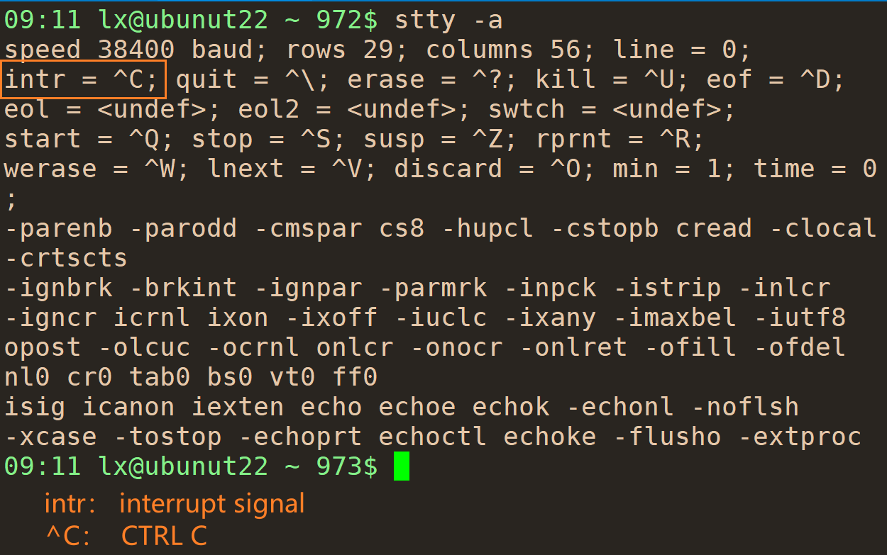
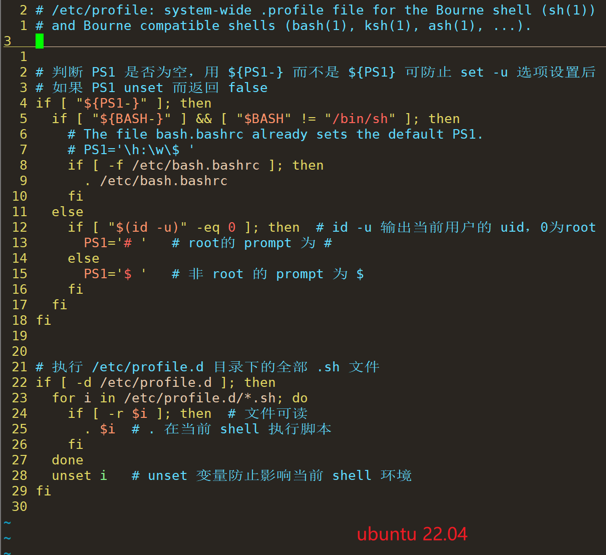
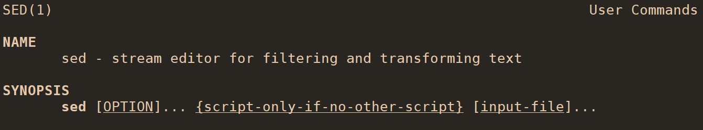
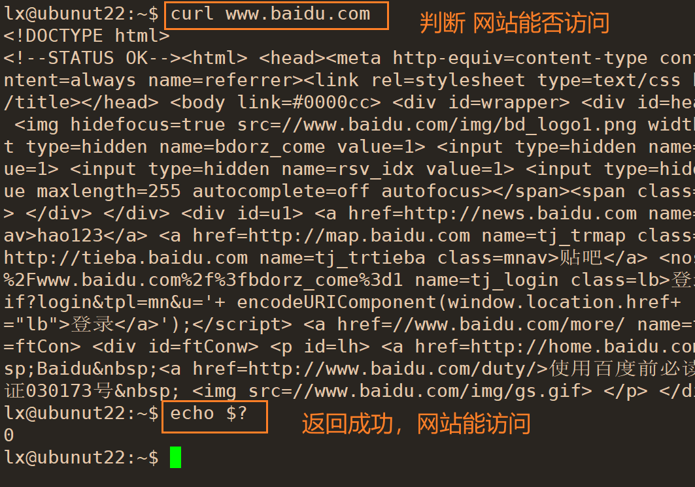
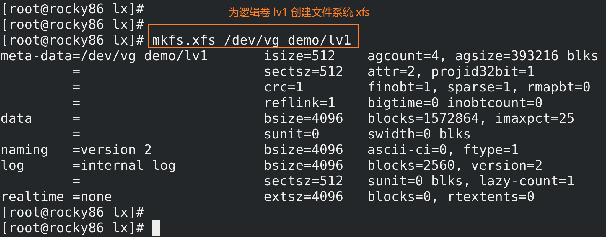

# 学习资源

## 官方文档
> [ubuntu](https://ubuntu.com/tutorials?q=bash#community)
> [GNU Manual Online](https://www.gnu.org/manual/manual.html)
> [Linux man pages](https://linux.die.net/man/)
> [Linux Documentation](https://linux.die.net/)

## 教程
> [Ubuntu 中文社区](https://forum.ubuntu.org.cn/index.php)
> [UNIX Tutorial for Beginners](http://www.ee.surrey.ac.uk/Teaching/Unix/)
> [Linux学习教程](http://c.biancheng.net/linux_tutorial/)
> [鸟哥的 Linux 私房菜](http://cn.linux.vbird.org/linux_basic/linux_basic.php)
> [Linux 教程](https://www.runoob.com/linux/linux-tutorial.html)
> [w3cschool](https://www.w3cschool.cn/linuxc/linuxc-612m3l6o.html)
> [Linux 入门教程](http://www.imooc.com/wiki/linuxlesson)
> [Linux 常用命令全拼](https://www.runoob.com/w3cnote/linux-command-full-fight.html)
> [howtogeek](https://www.howtogeek.com/category/linux/)
> [Linux Tutorial](https://rc.byu.edu/documentation/unix-tutorial/)


## 博客
> [The Linux kernel](https://www.win.tue.nl/~aeb/linux/lk/lk.html#toc10)


## 提问网站

> [FORCHANGE AI EDU](https://chat.forchange.cn/)


# 注意
- 在不同的系统，使用不同的  `bash` 版本，有些设置可能不同
	- 如 ubuntu 20.04 中默认创建用户不创建家目录，但 rocky 8.6 中默认创建家目录
	- 如通配符匹配在 ubuntu 20.04 和 rocky 8.6 中不同，用的 bash 版本不同，见 [3.5.8.1 Pattern Matching](https://www.gnu.org/savannah-checkouts/gnu/bash/manual/bash.html#Pattern-Matching) 对 `[...]` 说明


&nbsp;

# 操作系统下载
可以在官网或者镜像网站下载。

## Ubuntu
下载长期支持版。

> [阿里云镜像源](https://mirrors.aliyun.com/ubuntu-releases/)
> [Ubuntu 官网最新版](https://ubuntu.com/?spm=a2c6h.13651104.0.0.5a1a4763TTb0EY)
> [Ubuntu 官网 Old Ubuntu Releases](http://old-releases.ubuntu.com/releases/?spm=a2c6h.13651104.0.0.414329cacFG7ic)
> [阿里云 Old Ubuntu Releases](https://mirrors.aliyun.com/oldubuntu-releases/releases/?spm=a2c6h.25603864.0.0.63826f0f8RacGj)


# 安装虚拟化软件
## 虚拟化介绍
> [Virtualization Explained](https://www.bilibili.com/video/BV1ee4y1z7ix/?spm_id_from=333.999.0.0&vd_source=a99dfd145a3e6aa8000930c149d4bf58)


## 安装 VMware Workstation
> [有那些免费的虚拟机软件？](https://zhuanlan.zhihu.com/p/422262182)


***************************
# 操作系统
> 计算机的心智操作系统值哲学原理 1.3

- 操作系统是一个软件系统
- 替用户及其应用管理计算机上的软硬件资源
- 保证对计算机资源的公平竞争和使用
- 防止对计算机资源的非法侵占和使用
- 保证操作系统自身正常运转


# Linux 介绍

> [Operating System - Linux](https://www.tutorialspoint.com/operating_system/os_linux.htm)
> [What is Linux](https://www.redhat.com/en/topics/linux/what-is-linux)
> [Architecture of Linux](https://www.javatpoint.com/architecture-of-linux)


- 一种开源的操作系统软件
- 管理系统的硬件和资源
- 介于硬件和应用程序之间
- 提供一个平台能让用户方便的运行应用程序


## Linux 基本组成
> [Operating System - Linux](https://www.tutorialspoint.com/operating_system/os_linux.htm)


- Kernel
- System Library
- System Utility
###  Kernel
- The core part of linux
- It onsists of variable modules
- It interacts directly with the ulderlying hardware 
- It provides an abstraction to hide low level hardware details to **system or application programs**

### System Library
- Special functions or programs 
- Application programs or system utilities access the Kernel's ofeatures through system libraries
- These libraries implement most of the functionalities of the operating system and do not requires kernel module's code access rights


## 特点
- Portable
- Open Source
- Multi-User
- Multiprogramming
- Hierachical File System
- Shell
- Security


### System Utility
- Do specialized, individual level tasks


*********************************

> [Introduction: The Linux Operating System](https://rc.byu.edu/documentation/unix-tutorial/unix1.php) 


Three parts of the Linux operating system:
1. The kernel
- It is the lowest layer of the Linux operating system
- It interfaces directly with the computer hardware
- It provides an interface to programs whereby they may access files, the network, and devices

2. The shell
- The shell acts as an interface between the user and the kernel
- It is a command line interpreter (CLI) 
- It interprets the commands the user types in and executes them

3. The programs
- Each of programs does one thing and does it well


# Linux 分支介绍
> [Linux的分支及使用选择](https://zhuanlan.zhihu.com/p/381753464)


# 安装 ubuntu
## ubuntu 安装后基本配置


# 远程连接
## SSH

> [SSH 教程](https://www.cainiaojc.com/ssh/ssh-basic.html)
> [什么是SSH 以及常见的ssh 功能](https://blog.csdn.net/u013452337/article/details/80847113)
> [查看linux虚拟机ssh服务是否开启](https://blog.csdn.net/n123456uo/article/details/90261882)
> [解决：使用xshell连接服务器时无法使用账号密码登录的一种方式](https://blog.csdn.net/LvQiFen/article/details/122182815?spm=1001.2101.3001.6661.1&utm_medium=distribute.pc_relevant_t0.none-task-blog-2%7Edefault%7ECTRLIST%7ERate-1-122182815-blog-96923553.pc_relevant_multi_platform_whitelistv3&depth_1-utm_source=distribute.pc_relevant_t0.none-task-blog-2%7Edefault%7ECTRLIST%7ERate-1-122182815-blog-96923553.pc_relevant_multi_platform_whitelistv3&utm_relevant_index=1)
> [SSH远程访问及控制](https://www.cnblogs.com/y0226/p/16806645.html)


- SSH 是一种网络协议，主要用于保证远程登录计算机的安全
- SSH 的软件架构是服务器-客户端模式
- openssh 是 ssh 实现的一种
- openssh 对**客户端**的实现为 ssh
- openssh 对**服务器**的实现为 sshd
- 用小写 ssh 表示客户端程序


### 安装 
- ubuntu 默认安装 openssh-client
- ubuntu 安装 openssh-server：`sudo apt-get install openssh-server` 

### root 不能通过 xshell 远程
- 修改配置文件 /etc/ssh/sshd_config
编辑 `/etc/ssh/sshd_config` 做如下修改：
```bash
# 添加下面的行
PermitRootLogin yes

# 注释原来的行
#PermitRootLogin prohibit-password
```

- 重启 ssh 服务
> [How do I restart sshd daemon on Linux or Unix?](https://www.cyberciti.biz/faq/how-do-i-restart-sshd-daemon-on-linux-or-unix/)

- Ubuntu 22.04 和 Ubuntu 20.04
```bash
/etc/init.d/ssh restart
```

### 删除用户密码后 xshell 中不输入
密码不能连接
- ssh 做了限制，默认无密码时不能用密码的方法连接，可以修改配置
```bash
# /etc/ssh/sshd_config
# 注释下面行
#PermitEmptyPasswords no

# 新增下面行
PermitEmptyPasswords yes
```

- 换其他方式连接，如密钥或其他方式，还未试过


### ssh 通过公钥远程登录
> [设置 SSH 通过密钥登录](https://www.runoob.com/w3cnote/set-ssh-login-key.html)
> [linux下ssh公钥验证的设置和远程登录](https://donaldhan.github.io/linux/2020/04/29/linux下ssh公钥验证的设置和远程登录.html)


# linux 终端
> [Difference between pts and tty](https://unix.stackexchange.com/questions/21280/difference-between-pts-and-tty)
> [What is the exact difference between a 'terminal', a 'shell', a 'tty' and a 'console'?](https://unix.stackexchange.com/questions/4126/what-is-the-exact-difference-between-a-terminal-a-shell-a-tty-and-a-con)
> [Difference between /dev/tty and /dev/pts (tty vs pts) in Linux](https://www.golinuxcloud.com/difference-between-pty-vs-tty-vs-pts-linux/)
> [Linux的各种终端类型及概念](https://blog.csdn.net/xyz/article/details/118066465)


## console


## tty
> [Difference between /dev/tty and /dev/pts (tty vs pts) in Linux](https://www.golinuxcloud.com/difference-between-pty-vs-tty-vs-pts-linux/)
> [The TTY demystified](http://www.linusakesson.net/programming/tty/)

- terminal = tty = text input/output environment

- Ubuntu 22.04 server 可通过 `Ctrl A|t ` `F1-F6` 分别切换到六个 tty 终端，可通过 `tty` 命令显示当前  tty，不按照顺序切换，如先用 `Ctrl A|t F6` 再用 `Ctrl A|t F5` 切换，前面的仍是 `tty6`，后面的是 `tty5`


用 `w` 可以查看当前登录的用户


- Ubuntu 20.04 桌面版默认打开图形，用 `tty` 命令查看是 `/dev/pts/num` 而非 `/dev/tty/num`


切换到其他终端，如 `tty3`，可以通过 `startx` 命令切换到图形界面，但该方式打开的图形窗口只能有一个，即其他终端不能再用 `startx` 运行 `X server`，但原来的第一个终端的图形界面还存在。可通过 `killall xinit` 退出图形界面回到终端

- 图形界面登录可通过 `init 3` 切换到 CLI 模式，此时用 `tty` 命令查看为 `tty` 设备而非 `pts`

- 在图形界面可通过 `init 5` 再回到图形界面，查看其他终端还保持原来的界面不变


## pty

## pts
- 图形界面和远程登录时终端显示的设备为 `pts` 而非 `tty`


## startx
> [what does startx command do](https://askubuntu.com/questions/518454/what-does-startx-command-do)
> [startx Command](https://www.ibm.com/docs/en/aix/7.2?topic=s-startx-command)


//TODO: session 待补充
# session 会话管理
> [Linux session(会话)](https://www.cnblogs.com/sparkdev/p/12146305.html)
> [10. Processes](https://www.win.tue.nl/~aeb/linux/lk/lk-10.html)


# Tmux 终端复用
> [Tmux使用手册](http://louiszhai.github.io/2017/09/30/tmux/)
> [Tmux 使用教程](https://www.ruanyifeng.com/blog/2019/10/tmux.html)


# 基本规则
- 区分大小写

# 命令格式
> [What's the difference between a flag, an option, and an argument? [closed]](https://unix.stackexchange.com/questions/285575/whats-the-difference-between-a-flag-an-option-and-an-argument)


# Tab 补全命令

## 列出全部变量
- 输入 `$` 后按两次 `Tab` 键

## 列出全部用户
- 输入 `~` 后按两次 `Tab` 键


# 常用热键查看
- `stty -a` 查看热键，`man stty` 查看帮助说明




## 热键来源
- `man bash` 查看帮助文档介绍，bash 会用到 [readline 库](https://en.wikipedia.org/wiki/GNU_Readline)
- readline 库中热键如 ctrl z 等用 [emacs](https://en.wikipedia.org/wiki/Emacs)  快捷键


- readline 库初始化文件在 `/etc/inputrc` 中，可以看到默认是 emacs 快捷键


## 中断执行
> [ctrl+c 和 ctrl+z 的区别](https://blog.csdn.net/qq_54947566/article/details/124345900?spm=1001.2014.3001.5502)
> [Linux Ctrl+c与ctrl+z的区别](https://www.cnblogs.com/yzjT-mac/p/6207843.html)
> [Linux后台进程管理以及ctrl+z（挂起）、ctrl+c（中断）、ctrl+\（退出）和ctrl+d（EOF）的区别](https://blog.csdn.net/qq_36838191/article/details/82710101)
> [What is the difference in using Ctrl+D and Ctrl+C to terminate cat command?](https://unix.stackexchange.com/questions/379347/what-is-the-difference-in-using-ctrld-and-ctrlc-to-terminate-cat-command)


### Ctrl + z 进程放到后台挂起


//TODO: 待补充 Ctrl C
### Ctrl + c 发送 SIGINT 信号
> [POSIX signals](https://dsa.cs.tsinghua.edu.cn/oj/static/unix_signal.html)
> [How to Use SIGINT and Other Termination Signals in Linux](https://linuxhandbook.com/termination-signals/)


- 终端输入命令时，如果不想输入了可以按这两个键，该输入不会执行，不会记录到历史记录
- 如果输入 `sleep 100`，可以用该快捷键终止


//TODO: 待补充 Ctrl D
### Ctrl + d 发送 EOF 
> [Why does Ctrl-D (EOF) exit the shell?](https://unix.stackexchange.com/questions/110240/why-does-ctrl-d-eof-exit-the-shell)


- 终端直接按该快捷键则退出终端


## Ctrl + s 屏幕不显示和执行输入命令
- 按 `Ctrl + s` 后，输入的命令不显示在屏幕上，按 `Enter` 也不执行命令
- 按 `Ctrl + q` 后解锁屏幕，如果之前输入命令后按了 `Enter`，则解锁后将之前输入的依次执行，多个命令都会执行；如果没有按 `Enter`，则只显示在屏幕上

## Ctrl + q 解锁 Ctrl + s 


  

# shell 配置相关文件说明
> [bash 的环境配置文件](http://cn.linux.vbird.org/linux_basic/0320bash_4.php#settings_bashrc)
> [6.2 Bash Startup Files](https://www.gnu.org/software/bash/manual/html_node/Bash-Startup-Files.html)
> [bash-doc 4.3-6ubuntu1/usr/share/doc/bash/examples/startup-files](https://www.apt-browse.org/browse/ubuntu/trusty/main/all/bash-doc/4.3-6ubuntu1/file/usr/share/doc/bash/examples/startup-files)


- 不同 bash 其配置文件的执行顺序可能不同，但登录用户都是先执行 `/etc/profile` 脚本，可以看该脚本中的代码查看其执行顺序
- 基本顺序是先执行 `/etc/` 下的文件，再执行用户家目录中的文件，有的 bash 版本会在家目录中的文件执行完后又调用 `/etc/` 目录中的某个文件


## /etc/profile
- 该文件在哪被调用的？
- login shell 会读该文件，在哪里定义？

- 


### ubuntu 22.02 带图形界面


- 在当前 shell 中执行 `/etc/profile.d` 目录下的全部 `.sh` 脚本


## ~/.profile
### ubuntu 22.02 带图形界面
```bash
  1 # ~/.profile: executed by the command interpreter for login shells.      
  2 # This file is not read by bash(1), if ~/.bash_profile or ~/.bash_login
  3 # exists.
  4 # see /usr/share/doc/bash/examples/startup-files for examples.
  5 # the files are located in the bash-doc package.
  6 
  7 # the default umask is set in /etc/profile; for setting the umask
  8 # for ssh logins, install and configure the libpam-umask package.
  9 #umask 022
 10 
 11 # if running bash
 12 if [ -n "$BASH_VERSION" ]; then
 13     # include .bashrc if it exists
 14     if [ -f "$HOME/.bashrc" ]; then
 15     . "$HOME/.bashrc"
 16     fi
 17 fi
 18 
 19 # set PATH so it includes user's private bin if it exists
 20 if [ -d "$HOME/bin" ] ; then
 21     PATH="$HOME/bin:$PATH"
 22 fi
 23 
 24 # set PATH so it includes user's private bin if it exists
 25 if [ -d "$HOME/.local/bin" ] ; then
 26     PATH="$HOME/.local/bin:$PATH"
 27 fi
```

- login shell 才会读

- 只有 `~/.bash_profile` 和 `~/.bash_login` 均不存在才会读


- 注释中提到的 `/usr/share/doc/bash/examples/startup-files` 找不到 `examples` 目录，可从 [bash-doc 4.3-6ubuntu1/usr/share/doc/bash/examples/startup-files](https://www.apt-browse.org/browse/ubuntu/trusty/main/all/bash-doc/4.3-6ubuntu1/file/usr/share/doc/bash/examples/startup-files) 查看

- 该文件会执行家目录中的 `~/.bashrc` 文件

- 如果用户家目录中有 `bin` 或 `.local/bin` 文件夹，则会将这两个路径加入到 PATH 环境变量中，ubuntu 22.04 中默认无这两个目录，用户可以自己创建，如将可执行文件放到 `~/bin` 目录下，则可执行文件执行时不需要写全路径，可以直接执行了

- 

# 命令放后台执行
## &
> [Linux 命令中的 & 符号](https://blog.csdn.net/weixin_45505313/article/details/103749523)


# shell 设置文本输出颜色
> [shell中设置文字输出的颜色及字体格式](https://blog.csdn.net/yetugeng/article/details/89978787)
> [Bash tips: Colors and formatting (ANSI/VT100 Control sequences)](https://misc.flogisoft.com/bash/tip_colors_and_formatting)
> [How to change the output color of echo in Linux](https://stackoverflow.com/questions/5947742/how-to-change-the-output-color-of-echo-in-linux)


# 安装完成后基本设置
## 安装输入法
> [在 Ubuntu Linux 上安装 Fcitx5 中文输入法](https://zhuanlan.zhihu.com/p/415648411)


## 服务器修改控制台字体
> [在Ubuntu服务器中更改控制台字体](https://lzyws739307453.blog.csdn.net/article/details/103101188?spm=1001.2101.3001.6650.1&utm_medium=distribute.pc_relevant.none-task-blog-2%7Edefault%7EBlogCommendFromBaidu%7ERate-1-103101188-blog-89723707.pc_relevant_3mothn_strategy_recovery&depth_1-utm_source=distribute.pc_relevant.none-task-blog-2%7Edefault%7EBlogCommendFromBaidu%7ERate-1-103101188-blog-89723707.pc_relevant_3mothn_strategy_recovery&utm_relevant_index=2)


问题：安装的服务器版本控制台界面很小，字体调大后不能完全显示。


## 设置时区
> [Linux 如何设置时区、时间](https://blog.csdn.net/gezilan/article/details/79422864)

```shell
sudo timedatectl set-timezone 'Asia/Shanghai'
```


## 修改提示符 PS1
> [Controlling-the-Prompt](https://www.gnu.org/savannah-checkouts/gnu/bash/manual/bash.html#Controlling-the-Prompt)
> [环境变量PS1介绍](https://hongjh.blog.csdn.net/article/details/121312038)
> [Bash PS1 customization examples](https://linuxhint.com/bash-ps1-customization/)
> [6.9 Controlling the Prompt](https://www.gnu.org/software/bash/manual/html_node/Controlling-the-Prompt.html)


要想设置永久生效，将设置放在文件中，如 `/etc/profile` 或 `.bashrc` 等都可以。

- `man bash` 帮助文档查看环境变量 `$PS1` 的介绍

- 提示符说明：`man bash` 搜索 `PROMPTING`


- 注意 `\h` 显示主机名只到第一个 `.`前，之后的不显示，`\H` 显示完整主机名

- 示例


### <font color=red>问题</font>
- ubuntu 22.04 虚拟机中修改 PS1 （`/etc/profile`），需要 source 后生效，重新打开终端还原，且 `echo $PS1` 后查看的还是原来的变量


//TODO: 补充
# PS2

# PS3


# 主机名
> [Linux 配置（一）：临时修改主机名 | 永久修改主机名 | 详解](https://blog.csdn.net/succing/article/details/120638064)
> [LINUX 主机名字规范](https://blog.51cto.com/linuxguest/109487)
> [Linux修改主机名(静态主机名、临时主机名)](https://blog.csdn.net/zhaogang1993/article/details/82769439)


- 注意主机名不规范可能出现错误

## 查看主机名


## 临时修改主机名
- `hostname` 加新主机名，需要 root 权限，临时生效，不修改配置文件


## hostnamectl 永久修改主机名
- `man hostnamectl` 查看帮助文档

- `hostname` 查看当前系统主机名
	- 前面修改主机名时用的 `hostnamectl --static`，因此只修改 `static` 和 `transient` 两个参数

- `hostname set-hostname` 永久修改主机名


## /etc/hostname 主机名所在配置文件
- `hostnamectl` 修改主机名后，可以看到 `/etc/hostname` 配置文件的内容改变，变为新的主机名

## 修改主机名后刷新显示
- 如果输入 `bash` 重新打开一个 shell，可以看到主机名更新了
- 如果要当前的 shell 的主机名更新，需要退出后重新进入终端 


# 查看 Linux 版本
> [如何查看当前Ubuntu系统的版本](https://blog.csdn.net/mybelief321/article/details/9076331?spm=1001.2101.3001.6661.1&utm_medium=distribute.pc_relevant_t0.none-task-blog-2%7Edefault%7ECTRLIST%7ERate-1-9076331-blog-52074390.pc_relevant_multi_platform_whitelistv3&depth_1-utm_source=distribute.pc_relevant_t0.none-task-blog-2%7Edefault%7ECTRLIST%7ERate-1-9076331-blog-52074390.pc_relevant_multi_platform_whitelistv3&utm_relevant_index=1)


# 查看 IP 地址


## ip a


## hostname -I


# 查看登录用户
## logname


## last
- 查看最近登陆的用户


## who
> [who命令、whoami命令和who am i命令的区别](https://blog.csdn.net/u014270566/article/details/124177994)
> [w who whoami](http://pygo2.top/articles/52265/)


用 `su` 切换不同用户，`whoami` 显示切换后用户名，但 `who` 显示始终是当前登录系统的用户。


## w 
- `w` 显示当前全部登录用户以及做的操作

# 创建登录欢迎语
[Linux中创建自己的MOTD](https://www.cnblogs.com/gageshen/p/11565980.html)
[如何让你的终端欢迎语好看又有趣](https://zhuanlan.zhihu.com/p/115414827)
[ASCII艺术字（图）集](https://www.bootschool.net/ascii-art)

# Linux 登录
## ubuntu 登陆后为 root 账号设置密码
- Ubuntu 安装时默认设置的账户为普通账户，没有为 root 账户设置密码
- 默认账户在 sudo 组中，可以执行 `sudo` 命令
- 执行 `sudo passwd root`
- 按照提示输入当前登录用户的密码，即安装时设置的账户和密码
- 按照提示输入 `root` 的密码，输入完回车还要再输入一次确认


# 内部命令和外部命令
> [Linux的内部命令和外部命令](https://blog.csdn.net/tqptr_opqww/article/details/123879877)
> [Linux 中的内部命令和外部命令 ](https://www.cnblogs.com/greyzeng/p/16912218.html)
> [Linux内部命令和外部命令](https://blog.51cto.com/u_15060546/2651988)
> [hash](https://ipcmen.com/hash)
> [关於运行档路径的变量： $PATH](http://cn.linux.vbird.org/linux_basic/0220filemanager_1.php#dir_path)


- 内部命令集成在 shell 中，shell 被执行时这些内部命令被加载到内存中，访问速度快


- 外部命令不在 shell 中，需要时才加载，一个外部命令对应一个二进制文件
- 外部变量的路径要在 `PATH` 环境变量中，才能找到该命令执行
- 外部命令由 shell 控制，shell 中第一次使用一个外部命令时，从 `PATH` 路径中查找，找到后放到 hash 表中缓存到，之后再次调用该命令时直接从 hash 缓存表中查找


****************


## type 查看命令是内部命令还是外部命令
- `type` 查看是内部命令还是外部命令
- 命令路径不在环境变量 $PATH 中后，`type` 找不到该命令
- 外部命令执行后会在 hash 表中缓存下来，如果该命令路径改了，但也在环境变量 $PATH 中，也无法执行该命令，因为会从 hash 缓存中查找，用 `hash -d` 删除该命令的缓存后，可以使用


### help type 查看 type 命令帮助文档

### type -a 列出命令的全部位置
- 有些命令可能既是内部命令，又是外部命令，如 `echo` 这种常见命令，因为 shell 种类很多，防止内部命令不能用，则使用外部命令


## enable 管理内部命令


### enable 查看能使用的内部命令


### enable -a 查看全部内部命令以及状态

### enable -n 禁用内部命令
- 禁用后用 `enable` 查看不到
- 禁用后仍可以用 `enable -a` 查看
- 重新用 `enable` 加命令可以解除禁用


## 外部命令


# hash
> [linux的hash命令](https://blog.csdn.net/wei2314857815/article/details/104077515)


- 已使用过的外部命令的路径会保存在 `hash` 表中，可用 `hash` 命令查看，初始为空
- hash 表的缓存只是临时存在，只对当前终端，当前用户有效
- 将 hash 中已缓存的命令路径修改到环境变量 PATH 中的其他位置，无法执行该命令，因为会从 hash 中查找命令


## hash -d 从 hash 表中删除缓存的命令

## hash -r 情况 hash 表记录
- forget all remembered locations


## hash -t 查看指定命令的路径


# 别名 alias
> [alias命令_Linux alias命令：给命令定义别名](http://c.biancheng.net/linux/alias.html)


- 优先级：别名 > 内部命令 > 外部命令

## 执行原始命令非别名
- 别名和内部命令重名时，默认执行**别名**，如果想执行内部命令，可用如下方法：
	- 别名前加`\`
	- 用**单引号**包围命令
	- 用**双引号**包围命令
	- `command 命令` 
	- 直接写命令的完整路径


## 自定义别名


## 删除别名 unalias
### unalias 删除一个或多个别名

### unalias -a 删除全部别名


## 设置别名永久生效
- 将别名永久设置：将别名写在 `.bashrc` 文件中（注意要对当前用户生效还是所有用户生效有不同的路径）。

- 修改文件后立即生效：`source` 命令。（[Linux下source命令详解 ](https://www.cnblogs.com/shuiche/p/9436126.html)）


# 获取帮助
## whatis
> [linux 命令：whatis详解](https://blog.csdn.net/yspg_217/article/details/122061132)

- 列出命令的简单描述
- 查询利用数据库，如果刚装的程序，可能查不到，需要 `mandb` 更新数据库
- rocky 8.6 中装完系统后执行 `whatis hostname` 命令，显示 `hostname: nothing appopriate`，普通用户执行 `sudo mandb`后可以正常使用


## help 查看内部命令


## COMMAND --help 或 COMMAND -h
有些命令两种格式都支持，有些只支持一种

## man
- 一般查看外部命令，比 --help 和 -h 的帮助内容更详细。

- man 手册进行分区段处理，分为 9 个区，可以用 `man man` 查看：


- 一般文件说明在第 5 区段，用 `man 5 COMMAND`

- 有些命令可能在不同区段都有说明，可以用 `whatis` 来查看，然后用 `man section CMD` 查看对应区段说明。
如 `passwd` 在第 1 区段为命令的解释，第 5 区段为 `passwd` 文件的说明。


### man -f
- 相当于 `whatis` 


## info
帮助文档比 man 更详细。

## /usr/shar/doc 查看一些程序的官方说明文档
> [/usr/share/doc 的作用](https://blog.csdn.net/FlyClassFox/article/details/110731697)

- 输入 `manpath` 可以查看 man 手册的路径
- 可以用 vim 打开 `.gz` 的说明文档，如 `README.gz`


## /usr/share/man 查看 `man` 命令看到的文档
- `.gz` 文件可以直接用 `man` 命令打开

## 官方在线文档
> [ubuntu](https://ubuntu.com/tutorials?q=bash#community)
> [GNU Manual Online](https://www.gnu.org/manual/manual.html)
> [Linux man pages](https://linux.die.net/man/)
> [Linux Documentation](https://linux.die.net/)


## linux 和 windows 互传文件工具
### xshell 中传文件

#### xftp

#### lrzsz
- `sz` 命令


# 一行执行多个命令
1. 每个命令用分号（`;`）隔开

# 一个命令分成多行
反斜杠（\）+ `Enter` 按键，中间不能有空格


# 计算器 bc
> [Linux bc 命令](https://www.runoob.com/linux/linux-comm-bc.html)
> [bc command in Linux with examples](https://www.geeksforgeeks.org/bc-command-linux-examples/)


1. scale 
设置小数点后位数。

2. ibase
输入数字的进制（2~36），如果输入包含字母，必须大写。
3. obase
输出数字的进制（2~36）
4. last
上次打印的结果。
5. quit 结束
输入 quit 会终止执行 `bc` 命令


# 查看系统信息 
> [Linux 常用命令集合](https://www.runoob.com/w3cnote/linux-common-command.html)
## 查看系统是 32 位还是 64 位
> [灵活使用getconf命令来获取系统信息](https://www.cnblogs.com/wjoyxt/p/4815782.html)

`getconf LONG_BIT` 获取系统是 32 位还是 64 位。

`lscpu` 也会显示该信息。

## 查看系统架构
- `arch` 或 `uname -m`。
- `lscpu` 也会显示该信息


## 查看 CPU
1. `lscpu`
2. `/proc/cpuinfo` 文件中，可用 `cat` 命令查看。

## 查看内存
> [Linux free命令](https://www.runoob.com/linux/linux-comm-free.html)

## 查看磁盘空间
> [Linux 查看磁盘空间](https://www.runoob.com/w3cnote/linux-view-disk-space.html)
> [Linux命令 lsblk - 列出块设备信息](https://ipcmen.com/lsblk)


### df
> [Linux df 命令](https://www.runoob.com/linux/linux-comm-df.html)


## 查看发行版本
> [查看 Linux 发行版名称和版本号的 8 种方法](https://zhuanlan.zhihu.com/p/36253769)


# 关机、重启和注销

## 数据同步写入磁盘 sync
> [Linux sync命令](https://www.runoob.com/linux/linux-comm-sync.html)

## 关机指令 shutdown
> [Linux shutdown 命令](https://www.runoob.com/linux/linux-comm-shutdown.html)
> [Linux系统Shutdown命令定时关机详解](https://blog.csdn.net/q_l_s/article/details/44855817)


### shutdown -h now 立即关机

### shutdown -h 时间 设定时间关机
- shutdown -h 设置时间有一定格式，不指定时间，默认在 1 分钟后关机，会有提示说明，如果要取消，用 `shutdown -c`
- 本地执行 `shutdown` 不需要 `sudo`，远程需要，否则失败
- `shutdown -h +3` 表示 3 分钟后关机，该消息会发送给远程登录的全部终端
- 指定时间是 `hh:mm` 的形式，但可以用 `+m` 指定到超过一天的时间，单位为分钟
- `+m` 形式指定分钟不能为负数，否则报错
- `hh:mm` 形式指定的小时和分钟如果比现在早，则被认为是第二天的时间


### shutdown -k 广播关机消息，不真的关机


### shutdown --no-wall 不发送 wall message
- `man wall` 查看 `wall` 介绍


### shutdown -r 重启 reboot
- 和 `shutdown -h` 语法相同，可以设置时间，只是这个是重启

## 关机指令 halt
> [Linux halt命令](https://www.runoob.com/linux/linux-comm-halt.html)

## 关机指令 poweroff
> [Linux poweroff 命令](https://www.runoob.com/linux/linux-comm-poweroff.html)

关闭电源

## 重启指令 reboot
> [Linux reboot命令](https://www.runoob.com/linux/linux-comm-reboot.html)

## 休眠指令suspend
> [Linux suspend命令](https://www.runoob.com/linux/linux-comm-suspend.html)
[Linux下怎么让挂起的(suspend or stopped)进程恢复执行(resume)](https://blog.csdn.net/baiyan83/article/details/109759386)


# init 
> [init command in linux with examples](https://www.geeksforgeeks.org/init-command-in-linux-with-examples/)

## init 0 关机
- 如果当前有多个用户正在登录，可能无法关机


## init 1 
- single-user mode

## init 2
- multi-user mode

## init 3 关闭图形界面
- 从带图形界面的终端用 `sudo init 3` 可以切换到不带图形界面的终端


## init 6 reboot
- 重启


# history 历史命令
> [原来 history 可以这么强大](https://zhuanlan.zhihu.com/p/371739269)

- 历史记录中序号后面有个 `*`


## 执行最后一次的历史命令
- 按 <Esc> 后再按 `.`，会显示出最后一次的历史命令
- 按 <Alt> 同时按 `.`，会显示出最后一次的历史命令
- 按 <Ctrl> 同时按 `P` 会显示出最后一次的历史命令
- `!!` 执行最后一次历史命令
- `!:0` 执行最后一次历史命令，但去除参数 


- 按向上的方向键可以从后往前查看历史命令，按一次默认最后一次执行的历史命令
- `!-1` 执行最后一次历史命令

## 执行过去的某个历史命令
- 输入 `history` 显示过去的历史命令，前面有个序号，输入 `!`再输入序号，即可执行该条历史记录

- `!-n` 执行倒数第 n 个历史命令


## 查找最近历史记录
- `!string` 后面输入命令的开头几个字符，可以执行满足条件的命令
- `!string:p` 可显示以输入字符开头的最近一次命令，但不执行，执行后，按向上方向键则可显示打印的历史记录


- `!?string[?]`执行最近一次包含字符 `string` 的历史记录
- `Ctrl`+`R` 可以输入关键字查找历史记录，找到后按 `Enter` 键执行该命令，如果未找到，可按 `Ctrl` + `C` 结束输入，或者按 `Ctrl` + `G` 结束查找
- 当前用户的历史记录默认保存在 `~/.bash_history` 文件中，可在该文件中搜索


## history -n 显示最近的几条历史记录
- 相当于 `history | tail -n` 


## 删除历史记录
### history -c 清楚全部的历史记录

### history -d 删除指定序号的历史记录


## 不让命令显示在历史记录中
- 输入命令前输一个空格，该记录不在历史记录中（ubuntu 22.04 测试）


## 指定历史记录的格式和保存数目
### HISTTIMEFORMAT 指定历史记录的格式
- `man bash` 后搜索 `HISTTIMEFORMAT` 可查看该变量的说明
- `man 3 strftime` 可查看日期和时间的格式
- 可指定该变量的格式写入到 `/etc/profile` 中，或者只设置当前用户的历史记录格式写到 `~/.bashrc` 文件中，如 `export HISTTIMEFORMAT="%F %T `whoami` "`


### HISTSIZE 命令行中显示的历史记录的最大数目
- `man bash` 搜索 `HISTSIZE` 查看说明
- 终端输入 `history` 显示的历史记录的最大数目
- 如果 `HISTFILESIZE` 比这个值小，则不能超过 `HISTFILESIZE` 的值
- 修改当前用户可在 `~/.bashrc` 中修改参数


### HISTFILESIZE 历史文件中记录的历史命令的最大值
- `man bash` 搜索 `HISTFILESIZE` 查看说明
- 修改当前用户可在 `~/.bashrc` 中修改参数

### HISTCONTROL 历史记录在保存的方式
> [HISTCONTROL Command in Linux with Examples](https://www.geeksforgeeks.org/histcontrol-command-in-linux-with-examples/)

- `man bash` 搜索 `HISTCONTROL` 查看说明


- ignorespace
	- 该选项会导致命令前加空格时不保存到历史记录中
	- ubuntu 22.04 和 ubuntu 20.04 中设置了该选项
	
	- rocky8.6 没有设置该选项，因此开头带空格的命令也会记录
	

- ignoredups
	- 和上一条历史记录相同的命令不会重复记录到历史记录中
	- 只针对上一条相同，如果中间间隔其他命令，则仍会保存
	- rocky8.6 默认的设置
	- ubuntu 22.04 和 ubuntu 20.04 也设置了该选项

- ignoreboth
	- 同时设置 ignorespace 和 ignoredups
	- ubuntu 22.04 为该选项
	- ubuntu 20.04 为 ignoredups:ignorespace


# hwclock 硬件时间
> [hwclock](https://linux.die.net/man/8/hwclock)


# date 系统时间
> [Date Command in Linux: How to Set, Change, Format and Display Date](https://phoenixnap.com/kb/linux-date-command#ftoc-heading-10)
> [How To Format Date And Time In Linux, MacOS, And Bash?](https://www.shell-tips.com/linux/how-to-format-date-and-time-in-linux-macos-and-bash/)
> [How to Display the Date and Time in the Linux Terminal](https://www.howtogeek.com/410442/how-to-display-the-date-and-time-in-the-linux-terminal-and-use-it-in-bash-scripts/)


- `date` 显示系统时间

## 日期的格式 


<br/>

- `man date` 查看帮助文档，可看到 FORMAT 介绍

## -d 指定具体日期


## + 指定具体格式


## --set 设置时间 系统时间和硬件时间


## 应用

### Use date with Other Commands

<br/>

### 显示过去某天的星期


### 查看距离当前一定时间的具体日期
- `date -d` 或 `date --date`

### 查看距离某个日期一定时间的具体日期


### 计算某一天距离今天有多少天


### 计算


# 修改 bash 快捷键为 Vi 快捷键
> [Bash 行操作](https://wangdoc.com/bash/readline)


- 在 `~/.bashrc` 中加上 `set -o vi` 后，用 `source ~/.bashrc` 使配置生效


# 二进制文件查看
> [Linux命令学习总结：hexdump](https://www.cnblogs.com/kerrycode/p/5077687.html)

# windows格式文件转换为Linux 格式文件
> [Linux命令 dos2unix - 将DOS格式文本文件转换成Unix格式](https://www.w3cschool.cn/linuxc/linuxc-gvjq3lbf.html)


# echo
> [echo command in Linux with Examples](https://www.geeksforgeeks.org/echo-command-in-linux-with-examples/)
> [How to use Linux echo command](https://www.ionos.com/digitalguide/server/configuration/linux-echo-command/)

## echo -n 不输出结尾的换行符


## echo -e 允许转义


## <font color=red>echo $(ls) 和 ls</font>
> [Difference between 'ls' and 'echo $(ls)'](https://unix.stackexchange.com/questions/283586/difference-between-ls-and-echo-ls)
> [Command Substitution](https://www.gnu.org/savannah-checkouts/gnu/bash/manual/bash.html#Command-Substitution)


# PATH 环境变量
> [Linux path environment variable](https://linuxconfig.org/linux-path-environment-variable)
> [环境变量](https://www.lanqiao.cn/courses/1/learning/?id=60)
> [How to Set Environment Variables in Linux](https://phoenixnap.com/kb/linux-set-environment-variable#ftoc-heading-1)


## 设置临时环境变量


## 设置永久环境变量

在 /etc/profile 文件中添加，对所有用户生效。


<br/>

## 在 PATH 中添加路径
> [Linux中如何添加自己的路径到PATH](https://blog.csdn.net/qq_16209077/article/details/50711397)
> [关於运行档路径的变量： $PATH](http://cn.linux.vbird.org/linux_basic/0220filemanager_1.php#dir_path)


# /dev/null
> [What is /Dev/Null in Linux?](https://www.geeksforgeeks.org/what-is-dev-null-in-linux/)
> [shell 脚本中 /dev/null 的用途](https://www.cnblogs.com/wanng/p/shell-dev-null.html)


# 用户
> [Linux User Administration: A Complete Guide to Managing Multi-User Systems](https://www.linuxfordevices.com/tutorials/linux-user-administration)

## 用户类型


<br/>

- **根据 UID 区分不同的用户类型**
在 `/etc/login.defs` 文件中查看 UID 的范围，不同的系统可能不一样，下面是 Ubuntu 22.04.1 查看的范围：


	- 超级用户
	root，UID 为 0
	- 系统用户
	100 ~ 999
	100 是保留给用户设置使用的最小值


	- 普通用户
	1000 ~ 60000

### 新建普通用户 UID 超过 60000 影响
- 根据配置文件 `/etc/login.defs`，普通用户的最大 UID 为 60000，但新建 UID 超过 60000 也能新建成功，但有一些影响，见 [Using Large User IDs and Group IDs](https://docs.oracle.com/cd/E19120-01/open.solaris/819-2379/userconcept-35/index.html)


## 查看当前全部用户
### 在 `/etc/passwd` 中查看全部账户信息
- 查看全部
	
- 查看最后部分

- 查看前面部分


### 通过 `getent passwd` 查看
- 查看全部用户


- 查看某个特殊用户信息
根据用户名或者 UID 查询


## 用户组分类
- 管理员组
- 系统组
- 普通组

### GID 范围
通过 `/etc/login.def` 文件查看，Ubuntu 22.04.1 查看范围如下：


## 私有组、主要组和附加组
> [Linux私有组，主要组和附加组 ](https://blog.51cto.com/xinsz08/5022617)

- 创建新用户时默认会创建一个和该用户同名的组，组ID 为 GID
- `id username` 可以查看其全部组


## 用户和组相关配置文件
### /etc/passwd
- 查看该配置文件的说明：

该配置文件包含用户账号的信息，每一行一个用户，由 7 部分组成，每个部分由冒号分隔，内容如下：


- 配置文件的内容

	- 第二段密码
		- 如果用户密码为**小写的 `x`**，表示密码实际在 `shadow` 文件中，可以在 `etc/shadow` 文件中查看，如果**该文件中没有则密码无效**
		- 如果**用户密码为空**，则不需要密码。但有些应用可能在密码为空时不允许访问。
		- 如果密码以感叹号 `!` 开头，表示**密码被锁定**
		新创建的用户，还没设置密码时，查看密码为一个 `!`，除了 `root` 可以直接切换到该用户外，其他用户不能切换，需要先设置密码
		用 `passwd -l` 锁住密码后 `/etc/shadow` 中加密的密码前也有一个 `!`	


	- 第七段
该段显示 shell 的类型

### /etc/shadow 用户密码相关配置
> [详细解析/etc/shadow文件尤其是加密密码字段](https://www.cnblogs.com/jason-huawen/p/16300671.html)


- 查看配置文件的帮助文档


- 查看该配置文件的内容
<br/>


	- **第 1 字段 登录用户名 login name**
	如 root
	
	- **第 2 字段 用户密码**
	密码以加密的形式显示，没有则为空。
	
	- **第 3 字段 最近一次修改密码的日期**
	显示的数字为从 1970 年 1 月 1 号到最近一次修改密码的天数。
	数值 0 表示用户应在下次登录时修改密码。
	数值为空表示禁用密码老化功能。

	- **第 4 字段 最短密码使用时间**
	用户在上次修改密码后，想再次修改密码必须等待的天数。
	数值 0 和空表示没有等待时间，即随时可以修改密码。
	
	- **第 5 字段 最长密码使用时间**
	距离上次修改密码后，经过该天数用户必须修改密码。
	如果用户超过该时间仍不修改密码，密码仍然有效，在下次登录时用户会被要求修改密码。
	数值为空表示没有最长密码使用期限。
	如果数值比最短密码使用时间小，表示用户不能修改密码。

	- **第 6 字段 密码警告期**
	在密码将要过期（即第 5 字段定义的最长密码使用时间）的前几天提示用户修改密码。
	数值为 0 和空表示没有警告期。
	
	- **第 7 字段  密码不活动期**
	在密码已经过期（即第 5 字段定义的最长密码使用时间）之后的一段时间，密码仍能使用，但超过该有效期后用户将不能登录。
	字段为空表示无不活动期。

	- **第 8 字段 账户到期日**
	从 1970 年 1 月 1 号算起，用户账号到期的时间。
	账号到期后将不能登录该账号，密码到期后不能使用该密码登录。
	字段为空表示账号永远不会过期。
	数值 0 不建议使用，可能解释为账户不会到期或者到期时间为 1970年1月1号。

	- **第 9 字段 保留字段**
	
	
### /etc/group 用户组相关信息
- 配置文件帮助文档
该配置文件存放用户组相关信息。


- 配置文件内容

	- 第 1 字段 组名
	- 第 2 字段 组密码
	字段为空表示不需要密码。
	- 第 3 字段 GID
	- 第 4 字段 组中的全部用户
	逗号分隔用户，用户为以该组为**附加组**的用户，**不包含主要组**的用户


### /etc/gshadow 组密码相关配置
- 查看帮助文档


- 查看配置文件内容

	- 第 1 字段 组名
	- 第 2 字段 加密的组密码
	- 第 3 字段 组管理者
	组管理者以逗号分隔。
	管理者（administrators）能修改组密码和组成员。
	管理者同时有组成员的权限。
	- 第 4 字段 组成员
	组成员以逗号分隔
	组成员访问组不需要密码
	组成员为**以该组为附加组**的用户列表


### /etc/skel/ 用户家目录中配置文件
> [/etc/skel/目录](https://blog.csdn.net/codetz/article/details/52541780)

- 用户如果实际创建家目录，会将该目录中的文件复制到**家目录**中


- 该目录在 `/etc/default/useradd` 文件中指定


### /etc/login.defs 用户默认设置文件 
> [Linux /etc/login.defs：创建用户的默认设置文件](http://c.biancheng.net/view/3059.html)


#### 查看 UID 和 GID 范围

#### 默认加密方法
- `/etc/shadow` 中第二个字段加密密码的方法


### /etc/default/useradd 指定创建新用户时的默认设置
> [/etc/default/useradd文件详解](https://blog.csdn.net/qq_41982304/article/details/104953572)

利用 `useradd` 命令添加新用户时默认的设置。

#### 指定创建用户时的默认 shell 类型
- ubuntu 20.04 默认 `/bin/sh`，rocky 8.6 中默认 `/bin/bash` 


#### 指定创建家目录时复制配置文件的路径 SEKL


#### 指定创建用户时是否创建 mail spool
- ubuntu 22.04 默认不创建 mail spool，rocky 8.6 默认创建
- 将 ubuntu 22.04 `CREATE_MAIL_SPOOL` 那行去掉注释则创建 mail spool


&nbsp;

## 添加用户
> [useradd](https://linux.die.net/man/8/useradd)
> [Linux 中useradd命令的使用](https://www.cnblogs.com/Hackerman/p/12535719.html)


### 指定家目录
1. `-b` 选项指定 basedir，家目录默认由 **basedir** 和**账户名**组合在一起，如：


<br/>

2. 加 `-m` 选项可以实际生成该家目录，并将 `/etc/skel/` 目录中的配置文件拷贝到家目录下：

<br/>

3. `-d` 选项可以直接指定**家目录的完整路径**，如果同时指定 basedir 和 homedir 且两者不一致，不管命令的先后顺序，以 `-d` 指定的路径为主：

<br/>

4. `-d` 选项指定的**路径不存在时**可以**创建该路径**，包括**多级子目录都可以创建**，但创建子目录时有提示；`-b` 创建 basedir 规则也相同：


<br/>

5. 如果不指定 basedir 和 homedir，则使用默认值，默认在 `/etc/login.def ` 文件中
	- 默认认 basedir 为/home，家目录为 basedir/用户名/

	- `ubuntu 22.04`  中没有该设置，`rocky 8.6` 有


<br/>

### -u 指定 UID
#### `-u` 选项指定 UID，默认如果 UID 已存在，则不能创建：

<br/>

#### `-u -o` 两个选项结合可以创建重复的 UID


#### 创建的账户指定 UID 为 0 时

该账户显示为 root，具有 root 权限：

#### 指定 UID 超过 60000
- 根据配置文件 `/etc/login.defs`，普通用户的最大 UID 为 60000，但新建 UID 超过 60000 也能新建成功，但有一些影响，见 [Using Large User IDs and Group IDs](https://docs.oracle.com/cd/E19120-01/open.solaris/819-2379/userconcept-35/index.html)

### -g 指定用户 primary group
`-g` 选项指定主要组，可以指定组名或者 GID，但**组必须存在**
如果不指定，默认创建一个**和用户同名的组**


### -G 指定用户附加组
用 `-G` 选项增加附加组，附加组可以多个，用逗号 `,` 间隔，如果不指定主要组，则默认创建一个用户名同名的主要组。


### -s 指定 shell
Ubuntu 22.04.1 默认用 useradd 创建用户的 shell 为 `/bin/sh`，可在 `/etc/default/useradd` 文件中查看，可以修改默认为 `/bin/bash`


### -r 创建系统用户
`-r` 选项创建系统用户，系统用户和普通用户的 UID 范围不同。


### -m 创建家目录
用 `-d` 指定加目录后默认不会真的创建该目录，需要用 `-m` 选项创建，而 `-M` 选项则不创建家目录。


### -e 设置账号过期时间
`-e` 选项设置账号过期时间：


### <font color = 'red'>-l 不将新创建的用户添加到 lastlog 和 faillog 数据库中</font>


*********************
**问题：**
- ubuntu22.04 指定 `-l` 选项后新加的用户仍在 `lastlog` 数据库中？？


### useradd 和 adduser
> [useradd和 adduser的区别](https://blog.csdn.net/cynthrial/article/details/84673357)


Ubuntu 22.04.1 测试两者区别，adduser 会交互式让输入密码，默认的 shell 为 `/bin/bash`，自动创建主目录且赋值默认文件：


### 批量添加用户 newusers
> [newusers和chpasswd的用法](https://blog.licess.com/newusers-chpasswd/)

- 格式按照 `/etc/passwd` 中写


## 新添加的用户不能执行 ll 命令问题
- 测试环境为 Ubuntu 22.04.1


- 解决方案
用 `-m` 选项增加家目录（家目录内会有一些配置文件），并用 `-s` 选项修改 shell  为 `/bin/bash`


## 新添加的账户设置登录密码
新建账号没有设置密码时，先切换到 root 账户，然后用 `passwd` 命令设置密码，再切换到新账户即可正常使用新账号登录：


## 无法切换到 root 账户
新装好 Ubuntu 系统后用 `su` 或 `su -` 无法切换到 root 时，可以修改 root 密码，再切换


&nbsp;

## 新建用户时默认创建家目录
- ubuntu 20.04 和 rocky 8.6 的默认设置有差异
- rocky 8.6 中新建用户默认创建家目录
- ubuntu 20.04 中新建用户不指定 -m 选项，不创建家目录
- 在 `/etc/login.defs`  文件中设置


****************
- `/etc/login.defs` 文件中设置 `CREATE_HOME` 变量
- ubuntu 20.04 需要新加设置


## 新建用户时为家目录中添加指定文件
- 将要默认添加的文件添加到 `/etc/skel` 目录中
- `useradd -m` 在创建用户时创建家目录


## mkhomedir_helper 为已创建的用户创建家目录
- `man mkhomedir_helper` 查看该命令的帮助文档


### 用户已存在家目录：原来家目录文件时间不更新


### 用户不存在家目录：创建家目录并拷贝默认文件


## 修改用户账户 usermod
> [Usermod Command in Linux](https://linuxize.com/post/usermod-command-in-linux/)


### -g 修改用户初始组群 GID
`-g` 选项修改用户 GID


### -G 修改用户附加组 
`-G` 选项修改附加组。


### -aG 添加附加组
`-G` 修改附加组，会完全替换之前的附加组，如果想在原来基础上添加附加组，加上 `-a` 选项。
注意要写 `-aG`，如果写 `-Ga` 失败：


### -d -m修改家目录
`-d` 选项修改家目录，但**不会创建该家目录**，也不会将原来家目录内容移到新目录中。


<br/>

加上 `-m` 选项可**新建家目录并将原来目录改为新目录**。


### -s 修改用户默认 shell


### -u 修改用户 UID
`-u` 选项修改 UID，和添加用户时使用规则相同，注意范围，以及修改的 UID 不能和已存在的相同，如果添加相同的 UID，需要加上 `-o` 选项。


### -l 修改用户登录名
- 家目录的名称不变
- GID 对应的组名不变
- 文件中 owner 名改变


### -e 修改账号过期日期
`-e` 选项，和 `useradd` 使用方法相同。


## 删除账户 userdel
> [How to Delete/Remove Users in Linux (userdel Command)](https://linuxize.com/post/how-to-delete-users-in-linux-using-the-userdel-command/)

### userdel -f
- `userdel` 删除用户，如果用户正在登录，无法删除，需要 `-f` 选项强制删除。


### userdel -r 删除家目录和 mail spool 文件
不加 `-r` 删除用户后其家目录以及里面的文件仍存在。


## 账号信息查询
### id 查询 UID GID
`-G` 即 `groups` 里内容，包括主要组和附加组。


### finger

### chfn

### su 切换账号
> [Linux su命令：用户间切换（包含su和su -的区别）](http://c.biancheng.net/view/3089.html)

- 切换普通账号


- shell 为 /sbin/nologin 的账户登录
[What does "sudo su -s /bin/bash - <username>" do?](https://unix.stackexchange.com/questions/277639/what-does-sudo-su-s-bin-bash-username-do)
对于shell 为 /sbin/nologin 的账户，无法直接切换


### sudo
> [第十四章、Linux 账号管理与 ACL 权限配置](http://cn.linux.vbird.org/linux_basic/0410accountmanager_4.php#sudo)
> [How to Use the sudo Command in Linux](https://phoenixnap.com/kb/linux-sudo-command)
> [su、sudo、sudo su、sudo -i sudo -l的用法和区别](https://blog.csdn.net/mutou990/article/details/107724302)


使用 sudo 可以执行超级用户权限，且输入的是**自己用户的密码**而非 root 密码，但账号能否使用 sudo 要看 ` /etc/sudoers ` 文件的设置。


- usermod 命令将账户加入 sudo 组使用 sudo 命令
从 `/etc/sudoer` 配置文件可以看见 sudo 组的成员可以执行命令：


- 添加附加组也可以


- 修改 /etc/sudoers 文件 
普通用户可以用 `sudo vi /etc/sudoers` 修改该文件，或者用 **visudo** 来修改。


******************************

visudo 的其他用法见 [第十四章、Linux 账号管理与 ACL 权限配置](http://cn.linux.vbird.org/linux_basic/0410accountmanager_4.php#sudo)。


## 用户密码 
> [How to Handle Account Passwords in Linux With passwd Command](https://linuxhandbook.com/passwd-command/)
> [第十四章、Linux 账号管理与 ACL 权限配置](http://cn.linux.vbird.org/linux_basic/0410accountmanager_2.php#passwd)


### 密码格式


### 普通用户修改自己密码 passwd


### 修改 root 账号密码 sudo passwd root


### 修改其他用户密码
- sudo passwd 用户名
如果普通用户可以执行 sudo 则可以修改其他用户密码，不需要知道其原始密码


- root 账户修改 passwd 用户名


### 检查密码状态 passwd -S


<br/>


**7 个字段的含义如下：**
- 用户名
- 密码状态
	- L 
	密码被锁（locked password）
	- P
	有可用的密码（usable password）
	- NP
	没有密码（no password）
- 最近一次密码修改的日期
- 最短密码使用时间
数值 0 表示随时可修改密码
- 最长密码使用时间
- 密码警告期
- 密码不活动期，即密码过期后的宽限期
数值 -1 表示无不活跃期

最后四个字段的解释见 `/etc/shadow` 文件中描述。

### 检查全部账户的密码状态 passwd -Sa


### 强制用户在下次登录时修改密码
#### passwd -e 用户名


#### chage -d 0 用户名


### 锁定账户密码 passwd -l
- passwd -l 用户名锁住密码


- passwd -u 用户名 解锁密码


### 删除密码 passwd -d


### 设置最短密码使用时间
距离上次修改密码后，最短需要等待多少天才能修改密码，默认值为 0，即随时可以修改密码，可以通过 `-n` 选项修改。


### 修改密码过期参数 chage

<br/>

1. 初始：


2. 修改最近一次修改密码日期

如果设置数值为 0 则密码立即过期，下次登录必须修改修改密码：


3. 修改最短密码使用天数


4. 设置账号过期日期


5. 设置密码最长使用天数


6. 设置密码过期后的宽限期


### 批量修改密码 chpasswd
> [chpasswd command in Linux with examples](https://www.geeksforgeeks.org/chpasswd-command-in-linux-with-examples/)


### 无交互形式修改密码


# 组
## 用户组分类
- 管理员组
- 系统组
- 普通组

### GID 范围
通过 `/etc/login.def` 文件查看，Ubuntu 22.04.1 查看范围如下：


## 私有组、主要组和附加组
> [Linux私有组，主要组和附加组 ](https://blog.51cto.com/xinsz08/5022617)


## groupadd 添加群组
> [The groupadd command in Linux – A complete guide](https://www.linuxfordevices.com/tutorials/linux/groupadd-command)
> [groupadd](https://haicoder.net/linux/linux-groupadd.html)


- 添加普通组 groupadd -g GID 组名


- 添加系统组 groupadd -g GID -r 组名

## groupmod 修改组
- 修改组的名字  groupmod -n
- 修改组的 GID  groupmod -g


## groupdel 删除组
`groupdel 组名`，如果该组是某个用户的主要组（GID 为该组），则无法删除，需要用 `-f` 选项强制删除。

如果要删除的组是某个用户的附加组，则可以正常删除。


## newgrp 切换用户登录的组 
> [Linux newgrp command](https://www.computerhope.com/unix/unewgrp.htm)
> [Linux newgrp命令用法详解：切换用户的有效组](https://blog.csdn.net/digitalkee/article/details/102616038)


- 默认新建一个文件时其组为 GID 对应的那个主要组，如果要**新建文件时组为附加组**，用 **newgrp** 命令
- 与 `su` 和 `su -` 类似，如果切换组时用 `newgrp`则**当前目录不变**，如果用  `newgrp -`则当**前目录改变**


## 查看当前全部组
### /etc/group 文件中查看


### getent group 查看


## 查看某个附加组成员
### getent group 组名
`/etc/group` 中最后一个字段为该组成员，但为用户的附加组，不包括主要组，可以通过 `getent group` 查看：


### groupmems 组名


## 查看用户所在的全部组 
- id
- groups


# 文件权限
> [第六章、Linux 的文件权限与目录配置](http://cn.linux.vbird.org/linux_basic/0210filepermission_2.php)
> [Linux 的文件权限与目录配置](http://cn.linux.vbird.org/linux_basic/0210filepermission_2.php#filepermission_ch)


## 查看文件权限


## 文件和目录权限意义
- **文件存放数据**，**目录**存放内容为**文件名清单**

### 文件权限
- **r（read）**
读取文件内容

- **w（write）**
编辑，新增，修改**文件内容**（不包含删除文件）


- **x（execute）**
	- 该文件可以被系统执行
	- **Windows** 中文件**是否可执行**是依据**文件的后缀**
	- **Linux** 文件**是否可执行**是依据其**是否有 x 权限**
	- 如果**有 x 权限**但**文件不是可执行文件**也**不能执行**，如给一个文本文件可执行权限也不能执行

**********************

### 目录权限
- **r（read）**
读取目录结构清单，即查看文件名。


- **w（write）**
	- 创建新的文件或子目录
	- 删除文件或子目录
	- 修改文件或子目录名字
	- 移动文件或子目录的位置


- **x（execute）**
使用者能进入目录的权限，如果目录只有 w 权限而没有 x 权限，也不能删除或新增文件等操作。


## 修改所在组 chgrp
新的组必须存在。
普通用户需要用 sudo 执行该命令：


### 修改文件的所属组


### 修改目录的所属组


## 修改所有者 chown
普通用户需要用 sudo 执行该命令：


### 修改文件所有者


### 修改目录的所有者
注意仅修改目录的所有者还是修改目录以及其所有子目录和文件的所有者。

1. 初始：


2. 仅修改目录 passwd 的用户和所有组


3. 修改目录以及其全部子目录和文件的用户和组


## 修改权限 chmod
> [改变权限, chmod](http://cn.linux.vbird.org/linux_basic/0210filepermission_2.php#chmod)
> [Linux chmod命令](https://www.runoob.com/linux/linux-comm-chmod.html)

|权限|二进制|十进制|
|--|--|--|
|r--|100|4|
|-w-|010|2|
|--x|001|1|

如果是目录，需要递归设置目录中所有子目录以及文件的权限，则加上 `-R` 选项。

1. chmod 数字 文件名


2. 符号类型修改

|身份|符号|
|--|--|
|user|u|
|group|g|
|others|o|
|all|a|

|权限设置符号|含义|
|--|--|
|+|加入|
|-|除去|
|=|设置为|


*****************
**注意**：
- root 账户，即使文件没有 rw 权限，依旧可以读写

- root 账户，如果文件全部身份都没有 x 权限，不能执行文件，但仍可以修改文件权限

- root 账户，只要 user，group 或者 other 三者之一有 x 权限，则 root 可以执行文件


- 文件所有者，即使没有任何权限，仍可以修改权限

- 属于文件所属组的成员也不可以修改文件权限


- `chmod -R` 递归修改目录中文件的权限，只针对已存在的文件，新建的文件仍是默认权限


&nbsp;


## 默认权限 umask
> [文件与目录的默认权限与隐藏权限](http://cn.linux.vbird.org/linux_basic/0220filemanager_4.php)
> [Linux umask详解：令新建文件和目录拥有默认权限](http://c.biancheng.net/view/764.html)


1.  文件的最大默认权限为 666（rw-rw-rw-），目录的最大默认权限为777（rwxrwxrwx）。（这个参数在哪查看？）
2. 最大默认权限减去 umask 的值即为新建文件或目录时的权限。


# 文件的隐藏属性
> [文件隐藏属性](http://cn.linux.vbird.org/linux_basic/0220filemanager_4.php#attr)
> [Linux chattr命令详解：修改文件系统的权限属性](http://c.biancheng.net/view/874.html)
> [Linux lsattr命令：查看文件系统属性](http://c.biancheng.net/view/875.html)


那个 `e` 是什么？

# 文件特殊权限
> [文件特殊权限： SUID, SGID, SBIT](http://cn.linux.vbird.org/linux_basic/0220filemanager_4.php#suid_sgid_sbit)
> [Linux SetUID（SUID）文件特殊权限用法详解](http://c.biancheng.net/view/868.html)

## SUID
- 出现在文件**拥有者（owner）** 的 **x** 权限上，全称为 set UID
- 只针对**二进制程序**有效，不能是其他文件或目录
- 仅在**执行该程序的过程**中有效
- 执行者在程序执行过程中将具有该程序**拥有者**的权限
- 如果文件原来的 owner 位有 `x` 权限，则原来的 `x` 变为 `s`
- 如果文件原来的 owner 位没有 `x` 权限，则原来的 `x` 变为 `S`


## SGID 
- set GID，s 标志在**所属群组**的 **x** 位置时具有该权限
- SGID 可以针对**文件或目录**
- SGID 针对**文件权限**：
	- SGID 仅对**二进制程序**有用
	- 程序**执行者**对于该程序需要有 **x** 权限
	- 执行者在**执行过程**中其**群组将变成文件的群组**，即执行过程中其所属组改变
- SGID 针对**目录权限**：
	- 使用者在该目录下的群组将变成该目录的群组，但如果使用者没有 w 权限，目录的群组有 w 权限，使用者也不能新建文件
	- 若使用者在该目录下有 w 权限，则使用者所创建的新文件的群组和**此目录的群组相同**


## SBIT 
- sticky bit，仅针对**目录**的权限
- 使用者在该目录下创建的文件或目录只有**自己与 root 能删除**


## 添加特殊权限
1. 数字方法
- SUID 为 4
- SGID 为 2
- SBIT 为 1

将要添加的特殊权限数字写在第一个，如 `chmod 4755`，4 表示特殊权限 SUID，7 为 owner 的权限，第一个 5 为 group 权限，第二个 5 为 other 权限。
如果第一个数字为 6，即同时拥有权限 SUID 和 SGID。


2. 符号方法
- chmod u+s 添加 SUID 权限
- chmod g+s 添加 GUID 权限
- chmod o+t 添加 SBIT 权限


## 权限与指令之间的关系
> [ 极重要！权限与命令间的关系](http://cn.linux.vbird.org/linux_basic/0220filemanager_6.php)


# ACL 访问控制权限
> [Linux ACL访问控制权限完全攻略](http://c.biancheng.net/view/863.html)
> [主机的细部权限规划：ACL 的使用](http://cn.linux.vbird.org/linux_basic/0410accountmanager_3.php)
> [An introduction to Linux Access Control Lists (ACLs)](https://www.redhat.com/sysadmin/linux-access-control-lists)

## ACL 作用
ACL（Access Control List），可以针对特定使用者，文件或目录来设置权限。

## 启动 ACL 


## getfacl 获取文件 ACL


## setfacl 设置文件 ACL
### 为特定用户设置权限
`setfacl -m u:账号:权限`


### 为特定组设置权限


### 最大有效权限 mask
- 对文件设置 mask 只针对设置的 ACL 用户、组和默认的组，不影响文件的 owner 和 root 账户。
- 设置 mask 后如果用 setfacl 设置用户或组权限，mask 又恢复为默认值。
- mask 用来限制最大的有效权限，设置的 ACL  用户的权限不能超过 mask  的权限，超过的权限无效。


### 设置默认 ACL 权限
目录内已有的文件权限不改变，只改变新建的文件权限。


### 设置已有目录及其内容权限
- 默认 `setfacl` 设置目录不影响目录内文件的权限


- 修改已存在的目录以及其子文件权限，不改变新建子文件权限


## setfacl 删除 ACL 权限
- 删除单个文件或目录 ACL 权限


- 删除目录内全部文件的单个 ACL 权限
	- 初始
	

	- 递归删除目录的 ACL 权限


- 删除全部的 ACL 权限
	- `setfacl -b filename` 删除该文件或目录的全部 ACL 权限，目录不递归删除其子文件 ACL 权限。
	- `setfacl -b -R filename` 递归删除目录的全部 ACL 权限。


# 文件结构
> [Linux File Structure](https://www.linux.com/training-tutorials/linux-file-structure/)


# 文件种类
> [Linux文件种类与扩展名](http://cn.linux.vbird.org/linux_basic/0210filepermission_2.php#filepermission_type)


# 查看文件类型 file
> [Linux file命令](https://www.runoob.com/linux/linux-comm-file.html)


# stat 查看文件状态 四种时间信息

> [Stat Command in Linux](https://linuxize.com/post/stat-command-in-linux/)


## stat -L 查看符号链接对应的源文件的文件信息
- 默认查看符号链接时查看的信息是链接文件而非源文件的文件信息
- 加上 `-L` 选项后查看的是源文件的信息


## stat -f 查看文件系统的信息


## stat --format="format" 指定输出格式
- `man stat` 查看帮助文档可查看格式介绍


# 文件的三种时间 mtime ctime atime
> [ Useful Examples of Touch Command in Linux](https://phoenixnap.com/kb/touch-command-in-linux)

# 查看文件时间
## stat 一次查看全部时间


## ll 查看文件时间
### ll 查看 mtime
	- `ll` 命令看到的时间默认是修改时间（modification time）。
	- **文件内容**改变时更新该时间。
	- 加上 `--full-time` 选项查看完整时间。


### ll -c 查看 ctime
	- ll -c 命令看到的时间为 change time。
	- 文件的**属性和权限**改变时，修改文件名，移动文件等会更该时间。


### ll -u 查看 atime
> [3.8. Configuring atime Updates](https://access.redhat.com/documentation/en-us/red_hat_enterprise_linux/7/html/global_file_system_2/s1-manage-atimeconf)
> [Linux File Timestamps Explained: atime, mtime, and ctime](https://www.howtogeek.com/517098/linux-file-timestamps-explained-atime-mtime-and-ctime/)


- ll -u 查看 access time
- **查看文件内容**时更新该时间，如 `cat` 查看，但不一定每次读取都会更新，可能延迟
- 更新的有规则


### ll --time= 查看特定时间


### ll --full-time 查看完整时间
- 可以直接用 `stat` 查看所有时间的完整显示


# touch 修改文件时间
> [How To Use the touch Command in Linux](https://phoenixnap.com/kb/touch-command-in-linux#set-timestamp-using-a-reference-file)
> [Touch Command in Ubuntu 22.04](https://linuxhint.com/touch-command-linux/)


## touch 已存在的文件后更新全部时间


##  touch -c：更新文件的全部时间为当前时间
- `-c` 选项可以避免创建文件，默认文件不存在则创建
- 如果文件存在，则更新文件的全部时间为当前时间


&nbsp;

## touch -d：更新文件的 mtime 和 atime 
- `touch --date=STRING` 
- `touch -d` 可以同时修改 mtime 和 atime 的时间，后面参数为日期，以当前日期为参考；修改后 ctime 会变成当前日期和时间


## touch -t：更新文件的 mtime 和 atime 
- 和 `touch -d` 一样，不修改 ctime，但 ctime 的时间还是会变成当前时间


## touch -mt：仅修改 mtime
- 修改后 ctime 的时间变为当前时间。

- **touch -m 修改 mtime 为当前时间**


- **修改 mtime 为指定时间**


## touch -at：仅修改 atime
- mtime 的日期和时间都不变，但 ctime 的时间变为当前时间。

- **修改 atime 为当前时间**


- **修改 atime 为指定时间**


## touch -amt 修改 mtime 和 atime 为指定时间
- 修改后 ctime 会变成当前时间。


## touch -r 将文件的时间改为另一个文件的时间
- 第一个文件为参考文件，第二个文件为要修改的文件
- atime 和 mtime 修改为参考文件的对应时间，ctime 修改为当前时间


## touch -h：修改符号链接文件时间
- 硬链接和源文件是同一个文件，inode 相同，因此修改其中一个时间，另一个同步改变
- 修改符号链接时间，默认会修改到源文件而非符号链接文件


&nbsp;


# touch 创建新文件
> [Useful Examples of Touch Command in Linux](https://linuxhandbook.com/touch-command/)
> [How To Use the touch Command in Linux](https://phoenixnap.com/kb/touch-command-in-linux)
> [修改文件时间或建置新档： touch](http://cn.linux.vbird.org/linux_basic/0220filemanager_3.php#touch)


## 创建的文件已存在
- 创建的文件已存在，会修改文件的时间，三个时间均更新为当前时间


## 创建多个文件


## touch 创建文件数据过多不成功


## 创建特殊字符文件名
### 以 - 开头的文件


### 以 * 开头的文件


# 查找文件位置
> [linux命令which,whereis,locate,find的区别](https://zhuanlan.zhihu.com/p/35727707)
> [How to Use All Linux’s Search Commands](https://www.howtogeek.com/425408/how-to-use-all-linuxs-search-commands/)
> [ 命令与文件的搜寻](http://cn.linux.vbird.org/linux_basic/0220filemanager_5.php)
> [5 Command Line Tools to Find Files Quickly in Linux](https://www.tecmint.com/find-files-quickly-in-linux-terminal/)
> [搜索文件](https://www.lanqiao.cn/courses/1/learning/?id=60)

## which
> [Which Command in Linux ](https://linuxhandbook.com/which-command/)


- 查找可执行文件
- 在环境变量 `$PATH` 的路径中搜索
- `-a` 显示全部匹配结果


## whereis
> [Linux whereis命令](https://www.runoob.com/linux/linux-comm-whereis.html)


<br/>

## locate
> [Linux locate命令](https://www.runoob.com/linux/linux-comm-locate.html)
> [How to Use the locate Command in Linux](https://phoenixnap.com/kb/locate-command-in-linux)


- 从数据库查找数据，速度快
- 新建的文件等需要更新，用 `updatedb` 更新
- 查找的是路径全名，即 `-w` 选项；只搜索文件名
- 不是实时更新，如果一个文件被删了，但数据库没更新，可能该能查到


&nbsp;

//LABEL: find
## find
> [find](http://cn.linux.vbird.org/linux_basic/0220filemanager_5.php#find)
> [Linux find 命令](https://www.runoob.com/linux/linux-comm-find.html)
> 例子说明：[35 Practical Examples of Linux Find Command](https://www.tecmint.com/35-practical-examples-of-linux-find-command/)
> 命令参数讲解：[Linux find command](https://www.computerhope.com/unix/ufind.htm)
> [How to Use All Linux’s Search Commands](https://www.howtogeek.com/425408/how-to-use-all-linuxs-search-commands/)
> [Linux find命令：在目录中查找文件](http://c.biancheng.net/view/779.html)
> [15 Super Useful Examples of the Find Command in Linux](https://linuxhandbook.com/find-command-examples/)

<br/>


### <font color=red>find 查找没有 x 权限的目录</font>


### 查找文件的路径
- **.**
当前路径，不写路径默认也是当前路径
- **/**
根目录
- **~**
当前用户所在家目录


<br/>

### find -name 按文件名在特定目录查找
- 直接指定文件名为精确查找


<br/>

- 可以使用通配符

  

### <font color=red>find -regex 利用正则表达式查找文件</font>
> [8.5.2 ‘emacs’ regular expression syntax](https://www.gnu.org/software/findutils/manual/html_node/find_html/emacs-regular-expression-syntax.html)

- 用 Emacs 正则表达式


### find -type 指明文件类型查找


<br/>

### find -perm 查找特定权限的文件
#### find -perm mode 精准匹配


#### find -perm -mode 匹配所有权限位包含该权限的文件


#### find -perm /mode 任意一个权限位的权限匹配即可
- `find -perm /222` 则只要 	`owner group other` 中一个有 `w` 权限即可
- `find -perm /002` 则 `other` 必须要有 `w` 权限，其他权限位的 `0` 不是只可以没有权限


### find -depth
- 和 `find -d` 相同
- 先处理目录的内容，再处理目录

### find -ls
- 加上 `-ls` 的选项，相当于 `ls -dils` 


### find -fls
- 和 `ls` 类似，但将输出的内容重定向到文件中而非屏幕显示


### find -print
- 将文件名打印到标准输出，每个文件名后加一个换行符
- 默认行为


### find -print0
- 和 `print` 类似，但每个文件后不加换行符，用 `null` 字符代替


### <font color=red>find -prune 不递归查找目录</font>
- 不能和 `-delete` 一起使用，`-delete` 默认递归处理目录
- 要实现该功能可以用 `-maxdepth` 指定深度


### find -maxdepth -mindepth 指定目录深度
- 当前目录深度为 1，指定深度为 1，则只搜索当前目录
- 指定深度时该参数放在最前面


### find -exec 对查找的文件执行命令


**问题**：这里为什么有错误提示？看结果是删除成功了？

<br/>

### find -ok command ;
- 和 `-exec` 类似，但执行命令时会提示


### find -delete 删除文件
- 用该选项删除文件
- 默认开启 `-depth` 选项


### find -empty 查找全部空文件


<br/>

### 查找隐藏的文件或目录


<br/>

- 这里的点表示符号 `.`，用的是通配符而非正则表达式的符号
- 通配符 `*` 匹配任意字符，可以没有，因此可以匹配 `.` 
- `.?*` 排除 `.`，`?` 匹配单个字符，`.` 后至少要有一个字符才行，因此排除 `.`

### 查找多个文件类型


### 找到一个符合的文件就退出


### 根据文件所有者或所属组查询
> -user
> -group
> -uid
> -gid
> -nouser
> -nogroup


<br/>

### 根据时间查找文件
> 鸟哥的私房菜解释时间含义：[find](http://cn.linux.vbird.org/linux_basic/0220filemanager_5.php#find)


#### 以天为时间
- mtime atime ctime
- 当时间为 0，表示从当前时间到过去 24h 内的时间段


#### 以分钟为时间
- mmin amin cmin


### find -size 按文件大小查找文件


- 单位 `c，k，M，G` 大小写敏感，数值不能是小数


- find -size n
- 查询并非刚好 n units 的文件，而是 (n-1, n] unit 范围。


- find -size +n
- **大于 n** unit，不包括 n unit。


- find -size -n
- 小于等于 **n-1** unit。


- find -size +n -size -m 查找一段范围内文件


<br/>


### 操作符
> [Linux find command](https://www.computerhope.com/unix/ufind.htm#syntax)
> [What is meant by POSIX compliant?](https://teacherscollegesj.org/what-is-meant-by-posix-compliant/)


- 注意 `( expr )` 使用时括号要转义，即 `\( expr \)`，括号内左右两边有空格


# 绝对路径和相对路径
> [绝对路径与相对路径](http://cn.linux.vbird.org/linux_basic/0210filepermission_3.php#dir_path)


# Linux 目录
## Linux 目录配置
> [Linux目录配置](http://cn.linux.vbird.org/linux_basic/0210filepermission_3.php)


## 切换目录 cd
> [目录的相关操作](http://cn.linux.vbird.org/linux_basic/0220filemanager_1.php#dir_opdir)


## 显示当前目录 pwd


## 创建目录 mkdir


## 删除空目录 rmdir


# 查看文件系统信息
[Linux dumpe2fs命令：查看文件系统信息](http://c.biancheng.net/view/889.html)


# wc 统计文件字数、字节数和行数
[Linux命令 wc - 统计文件的字节数、字数、行数](https://www.w3cschool.cn/linuxc/linuxc-rhp23mam.html)
[wc command in Linux with examples](https://www.geeksforgeeks.org/wc-command-linux-examples/)


# 统计目录中文件的数目
> [how to count files in directory on linux](https://devconnected.com/how-to-count-files-in-directory-on-linux/)
## ls | wc -l 统计一个目录中文件数目
- `ls` 列出的每个文件都是单独一行，但终端处理并没有每个文件一行写
  


## 递归统计目录中的文件数目
- 注意查找时可能有的位置没有权限而出现错误提示


## tree 统计
- 注意如果没有权限则显示的结果不准确
- 如果目录树太多，只看最后的结果，可以用 `tree | tail -n1` 显示最后一行结果


# 查看目录的实际大小
> [`ls -lS` isn't showing true size of directory](https://unix.stackexchange.com/questions/365369/ls-ls-isnt-showing-true-size-of-directory)

- `ll` 查看的目录大小并非目录的实际大小


## du
> [How to Get the Size of a Directory in Linux](https://linuxize.com/post/how-get-size-of-file-directory-linux/) 


# 链接文件
> [Linux ln 命令](https://www.runoob.com/linux/linux-comm-ln.html)
> [硬链接和符号链接的区别](https://www.cnblogs.com/LubinLew/p/LinuxFileLink.html)
> [实体链接与符号链接： ln](http://cn.linux.vbird.org/linux_basic/0230filesystem_2.php#link)


## 硬链接 （hard link）
### 定义
> 硬链接的定义：[Hard link](https://en.wikipedia.org/wiki/Hard_link)

- 链接文件 inode 和源文件相同
- 不占用额外空间，指向的都是同一块数据
- 对用户来说，相当于一个文件有多个名字
- 修改一个文件内容，**其他文件同步改变**
- 增加一个链接文件，链接数加 1
- **不能为目录**创建硬链接
- 只能在**同一个文件系统**创建硬链接
- 如果源文件**移动到其他地方**，**链接不受影响**
- 删除源文件后**仍可以操作其他硬链接文件**
- 删除一个链接文件后，文件的连接数减1，如果删除全部硬链接文件，则文件被删除
- 硬链接和 源文件的 inode 相同，因此其权限属性等相同，一个修改，其他同步改变


**************


### 目录的链接数

- 目录至少有两个链接数，当前目录下其本身占一个，子目录中有个 `./` 表示当前目录，占一个硬链接
- 根目录 `/` 下也有一个 `../` 目录，其 inode 和当前目录相同（[Why does '/' have an '..' entry?](https://unix.stackexchange.com/questions/5711/why-does-have-an-entry/)）
- 一般操作系统不允许为目录创建硬链接


### 硬链接的作用
> [Why do hard links exist?](https://unix.stackexchange.com/questions/20670/why-do-hard-links-exist)
> [When would creating a hard link be useful?](https://superuser.com/a/288297/1112374)

### 硬链接的限制
> [Why are hard links only valid within the same filesystem?](https://unix.stackexchange.com/questions/290525/why-are-hard-links-only-valid-within-the-same-filesystem)


- 大多数操作系统，不能为目录创建硬链接
- 硬链接**不能跨文件系统**使用

## 符号链接 （symbolic link）

### 定义
> [Symbolic link](https://en.wikipedia.org/wiki/Symbolic_link)


- 可以在不同的文件系统上使用
- 链接文件的 **inode 和源文件不同**
- 源文件的**链接数不增加**
- 类似 Windows 中的快捷键
- 源文件删除，则符号链接文件不能用
- 符号链接的 inode 指向内容为**源文件的文件名**
- 符号链接和源文件的权限不同
- 修改源文件的权限，不影响符号链接的权限
- 符号链接文件是一种新的文件类型，`ll` 可看见文件类型为 `l`，与源文件是两个文件


<br/>

### 符号链接的作用
> [When do we use symbolic link in Linux?](https://qr.ae/prialT)

- 相对硬链接，可以为目录创建符号链接
- 可以跨文件系统创建符号链接
- 用于不同软件版本切换很方便


### 创建符号链接时源文件的路径


### 删除符号链接
> [How to Remove (Delete) Symbolic Links in Linux](https://linuxize.com/post/how-to-remove-symbolic-links-in-linux/)
> [Trailing slashes on symbolic links to directories](https://unix.stackexchange.com/questions/29769/trailing-slashes-on-symbolic-links-to-directories)


- 如果为一个文件创建符号链接，直接删除符号链接，不影响源文件

- 如果为目录创建符号链接，删除时只删除符号链接文件，后面不带 `/`，则只删除符号链接，不影响源目录文件

- 如果为目录创建符号链接，删除时符号链接文见带 `/`，则会删除源目录，而链接文件仍存在，只是查看无内容


//LABEL ls
# 查看文件目录内容 ls
> [Linux ls Options](https://ipcisco.com/lesson/linux-ls-command/)
> [文件与目录的检视： ls](http://cn.linux.vbird.org/linux_basic/0220filemanager_2.php#ls)


## ls -l 查看文件属性 
显示的时间为修改时间（modification time）mtime。


### ls -l 显示的文件和目录的 size 
#### 普通文件
- 普通文件的 size 为文件的内容大小

#### 符号链接文件
- 显示源文件的文件名的长度


#### 硬链接文件
- 和源文件相同 
#### 管道文件

#### <font color=red>目录</font>
> [Why is the size of a directory either 0 or 4096?](https://unix.stackexchange.com/questions/503048/why-is-the-size-of-a-directory-either-0-or-4096)
> [`ls -lS` isn't showing true size of directory](https://unix.stackexchange.com/questions/365369/ls-ls-isnt-showing-true-size-of-directory)

- 目录的 size 并非目录的实际大小


## ls -a 查看全部文件，包含隐藏文件 


## ls -A 查看全部文件，不包括 . 和 .. 

- `.` 为当前目录，`..` 为上级目录。


## ls 仅列出隐藏文件


## ls -d 仅列出目录，而不列出目录的内容


<br/>

## ls -F 在列出的文件后加符号表明其类型
目录加 `/`，可执行文件加 `*`，socket 文件加 `=`


## 文件大小以较易读的方式显示


<br/>

## ls -i 列出 inode 号码


<br/>

## ll -n 用 UID 和 GID 代替使用者和群组的名称


<br/>

## ls -R 查看目录中所有子目录的信息 


<br/>

## ls -s 
> [Why does ls -l output a different size from ls -s?](https://askubuntu.com/questions/269480/why-does-ls-l-output-a-different-size-from-ls-s)

- `ls -s` 列出的不是文件的真是大小


## ll 常用组合 


# Linux 处理多个连续的路径分隔符
> [How does Linux handle multiple consecutive path separators (/home////username///file)?](https://unix.stackexchange.com/questions/1910/how-does-linux-handle-multiple-consecutive-path-separators-home-username)


# 目录最后是否带 / 的差异
> [When should I use a trailing slash on a directory? [duplicate]](https://unix.stackexchange.com/questions/50499/when-should-i-use-a-trailing-slash-on-a-directory)


- 移动文件

- 移动目录


# 文件操作
> [第七章、Linux 文件与目录管理](http://cn.linux.vbird.org/linux_basic/0220filemanager_2.php#cprmmv)

## 复制文件和目录 cp
[Linux cp命令：复制文件和目录](http://c.biancheng.net/view/746.html)

### 复制单个普通文件 不加任何选项
#### 复制文件后文件的属性改变
- ubuntu 22.04 测试复制文件后权限不变（源文件修改默认权限，普通用户和 root 复制该文件，权限仍和源文件相同，但创建新文件则是默认权限）
- ubuntu 22.04 测试复制文件后 owner 和所属组变成复制的用户的 uid 和 gid
- ubuntu 22.04 测试，复制后用 `stat` 命令查看，mtime，ctime，atime 和 birth time 均变成当前时间


#### 有同名文件直接覆盖，即使该文件正在使用，不询问是否覆盖


### cp -p 复制单个文件 保留文件属性
- ubuntu 22.04 测试
- 普通用户加上 -p 选项后，uid 和 gid 仍然改变，变成当前用户的 ownership
- root 加上 -p 选项后，uid 和 gid 保持不变
- 普通用户和 root 的 mtime 和 atime 不变，ctime 改变


### cp -d 复制符号链接文件时保留链接文件属性
- 不加选项时复制链接文件时复制的实际是源文件而非链接文件
- 复制时加 `-p` 选项，复制的仍是源文件而非链接文件
- `cp -d` 复制链接文件，但其 ownership 等属性仍会改变
- 复制**硬链接文件**该选项无效，普通用户和 root 均是


### cp -r, cp -R 复制目录
- -r 或 -R 复制目录以及目录内的文件和子目录
- 递归复制不加其他参数，其文件的属性会改变
- 递归复制后要保留属性则根据需要添加额外参数


### cp -a 复制文件或目录 保留属性 递归复制目录内容
- `-a` 为 `-dR --preserve=all`
- 隐藏属性，即用 `chattr` 修改的属性，root 和普通用户复制时均不能保留
- 特殊权限，如 `SUID`，root 复制可保留，普通用户不能


### cp -i 复制单个文件 目标文件存在时提示
- `--interactive`


### 复制文件生成链接文件
- -s 生成符号链接
- -l 生成硬链接


### cp -u 目标文件存在 只有源文件更新时覆盖目标文件


### cp --backup 有同名文件先备份
> [Copying with Linux CP Command](https://www.ionos.com/digitalguide/server/configuration/linux-cp-command/)

- 可以用 `cp -b`，但这样备份的文件名固定，如果再备份一次会覆盖，这种写法不能指定参数
- `cp --backup=numbered` 会为备份的文件创建数字，多备份几次会有不同的文件名


### 复制多个文件到同一个目录中
- 目录必须存在


### 将一个文件复制多份
> [linux系统如何将一个文件同时复制多份](https://www.cnblogs.com/liujiaxin2018/p/9405079.html)

#### 利用 tee 命令


&nbsp;

## 删除文件或目录 rm
- 如果文件正在编辑，默认 `rm` 文件可以直接删除，删除后用 `ls` 查看无此文件，但如果在另一个终端仍编辑已删除的文件然后保存，会重新生成该文件，文件名不变，无任何提示，再用 `ls` 查看可以看到已删除的文件

### -f 强制删除文件


### -i 删除前询问
`y` 或 `Y` 表示删除，`n` 或 `N` 表示不删除。


### -r 递归删除目录
`rm` 默认不能删除目录，用 `-r` 或 `-R` 选项可以删除目录及其子目录


### -ri 删除目录中部分文件
可以用 `rm -ri` 删除目录时加上 `-i` 选项，可只删除部分内容。


### -d 删除空目录
- `--dir`

### 删除目录中的全部内容但不删除目录文件


### 写别名利用 mv 在删除时将文件移到一个回收站
> [Linux使用别名alias将rm命令替换为mv避免误删除](https://blog.csdn.net/timonium/article/details/115210188)

- 防止 `rm` 误删文件，可以定义别名，利用 `mv` 来实现类似垃圾桶的的效果，文件删除到一个垃圾桶中，方便找回
- `mv -t` 可以指定目标位置
- 如果确定想永久删除而非移到其他地方，可以用 `\rm` 不使用别名而是原始命令
- 如果想永久保存别名，则根据是需要对全部用户生效还是当前用户选则将别名存到不同的文件中


### 删除特殊文件名的文件


## 移动文件或目录 mv
1. 如果目标文件已存在，默认不提示，直接覆盖。


2. 如果目标文件不存在，默认创建该目标文件


3. 如果目标文件在**不存在的目录**中，默认**无法移动**

4. 可以移动目录，默认**移动目录中全部内容**

5. 移动后文件的 inode 和属性权限等与原来相同


//TODO 待补充
## 同一分区和不同分区移动文件

## move -b 移动前备份
- 和 `cp --backup` 用法相同

### mv -i 目标文件存在时提示 


### mv -t 移到一个目录中
- `--target-directory=DIRECTORY` 第一个参数为一个已存在的目录，后面可以跟多个文件
- 可以将多个文件移到已存在的目录中

j


### 移动多个文件到目录
- 最后必须是目录，且存在


- 可以用 `mv -t`


### mv -u 移动时目标文件只有源文件较新时才覆盖 


### mv -n 目标文件存在时不移动
- `mv --no-clobber` 不覆盖已存在的文件


### mv -f 强制移动文件不提示 
- `-f, --force` 强制移动不提示

## rename 批量修改文件名
> [Linux rename command](https://www.computerhope.com/unix/rename.htm)

### substitution


### translation


## 获取路径的文件名和目录名 basename dirname
### basename


### dirname 


# 查看文件内容——纯文本文件
> [ 文件内容查阅](http://cn.linux.vbird.org/linux_basic/0220filemanager_3.php)
> [5 Commands to View the Content of a File in Linux Command Line](5 Commands to View the Content of a File in Linux Command Line)


## cat
> [Cat Command in Linux: Essential and Advanced Examples](https://linuxhandbook.com/cat-command/)
> [How to Use Linux Cat Command (With Examples)](https://phoenixnap.com/kb/linux-cat-command)


### 显示多个输入


<br/>

- cat f - g  


#### 合并被分割的文件
可以合并被分割的二进制文件或文本文件。


####  cat -n 显示内容时标注行号
空白行也会标记


#### cat -b 标注行号不包括空白行


#### cat -s 压缩连续的空白行


<br/>

#### cat -E
- 每行结束位置显示 `$`


#### cat -A 显示非打印字符
- 注意 windows 格式和 Linux 格式的文件显示隐藏字符不同


<br/>

- `cat -A` 相当于 `cat -vET`


### tac 从后往前显示


### nl


### rev 反转一行内容
reverse lines charaterwise


### more
> [可翻页检视](http://cn.linux.vbird.org/linux_basic/0220filemanager_3.php#file_content_2)

### less
> [可翻页检视](http://cn.linux.vbird.org/linux_basic/0220filemanager_3.php#file_content_2)


### head
#### head -n NUM
- NUM 为正数，显示前 n 行
- NUM 为负数，显示除了最后 NUM 行以外的所有行


#### head -c NUM 
- NUM 为正数，打印前 NUM bytes 的字符
- NUM 为负数，打印除了最后 NUM bytes 的字符


## tail


### tail -n NUM


### tail -c NUM


### tail -f


## cut
> [Linux cut命令](https://www.runoob.com/linux/linux-comm-cut.html)
> 


### cut -b 以字节为单位分割


### cut -c 以字符为单位分割


#### cut -f 按照区域为单位分割
默认用 tab 为分隔符，可以用 `-d` 选项指定分隔符。


#### cut --complement 反选


#### cut --output-delimiter 指定输出分隔符


### paste 合并文件
> [10 examples of paste command usage in Linux](https://www.theunixschool.com/2012/07/10-examples-of-paste-command-usage-in.html)


默认合并的两个文件以 tab 分隔


#### paste -d 指定分隔符


#### paste -s 将文件以行方式合并


## 查看文件内容——非纯文本文件 
### od
> [非纯文字档： od](http://cn.linux.vbird.org/linux_basic/0220filemanager_3.php#od)
> [Linux od命令](https://www.runoob.com/linux/linux-comm-od.html)

### hexdump
> [Linux命令学习总结：hexdump](https://www.cnblogs.com/kerrycode/p/5077687.html)


//TODO: 补充
# inode
> [理解inode](http://www.ruanyifeng.com/blog/2011/12/inode.html)
> [认识 EXT2 文件系统](http://cn.linux.vbird.org/linux_basic/0230filesystem_1.php)


- 不同文件系统的 inode
- 文件系统没有 inode 号，但还有存储空间，也不能新建文件
- inode 部分看深入理解计算机系统页表
- cp mv inde 是否在同一个文件系统
- 不同分区 inode: df -i (查看多少分区，当前文件在哪个分区)
- 不同分区的 inode，不同分区有相同一个 inode 号


# 输入输出重定向
> [第十一章、认识与学习 BASH](http://cn.linux.vbird.org/linux_basic/0320bash_5.php)
> [Input Output Redirection in Linux/Unix Examples](https://www.guru99.com/linux-redirection.html)
> [Input Output Redirection on Linux Explained](https://devconnected.com/input-output-redirection-on-linux-explained/)
> [shell中的"2>&1"是什么意思？](https://blog.csdn.net/Rbaggio92/article/details/52003250)
> [Input/Output Redirection in the Shell](https://thoughtbot.com/blog/input-output-redirection-in-the-shell)
> [Input/Output Redirection in Unix](http://www.unixmantra.com/2013/09/input-output-redirection-in-unix.html)
> [linux redirection: difference between using "2>&1" before and after "> somfilename"](https://stackoverflow.com/a/54960560/12342782)
> 用 dup2 函)数实现重定向，解释重定向的过程：[38.2 - The dup2 System Call - A C tutorial for redirecting stdin and stdout using system calls](https://youtu.be/PIb2aShU_H4)
> [dup(2) — Linux manual page](https://man7.org/linux/man-pages/man2/dup.2.html)
> bash 帮助手册在线文档：[3.6 Redirections](https://www.gnu.org/software/bash/manual/html_node/Redirections.html)
> [2.7 Redirection](https://pubs.opengroup.org/onlinepubs/9699919799/utilities/V3_chap02.html#tag_18_07)


## 查看帮助文档


- `man bash` 查看帮助文档，搜索 `REDIRECTION` 关键词可找到重定向的说明

## 文件描述符
- 标准输入：0
- 标准输出：1
- 标准错误：2


## 1> 或 >：标准输出重定向到文件 
1. 如果重定向的文件不存在，则创建该文件，如果文件在不存在的目录中，提示错误


2. 如果重定向文件已存在，1> (>) 覆盖源文件，1>>（>> ）在源文件中追加内容


## >&fd：根据 fd 重定向到标准输出或标准错误
> [Input/Output Redirection in the Shell](https://thoughtbot.com/blog/input-output-redirection-in-the-shell)


将标准错误重定向到标准输出：


## 2>： 错误重定向  
- 标准错误包括一些提示语


## 标准输出和标准错误分开放不同文件


## &>：标准输出和错误放到同一文件 


## 注意重定向的顺序
> [linux redirection: difference between using "2>&1" before and after "> somfilename"](https://stackoverflow.com/a/54960560/12342782)
> 用 dup2 函数实现重定向，解释重定向的过程：[38.2 - The dup2 System Call - A C tutorial for redirecting stdin and stdout using system calls](https://youtu.be/PIb2aShU_H4)
> 和上面的视频讲的描述一样，有伪代码：[linux redirection: difference between using "2>&1" before and after "> somfilename"](https://stackoverflow.com/a/54960021/12342782)
> [dup(2) — Linux manual page](https://man7.org/linux/man-pages/man2/dup.2.html)
> bash 帮助手册在线文档：[3.6 Redirections](https://www.gnu.org/software/bash/manual/html_node/Redirections.html)
> [2.7 Redirection](https://pubs.opengroup.org/onlinepubs/9699919799/utilities/V3_chap02.html#tag_18_07)


## 丢弃标准输出或错误


## 重定向不覆盖已存在文件
- 默认设置会覆盖已存在的文件。

1. set -o noclobber


2. set -C
	- `help set` 查看 `set` 选项
	- `set -C` 设置该选项
	- `set +C` 取消该设置


## set -e 如果输出有错误则退出
- `help set` 查看帮助文档
- `set -e` 设置选项
- `set +e` 取消设置


## cat > 终端输入的内容重定向到文件


## 多个命令输出内容重定向


## 输入重定向


- 用文件内容作为输入代替键盘输入
- 注意命令是否支持标准输入，不支持则不能用输入重定向
- 直接输入命令后回车，支持标准输入的则会等待输入，如 `cat`，`bc` 


# | 管道
- 管道 `|` 的前面要支持标准输出，后面要支持标准输入
- 不支持标准错误，如果要处理标准错误，需要将标准错误重定向到标准输出
- 管道的左右两边都在子进程中执行


# tr 字符转换或删除
> [Linux tr Command with Examples](https://phoenixnap.com/kb/linux-tr)
> [Tr Command in Linux with Examples](https://linuxize.com/post/linux-tr-command/)


&nbsp;

## tr 替换


## tr -s 将重复的字符进行压缩再替换


## tr -d 删除字符


## tr -c 反选替换
- 下面例子中，要替换的字符比用来替换的字符多，全替换为 `y`
- 注意排除字符时可能会包含最后的换行符，可用 `echo -n` 去掉换行符


## tr -t 将原字符的长度减少到和替换字符相同
- `t` 代表 `truncate`
- 默认替换时如果用来替换的字符比需要替换的字符少，后面的字符全部替换为用来替换的最后一个字符
- 使用 `-t` 选项后，多余的字符不再替换，只替换 `SET2` 的字符数目


## tr 处理的结果保存到文件


## tr -d "[:digit:]"


&nbsp;

# Here 文档 输入多行字符串
> [How to Use “Here Documents” in Bash on Linux](https://www.howtogeek.com/719058/how-to-use-here-documents-in-bash-on-linux/)
> [Here 文档 ](https://wangdoc.com/bash/quotation#here-%E6%96%87%E6%A1%A3)


# Here 字符串
> [Here 字符串](https://wangdoc.com/bash/quotation#here-%E5%AD%97%E7%AC%A6%E4%B8%B2)


- 将字符串通过标准输入传递给命令


&nbsp;

# 进程替换 <(list)  >(list)
> [Process Substitution: An Uncommon but Advanced Way for Input/Output Redirection in Linux](https://linuxhandbook.com/bash-process-substitution/)
> [Chapter 23. Process Substitution](https://tldp.org/LDP/abs/html/process-sub.html)


# tee 命令
> [How to Use the Linux tee Command](https://phoenixnap.com/kb/linux-tee)
> [Linux tee命令](https://www.runoob.com/linux/linux-comm-tee.html)


- `tee` 命令用来将标准输入同时显示到标准输出和文件中
- tee [FILE] 
- 如果有相同的文件存在，默认覆盖原来的内容


- tee -a [FILE]
有相同的文件，则追加内容而不是覆盖

&nbsp;

- tee [FILE1] [FILE2] 标准输入保存到多个文件

- 不显示标准输出的内容


# getent 命令
> [Linux getent 命令手册](https://www.360blogs.top/linux-getent-cmd/)

# 文件压缩
> [压缩文件的用途与技术](http://cn.linux.vbird.org/linux_basic/0240tarcompress_1.php)
> [Linux 系统常见的压缩命令](http://cn.linux.vbird.org/linux_basic/0240tarcompress_2.php)


常见压缩文件扩展名：


- 文件压缩指令只能针对单个文件压缩，不能压缩目录。

## compress 压缩
### 一些比较小或者空的文件不能压缩

### compress -r 递归压缩目录中的全部文件
- 压缩的为单个文件，不打包

### compress -v 显示压缩过程的信息
### compress -d 解压缩


&nbsp;

### zcat 查看压缩后文件


### uncompress 解压缩
- 和 `compress -d` 效果一样


<br/>

## gzip 压缩文件
> [Linux gzip命令：压缩文件或目录](http://c.biancheng.net/view/783.html)


- gzip  只能压缩文件，不能压缩目录


### gzip 可以压缩空的或很小的文件


&nbsp;

### gzip -v 显示压缩比
- 显示的百分比为减少的百分比，不是压缩后的文件与源文件的百分比


### gzip -d 解压缩


### gzip -c 保留源文件，将压缩数据输出到标准输出


### gzip -数值 指定压缩等级
- 1 等级最低，压缩比最差
- 9 等级最高，压缩比最好，需要时间更长
- 默认等级为 6


### gzip -r 递归压缩目录中全部文件
- gzip 不能压缩目录，递归压缩的只是文件，文件未打包，是单个文件


<br/>

### gunzip 解压 .gz 文件
- 相当于 `gzip -d`

### zcat zmore zless 查看 .gz 压缩文件内容


<br/>

## bzip2 压缩文件


&nbsp;

### bzip2 能压缩空文件


&nbsp;

### bzip2 不能压缩目录
- bzip2 没有 `-r` 选项，不能递归压缩目录中的文件


<br/>


### bzip2 -v 显示压缩比


### bzip2 -d 解压缩 .bz2 的文件


### bzip2 -k 压缩文件并保留源文件
- `--keep` keep input files during compression or decompression


### bzip2 -c 
- 将压缩的文件输出到标准输出
- 直接输出到终端会提示错误
- 可以结合重定向将输出的压缩文件内容重定向到一个文件


### bzip2 -数字 设置压缩比
- 和 gzip 相同


### bzcat bzmore bzless 查看 .bz2 压缩文件内容
相当于 bzip2 -dc，不会将文件解压，而是将解压的内容输出到标准输出。


## xz 压缩

### xz 不能压缩目录
- `xz` 没有 `-r` 选项，不能压缩目录，也不能递归压缩目录下的文件

- 可以通过其他方式同时压缩多个文件

<br/>

### xz -v 显示压缩比信息


<br/>

### xz -l 列出压缩文件的信息


<br/>

### xz -k 压缩并保留源文件


<br/>

### xz -d 解压缩文件


### unxz 解压缩
- 相当于 `xz -d`


### xz -数字 设置压缩比
- 同 bzip2 -数字

### xzcat xzmore xzless 查看 .zx 压缩文件内容


## zip 打包压缩
> [Linux zip 命令](https://www.runoob.com/linux/linux-comm-zip.html)
> [How to Zip Files and Directories in Linux](https://linuxize.com/post/how-to-zip-files-and-directories-in-linux/)


### 压缩多个文件


&nbsp;

### -r 压缩目录


&nbsp;

### -q 压缩时不显示执行过程


&nbsp;

### -Z 指定压缩方法 bzip2


&nbsp;

### 指定压缩等级
- xz 相同


<br/>

### -e 创建密码


<br/>

### -s 压缩成多个分卷
- 单位为 k，m，g，t，**不区分大小写**，但分卷的最小大小为 64K，小于这个大小不能分卷。


<br/>

### -0 打包但不压缩
- 数字为 0 ~ 9，0 不压缩，1 压缩比最低，速度最快；9 压缩比最高，速度最慢


&nbsp;

### -c 为每个文件添加备注

&nbsp;

## unzip 解压缩
### -d 指定解压缩目录
目录不存在会创建，但不能递归创建目录。


&nbsp;

### -q 不显示提示信息


&nbsp;

### -x 解压时排除部分文件

&nbsp;

### -o 不询问是否覆盖相同文件，直接覆盖

&nbsp;

### -n 不覆盖已存在的相同文件

&nbsp;

### -l 列出压缩文件的内容


&nbsp;

# 文件打包
## tar
> [ 打包命令: tar](http://cn.linux.vbird.org/linux_basic/0240tarcompress_3.php)
> [Tar Command in Linux (Create and Extract Archives)](https://linuxize.com/post/how-to-create-and-extract-archives-using-the-tar-command-in-linux/)
> [Linux tar 命令](https://www.runoob.com/linux/linux-comm-tar.html)


### tar -cf 创建打包文件
- `-c` 选项创建打包文件
- `-f` 选项指明打包后文件名，**后面必须为文件名不能是其他选项**

- 如果打包目录，默认将目录中全部内容**递归打包**


&nbsp;

### -v 显示正在处理的文件


<br/>

### -t 查看打包的文件名
- List the contents of an archive


- 加上 `-v` 选项可查看文件的属性等信息


<br/>

### -z 创建 gzip 压缩的打包文件
- `-z` 选项表明采用 gzip 压缩
- 打包文件后缀最好为 `.tar.gz` 


<br/>

### -j 创建 bzip2 压缩的打包文件
- `-j` 选项采用 bzip2 压缩打包文件
- 打包文件的后缀最好为 `.tar.bz2` 


### -J 创建 xz 压缩的打包文件
- `-J` 选项采用 xz 压缩打包文件
- 打包文件的后缀最好为 `.tar.xz` 


<br/>

### -x 解打包文件 将打包文件中的文件提取出来
- Extract files from an archive
- 用 gzip、bzip2 或 xz 压缩的打包文件解打包过程相同，无需特殊的选项
- 默认提取出来的文件在当前目录


### -C 解打包时将里面的文件提取到其他目录
- Change directory 


### -p 保留权限


普通用户默认打包后再解打包文件的权限和属性会改变，root 用户不会改变。

1. 初始文件权限和属性


2. 打包后用 -t 查看，权限和属性未改变


3. 解打包后所属者和所属组改变 


### -P 保留绝对路径符


<br/>

### 打包多个文件


### --exclude 打包时排除部分文件或目录
注意 --exclude 的位置：


<br/>

# 文件拆分 
## slpit
> [split命令_Linux split命令：切割（拆分）文件](http://c.biancheng.net/linux/split.html)
> [9 Useful Examples of the Split Command in Linux](https://linuxhandbook.com/split-command/)


### split -l 按照文件的行划分
- `-l` 指定分割的一份文件有多少行
- `--lines=NUMBER`


### split -n 将文件分成几份
- `--number=CHUNKS`


### split -a 修改子文件后缀长度
- 默认长度 2，aa，ab，ac 等。


### split -d 子文件后缀用数字


### split -b 按照文件大小划分子文件


### split -C 设置子文件的最大尺寸


### 将划分的子文件组合起来


# sort 文件内容排序整理
> [Linux sort Command with Examples](https://phoenixnap.com/kb/linux-sort)
> [10 Useful Examples of the Sort Command in Linux](https://linuxhandbook.com/sort-command/)


## sort filename
默认将文件内容每行按照第一个字符排序，数字在前（0-9，如果是 10 只识别 1，负数识别符号 -），先小写字母，然后大写字母。


<br/>

## sort -o 保存排序后内容到文件


也可以用重定向实现相同的效果：


<br/>

## sort -c 检查文件是否已排序


<br/>


## sort file1 file2 将多个文件内容排序


可以用下面方法实现相同的效果：


<br/>


## sort --files0-from=F 


 

<br/>

## 将排序后的内容加上行号


<br/>

## sort -r 将排序后的结果逆序显示
- 默认排序是从小到大，逆序后从大到小


<br/>

## sort -n 按照数字排序
- `sort --numeric-sort`
- 默认从小到大排序


<br/>


## sort -R 随机排序，打乱顺序
- `sort --Random-sort`


<br/>

## sort -k 按照指定的列排序
- `sort --key=KEYDEF`
- 默认的分隔符为空格


<br/>

## sort -t 指定分隔符
- `sort --field-separator=SEP`
- 用 sort -k 时默认的分隔符为空格，可以用 -t 修改分隔符。


<br/>


## sort -u 去除相同的行
- `sort --unique`


<br/>

# uniq 过滤文件中相邻的相同行

## uniq 只去除相邻重复的行


## -c 显示行的相邻重复数目


## uniq -d 只显示有相邻重复行的行


## uniq -D 打印全部相邻重复的行


## uniq -u 只打印不相邻的行


# 比较文件之间的不同之处
## diff 查看两个文件的不同之处
> [Linux 文本对比 diff 命令详解（整理）](https://www.cnblogs.com/wf-linux/p/9488257.html)

- `diff` 只能查看文本文件的不同，不能比较二进制文件


## patch 根据 diff 文件修复源文件


<br/>

## vimdiff 通过图形界面查看文件的不同


<br/>

- 相当于 `vim -d`

## cmp 查看文件之间差异
> [10+ cmp command examples in Linux](https://www.golinuxcloud.com/cmp-command-in-linux/)


- `cmp` 可查看二进制文件的差异

# tree


# seq


## seq -w 保持数字相同宽度


<br/>

## seq -f 用 printf 格式打印浮点数
> [printf](https://cplusplus.com/reference/cstdio/printf/)
> [Linux Seq Command - Print a Sequence of Numbers](https://www.putorius.net/seq-command-linux.html)
> [Seq Command in Linux](https://linuxhandbook.com/seq-command/)

用 `info seq` 查看详细介绍：


<br/>

## seq -s 指定分隔符
默认分隔符为换行符。


## 进行加减乘除运算


## 应用
### 创建多个文件


### 将打印数字保存到文件


### 循环中使用


<br/>

# 不同格式文本查看
## file 文件类型查看
- `man file` 查看帮助文档

  
## 二进制文件查看
> [Linux命令学习总结：hexdump](https://www.cnblogs.com/kerrycode/p/5077687.html)


## windows格式文件转换为 Unix 格式文件
### vim 中转换
- `:set ff=dos` 转换为 Windows 格式
- `:set ff=unix` 转换为 unix 格式

### dos2unix 转换
> [Linux命令 dos2unix - 将DOS格式文本文件转换成Unix格式](https://www.w3cschool.cn/linuxc/linuxc-gvjq3lbf.html)

- dos2unix 需要安装后才能使用


# 查看文本中非打印字符
## cat -A 显示出制表符、结束符等非打印字符


<br/>

- `cat -v` 
Windows 格式的文件显示最后的 `^M` 标记，linux 格式文件不显示


- `cat -T` 将制表符显示为 `^I` 符号
- `cat -E` 将行末的结束符显示出来


## vim 中 list 模式显示制表符和行结束符号$


<br/>

- 能方便识别空格和制表符
- 能识别出行结尾位置


# grep 
> [20 grep command examples in Linux](https://www.golinuxcloud.com/grep-command-in-linux/)
> [grep(1) — Linux manual page](https://man7.org/linux/man-pages/man1/grep.1.html)


- `man grep` 或 `grep --help` 查看帮助


- 按行匹配
- 默认区分大小写

## grep 逐行匹配文本
- grep 按行查看是否匹配给定的模式，模式打印匹配的一行内容


## grep 在多个文件中查找


## grep -i 不区分大小写
- `grep -i` 即 `grep --ignore-case`


## grep -w 必须整个 word 匹配
- word 定义是字母、数字和下划线


- 中文也能匹配


## grep -c 显示匹配到的行数
- 显示的以行为单位，如果匹配的只有一行，但该行中有几个匹配的内容，输出也为 1


## grep -v 排除含某些内容的行


## grep -n 显示行号


## grep -o 仅显示匹配的内容
- 一行中匹配的多个部分会被分开成多行显示


## 搜索一个目录中的全部文件
- 搜索指定目录的全部文件，不包括子目录
- 不指定目录则为当前目录


## grep -r 递归查找目录中全部的子目录
- 当符号链接文件在子目录时，不能显示出来，要用 `-R`，见后面 `-R` 说明


## grep -R 递归查找目录中全部的子目录


- 帮助文档说 `-r` 参数不显示软连接，但 ubunut 22.04 测试，符号链接文件在当前搜索目录时，能显示，符号链接文件在子目录时，只有 `-R` 能显示


## grep -l 仅显示匹配的文件


## grep -L 显示不匹配的文件名

- 和 `grep -l` 相反


## grep -m NUM 匹配了 NUM 行后停止搜索
- grep 并不会一次搜索整个文件，按行搜索
- 如果指定最多匹配 NUM 行，则搜索匹配了 NUM 行后，停止搜索文件


## grep -f 从文件内容获取匹配模式


## grep -H 每个显示内容加上文件名


## grep -h 匹配的内容前不输出文件名


## grep -A | -B | -C 显示匹配内容前后的内容

- grep -A NUM 显示匹配文本之后的 NUM 行
- grep -B NUM 显示匹配文本之前的 NUM 行
- grep -C NUM 显示匹配文本之前和之后的 NUM 行


## 匹配以特定字符开头的行 


## 匹配以特定字符结束的行


## grep -e 匹配出以 `-` 开头的模式


## grep -e 匹配多个模式


## grep -E 结合扩展正则表达式


# grep 中正则表达式应用
## <font color=red>grep 取出首尾单词相同的行</font>


## grep "[0-Z]" 匹配


## [:digit:] 和 [[:digit:]]


# sed 
> [sed, a stream editor](https://www.gnu.org/software/sed/manual/sed.html#Invoking-sed)
> [50 sed Command Examples](https://linuxhint.com/50_sed_command_examples/)


- `sed` is a stream editor. A stream editor is used to perform basic text transformations on an input stream(a file or input from a pipeline).
- `sed` can filter text in a pipeline.
- 一行一行处理，不将整个文件全部加载再处理


## 工作原理
> [How sed Works](https://www.gnu.org/software/sed/manual/sed.html#index-Pattern-space_002c-definition)


- `sed` maintains two data buffers: the active pattern space, and the auxiliary hold space. Both are initially empty.
- `sed` 从 input stream 读取一行内容，去掉 trailing newline 后将其放到 pattern space 中。 
- 然后执行命令，每个命令可以关联一个地址，即在选择的地址返回内执行命令。
- 当该行的命令执行完成后，除非使用了 `-n` 选项，该模式空间的内容会打印到 output stream，加上被移除的 trailing newline。
- 接着开始重复的处理下面一行内容。


## sed 使用的正则表达式语法
> [Regular Expressions: selecting text](https://www.gnu.org/software/sed/manual/sed.html#sed-regular-expressions)


- greedy 模式匹配


### 基本正则表达式
> [5.3 Overview of basic regular expression syntax](https://www.gnu.org/software/sed/manual/sed.html#BRE-syntax)


#### `.` 
- Matched any character, including newline.

#### `\+`

#### `\?`

#### `\{i\}`

#### `\{i,j\}`

#### `\{i,\}`

#### `\(regexp\)`

#### regexp1\|regexp2
- or
  
#### regexp1regexp2
- and

#### \digit
- 对 `()` 中的内容 back reference，如 `\1` 引用第一个 group 的内容

#### `\n`
- newline

#### `\char`
- 对特殊字符转义，匹配字符本身，如 `$ * . [ \ ^`
- `\\` 匹配 `\`
- `\t` 不能匹配制表符，只匹配 `t`

- `\$` 匹配一个 `$` 符号
- ``\\$` 匹配以 `\` 结尾的字符串

#### `[a-zA-Z0-9]` 匹配字母和数字
- 数字和字母


### 扩展正则表达式
> [5.4 Overview of extended regular expression syntax](https://www.gnu.org/software/sed/manual/sed.html#ERE-syntax)


#### 特殊字符匹配本身需要转义
- ?
- +
- {}
- ()
- |

### `[]` Bracket Expressions
> [5.5 Character Classes and Bracket Expressions](https://www.gnu.org/software/sed/manual/sed.html#Character-Classes-and-Bracket-Expressions)


- 基本和扩展正则表达式都可以用
- 方括号中以 `^` 开头则排除后面的字符
- `^` 在方括号中只有不是在最前面时才能表达本来含义
- `-` 在方括号中只有在最后或最前面时才不是表示范围
- `]` 如果不是在最前面，则表示结束 bracket expression

#### [abc]
- 匹配方括号中的其中一个单个字符

#### `[a-d]` Range Expression

### Named Classes
> [5.5 Character Classes and Bracket Expressions](https://www.gnu.org/software/sed/manual/sed.html#Character-Classes-and-Bracket-Expressions)


- 必须要在方括号中使用，如 `[[:digit:]]`

#### [:digit:]

#### [:alnum:]

#### [:alpha:]

#### [:blank:]
- space and tab

#### [:cntrl:]
- ASCII 码八进制范围为 `000` 到 `037`，以及 `177`

#### [:graph:]
- `[:alnum:]` and `[:punct:]`
#### [:print:]
- `[:alnum:]`, `[:punct:]`, and space
#### [:space:]
- Space characters: in the `C locale`, this is tab, newline, vertical tab, form feed, carriage return, and space.
#### [:lower:]
#### [:upper:]
#### [:xdigit:]

### Regular Expression Extensions
> [Regular Expression Extensions](https://www.gnu.org/software/sed/manual/sed.html#regexp-extensions)

- 基本正则表达式和扩展正则表达式都可以使用

#### \w

#### \W

#### \b 匹配单词边界
- 边界是 word 和 non-word 的边界

#### \< 单词的开头

#### \> 单词的结束

#### \B 
- 和 `\b` 相反

#### \s
- space and tabs

#### \S

#### \`

#### \'


### 转义字符
> [5.8 Escape Sequences - specifying special characters](https://www.gnu.org/software/sed/manual/sed.html#Escapes)


## 命令格式
- `sed [OPTION]... {script-only-if-no-other-script} [input-file]...`




- 选项：可选
- scrip：必须有，如果没有命令，则用空 `''`
- 文件：可选，没有则用标准输入

### 选项 OPTION 格式第一部分
> [Command-line Options](https://www.gnu.org/software/sed/manual/sed.html#Command_002dLine-Options)


#### -n 不自动输出模式空间的内容
- quite, --silent 
- 不自动的输出模式空间的内容


#### -e 处理多个命令
- `--expression=script` 
- Add the commands in script to the set of commands to be run while processing the input.


#### -i[SUFFIX] 修改文件
> [sed -i](https://www.gnu.org/software/sed/manual/sed.html#Command_002dLine-Options)


- `--in-place[=SUFFIX]`
- `sed` 将创建一个临时文件并发送输出到该文件而非标准输出。
- 当文件全部处理完，临时文件被重命名为输出文件的名字，即覆盖原始文件。
- 可以加一个后缀（SUFFIX），这样起到备份的作用，将原始文件的名字修改为带有后缀或前缀的名字。
- 添加前缀或后缀时，可以用 `*` 代表源文件的名字，这样可以在 `*` 前后添加字符。
- 后缀中不加 `*`，则默认在源文件的名后添加后缀。


#### -b 二进制模式打开文件
- `--binary`


#### -r|-E 扩展正则表达式
> [extended regular expression](https://www.gnu.org/software/sed/manual/sed.html#ERE-syntax)
> [Regular Expressions: selecting text](https://www.gnu.org/software/sed/manual/sed.html#sed-regular-expressions)


- `--regexp-extended`
- `egrep` 使用的正则表达式
- 扩展正则表达式对一些符号需要转义：`? + () {} |`

####  -s 将多个文件视为分开的独立文件

### scrip 格式第二部分
> [sed Script](https://www.gnu.org/software/sed/manual/sed.html#sed-scripts)

- `sed` 程序可以包含多个 `sed` 命令，即 `sed script`
- 格式为 `[addr]X[options]`
- `X` 是单个字母的 `sed` 命令
- `[addr]` 表示地址，可选的，指定地址则后面的命令 `X` 只处理匹配的**行**
- 地址可以是行号，正则表达式，或者行范围
- 不特意指明地址，则表示全部范围
- 最后的 `options` 是可选的额外命令
  
#### `[addr]` 地址表示方法
> [4 Addresses:selecting lines](https://www.gnu.org/software/sed/manual/sed.html#sed-addresses)


##### 指定特定一行
- 直接输入行号
- `$` 表示最后一行

##### 指定连续的行的范围
- 两个行号用 `,` 分隔，如 `3,5` 表示第 3 行到第 5 行

- `4,` 表示第 4 行到最后一行
- `4,1` 则只能匹配第 4 行
- `2,+3` 表示起始为第 2 行，结束行为第 2 行后面的第 3 行


##### 指定不连续的加步长的行范围
- `first~step`
- `0~2` 表示从第 2 行开始，取 2，4，6 行等偶数行
- `1~2` 表示从第 1 行开始，取 1，3，5 行等奇数行

- `2,~3` 表示从第 2 行开始，结束行为 3 倍数的行  


##### 行号 + 正则表达式 指定地址范围
- 如 `0,/regexp/` 起始行为第 0 行，结束行为正则表达式匹配的行
- 注意 `0,/regexp/` 和 `1,/regexp/` 的区别
- 起始行也可以是正则表达式，`/regexp/,/regexp/`
  


### sed 命令
> [sed commands summary](https://www.gnu.org/software/sed/manual/sed.html#sed-scripts)


#### p 打印模式空间的内容
- 默认区分大小写
- `IP` 忽略大小写


#### P 打印模式空间的内容直到第一个换行符
- Print the pattern space, up to the first <newline>.

#### a\ 在行后添加内容
- 用 `a\` 后面写要添加的内容
  
- 可以用 `\n` 添加多行


#### d 删除内容
- 直到范围后删除匹配的行


#### c\ 替换行
- change lines with text
- 在 `\c` 后写入替换的文本，可以用 `\n` 换行


#### e command 执行命令替换输出内容
- Executes command and sends its output to the output stream. The command can run across multiple lines, all but the last ending with a back-slash.


#### i\ text 在行前插入内容


#### r filename 读取文件内容到匹配的行后


#### w filename 保存模式空间的内容到指定文件


#### = 为输出的内容打印行号
- 行号后带换行符，即行号单独占一行，在实际行的上面
- 空行也有行号


#### { cmd ; cmd ... } 组合多个命令


#### q[exit-code] 退出
- 下面的例子不执行后面的 `5d`，但输出不是 `2 4 5 6` 而是 `2`


#### s/regexp/replacement/[flags] 查找替换
> [The s Command](https://www.gnu.org/software/sed/manual/sed.html#The-_0022s_0022-Command)


- 和 vim 中使用语法类似

##### flags
- g


- p
打印替换后模式空间的结果

- i|I 忽略大小写
默认区分大小写

- m|M 多行匹配


## 处理多个命令
> [Multiple commands syntax](https://www.gnu.org/software/sed/manual/sed.html#Multiple-commands-syntax)


### `sed` 命令用 newlines 分隔


### 用 `;` 分隔一些命令


### 用 `-e` 选项


## 处理标准输入的内容


## s/regexp/replacement/ 查找替换
- 不改变源文件的内容，仅将修改输出显示
- 类似 vim 中的查找替换
- 不加标志则，默认只替换一行中的第一个符合的字符
- 标志位类似 vim 中替换的标志位，但不是全都支持
- 可用标志位
	- g
	将**一行**中全部符合条件的均替换，而不是只替换第一个符合之处
	- i 和 I
    大写和小写的 i 均是忽略大小写，和 vim 不同，不加则区分大小写
- 分隔符 `/` 可以换成其他符号，如 `#` 或 `@` 等，当搜索的内容有 `/` 符号时，可以换成其他分隔符


### 指明行范围
- `$` 表示最后一行
- `1,3` 表示第 1 行到第 3 行
- `1,+2` 表示第 1 行到第 1 行再加 2 行的位置
- `1,/pattern/` 起始为第 1 行，结束根据模式匹配到的行


### 处理一行中其中一个匹配内容


# UID, EUID, RUID and SUID
> [euid,ruid,suid](https://book.hacktricks.xyz/linux-hardening/privilege-escalation/euid-ruid-suid)

## UID

## EUID

## RUID

## SUID


# chroot
> [chroot](https://wiki.archlinux.org/title/chroot)
> [How to Use the chroot Command on Linux](https://www.howtogeek.com/441534/how-to-use-the-chroot-command-on-linux/)
> [chroot command in Linux with examples](https://www.geeksforgeeks.org/chroot-command-in-linux-with-examples/)


**************************


# 重启网络

- ubuntu 20.04


- ubuntu 22.04
没有 `/etc/init.d/network` 文件 ？


# dd
> [https://www.lanqiao.cn/courses/1/learning/?id=62&compatibility=true](https://www.lanqiao.cn/courses/1/learning/?id=62&compatibility=true)


## 生成任意大小的文件
- 文件单位


# xeyes
> [xeyes](https://www.lanqiao.cn/courses/1/learning/?id=59)


# 好玩工具
> [11 Fun Linux Command-Line Programs You Should Try When Bored](https://www.makeuseof.com/fun-linux-command-line-programs/)

## cmatrix


*********************************
//LABEL: 软件管理
# 软件管理
> [鸟哥的 Linux 私房菜](http://cn.linux.vbird.org/linux_basic/linux_basic.php)

## 软件包管理
- 为了更好安装、卸载软件等，不用每次都要通过源码编译安装软件
- 将软件所有相关文件打包成一个特殊格式的文件
- 打包的文件包含**预先侦测系统**和**相依赖的脚本**
- 打包的文件会记录软件提供的所有文件信息等
- 安装软件时会进行环境检查，查看当前环境是否满足
- 安装软件时会进行属性依赖检查，即安装某个软件可能需要依赖其它一些软件，不安装依赖则无法安装该软件


## 软件包的分类
> [What are *-devel packages?](https://stackoverflow.com/questions/2358801/what-are-devel-packages)

- 一般软件内容分为一般使用和开发使用（devel package）
- 很多软件会以函数库的方式释放出部分功能以供其他软件调用


- 如安装 httpd 时有如下几个包


## 软件源
### AppStream
> [RHEL 8 - RHEL自带AppStream应用模块管理](https://blog.csdn.net/weixin_43902588/article/details/117589073)
> [Chapter 1. Using AppStream](https://access.redhat.com/documentation/en-us/red_hat_enterprise_linux/8/html/installing_managing_and_removing_user-space_components/using-appstream_using-appstream)
> [Chapter 9. 使用AppStream](https://xy2401.com/local-docs/redhat/8.zh-Hans/installing-managing-and-removing-user-space-components/OEBPS/using-appstream_using-appstream.html)


### BaseOS


## 获取软件包的途径

- 官方网站


## RPM 
- 环境：rocky 8.6
- 最早由 Red Hat 开发的包管理器
- Package Manager
- 软件已经事先被编译过，因此软件安装时对主机环境有要求
- 安装软件前检查硬盘容量、操作系统版本等环境
- RPM 文件提供软件版本信息、相关依赖、软件用途、所含文件等信息
- RPM 文件使用数据库记录软件安装时必须具备的依赖属性软件以及其他参数等，便于软件升级、移除、验证、查询等
- 通常不同的 distribution 所释出的 RPM 文件不能用在其他的 distributions 上


### RPM 文件名
> [Package filename and label](https://en.wikipedia.org/wiki/RPM_Package_Manager#Package_filename_and_label)


- 版本号后面的 release 第一个数字为相同的版本 rebuilt 的次数，可能是修复一些小 bug 或重设一些编译参数等
- release 中的 `el` 时 `Red Hat Enterprise Linux` 的缩写，`8.7.0` 是适配 red hat 以及 centos 8.7.0 以上的版本 
- 硬件操作平台常用种类
  - i386
  - i686
  - x86_64
  - noarch
  没有硬件平台的限制


### RPM 仓库
> [The Origin of RPM Content](https://docs.pulpproject.org/en/2.19/plugins/pulp_rpm/tech-reference/rpm.html#)


- 根据功能不同将软件放在不同的仓库中，如 `AppStream` 和 `BaseOS`
- 仓库中，如 `AppStrem` 中有两个目录
	- Packages
	rpm 安装包
	- repodata
	存放元数据，用来描述 RPM 包的信息


### RPM 数据库目录 /var/lib/rpm
> [What is the purpose of the '/var/lib/rpm' directory?](https://access.redhat.com/solutions/439953)

- `/var/lib/rpm` 目录中包含 RPM 数据库
- RPM 数据库包含系统中安装的 RPM 包的信息
- 当使用 rpm 命令时会用到 RPM 数据库
- 当安装或移除 rpm 包时会修改数据库
- 但软guanguan其释放的软件内的文件放在其他目录中，如软件的使用手册说明放在 `/usr/share/doc` 目录中


### 安装软件包
环境
- rocky 8.6
- 虚拟机

#### 从光盘安装包
- rocky 8.6
- 从系统的光盘中获取 rpm 包


- 将光盘挂载到一个空目录
	- `lsblk` 查看光盘的文件
	
	- 光盘文件在 `/dev/cdrom` （`/dev/sr0` 软连接）
	
	- 新建一个目录 `/mnt/cdrom`，利用 `mount /dev/sr0 /mnt/cdrom` 挂载光盘 
	
	
	
	- 查看光盘的内容，包主要在两个仓库中：BaseOS 和 AppStream
		- BaseOS 放操作系统核心安装包
		- AppStream 仓库放用户常用的安装包

- 利用 rpm 安装，需要指定安装包的完整路径和文件名


- 如果安装的包需要依赖，则 rpm 不能装成功

  

### rpm -i 安装软件
- 如果安装包需要依赖则安装不成功

- 从本地仓库安装需要写明完整路径


- rpm -i 安装软件包

- 加上 `-v` 选项显示 


- 加上 `-h` 选项显示安装进度条


- 安装选项


#### --test 安装前检查
- `-i` 选项后可以加一些选项，`--test` 可以不安装，仅检查能否安装


#### --replacepkgs 安装已经装过的软件


#### --replacefiles 覆盖文件


#### --justdb 更新数据库
- 如果 RPM 数据库破损或产生错误时，该选项可更新软件在数据库中的信息


#### --nosignature 跳过数字签名检查

#### --noscripts 不执行某些脚本
- RPM 在软件安装过程中会自动执行一些操作，可加该选项禁止执行


### 升级与更新


- rpm -Uvh 
	- 如果软件没安装过，则安装，和 `-i` 相同，除了安装后会删除其他版本

- rpm -Fvh
	- freshen
	- 只有软件安装过才更新，不会安装未安装的软件

### 安装旧版本
- rpm -Uvh --oldpackage packageName.rpm

### rpm -q 查询 RPM 包
- 查询是在 `/var/lib/rpm` 目录中查找数据库文件


#### rpm -qa 查询已安装的全部软件
- `rpm -qa` 不加文件名则查找全部已安装的软件
- 支持通配符查找某个软件
- 查找软件安装包时只用写包名字，不用写路径


#### rpm -q 查询某个软件是否已安装
- 后面接软件包的名字，不用写全路径
- 软件包的名字必须写对，不用写后面的版本号，只用写包名


#### rpm -qi 列出软件的详细信息
- `--info` 


#### rpm -ql 列出软件中的全部文件
- 列出软件安装完后释放出的文件列表以及完整的路径


#### rpm -qc 列出软件中的配置文件
- `--configfiles` 仅列出配置文件，即 `/etc/`目录下的文件


#### rpm -qd 列出说明文档
- `--artifactfiles` 仅列出说明文档，`/usr/share/doc` 和 `/usr/share/man` 目录中的文档


#### rpm -qR 列出软件依赖
- `--requires` 


### 查询

## SRPM
- Source RPM，即 RPM 文件里含的未编译的源代码
- 文件的扩展名为 `*.src.rpm`
- SRPM 中包含了软件所需的相关依赖性说明以及 RPM 文件提供的数据
- 提供了参数配置文件，如 configure 与 makefile
- 要以 RPM 管理的方式编译成 RPM 文件再安装
- SRPM 可以通过修改配置参数来编译生成适合自己的 RPM 文件


## YUM
> [yum](https://en.wikipedia.org/wiki/Yum_(software))


- Yellow Dog Updater, Modified
- The YUM is a free and open-source command-line package-management utility for computers running the Linux operating system using the **RPM Package Manager**.
- 为了解决 RPM 属性相依的问题
- 安装软件时可自动装上需要的依赖

## dpkg
- Debian 社区开发的包管理器
- Debian Package
- 软件包后缀为 .deb


### 仓库种类
#### Ubuntu 仓库种类
> [Repositories](https://help.ubuntu.com/community/Repositories)
> [What are Repositories](https://help.ubuntu.com/community/Repositories/Ubuntu)


ubuntu 仓库分成 4 种类：
- main
包含大多数需要使用的开源应用程序，包括安装 Ubuntu 时默认装上的软件
- restricted
- universe
- multiverse

### 安装软件
#### 从光盘安装包
- ubuntu 22.04 虚拟机
- 将光盘挂载到一个空目录
 
- 软件安装包在 pool 目录中

### Verify 校验文件
- `man rpm` 搜索 `Verify`
- 校验功能用于检查文件是否修改过
- 软件安装包中的文件修改后卸载后会备份
  


## rocky 配置私有 yum 仓库
环境：rocky 8.6

- 安装 httpd
```bash
sudo yum install -y httpd
```
- 开启 httpd 服务
```bash
systemctl restart httpd.service
```
- 关闭防火墙
```bash
sudo systemctl stop firewalld.service
```


# curl

## 判断一个网站能否访问
- `curl www.baidu.com` 可以测试写的网站能否访问
- 能访问则返回 0，不能访问返回非0




# scp

//TODO: sleep 问题
# sleep


//TODO: 分区、文件系统 和 挂载
# 不同设备在 linux 中的文件名
- 鸟哥的Linux私房菜 基础篇 2.1.3

# lsblk 


# df 
- 只能看正在挂载的文件系统

# blkid 查看文件的 UUID

# 磁盘分区
操作环境：虚拟机

## 分区的目的
- 为什么要分区


## 分区方式
- 不同分区方式的差别
- 一个硬盘能否有不同分区方式
- 跨分区的文件使用有什么限制
	- 硬链接
### MBR 分区
- 有主分区和扩展分区组成，最多 4 个
- 扩展分区只能 1 个，或者没有，即 4 个主分区
- 扩展分区不能直接使用，必须在扩展分区中划分逻辑分区来使用


#### 主分区
- 主分区是否可以扩展和缩减
- 一个主分区的大小是否有限制
- 设备名不会因为其他设备删除而动态变化

#### 逻辑分区
- 在扩展分区中划分
- 为什么叫逻辑分区
- 逻辑分区的个数和容量是否有限制
- 主分区和逻辑分区在使用上的区别
- 逻辑分区是否可以扩容和缩减
- 逻辑分区的设备名至少从  5 开始，如 `sda5`，前面的 4 个数字是留给主分区和扩展分区使用
- 设备名可能变化，如果删除 `sda5`，则原来的设备 `sda6` 变为 `sda5`，因此表示设备时用 `UUID` 更好

### GPT 分区

## 新增磁盘
> [ Virtual Hard Disk is added, but not showing using lsblk -d command](https://www.linuxquestions.org/questions/linux-newbie-8/virtual-hard-disk-is-added-but-not-showing-using-lsblk-d-command-4175645367/)
> [How to detect new hard disk attached without rebooting?](https://unix.stackexchange.com/questions/404405/how-to-detect-new-hard-disk-attached-without-rebooting)
> [How to Scan Newly added Disks in Linux Easily](https://www.learnitguide.net/2016/02/how-to-scan-newly-added-disks-in-linux.html)
> [How to Scan\Detect new LUN’s & SCSI disks in Linux](https://www.2daygeek.com/scan-detect-luns-scsi-disks-on-redhat-centos-oracle-linux/)

- 是否需要关机状态新增硬盘
- 新增硬盘后让系统识别到新硬盘
	- 重启系统
	- 重新扫描硬盘
	


- 需要 root 权限

### fdisk -l device 查看设备分区
### fdisk device 为设备创建分区

#### m 查看帮助


#### 查看内核是否识别新的分区
- 用 `lsblk` 命令查看是否有新分区信息
- `cat /proc/partitions` 查看内核是否识别新的分区
- 上面两种方式区别？

#### partprobe 分区后同步分区表
- 内核中的分区表信息和硬盘分区表同步
- CentOS 7，8 同步分区表

## gdisk 创建 GPT 分区


# 文件系统

## 文件系统的定义
- 什么是文件系统


## 文件系统的作用
- 为什么需要文件系统
## 文件系统类型
- 为什么有不同类型的文件系统
- 不同类型的文件系统有什么区别
- 不同类型的文件系统上的文件使用有什么区别
- 一个分区上能否有多个不同的文件系统
- 
### ext4 
- 支持扩容和缩减

### xfs

### swap


## 虚拟文件系统 VFS
- 屏蔽不同文件系统的差异


## 创建文件系统
### mkfs

## 查看文件系统的属性

### clean 状态

### block size
- 跟文件系统的大小有关，如常用的 4KB
- 存放文件的最小单位
	- ll 查看目录时显示的大小为 4kB 
	- df 查看文件的大小和 ll 查看文件的大小
	- ls -s 查看文件的大小

- mkfs.ext -b 创建文件系统时指定文件大小
- 一旦文件系统创建完成，不能修改块的大小


### Reserved blocks
- 保留块，预留给 root 使用，普通用户无法使用，应急


### tune2fs 查看 ext4 文件系统属性

### xfs_info 查看 xfs 文件系统属性


# 挂载
- 挂载的目录必须先存在
- 挂载的文件夹最好用空目录，否则挂载后原来的文件看不到，除非解除挂载
- 一个设备可以同时挂载到多个挂载点


## 挂载的定义

## 挂载的目的
- 为什么要挂载


## mount 临时挂载

### -o ro 只读

### -a

### unmount 接触挂载

## 永久挂载
### 写配置文件 `/etc/fstab`
	- 设备名或UUID
	UUID 在用 mount 挂载后会生成，可以用 blkid 查看，该方式更好
	- 挂载点
	- 文件系统类型
	- 选项
	如 `ro` 只读

### 让配置文件生效
- mount -a 对配置文件中新增的行可以生效，但修改配置文件或删除不能生效
- mount -o remount 挂载点名 可以让配置文件生效


# 逻辑卷轴管理器 LVM
## 什么时 LVM


## 为什么需要逻辑卷

## 逻辑卷使用和物理卷区别

## 能否将全部分区都用逻辑卷


## 逻辑卷的性能


## 物理卷
### 查看物理卷的信息
#### pvs


#### pvdisplay 
- 更详细


## PE

## VG 卷组
- volumn group


### 查看卷组信息
#### vgs 

#### vgdisplay


## LV 逻辑卷
- logical volumn

### lvcreate 创建逻辑卷
- 创建完的逻辑卷是软连接


### 查看逻辑卷的信息
#### lvs

### lvdisplay


## 创建逻辑卷的过程
### 创建分区

### 修改分区的类型为 LVM
	- MBR 类型
	- GPT 类型

### 安装 lvm2 软件包
	- rocky : yum -y install lvm2
	- ubuntu: apt -y install lvm2

### pvcreate 创建物理卷
- 如 `pvcreate /dev/sdb{1..3}
- 


### vgcreate 创建卷组
- 如 `vgcreate vg_demo /dev/sdb{1..3}`
- 可以指定 PE 大小，加上 `-s` 选项，不指定则使用默认值


### lvcreate 创建逻辑卷
- `lvcreate  `


#### -n 指定逻辑卷名字

#### -L 指定逻辑卷的大小
- 可以直接指定 size，如 `6G`
- 如果指定的大小不是 PE 的整数倍怎么处理？
- 指定的大小不能超过卷组的大小

#### -l 指定逻辑卷的大小
- 指定 PE 的个数

#### 指明逻辑卷的卷组
- 一个逻辑卷能否能否从多个卷组组合？
- 能否不指明卷组


### 为逻辑卷创建文件系统
- 如 `mkfs.xfs /dev/vg_demo/lv1`




### 挂载
- 创建一个空目录如 `/log` 作为挂载点，如果该目录已存在，则换一个名字
- 用 `lsblk -f` 或者 `blkid` 查看逻辑卷的 UUID
- 修改 `/etc/fstab` 配置文件，注意挂载点必须存在，且最好是空目录，否则原来目录的内容会被覆盖

- 让配置文件生效 
	- `mount -a`，该命令对配置文件中新增或删除的项有效
	- 如果修改配置项后需要生效，用 `mount -o remount mountpoint` 
- 用 `lsblk` 可以查看逻辑卷有了挂载点的信息


## lvextend 扩展逻辑卷
- 在卷组的多余空间中扩容
- 先查看卷组是否还有空间进行扩展，用 `vgs` 查看 `VFree` 选项的值即为剩余的空间
- 用 `lvextend` 命令扩展，`-L` 选项指定大小，如 `lvextend -L +4G` 在原来的基础上增加 `4G`，必须卷组有 `4G` 的空间


### 扩展条件
- 已经有文件系统，已经有数据，能否扩容
- 先看卷组是否还有空间


### -L 指定大小
- 如 `lvextend -L +4G` 原来的基础上增加 `4G`，必须卷组有 `4G` 的空间


### -l 指定 PE 个数

### -r 自动重置文件系统大小


# 进程

## 进程状态
### 三态

### 五态

## 观察进程

### ps

### pstree


******************
# 网络配置
- ip
- netmask
- getway

# 查看启动方式

- VMware ---> 虚拟机 ---> 设置 ---> 选项 ---> 高级


# 添加一块新网卡
- 环境：虚拟机（VMware） Rocky 8.6
- VMware ---> 虚拟机 ---> 设置


- `ip a` 可以看到新网卡名，但没 ip 等信息

- `nmcli connection` 查看生效的网卡，绿色为正常状态


- 配置网卡信息
	- 进入 `/etc/sysconfig/network-scripts/` 目录，可看到有 `ifcfg-` 开头的文件名 
	
	- 在该目录下新建网卡配置文件，如 `ifcfg-eth1`，网卡名为 `eth1`
	

- 

# 修改网卡名
- 修改 `/etc/default/grub` 配置文件，在 `GRUB_CMDLINE_LINUX` 中的内容最后追加 `net.ifnames=0`
- 修改网卡配置文件，修改 `/etc/sysconfig/network-scripts/` 目录中对应的配置文件的名字
- 修改网卡配置文件中 `DEVICE` 和 `NAME` 都修改，`DEVICE` 为网卡名 
- 如原来的网卡名为 `ens160`，则配置文件名为 `ifcfg-ens160`，将其改为 `ifcfg-eth0`

- 重读网卡配置文件
	- UEFI 模式引导的系统重读配置
	
	- BIOS 模式引导的系统重读配置 
    

- 重启使配置文件生效

`nmcli connection reload` 和 `nmcli connection up NAME`
## 网络连接模式

### 桥接

### 仅主机
- 配置文件无网关
- 可以设置 DCPH 自动分配 IP

### NAT

## 识别新网卡
- 先用 `nmcli connection` 查看是否有新网卡

# 查看是 BIOS 还是
# 修改网卡名
- 为什么修改网卡名
- CentOS 7 以后用硬件生成的网卡名，不会和其他重复，插入新网卡也不会重复
- 但网卡名不方便管理，不能标准化，不好大规模管理


# 添加域名解析服务器地址
- 修改 `/etc/sysconfig/network-scripts/ifcfg-eth0` 配置文件，其中 `eth0` 为网卡名
	- 添加 `DNS1=10.0.0.2`，`DNS2=服务器地址` 

- 让配置生效
	- `nmcli connection reload`
	- `nmcli connection up eth1`，其中 `eth1` 不是网卡名，而是配置文件中写的 `NAME`

- `cat /etc/resolv.conf` 查看


- 判断域名解析是否生效
	- host
	- nslookup
	


## Rocky8.6
- 修改配置文件 `/etc/default/grub` 中在 `GRUB_CMDLINE_LINUX` 行的内容中追加 `net.ifnames=0`

- DEVICE 
网卡名
- NAME
配置文件名 `nmcli connection` 第一列显示的名称


- nmcli connection 让配置文件生效
- 
- ## Ubuntu22.04

# 网卡配置
## Red Hat 系列


## Ubuntu

