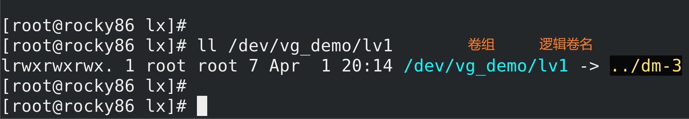
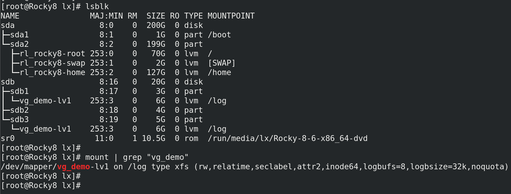
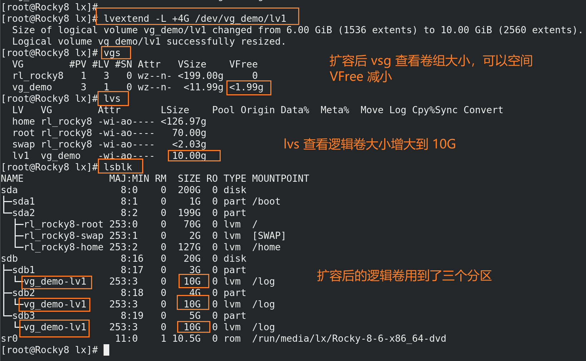

Linux 磁盘分区与文件系统

> 鸟哥的Linux私房菜-基础学习篇 第四版 第2章 主机规划与磁盘分区
> 鸟哥的Linux私房菜-基础学习篇 第四版 第7章 Linux磁盘与文件系统管理

# 设备文件类型
Both block and character devices provide an interface between the user space applications and the underlying hardware or kernel services. 
They allow programs to read from and write to the devices in a standardized way, abstracting away the complexities of the underlying hardware implementation.

## 字符设备
- Character devices represent devices that can be accessed as a stream of characters, indicating a sequential flow of data.
- They typically handle devices that require input or output of data character by character, such as serial ports, terminals, or devices that deal with keyboard/mouse input.
- Character devices are accessed through byte-by-byte I/O operations.
- They generally don't support random access and operate with a stream of characters.
- Examples of character devices include `/dev/tty` (terminal), `/dev/null` (null device), and `/dev/urandom` (random number generator).
- Character device files have a type identifier "c" in the permissions section of the `ls -l` command output.
## 块设备
- Block devices represent devices that allow access to data in fixed-sized blocks, typically used for storage devices like hard disks, SSDs, and USB drives.
- They are accessed in terms of block I/O operations and seem to be a continuous stream of data.
- Block devices are capable of random access, meaning you can read/write data at any position within a block without the need to read the entire block.
- Examples of block devices include `/dev/sda` (hard disk), `/dev/sdb` (USB drive), and `/dev/nvme0n1` (NVMe storage device).
- Block device files have a type identifier "b" in the permissions section of the `ls -l` command output.


# 磁盘连接方式与设备文件名的关系
> [devices.txt](https://www.kernel.org/doc/Documentation/admin-guide/devices.txt)
> [linux设备管理之主/次设备号](https://zhuanlan.zhihu.com/p/608858455)

- 每个设备都被当成文件对待
常见的接口类型对应的文件名（鸟哥的linux私房菜-基础学习篇 2.2.1）：


## 设备类型和设备号
- 查看字符设备和块设备对应的设备号
```bash
[root@ubuntu22-c0 ~]$ cat /proc/devices  | less
```
块设备：
```bash
Block devices:
  7 loop
  8 sd
  9 md
 11 sr
 65 sd
 66 sd
 67 sd
 68 sd
 69 sd
 70 sd
 71 sd
128 sd
129 sd
130 sd
131 sd
132 sd
133 sd
134 sd
135 sd
253 device-mapper
254 mdp
259 blkext
```

## 查看设备
```bash
[root@ubuntu22-c0 ~]$ lsblk -p
NAME                                  MAJ:MIN RM  SIZE RO TYPE MOUNTPOINTS
/dev/sda                                8:0    0  200G  0 disk
├─/dev/sda1                             8:1    0    1M  0 part
├─/dev/sda2                             8:2    0    2G  0 part /boot
└─/dev/sda3                             8:3    0  198G  0 part
  └─/dev/mapper/ubuntu--vg-ubuntu--lv 253:0    0   99G  0 lvm  /
/dev/sr0                               11:0    1 1024M  0 rom
```
```bash
[root@ubuntu22-c0 ~]$ ll /dev/sda*
brw-rw---- 1 root disk 8, 0 Aug 24 09:35 /dev/sda
brw-rw---- 1 root disk 8, 1 Aug 24 09:35 /dev/sda1
brw-rw---- 1 root disk 8, 2 Aug 24 09:35 /dev/sda2
brw-rw---- 1 root disk 8, 3 Aug 24 09:35 /dev/sda3
```

- 设备文件名根据 Linux 内核检测到磁盘的顺序来命令
如 /dev/sda 和 /dev/sdb，其中 `a` 和 `b` 取决于内核检测到磁盘的顺序

- 上面的 `8,0` 分别为 major number 和 minor number
主设备号 8 表示 `sd`，对应的设备类型为 SCSI，SATA，SAS 等设备，可以从 `/proc/devices` 中查看其设备号
次设备号来区分同一设备，例如这里用来区分不同分区；或者如果有另一个同类设备，其设备为 `/dev/sdb`，则主设备
号同样为 8，这时也可根据次设备号的不同区分设备

# 磁盘结构
> CSAPP 第三版第六章介绍

## 机械盘
1. Notice that **manufacturers** express **disk capacity** in **units** of **gigabytes** (GB) or **terabytes** (TB), where 1 GB = $10^9$ bytes and 1 TB = $10^{12}$ bytes.  （注意厂商表示磁盘容量不是用二进制，而是十进制）

2. 这种磁盘访问速度比 DRAM 慢了接近 250 倍。

3. 现代**磁盘控制器**将**磁盘**作为一系列的**逻辑块**提供给 CPU，每个**块**是**扇区**大小的**整数倍**，一个**扇区**是 512 bytes（或者 4K 字节），最简单的情况下，一个**逻辑块**就是一个**扇区**，**块号**是一系列增长的数字，从 0 开始，0， 1，2 ，等。**磁盘控制器**控制**物理扇区**和**逻辑块**的映射。

4. **磁盘控制器**会将一些**柱面**保留作为**备用柱面**，这些区域没有被映射为逻辑块，如果有个柱面的扇区坏了，**磁盘控制器**将数据复制到备用的柱面，然后磁盘就能继续正常工作。因此磁盘的格式容量（formatted capacity）比实际容量小。

## 固态盘
**固态硬盘**中有一个**固件**（firmware)设备 ，称为**闪存翻译层**（flash translation layer），充当旋转磁盘中**磁盘控制器**（disk controller）的功能。

**固态硬盘**中以**页**（page）为单位从**闪存**中读写数据，**页**的大小根据技术的不同，通常在 512 字节 到 4 KB。

一系列的**页**组成一**块**（block），注意这个**块**和前面提到的的**逻辑块**不同。

**写数据**：如果要写数据到某一**页**，必须保证该**页**所在的**块**的内容全部被**擦除**（erased），因此在写数据前必须将该**块**的其他**页**的数据内容复制到一个新的已经被擦除的**块**中，因此**写操作很复杂**。

**读数据**：直接读取。

一个**块**被反复擦除大约10万次后将被**磨损**，无法使用。


# fdisk 查看磁盘扇区大小
```bash
[root@ubuntu22-c0 ~]$ lsblk -p
NAME                                  MAJ:MIN RM  SIZE RO TYPE MOUNTPOINTS
/dev/sda                                8:0    0  200G  0 disk
├─/dev/sda1                             8:1    0    1M  0 part
├─/dev/sda2                             8:2    0    2G  0 part /boot
└─/dev/sda3                             8:3    0  198G  0 part
  └─/dev/mapper/ubuntu--vg-ubuntu--lv 253:0    0   99G  0 lvm  /
/dev/sr0                               11:0    1 1024M  0 rom
[root@ubuntu22-c0 ~]$ fdisk -l /dev/sda
Disk /dev/sda: 200 GiB, 214748364800 bytes, 419430400 sectors
Disk model: VMware Virtual S
Units: sectors of 1 * 512 = 512 bytes
Sector size (logical/physical): 512 bytes / 512 bytes
I/O size (minimum/optimal): 512 bytes / 512 bytes
Disklabel type: gpt
Disk identifier: CD107A96-8A31-4B05-B62C-EA05609760ED

Device       Start       End   Sectors  Size Type
/dev/sda1     2048      4095      2048    1M BIOS boot
/dev/sda2     4096   4198399   4194304    2G Linux filesystem
/dev/sda3  4198400 419428351 415229952  198G Linux filesystem
```
- 上面可以看出磁盘 /dev/sda 大小为 200G，扇区的大小为 512 字节

# 机械盘扇区划分
> [捋一捋磁盘及分区](https://zhuanlan.zhihu.com/p/388384142)
> [磁盘I/O那些事](https://tech.meituan.com/2017/05/19/about-desk-io.html)


- 早期每个磁道扇区数目相同，但外面磁道比里面周长大，因此外面一个扇区比里面一个扇区面积大，但存放的字节数相同，浪费
- 如今采用 ZBR（Zoned Bit Recording）技术，不通磁道扇区数目不同，采用等密度结构
这种结构导致相同时间内磁头读取的外磁道的数据多于内磁道，即外磁道数据传输速度快于内磁道


# lsblk 查看硬盘是机械盘还是固态盘
```bash
[root@ubuntu22-c0 ~]$ lsblk -d -o name,rota
NAME ROTA
sda     1
sr0     1
```
- ROTA 表示 rotational，值为 1 表示机械盘

# 磁盘分区

## 分区的作用
1. 提供逻辑隔离：磁盘分区将一个物理磁盘划分为多个逻辑部分，每个部分称为一个分区。这样做的目的是将磁盘空间划分为多个独立的区域，从而在每个分区中存储不同类型的数据。通过将数据隔离到不同的分区，可以提高安全性和可维护性。

2. 空间管理：磁盘分区允许您更有效地管理磁盘空间。您可以根据需要分配不同大小的分区，并将不同类型的数据存储在不同的分区中。这样可以更好地利用可用空间，避免磁盘碎片化，并提供更好的性能。

3. 多操作系统支持：磁盘分区对于在同一台计算机上安装多个操作系统是至关重要的。通过在不同的分区上安装不同的操作系统，每个操作系统都可以独立运行，并且它们的文件和设置不会相互干扰。

4. 文件系统管理：每个磁盘分区可以被格式化为不同的文件系统，例如ext4、NTFS等。不同的文件系统具有不同的特性和性能，因此您可以根据需求选择适当的文件系统来支持特定的应用程序、数据类型或性能需求。

5. 数据备份和恢复：通过在不同的磁盘分区上存储数据，您可以更轻松地执行数据备份和恢复操作。分区级别的备份可以提供更高的灵活性和粒度，以便只选择性地备份或恢复特定的数据。

总而言之，磁盘分区在Linux中具有以下重要的目的和作用：提供逻辑隔离、空间管理、多操作系统支持、文件系统管理以及数据备份和恢复。

## 分区方式
- 不同分区方式的差别
- 跨分区的文件使用有什么限制
	- 硬链接


- 查看硬盘分区方式
```bash
[root@ubuntu22-c0 ~]$ fdisk -l /dev/sda
Disk /dev/sda: 200 GiB, 214748364800 bytes, 419430400 sectors
Disk model: VMware Virtual S
Units: sectors of 1 * 512 = 512 bytes
Sector size (logical/physical): 512 bytes / 512 bytes
I/O size (minimum/optimal): 512 bytes / 512 bytes
Disklabel type: gpt
Disk identifier: CD107A96-8A31-4B05-B62C-EA05609760ED

Device       Start       End   Sectors  Size Type
/dev/sda1     2048      4095      2048    1M BIOS boot
/dev/sda2     4096   4198399   4194304    2G Linux filesystem
/dev/sda3  4198400 419428351 415229952  198G Linux filesystem
```

从结果可看出该磁盘分区类型为 gpt

### MBR (MS-DOS) 分区
- 早期 Linux 系统为兼容 Windows 磁盘，使用支持 Windows 的 MBR（Master Boot Record）方式处理启动引导程序与分区表
- 启动引导程序记录区与分区表放在磁盘的第一个扇区（0 磁道 0 扇区，最外面的磁道为 0 磁道），该扇区通常为 512 字节
	- 前 446 字节为主引导记录（Master Boot Record），即安装启动引导程序的地方
	- 64 字节为分区表（partition table），记录整个硬盘的分区状态
	- 最后 2 字节为 55AA，标识位

查看硬盘的前 512 字节
```bash
[root@ubuntu22-c0 ~]$ hexdump -Cv -n 512 /dev/sda
```

查看最后 2 字节
```bash
[root@ubuntu22-c0 ~]$ dd if=/dev/sda of=/tmp/mbr bs=1 count=2 skip=510
2+0 records in
2+0 records out
2 bytes copied, 0.000206745 s, 9.7 kB/s
[root@ubuntu22-c0 ~]$ hexdump -C /tmp/mbr
00000000  55 aa                                             |U.|
00000002
```

备份分区表 64 字节内容：
```bash
[root@ubuntu22-c0 ~]$  dd if=/dev/sda of=/tmp/partition bs=1 count=64 skip=446
64+0 records in
64+0 records out
64 bytes copied, 0.000374085 s, 171 kB/s
[root@ubuntu22-c0 ~]$ hexdump -vC /tmp/partition
00000000  00 00 02 00 ee ff ff ff  01 00 00 00 ff ff ff 18  |................|
00000010  00 00 00 00 00 00 00 00  00 00 00 00 00 00 00 00  |................|
00000020  00 00 00 00 00 00 00 00  00 00 00 00 00 00 00 00  |................|
00000030  00 00 00 00 00 00 00 00  00 00 00 00 00 00 00 00  |................|
00000040
```

#### MBR 分区表
- 最多 4 个主分区
仅有 64 字节存储分区表信息，一个分区信息占用 16 字节，因此最多四个主分区

- 单个分区不超过 2T
一个分区 16 字节，其中记录分区开始位置占 4 字节，记录分区结束位置占 4 字节，一个分区记录占 32 位
而分区记录的单位为扇区，一个扇区 512（$2^{9}$）字节，因此一个分区的最大空间位 $2^{9}*2^{32}$=$2^{41}$ 字节，即 2T 
(1T = $2^{40}$)

- 分区的最小单位 
之前旧的操作系统按照柱面分区(如 CentOS 5 之前版本)，之后按照扇区分区

如 ubuntu22.04 中以扇区为单位
```bash
[root@ubuntu22-c0 ~]$ fdisk -l /dev/sda
Disk /dev/sda: 200 GiB, 214748364800 bytes, 419430400 sectors
Disk model: VMware Virtual S
Units: sectors of 1 * 512 = 512 bytes
Sector size (logical/physical): 512 bytes / 512 bytes
I/O size (minimum/optimal): 512 bytes / 512 bytes
Disklabel type: gpt
Disk identifier: CD107A96-8A31-4B05-B62C-EA05609760ED

Device       Start       End   Sectors  Size Type
/dev/sda1     2048      4095      2048    1M BIOS boot
/dev/sda2     4096   4198399   4194304    2G Linux filesystem
/dev/sda3  4198400 419428351 415229952  198G Linux filesystem
```

- 有主分区和扩展分区组成，最多 4 个
- 扩展分区只能 1 个，或者没有，即 4 个主分区
- 扩展分区不能直接使用，必须在扩展分区中划分逻辑分区来使用

#### 主分区
- 主分区不能直接可以扩容和缩减
- 主分区不能超过 2T
- 设备名不会因为其他设备删除而动态变化

#### 扩展分区
- 分区表 64 字节，一个分区记录占用 16 字节，因此最多划分 4 个主分区
  如果想划分更多分区，需要使用扩展分区，扩展分区目的就是使用额外的扇区来记录分区信息
- 扩展分区仍然不能超过 2T
- 扩展分区最多只能有 1 个
- 扩展分区无法格式化，需要划分逻辑分区来存储数据


#### 逻辑分区
- 在扩展分区中划分
- 主分区和扩展分区总共最多四个
- 逻辑分区的设备号从 5 开始，如 /dev/sda5，前面四个数字留给主分区或扩展分区使用
- 逻辑分区的数量也有限制，依据操作系统而不同
- 逻辑分区能扩容和缩减，可以将两个逻辑分区合并为一个
- 设备名可能变化，如果删除 `sda5`，则原来的设备 `sda6` 变为 `sda5`，因此表示设备时用 `UUID` 更好

### GPT 分区
- GUID partition table 
- GPT 没有主分区和扩展分区的区别，采用 GUID 来标识分区，支持更多的分区数量
- GPT 将磁盘所有区块以 LBA (Logical Block Address) 来处理
- LBA0 为 MBR 兼容区块
- GPT 用 64 位表示分区大小，因此单个分区的容量为 8 ZB
- 和 MBR 仅有第一个扇区的 512 字节来记录不同，GPT分区在磁盘的最后会备份分区信息
- GPT 分区默认可以提供多达 128 组记录每组记录都能独立存在，都可视为主分区，用来格式化


## 新增磁盘
> [ Virtual Hard Disk is added, but not showing using lsblk -d command](https://www.linuxquestions.org/questions/linux-newbie-8/virtual-hard-disk-is-added-but-not-showing-using-lsblk-d-command-4175645367/)
> [How to detect new hard disk attached without rebooting?](https://unix.stackexchange.com/questions/404405/how-to-detect-new-hard-disk-attached-without-rebooting)
> [How to Scan Newly added Disks in Linux Easily](https://www.learnitguide.net/2016/02/how-to-scan-newly-added-disks-in-linux.html)
> [How to Scan\Detect new LUN’s & SCSI disks in Linux](https://www.2daygeek.com/scan-detect-luns-scsi-disks-on-redhat-centos-oracle-linux/)

vmware 中操作

- 可以不关机状态新增硬盘
- 新增硬盘后让系统识别到新硬盘
	- 重启系统
	- 重新扫描硬盘，需要 root 权限
	```bash
	[root@ubuntu22-c0 ~]$ ls /sys/class/scsi_host/
	host0   host11  host14  host17  host2   host22  host25  host28  host30  host4  host7
	host1   host12  host15  host18  host20  host23  host26  host29  host31  host5  host8
	host10  host13  host16  host19  host21  host24  host27  host3   host32  host6  host9
	[root@ubuntu22-c0 ~]$ for h in $(ls /sys/class/scsi_host); do
	> echo '- - -' > /sys/class/scsi_host/$h/scan
	> done
	[root@ubuntu22-c0 ~]$ lsblk -p
	NAME                                  MAJ:MIN RM  SIZE RO TYPE MOUNTPOINTS
	/dev/sda                                8:0    0  200G  0 disk
	├─/dev/sda1                             8:1    0    1M  0 part
	├─/dev/sda2                             8:2    0    2G  0 part /boot
	└─/dev/sda3                             8:3    0  198G  0 part
	└─/dev/mapper/ubuntu--vg-ubuntu--lv 253:0    0   99G  0 lvm  /
	/dev/sdb                                8:16   0   20G  0 disk
	/dev/sr0                               11:0    1 1024M  0 rom
	```
- 查看内核是否识别新的分区
	- 用 `lsblk` 命令查看是否有新分区信息
	- `cat /proc/partitions` 查看内核是否识别新的分区
## 分区工具 fdisk
```bash
[root@ubuntu22-c0 ~]$ whatis fdisk
fdisk (8)            - manipulate disk partition table
```

- 默认 fdisk 使用 MBR 分区方式

### fdisk -l device 查看设备分区
```bash
[root@ubuntu22-c0 ~]$ fdisk -l /dev/sda
Disk /dev/sda: 200 GiB, 214748364800 bytes, 419430400 sectors
Disk model: VMware Virtual S
Units: sectors of 1 * 512 = 512 bytes
Sector size (logical/physical): 512 bytes / 512 bytes
I/O size (minimum/optimal): 512 bytes / 512 bytes
Disklabel type: gpt
Disk identifier: CD107A96-8A31-4B05-B62C-EA05609760ED

Device       Start       End   Sectors  Size Type
/dev/sda1     2048      4095      2048    1M BIOS boot
/dev/sda2     4096   4198399   4194304    2G Linux filesystem
/dev/sda3  4198400 419428351 415229952  198G Linux filesystem
```

### fdisk device 为设备创建分区
- m 查看帮助
- p 打印信息
- n 添加新分区
- w 保存并退出 
- q 退出不保存

```bash
Command (m for help): n
Partition type
   p   primary (0 primary, 0 extended, 4 free)
   e   extended (container for logical partitions)
Select (default p): p
Partition number (1-4, default 1):
First sector (2048-41943039, default 2048):
Last sector, +/-sectors or +/-size{K,M,G,T,P} (2048-41943039, default 41943039): +1G

Created a new partition 1 of type 'Linux' and of size 1 GiB.
```

默认第一个扇区起始位置为 2048 

分区后:
```bash
[root@ubuntu22-c0 ~]$ lsblk -p
NAME                                  MAJ:MIN RM  SIZE RO TYPE MOUNTPOINTS
/dev/sda                                8:0    0  200G  0 disk
├─/dev/sda1                             8:1    0    1M  0 part
├─/dev/sda2                             8:2    0    2G  0 part /boot
└─/dev/sda3                             8:3    0  198G  0 part
  └─/dev/mapper/ubuntu--vg-ubuntu--lv 253:0    0   99G  0 lvm  /
/dev/sdb                                8:16   0   20G  0 disk
├─/dev/sdb1                             8:17   0    1G  0 part
├─/dev/sdb2                             8:18   0   10G  0 part
├─/dev/sdb3                             8:19   0    1K  0 part
├─/dev/sdb5                             8:21   0    3G  0 part
└─/dev/sdb6                             8:22   0    2G  0 part
/dev/sr0                               11:0    1 1024M  0 rom
```

### 分区工具 gdisk
```bash
[root@ubuntu22-c0 ~]$ whatis gdisk
gdisk (8)            - Interactive GUID partition table (GPT) manipulator
```

- 默认 GPT 分区
- 通 fdisk 使用类似，gdisk 设备名进入管理分区

```bash
[root@ubuntu22-c0 ~]$ gdisk -l /dev/sdb
GPT fdisk (gdisk) version 1.0.8

Partition table scan:
  MBR: protective
  BSD: not present
  APM: not present
  GPT: present

Found valid GPT with protective MBR; using GPT.
Disk /dev/sdb: 41943040 sectors, 20.0 GiB
Model: VMware Virtual S
Sector size (logical/physical): 512/512 bytes
Disk identifier (GUID): 786E1AAB-F5D0-4F9A-A61E-05400EC6B7DF
Partition table holds up to 128 entries
Main partition table begins at sector 2 and ends at sector 33
First usable sector is 34, last usable sector is 41943006
Partitions will be aligned on 2048-sector boundaries
Total free space is 31457213 sectors (15.0 GiB)

Number  Start (sector)    End (sector)  Size       Code  Name
   1            2048         4196351   2.0 GiB     8300  Linux filesystem
   2         4196352        10487807   3.0 GiB     8300  Linux filesystem
```

## partprobe 分区后同步分区表
- 内核中的分区表信息和硬盘分区表同步
- CentOS 7，8 同步分区表

```bash
[root@ubuntu22-c0 ~]$ whatis partprobe
partprobe (8)        - inform the OS of partition table changes
```

# BIOS 和 UEFI
> [UEFI vs. BIOS: How Do They Differ?](https://phoenixnap.com/kb/uefi-vs-bios)

- 主机系统加载硬件驱动方面的程序，主要有 BIOS 和 UEFI 两种机制
- CMOS 是记录硬件参数且嵌入在主板上面的存储器
- BIOS 是写入到主板上的固件（写入到硬件上的一个软件程序）
- BIOS 是启动时计算机系统会主动执行的第一个程序
- BIOS 主要完成硬件自检和引导操作系统，操作系统启动后，BIOS 的任务即完成
- BIOS 会依据用户的设置去取得能够启动的硬盘，并且到该硬盘里读取第一个扇区的 MBR  位置
MBR 的前 446 字节会存放最基本的启动引导程序，引导程序的目的时加载内核文件
- 启动引导程序（Boot loader）的主要任务有：
	- 提供选项
    用户选择不同的启动选项
	- 加载内核文件
    直接指向可以使用的程序区段来启动操作系统
	- 转交其他启动引导程序
    将启动管理功能转交给其他启动引导程序负责，启动引导程序除了可以安装在 MBR 之外，
	还可以安装在每个分区的启动扇区，如安装多系统时可以通过不同的选项启动不同的操作系统
- BIOS 仅是 16 位程序，分区限制大小为 2T
- BIOS 图形界面仅支持键盘操作，不支持鼠标
- 一般 BIOS 和 MBR 搭配，但 linux 也支持 BIOS + GPT + GRUB 启动

- UEFI 为 Unified extensible firmware interface，即统一可扩展固件接口 
- UEFI 使用 C 语言编写
- UEFI 引入 GPT 分区表，支持分区大小超过 2T
- UEFI 图形界面更容易操作，支持鼠标
- UEFI 可看成一个低级的操作系统
- 一般 UEFI 和 GPT 搭配

## 查看启动方式 BIOS 还是 UEFI
> [Guide To Check UEFI or BIOS In Windows/Linux System](https://servonode.com/check-uefi-or-bios-in-widows-or-linux)

### 方法一：查看 /sys/firmware/efi 目录
`/sys/firmware/efi` 目录存在则为 UEFI 启动

- ubuntu20.04 UEFI 启动
```bash
[10:17:49 root@ubuntu2004 /sys/firmware]#ls
acpi  dmi  efi  memmap
[10:17:50 root@ubuntu2004 /sys/firmware]#
```

- rocky8.6 BIOS 启动
```bash
root@rocky86 ~ $ cd /sys/firmware/
root@rocky86 firmware $ ls
acpi  dmi  memmap  qemu_fw_cfg
```

### 方法二：dmesg
- ubuntu20.04 UEFI 启动
```bash
root@ubuntu2004 ~# dmesg | grep efi:
[    0.000000] efi: EFI v2.60 by HUAWEI
[    0.000000] efi:  ACPI 2.0=0x8f7fe014  SMBIOS=0x8c4ed000  SMBIOS 3.0=0x8c4eb000  ESRT=0x8c4e9c18  MEMATTR=0x88fd9018  MOKvar=0x88fd7000 
```

- rocky8.6 BIOS 启动
```bash
root@rocky86 firmware $ dmesg | grep efi
[    0.000000] clocksource: refined-jiffies: mask: 0xffffffff max_cycles: 0xffffffff, max_idle_ns: 1910969940391419 ns
[    5.408252] tsc: Refined TSC clocksource calibration: 2918.420 MHz
root@rocky86 firmware $ 
root@rocky86 firmware $ dmesg | grep efi:
```

### 方法三：适合虚拟机安装查看
- VMware ---> 虚拟机 ---> 设置 ---> 选项 ---> 高级


# 文件系统
- 文件系统是操作系统使用的一种结构，用于在磁盘上组织文件和目录，并记录文件的位置、大小、权限等元数据。
- 文件系统是为了方便管理和组织硬盘上的数据，并提供对文件的读写、访问控制等功能。
- 一个分区只能创建一个文件系统
- 一个硬盘可以划分不同分区，每个分区可以使用不同的文件系统
	- 例如安装多操作系统，不同分区安装不同操作系统，从而使用不同的文件系统
	- 不同分区创建不同的文件系统用于管理不同类型的文件
     例如，在一个硬盘上创建一个ext4文件系统的分区用于存储系统文件和应用程序，
	 然后创建一个XFS文件系统的分区用于存储大量的媒体文件。

## 文件系统的作用
1. 数据组织：文件系统定义了文件和目录在磁盘上的结构，使得文件可以进行逻辑上的组织和存储。

2. 访问控制：文件系统通过权限机制确定哪些用户或进程有权限读取或修改文件内容。

3. 文件定位：文件系统提供了文件路径的机制，方便用户通过路径来访问和定位文件。

## 不同文件系统的区别
不同的文件系统采用不同的数据结构和算法来管理数据。
常见的Linux文件系统包括Ext4、XFS、Btrfs等。 这些文件系统在读写文件时可能有以下区别：

1. 性能特性：不同文件系统的性能特点各不相同。某些文件系统可能更适合大型文件的读写操作，而某些文件系统可能更适合处理小文件和元数据。

2. 容量限制：不同文件系统对支持的最大文件大小、分区大小等有不同的限制。

3. 日志和元数据写入：一些文件系统具有日志功能，可以记录文件系统操作，提高数据的完整性和一致性。而其他文件系统可能采用不同的元数据写入策略。

4. 数据压缩和加密：某些文件系统提供数据压缩和加密的特性，以减少磁盘空间占用和增加数据的安全性。

综上所述，不同文件系统有不同的特性和性能表现，选择合适的文件系统取决于具体的需求和应用场景。


## 文件系统类型
### ext4 
- 支持扩容和缩减

### xfs

### swap


## 虚拟文件系统 VFS
- 屏蔽不同文件系统的差异


## 创建文件系统
### mkfs

## 查看文件系统的属性

### clean 状态

### block size
- 跟文件系统的大小有关，如常用的 4KB
- 存放文件的最小单位
	- ll 查看目录时显示的大小为 4kB 
	- df 查看文件的大小和 ll 查看文件的大小
	- ls -s 查看文件的大小

- mkfs.ext -b 创建文件系统时指定文件大小
- 一旦文件系统创建完成，不能修改块的大小


### Reserved blocks
- 保留块，预留给 root 使用，普通用户无法使用，应急


### tune2fs 查看 ext4 文件系统属性

### xfs_info 查看 xfs 文件系统属性


# 挂载
- 挂载的目录必须先存在
- 挂载的文件夹最好用空目录，否则挂载后原来的文件看不到，除非解除挂载
- 一个设备可以同时挂载到多个挂载点


## 挂载的定义

## 挂载的目的
- 为什么要挂载


## 查看已挂载的所有设置

```bash

```

## mount 临时挂载

### -o ro 只读

### -a

### unmount 接触挂载

## 永久挂载
### 写配置文件 `/etc/fstab`
	- 设备名或UUID
	UUID 在用 mount 挂载后会生成，可以用 blkid 查看，该方式更好
	- 挂载点
	- 文件系统类型
	- 选项
	如 `ro` 只读

### 让配置文件生效
- mount -a 对配置文件中新增的行可以生效，但修改配置文件或删除不能生效
- mount -o remount 挂载点名 可以让配置文件生效


# 逻辑卷轴管理器 LVM
## 什么时 LVM


## 为什么需要逻辑卷

## 逻辑卷使用和物理卷区别

## 能否将全部分区都用逻辑卷


## 逻辑卷的性能


## 物理卷
### 查看物理卷的信息
#### pvs


#### pvdisplay 
- 更详细


## PE

## VG 卷组
- volumn group


### 查看卷组信息
#### vgs 

#### vgdisplay


## LV 逻辑卷
- logical volumn

### lvcreate 创建逻辑卷
- 创建完的逻辑卷是软连接



### 查看逻辑卷的信息
#### lvs

### lvdisplay


## 创建逻辑卷的过程
### 创建分区

### 修改分区的类型为 LVM
	- MBR 类型
	- GPT 类型

### 安装 lvm2 软件包
	- rocky : yum -y install lvm2
	- ubuntu: apt -y install lvm2

### pvcreate 创建物理卷
- 如 `pvcreate /dev/sdb{1..3}
- 


### vgcreate 创建卷组
- 如 `vgcreate vg_demo /dev/sdb{1..3}`
- 可以指定 PE 大小，加上 `-s` 选项，不指定则使用默认值


### lvcreate 创建逻辑卷
- `lvcreate  `


#### -n 指定逻辑卷名字

#### -L 指定逻辑卷的大小
- 可以直接指定 size，如 `6G`
- 如果指定的大小不是 PE 的整数倍怎么处理？
- 指定的大小不能超过卷组的大小

#### -l 指定逻辑卷的大小
- 指定 PE 的个数

#### 指明逻辑卷的卷组
- 一个逻辑卷能否能否从多个卷组组合？
- 能否不指明卷组


### 为逻辑卷创建文件系统
- 如 `mkfs.xfs /dev/vg_demo/lv1`


### 挂载
- 创建一个空目录如 `/log` 作为挂载点，如果该目录已存在，则换一个名字
- 用 `lsblk -f` 或者 `blkid` 查看逻辑卷的 UUID
- 修改 `/etc/fstab` 配置文件，注意挂载点必须存在，且最好是空目录，否则原来目录的内容会被覆盖

- 让配置文件生效 
	- `mount -a`，该命令对配置文件中新增或删除的项有效
	- 如果修改配置项后需要生效，用 `mount -o remount mountpoint` 
- 用 `lsblk` 可以查看逻辑卷有了挂载点的信息



## lvextend 扩展逻辑卷
- 在卷组的多余空间中扩容
- 先查看卷组是否还有空间进行扩展，用 `vgs` 查看 `VFree` 选项的值即为剩余的空间
- 用 `lvextend` 命令扩展，`-L` 选项指定大小，如 `lvextend -L +4G` 在原来的基础上增加 `4G`，必须卷组有 `4G` 的空间


### 扩展条件
- 已经有文件系统，已经有数据，能否扩容
- 先看卷组是否还有空间


### -L 指定大小
- 如 `lvextend -L +4G` 原来的基础上增加 `4G`，必须卷组有 `4G` 的空间


### -l 指定 PE 个数

### -r 自动重置文件系统大小


