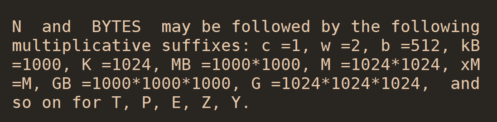
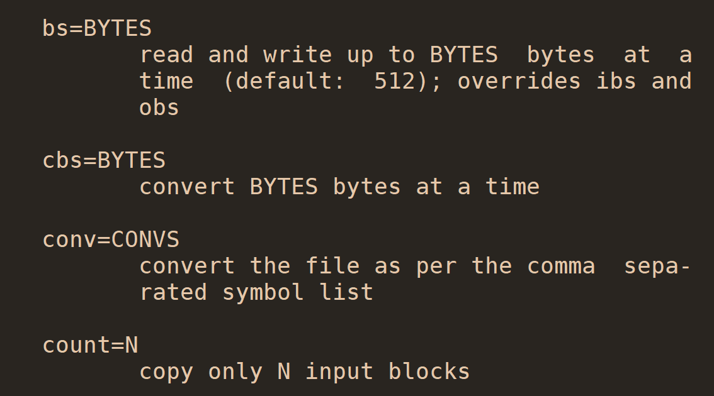
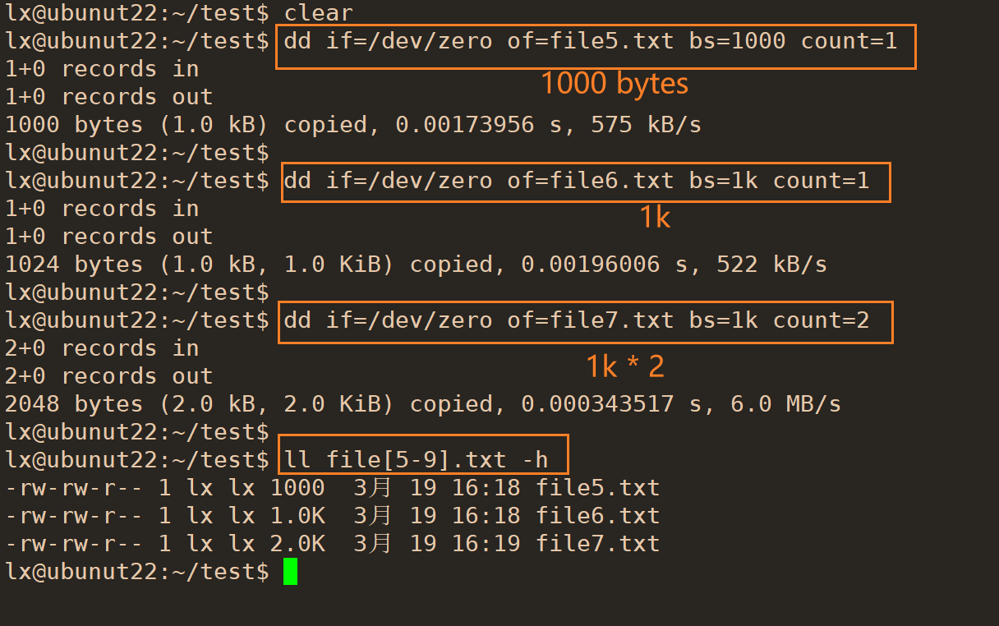
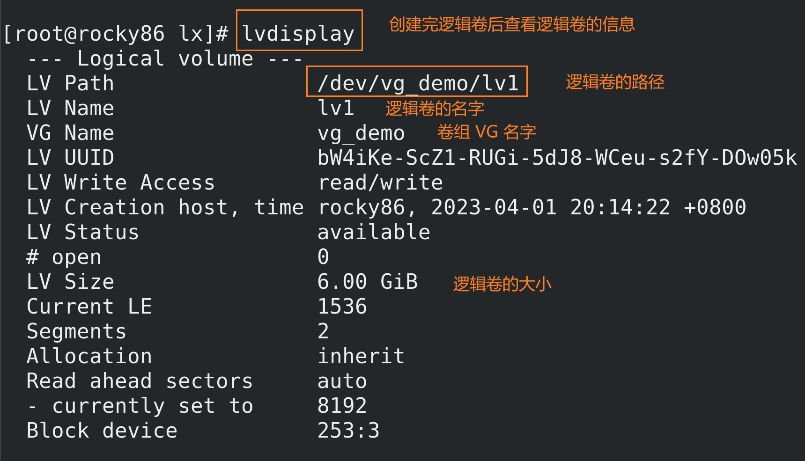

Linux 磁盘分区与文件系统

> 鸟哥的Linux私房菜-基础学习篇 第四版 第2章 主机规划与磁盘分区
> 鸟哥的Linux私房菜-基础学习篇 第四版 第7章 Linux磁盘与文件系统管理
> 鸟哥的Linux私房菜-基础学习篇 第四版 第14章 磁盘配额（Quota）与高级文件系统管理

# 设备文件类型
Both block and character devices provide an interface between the user space applications and the underlying hardware or kernel services. 
They allow programs to read from and write to the devices in a standardized way, abstracting away the complexities of the underlying hardware implementation.

## 字符设备
- Character devices represent devices that can be accessed as a stream of characters, indicating a sequential flow of data.
- They typically handle devices that require input or output of data character by character, such as serial ports, terminals, or devices that deal with keyboard/mouse input.
- Character devices are accessed through byte-by-byte I/O operations.
- They generally don't support random access and operate with a stream of characters.
- Examples of character devices include `/dev/tty` (terminal), `/dev/null` (null device), and `/dev/urandom` (random number generator).
- Character device files have a type identifier "c" in the permissions section of the `ls -l` command output.
## 块设备
- Block devices represent devices that allow access to data in fixed-sized blocks, typically used for storage devices like hard disks, SSDs, and USB drives.
- They are accessed in terms of block I/O operations and seem to be a continuous stream of data.
- Block devices are capable of random access, meaning you can read/write data at any position within a block without the need to read the entire block.
- Examples of block devices include `/dev/sda` (hard disk), `/dev/sdb` (USB drive), and `/dev/nvme0n1` (NVMe storage device).
- Block device files have a type identifier "b" in the permissions section of the `ls -l` command output.

# 磁盘连接方式与设备文件名的关系
> [devices.txt](https://www.kernel.org/doc/Documentation/admin-guide/devices.txt)
> [linux设备管理之主/次设备号](https://zhuanlan.zhihu.com/p/608858455)

- 每个设备都被当成文件对待
常见的接口类型对应的文件名（鸟哥的linux私房菜-基础学习篇 2.2.1）：


## 设备类型和设备号
- 查看字符设备和块设备对应的设备号
```bash
[root@ubuntu22-c0 ~]$ cat /proc/devices  | less
```
块设备：
```bash
Block devices:
  7 loop
  8 sd
  9 md
 11 sr
 65 sd
 66 sd
 67 sd
 68 sd
 69 sd
 70 sd
 71 sd
128 sd
129 sd
130 sd
131 sd
132 sd
133 sd
134 sd
135 sd
253 device-mapper
254 mdp
259 blkext
```

## 查看设备
```bash
[root@ubuntu22-c0 ~]$ lsblk -p
NAME                                  MAJ:MIN RM  SIZE RO TYPE MOUNTPOINTS
/dev/sda                                8:0    0  200G  0 disk
├─/dev/sda1                             8:1    0    1M  0 part
├─/dev/sda2                             8:2    0    2G  0 part /boot
└─/dev/sda3                             8:3    0  198G  0 part
  └─/dev/mapper/ubuntu--vg-ubuntu--lv 253:0    0   99G  0 lvm  /
/dev/sr0                               11:0    1 1024M  0 rom
```
```bash
[root@ubuntu22-c0 ~]$ ll /dev/sda*
brw-rw---- 1 root disk 8, 0 Aug 24 09:35 /dev/sda
brw-rw---- 1 root disk 8, 1 Aug 24 09:35 /dev/sda1
brw-rw---- 1 root disk 8, 2 Aug 24 09:35 /dev/sda2
brw-rw---- 1 root disk 8, 3 Aug 24 09:35 /dev/sda3
```

- 设备文件名根据 Linux 内核检测到磁盘的顺序来命令
如 /dev/sda 和 /dev/sdb，其中 `a` 和 `b` 取决于内核检测到磁盘的顺序

- 上面的 `8,0` 分别为 major number 和 minor number
主设备号 8 表示 `sd`，对应的设备类型为 SCSI，SATA，SAS 等设备，可以从 `/proc/devices` 中查看其设备号
次设备号来区分同一设备，例如这里用来区分不同分区；或者如果有另一个同类设备，其设备为 `/dev/sdb`，则主设备
号同样为 8，这时也可根据次设备号的不同区分设备

# 磁盘结构
> CSAPP 第三版第六章介绍

## 机械盘
1. Notice that **manufacturers** express **disk capacity** in **units** of **gigabytes** (GB) or **terabytes** (TB), where 1 GB = $10^9$ bytes and 1 TB = $10^{12}$ bytes.  （注意厂商表示磁盘容量不是用二进制，而是十进制）

2. 这种磁盘访问速度比 DRAM 慢了接近 250 倍。

3. 现代**磁盘控制器**将**磁盘**作为一系列的**逻辑块**提供给 CPU，每个**块**是**扇区**大小的**整数倍**，一个**扇区**是 512 bytes（或者 4K 字节），最简单的情况下，一个**逻辑块**就是一个**扇区**，**块号**是一系列增长的数字，从 0 开始，0， 1，2 ，等。**磁盘控制器**控制**物理扇区**和**逻辑块**的映射。

4. **磁盘控制器**会将一些**柱面**保留作为**备用柱面**，这些区域没有被映射为逻辑块，如果有个柱面的扇区坏了，**磁盘控制器**将数据复制到备用的柱面，然后磁盘就能继续正常工作。因此磁盘的格式容量（formatted capacity）比实际容量小。

## 固态盘
**固态硬盘**中有一个**固件**（firmware)设备 ，称为**闪存翻译层**（flash translation layer），充当旋转磁盘中**磁盘控制器**（disk controller）的功能。

**固态硬盘**中以**页**（page）为单位从**闪存**中读写数据，**页**的大小根据技术的不同，通常在 512 字节 到 4 KB。

一系列的**页**组成一**块**（block），注意这个**块**和前面提到的的**逻辑块**不同。

**写数据**：如果要写数据到某一**页**，必须保证该**页**所在的**块**的内容全部被**擦除**（erased），因此在写数据前必须将该**块**的其他**页**的数据内容复制到一个新的已经被擦除的**块**中，因此**写操作很复杂**。

**读数据**：直接读取。

一个**块**被反复擦除大约10万次后将被**磨损**，无法使用。


# fdisk 查看磁盘扇区大小
```bash
[root@ubuntu22-c0 ~]$ lsblk -p
NAME                                  MAJ:MIN RM  SIZE RO TYPE MOUNTPOINTS
/dev/sda                                8:0    0  200G  0 disk
├─/dev/sda1                             8:1    0    1M  0 part
├─/dev/sda2                             8:2    0    2G  0 part /boot
└─/dev/sda3                             8:3    0  198G  0 part
  └─/dev/mapper/ubuntu--vg-ubuntu--lv 253:0    0   99G  0 lvm  /
/dev/sr0                               11:0    1 1024M  0 rom
[root@ubuntu22-c0 ~]$ fdisk -l /dev/sda
Disk /dev/sda: 200 GiB, 214748364800 bytes, 419430400 sectors
Disk model: VMware Virtual S
Units: sectors of 1 * 512 = 512 bytes
Sector size (logical/physical): 512 bytes / 512 bytes
I/O size (minimum/optimal): 512 bytes / 512 bytes
Disklabel type: gpt
Disk identifier: CD107A96-8A31-4B05-B62C-EA05609760ED

Device       Start       End   Sectors  Size Type
/dev/sda1     2048      4095      2048    1M BIOS boot
/dev/sda2     4096   4198399   4194304    2G Linux filesystem
/dev/sda3  4198400 419428351 415229952  198G Linux filesystem
```
- 上面可以看出磁盘 /dev/sda 大小为 200G，扇区的大小为 512 字节

# 机械盘扇区划分
> [捋一捋磁盘及分区](https://zhuanlan.zhihu.com/p/388384142)
> [磁盘I/O那些事](https://tech.meituan.com/2017/05/19/about-desk-io.html)


- 早期每个磁道扇区数目相同，但外面磁道比里面周长大，因此外面一个扇区比里面一个扇区面积大，但存放的字节数相同，浪费
- 如今采用 ZBR（Zoned Bit Recording）技术，不通磁道扇区数目不同，采用等密度结构
这种结构导致相同时间内磁头读取的外磁道的数据多于内磁道，即外磁道数据传输速度快于内磁道


# lsblk 查看硬盘是机械盘还是固态盘
```bash
[root@ubuntu22-c0 ~]$ lsblk -d -o name,rota
NAME ROTA
sda     1
sr0     1
```
- ROTA 表示 rotational，值为 1 表示机械盘

# 磁盘分区

## 分区的作用
1. 提供逻辑隔离：磁盘分区将一个物理磁盘划分为多个逻辑部分，每个部分称为一个分区。这样做的目的是将磁盘空间划分为多个独立的区域，从而在每个分区中存储不同类型的数据。通过将数据隔离到不同的分区，可以提高安全性和可维护性。

2. 空间管理：磁盘分区允许更有效地管理磁盘空间。可以根据需要分配不同大小的分区，并将不同类型的数据存储在不同的分区中。这样可以更好地利用可用空间，避免磁盘碎片化，并提供更好的性能。

3. 多操作系统支持：磁盘分区对于在同一台计算机上安装多个操作系统是至关重要的。通过在不同的分区上安装不同的操作系统，每个操作系统都可以独立运行，并且它们的文件和设置不会相互干扰。

4. 文件系统管理：每个磁盘分区可以被格式化为不同的文件系统，例如ext4、NTFS等。不同的文件系统具有不同的特性和性能，因此可以根据需求选择适当的文件系统来支持特定的应用程序、数据类型或性能需求。

5. 数据备份和恢复：通过在不同的磁盘分区上存储数据，您可以更轻松地执行数据备份和恢复操作。分区级别的备份可以提供更高的灵活性和粒度，以便只选择性地备份或恢复特定的数据。

总而言之，磁盘分区在Linux中具有以下重要的目的和作用：提供逻辑隔离、空间管理、多操作系统支持、文件系统管理以及数据备份和恢复。

硬盘也可以不分区使用

## 分区方式
- 不同分区方式的差别
- 跨分区的文件使用有什么限制
	- 硬链接


- 查看硬盘分区方式
```bash
[root@ubuntu22-c0 ~]$ fdisk -l /dev/sda
Disk /dev/sda: 200 GiB, 214748364800 bytes, 419430400 sectors
Disk model: VMware Virtual S
Units: sectors of 1 * 512 = 512 bytes
Sector size (logical/physical): 512 bytes / 512 bytes
I/O size (minimum/optimal): 512 bytes / 512 bytes
Disklabel type: gpt
Disk identifier: CD107A96-8A31-4B05-B62C-EA05609760ED

Device       Start       End   Sectors  Size Type
/dev/sda1     2048      4095      2048    1M BIOS boot
/dev/sda2     4096   4198399   4194304    2G Linux filesystem
/dev/sda3  4198400 419428351 415229952  198G Linux filesystem
```

从结果可看出该磁盘分区类型为 gpt

### MBR (MS-DOS) 分区
- 早期 Linux 系统为兼容 Windows 磁盘，使用支持 Windows 的 MBR（Master Boot Record）方式处理启动引导程序与分区表
- 启动引导程序记录区与分区表放在磁盘的第一个扇区（0 磁道 0 扇区，最外面的磁道为 0 磁道），该扇区通常为 512 字节
	- 前 446 字节为主引导记录（Master Boot Record），即安装启动引导程序的地方
	- 64 字节为分区表（partition table），记录整个硬盘的分区状态
	- 最后 2 字节为 55AA，标识位

查看硬盘的前 512 字节
```bash
[root@ubuntu22-c0 ~]$ hexdump -Cv -n 512 /dev/sda
```

查看最后 2 字节
```bash
[root@ubuntu22-c0 ~]$ dd if=/dev/sda of=/tmp/mbr bs=1 count=2 skip=510
2+0 records in
2+0 records out
2 bytes copied, 0.000206745 s, 9.7 kB/s
[root@ubuntu22-c0 ~]$ hexdump -C /tmp/mbr
00000000  55 aa                                             |U.|
00000002
```

备份分区表 64 字节内容：
```bash
[root@ubuntu22-c0 ~]$  dd if=/dev/sda of=/tmp/partition bs=1 count=64 skip=446
64+0 records in
64+0 records out
64 bytes copied, 0.000374085 s, 171 kB/s
[root@ubuntu22-c0 ~]$ hexdump -vC /tmp/partition
00000000  00 00 02 00 ee ff ff ff  01 00 00 00 ff ff ff 18  |................|
00000010  00 00 00 00 00 00 00 00  00 00 00 00 00 00 00 00  |................|
00000020  00 00 00 00 00 00 00 00  00 00 00 00 00 00 00 00  |................|
00000030  00 00 00 00 00 00 00 00  00 00 00 00 00 00 00 00  |................|
00000040
```

#### MBR 分区表
- 最多 4 个主分区
仅有 64 字节存储分区表信息，一个分区信息占用 16 字节，因此最多四个主分区

- 单个分区不超过 2T
一个分区 16 字节，其中记录分区开始位置占 4 字节，记录分区结束位置占 4 字节，一个分区记录占 32 位
而分区记录的单位为扇区，一个扇区 512（$2^{9}$）字节，因此一个分区的最大空间位 $2^{9}*2^{32}$=$2^{41}$ 字节，即 2T 
(1T = $2^{40}$)

- 分区的最小单位 
之前旧的操作系统按照柱面分区(如 CentOS 5 之前版本)，之后按照扇区分区

如 ubuntu22.04 中以扇区为单位
```bash
[root@ubuntu22-c0 ~]$ fdisk -l /dev/sda
Disk /dev/sda: 200 GiB, 214748364800 bytes, 419430400 sectors
Disk model: VMware Virtual S
Units: sectors of 1 * 512 = 512 bytes
Sector size (logical/physical): 512 bytes / 512 bytes
I/O size (minimum/optimal): 512 bytes / 512 bytes
Disklabel type: gpt
Disk identifier: CD107A96-8A31-4B05-B62C-EA05609760ED

Device       Start       End   Sectors  Size Type
/dev/sda1     2048      4095      2048    1M BIOS boot
/dev/sda2     4096   4198399   4194304    2G Linux filesystem
/dev/sda3  4198400 419428351 415229952  198G Linux filesystem
```

- 有主分区和扩展分区组成，最多 4 个
- 扩展分区只能 1 个，或者没有，即 4 个主分区
- 扩展分区不能直接使用，必须在扩展分区中划分逻辑分区来使用

#### 主分区
- 主分区不能直接可以扩容和缩减
- 主分区不能超过 2T
- 设备名不会因为其他设备删除而动态变化

#### 扩展分区
- 分区表 64 字节，一个分区记录占用 16 字节，因此最多划分 4 个主分区
  如果想划分更多分区，需要使用扩展分区，扩展分区目的就是使用额外的扇区来记录分区信息
- 扩展分区仍然不能超过 2T
- 扩展分区最多只能有 1 个
- 扩展分区无法格式化，需要划分逻辑分区来存储数据


#### 逻辑分区
- 在扩展分区中划分
- 主分区和扩展分区总共最多四个
- 逻辑分区的设备号从 5 开始，如 /dev/sda5，前面四个数字留给主分区或扩展分区使用
- 逻辑分区的数量也有限制，依据操作系统而不同
- 逻辑分区能扩容和缩减，可以将两个逻辑分区合并为一个
- 设备名可能变化，如果删除 `sda5`，则原来的设备 `sda6` 变为 `sda5`，因此表示设备时用 `UUID` 更好

### GPT 分区
- GUID partition table 
- GPT 没有主分区和扩展分区的区别，采用 GUID 来标识分区，支持更多的分区数量
- GPT 将磁盘所有区块以 LBA (Logical Block Address) 来处理
- LBA0 为 MBR 兼容区块
- GPT 用 64 位表示分区大小，因此单个分区的容量为 8 ZB
- 和 MBR 仅有第一个扇区的 512 字节来记录不同，GPT分区在磁盘的最后会备份分区信息
- GPT 分区默认可以提供多达 128 组记录每组记录都能独立存在，都可视为主分区，用来格式化


## 新增磁盘
> [ Virtual Hard Disk is added, but not showing using lsblk -d command](https://www.linuxquestions.org/questions/linux-newbie-8/virtual-hard-disk-is-added-but-not-showing-using-lsblk-d-command-4175645367/)
> [How to detect new hard disk attached without rebooting?](https://unix.stackexchange.com/questions/404405/how-to-detect-new-hard-disk-attached-without-rebooting)
> [How to Scan Newly added Disks in Linux Easily](https://www.learnitguide.net/2016/02/how-to-scan-newly-added-disks-in-linux.html)
> [How to Scan\Detect new LUN’s & SCSI disks in Linux](https://www.2daygeek.com/scan-detect-luns-scsi-disks-on-redhat-centos-oracle-linux/)

vmware 中操作

- 可以不关机状态新增硬盘
- 新增硬盘后让系统识别到新硬盘
	- 重启系统
	- 重新扫描硬盘，需要 root 权限
	```bash
	[root@ubuntu22-c0 ~]$ ls /sys/class/scsi_host/
	host0   host11  host14  host17  host2   host22  host25  host28  host30  host4  host7
	host1   host12  host15  host18  host20  host23  host26  host29  host31  host5  host8
	host10  host13  host16  host19  host21  host24  host27  host3   host32  host6  host9
	[root@ubuntu22-c0 ~]$ for h in $(ls /sys/class/scsi_host); do
	> echo '- - -' > /sys/class/scsi_host/$h/scan
	> done
	[root@ubuntu22-c0 ~]$ lsblk -p
	NAME                                  MAJ:MIN RM  SIZE RO TYPE MOUNTPOINTS
	/dev/sda                                8:0    0  200G  0 disk
	├─/dev/sda1                             8:1    0    1M  0 part
	├─/dev/sda2                             8:2    0    2G  0 part /boot
	└─/dev/sda3                             8:3    0  198G  0 part
	└─/dev/mapper/ubuntu--vg-ubuntu--lv 253:0    0   99G  0 lvm  /
	/dev/sdb                                8:16   0   20G  0 disk
	/dev/sr0                               11:0    1 1024M  0 rom
	```
- 查看内核是否识别新的分区
	- 用 `lsblk` 命令查看是否有新分区信息
	- `cat /proc/partitions` 查看内核是否识别新的分区
## 分区工具 fdisk
```bash
[root@ubuntu22-c0 ~]$ whatis fdisk
fdisk (8)            - manipulate disk partition table
```

- 默认 fdisk 使用 MBR 分区方式

### fdisk -l device 查看设备分区
```bash
[root@ubuntu22-c0 ~]$ fdisk -l /dev/sda
Disk /dev/sda: 200 GiB, 214748364800 bytes, 419430400 sectors
Disk model: VMware Virtual S
Units: sectors of 1 * 512 = 512 bytes
Sector size (logical/physical): 512 bytes / 512 bytes
I/O size (minimum/optimal): 512 bytes / 512 bytes
Disklabel type: gpt
Disk identifier: CD107A96-8A31-4B05-B62C-EA05609760ED

Device       Start       End   Sectors  Size Type
/dev/sda1     2048      4095      2048    1M BIOS boot
/dev/sda2     4096   4198399   4194304    2G Linux filesystem
/dev/sda3  4198400 419428351 415229952  198G Linux filesystem
```

### fdisk device 为设备创建分区
- m 查看帮助
- p 打印信息
- n 添加新分区
- w 保存并退出 
- q 退出不保存

```bash
Command (m for help): n
Partition type
   p   primary (0 primary, 0 extended, 4 free)
   e   extended (container for logical partitions)
Select (default p): p
Partition number (1-4, default 1):
First sector (2048-41943039, default 2048):
Last sector, +/-sectors or +/-size{K,M,G,T,P} (2048-41943039, default 41943039): +1G

Created a new partition 1 of type 'Linux' and of size 1 GiB.
```

默认第一个扇区起始位置为 2048 

分区后:
```bash
[root@ubuntu22-c0 ~]$ lsblk -p
NAME                                  MAJ:MIN RM  SIZE RO TYPE MOUNTPOINTS
/dev/sda                                8:0    0  200G  0 disk
├─/dev/sda1                             8:1    0    1M  0 part
├─/dev/sda2                             8:2    0    2G  0 part /boot
└─/dev/sda3                             8:3    0  198G  0 part
  └─/dev/mapper/ubuntu--vg-ubuntu--lv 253:0    0   99G  0 lvm  /
/dev/sdb                                8:16   0   20G  0 disk
├─/dev/sdb1                             8:17   0    1G  0 part
├─/dev/sdb2                             8:18   0   10G  0 part
├─/dev/sdb3                             8:19   0    1K  0 part
├─/dev/sdb5                             8:21   0    3G  0 part
└─/dev/sdb6                             8:22   0    2G  0 part
/dev/sr0                               11:0    1 1024M  0 rom
```

### 分区工具 gdisk
```bash
[root@ubuntu22-c0 ~]$ whatis gdisk
gdisk (8)            - Interactive GUID partition table (GPT) manipulator
```

- 默认 GPT 分区
- 通 fdisk 使用类似，gdisk 设备名进入管理分区

```bash
[root@ubuntu22-c0 ~]$ gdisk -l /dev/sdb
GPT fdisk (gdisk) version 1.0.8

Partition table scan:
  MBR: protective
  BSD: not present
  APM: not present
  GPT: present

Found valid GPT with protective MBR; using GPT.
Disk /dev/sdb: 41943040 sectors, 20.0 GiB
Model: VMware Virtual S
Sector size (logical/physical): 512/512 bytes
Disk identifier (GUID): 786E1AAB-F5D0-4F9A-A61E-05400EC6B7DF
Partition table holds up to 128 entries
Main partition table begins at sector 2 and ends at sector 33
First usable sector is 34, last usable sector is 41943006
Partitions will be aligned on 2048-sector boundaries
Total free space is 31457213 sectors (15.0 GiB)

Number  Start (sector)    End (sector)  Size       Code  Name
   1            2048         4196351   2.0 GiB     8300  Linux filesystem
   2         4196352        10487807   3.0 GiB     8300  Linux filesystem
```

## partprobe 分区后同步分区表
- 内核中的分区表信息和硬盘分区表同步
- CentOS 7，8 同步分区表

```bash
[root@ubuntu22-c0 ~]$ whatis partprobe
partprobe (8)        - inform the OS of partition table changes
```

## lsblk 列出磁盘
```bash
[root@ubuntu22-c0 ~]$ lsblk
NAME                      MAJ:MIN RM  SIZE RO TYPE MOUNTPOINTS
sda                         8:0    0  200G  0 disk
├─sda1                      8:1    0    1M  0 part
├─sda2                      8:2    0    2G  0 part /boot
└─sda3                      8:3    0  198G  0 part
  └─ubuntu--vg-ubuntu--lv 253:0    0   99G  0 lvm  /
sdb                         8:16   0   20G  0 disk
├─sdb1                      8:17   0    2G  0 part
└─sdb2                      8:18   0    3G  0 part
sr0                        11:0    1 1024M  0 rom
```
- `RM` 表示 removable device，是否可卸载设备

- lsblk -f 显示文件系统信息
- lsblk -p 显示完整路径
- lsblk -o 指定输出列


# BIOS 和 UEFI
> [UEFI vs. BIOS: How Do They Differ?](https://phoenixnap.com/kb/uefi-vs-bios)

- 主机系统加载硬件驱动方面的程序，主要有 BIOS 和 UEFI 两种机制
- CMOS 是记录硬件参数且嵌入在主板上面的存储器
- BIOS 是写入到主板上的固件（写入到硬件上的一个软件程序）
- BIOS 是启动时计算机系统会主动执行的第一个程序
- BIOS 主要完成硬件自检和引导操作系统，操作系统启动后，BIOS 的任务即完成
- BIOS 会依据用户的设置去取得能够启动的硬盘，并且到该硬盘里读取第一个扇区的 MBR  位置
MBR 的前 446 字节会存放最基本的启动引导程序，引导程序的目的时加载内核文件
- 启动引导程序（Boot loader）的主要任务有：
	- 提供选项
    用户选择不同的启动选项
	- 加载内核文件
    直接指向可以使用的程序区段来启动操作系统
	- 转交其他启动引导程序
    将启动管理功能转交给其他启动引导程序负责，启动引导程序除了可以安装在 MBR 之外，
	还可以安装在每个分区的启动扇区，如安装多系统时可以通过不同的选项启动不同的操作系统
- BIOS 仅是 16 位程序，分区限制大小为 2T
- BIOS 图形界面仅支持键盘操作，不支持鼠标
- 一般 BIOS 和 MBR 搭配，但 linux 也支持 BIOS + GPT + GRUB 启动

- UEFI 为 Unified extensible firmware interface，即统一可扩展固件接口 
- UEFI 使用 C 语言编写
- UEFI 引入 GPT 分区表，支持分区大小超过 2T
- UEFI 图形界面更容易操作，支持鼠标
- UEFI 可看成一个低级的操作系统
- 一般 UEFI 和 GPT 搭配

## 查看启动方式 BIOS 还是 UEFI
> [Guide To Check UEFI or BIOS In Windows/Linux System](https://servonode.com/check-uefi-or-bios-in-widows-or-linux)

### 方法一：查看 /sys/firmware/efi 目录
`/sys/firmware/efi` 目录存在则为 UEFI 启动

- ubuntu20.04 UEFI 启动
```bash
[10:17:49 root@ubuntu2004 /sys/firmware]#ls
acpi  dmi  efi  memmap
[10:17:50 root@ubuntu2004 /sys/firmware]#
```

- rocky8.6 BIOS 启动
```bash
root@rocky86 ~ $ cd /sys/firmware/
root@rocky86 firmware $ ls
acpi  dmi  memmap  qemu_fw_cfg
```

### 方法二：dmesg
- ubuntu20.04 UEFI 启动
```bash
root@ubuntu2004 ~# dmesg | grep efi:
[    0.000000] efi: EFI v2.60 by HUAWEI
[    0.000000] efi:  ACPI 2.0=0x8f7fe014  SMBIOS=0x8c4ed000  SMBIOS 3.0=0x8c4eb000  ESRT=0x8c4e9c18  MEMATTR=0x88fd9018  MOKvar=0x88fd7000 
```

- rocky8.6 BIOS 启动
```bash
root@rocky86 firmware $ dmesg | grep efi
[    0.000000] clocksource: refined-jiffies: mask: 0xffffffff max_cycles: 0xffffffff, max_idle_ns: 1910969940391419 ns
[    5.408252] tsc: Refined TSC clocksource calibration: 2918.420 MHz
root@rocky86 firmware $ 
root@rocky86 firmware $ dmesg | grep efi:
```

### 方法三：适合虚拟机安装查看
- VMware ---> 虚拟机 ---> 设置 ---> 选项 ---> 高级


# 文件系统
- 文件系统是操作系统使用的一种结构，用于在磁盘上组织文件和目录，并记录文件的位置、大小、权限等元数据。
- 文件系统是为了方便管理和组织硬盘上的数据，并提供对文件的读写、访问控制等功能。
- 一个分区只能创建一个文件系统
- 一个硬盘可以划分不同分区，每个分区可以使用不同的文件系统
	- 例如安装多操作系统，不同分区安装不同操作系统，从而使用不同的文件系统
	- 不同分区创建不同的文件系统用于管理不同类型的文件
    例如，在一个硬盘上创建一个ext4文件系统的分区用于存储系统文件和应用程序，
	  然后创建一个XFS文件系统的分区用于存储大量的媒体文件。

- `man fs` 查看文件系统说明

## 文件系统的作用
1. 数据组织：文件系统定义了文件和目录在磁盘上的结构，使得文件可以进行逻辑上的组织和存储。

2. 访问控制：文件系统通过权限机制确定哪些用户或进程有权限读取或修改文件内容。

3. 文件定位：文件系统提供了文件路径的机制，方便用户通过路径来访问和定位文件。

## 不同文件系统的区别
不同的文件系统采用不同的数据结构和算法来管理数据。
常见的Linux文件系统包括Ext4、XFS、Btrfs等。 这些文件系统在读写文件时可能有以下区别：

1. 性能特性：不同文件系统的性能特点各不相同。某些文件系统可能更适合大型文件的读写操作，而某些文件系统可能更适合处理小文件和元数据。

2. 容量限制：不同文件系统对支持的最大文件大小、分区大小等有不同的限制。

3. 日志和元数据写入：一些文件系统具有日志功能，可以记录文件系统操作，提高数据的完整性和一致性。而其他文件系统可能采用不同的元数据写入策略。

4. 数据压缩和加密：某些文件系统提供数据压缩和加密的特性，以减少磁盘空间占用和增加数据的安全性。

综上所述，不同文件系统有不同的特性和性能表现，选择合适的文件系统取决于具体的需求和应用场景。


## 查看内核支持的文件系统
```bash
[root@ubuntu22-c0 ~]$ uname -r
5.15.0-79-generic
[root@ubuntu22-c0 ~]$ ls /lib/modules/$(uname -r)/kernel/fs
9p      bfs             coda    f2fs      hfs      ksmbd       nfsd    omfs       quota         ubifs
adfs    binfmt_misc.ko  cramfs  fat       hfsplus  lockd       nilfs2  orangefs   reiserfs      udf
affs    btrfs           dlm     freevxfs  hpfs     minix       nls     overlayfs  romfs         ufs
afs     cachefiles      efs     fscache   isofs    netfs       ntfs    pstore     shiftfs.ko    vboxsf
autofs  ceph            erofs   fuse      jffs2    nfs         ntfs3   qnx4       smbfs_common  xfs
befs    cifs            exfat   gfs2      jfs      nfs_common  ocfs2   qnx6       sysv          zonefs
```

- 支持的文件系统并不一定在当前系统可用，如果编译内核时未选择则不可用

## 查看当前系统可用的文件系统
```bash
[root@ubuntu22-c0 ~]$ cat /proc/filesystems
nodev   sysfs
nodev   tmpfs
nodev   bdev
nodev   proc
nodev   cgroup
nodev   cgroup2
nodev   cpuset
nodev   devtmpfs
nodev   configfs
nodev   debugfs
nodev   tracefs
nodev   securityfs
nodev   sockfs
nodev   bpf
nodev   pipefs
nodev   ramfs
nodev   hugetlbfs
nodev   devpts
        ext3
        ext2
        ext4
        squashfs
        vfat
nodev   ecryptfs
        fuseblk
nodev   fuse
nodev   fusectl
nodev   mqueue
nodev   pstore
        btrfs
nodev   autofs
nodev   binfmt_misc
```

## 文件系统类型
> [File System Comparison: NTFS, FAT32, exFAT, and EXT, Which File System Should I Use](https://www.easeus.com/diskmanager/file-system.html)


- linux 常用文件系统
	- ext2/3/4
	- xfs
	- swap
- Windows 常用文件系统
	- FAT32
	- NTFS
- unix 常用文件系统
- 网络文件系统
	- NFS
- 集群文件系统
	- GFS2
- 分布式文件系统
	- ceph
- RAW 裸文件系统
未经处理或未经格式化的文件系统


## 文件系统的组成
1. 内核中的模块：这是文件系统的核心部分，它们是内核模块，负责在操作系统内核中实现文件系统的功能。
在Linux中，常见的文件系统模块包括ext4（采用扩展文件系统4）、xfs（专为高性能设计的文件系统）和vfat（用于FAT文件系统）等。
这些模块负责处理与文件的读写、目录结构管理、磁盘空间分配等相关操作。

2. Linux虚拟文件系统：Linux虚拟文件系统（VFS）是一个抽象层，它为用户空间应用程序提供与不同文件系统的统一接口。
VFS负责处理文件系统的挂载、文件路径的解析、缓存管理等任务。
它隐藏了不同文件系统的细节，使应用程序能够以统一的方式进行文件操作，而无需关心底层文件系统的具体实现。

3. 用户空间管理工具：用户空间管理工具用于创建、格式化和管理不同文件系统类型。这些工具通常以"mkfs"开头，后面跟着文件系统类型的名称，比如mkfs.ext4、mkfs.xfs和mkfs.vfat。
这些工具提供了命令行界面，供用户使用特定的命令和选项来创建文件系统、分配磁盘空间、设置文件系统特性等。

内核模块提供文件系统的核心功能，VFS提供统一的接口，而用户空间工具则用于创建和管理文件系统。
这些组成部分共同协作，使得操作系统能够有效地管理文件和存储空间。


## 硬盘格式化
在Linux中，硬盘格式化是指对硬盘或分区进行特定的操作，以准备其用作文件系统的存储介质。
硬盘格式化的目的是在存储介质上创建文件系统结构并初始化相关元数据，以使其能够有效地存储和管理文件数据。

通常，硬盘格式化分为两个主要步骤：分区和格式化。

1. 分区：在硬盘上划分分区是指将硬盘分为若干个逻辑区域，每个分区在逻辑上独立，并被视为一个单独的存储设备。分区可以将硬盘划分为不同的区域，方便对文件系统进行管理和分配空间。分区会在硬盘上创建分区表，记录每个分区的起始位置、大小和文件系统类型等信息。通过使用分区，可以将硬盘有效地划分为多个逻辑存储单元，使文件系统的管理更加灵活。

2. 格式化：一旦分区创建完毕，就可以对每个分区进行格式化。格式化是在分区上创建文件系统结构及其相关元数据的过程。在格式化过程中，文件系统会在分区上建立目录结构、元数据表和相应的文件数据结构，以准备文件的存储和管理。格式化还会进行一些必要的初始化操作，如设置文件系统的默认参数、预分配磁盘空间等。

需要注意的是，格式化是一个破坏性操作，它会清空分区上的所有数据。因此，在进行格式化之前，请务必备份重要的数据，以免丢失。

分区和格式化是独立的操作，但通常在创建新分区后进行格式化。这样，文件系统结构和元数据将相应地在分区上创建，以准备文件的存储和管理。

传统的一个分区只能被格式化为一个文件系统

## mkfs 创建文件系统
```bash
[root@ubuntu22-c0 ~]$ whatis mkfs
mkfs (8)             - build a Linux filesystem
```

```bash
[root@ubuntu22-c0 ~]$ mkfs.ext4 /dev/sdb1
mke2fs 1.46.5 (30-Dec-2021)
Creating filesystem with 524288 4k blocks and 131072 inodes
Filesystem UUID: 7c1d3234-c920-454a-9940-a280cfd1ac91
Superblock backups stored on blocks:
        32768, 98304, 163840, 229376, 294912

Allocating group tables: done
Writing inode tables: done
Creating journal (16384 blocks): done
Writing superblocks and filesystem accounting information: done
```

- 创建文件系统后用 `lsblk -f` 查看
- 创建文件系统后不能使用，因为该文件系统的根目录与 Linux 系统根目录独立，无法直接使用该文件系统
linux 系统支持同时使用多个文件系统，每个文件系统都有自己的根目录
因此创建文件系统（格式化）后需要挂载，即将文件系统与 linux 系统中特定的目录关联，使得该文件系统在该目录下可见和可访问
- 创建文件系统后用 `lsblk -f` 查看可看见该文件系统分配一个 UUID，该 UUID 唯一且不会改变，可以用其表示该分区
MBR 分区方式中创建的逻辑分区的设备名可能改变，随着其他逻辑分区的删除名字动态变化，这种情况下用 UUID 代表该分区更稳定

## blkid 查看块设备属性
```bash
[root@ubuntu22-c0 ~]$ whatis blkid
blkid (8)            - locate/print block device attributes
[root@ubuntu22-c0 ~]$ blkid
/dev/mapper/ubuntu--vg-ubuntu--lv: UUID="8ff51380-f669-4ec7-9344-435cc629f026" BLOCK_SIZE="4096" TYPE="ext4"
/dev/sda2: UUID="f81cc5f3-9189-4a0c-b53a-f67110325cc7" BLOCK_SIZE="4096" TYPE="ext4" PARTUUID="3b07f660-02d5-4564-ace5-88dfb42355f6"
/dev/sda3: UUID="tdjiqK-EK47-vWMt-8sMA-wIvP-B0Fc-rGXGe1" TYPE="LVM2_member" PARTUUID="73f41d5d-e069-4c48-9ee3-8b258466bbbf"
/dev/sdb2: UUID="6f48cb0f-ad98-4b95-8de1-897abd770596" BLOCK_SIZE="512" TYPE="xfs" PARTLABEL="Linux filesystem" PARTUUID="36b14776-7ca9-48e6-a4e3-074f269f32ea"
/dev/sdb1: UUID="7c1d3234-c920-454a-9940-a280cfd1ac91" BLOCK_SIZE="4096" TYPE="ext4" PARTLABEL="Linux filesystem" PARTUUID="961f8f5d-bd97-4549-9423-db7084edf16e"
/dev/sda1: PARTUUID="3747d8f2-bf73-4d32-9007-983bb39d9867"
```

## 文件系统的特性
> [第八章、Linux 磁盘与文件系统管理](http://cn.linux.vbird.org/linux_basic/0230filesystem_1.php)

- 文件系统将文件的权限（rwx）与文件属性（owner,group,timestamp等）放在 inode 中，数据放在数据区块中
- 文件系统创建时（格式化时）就已经规划好 inode 和数据区块


### 超级区块
记录文件系统的整体信息，包括 inode 与数据区块的总量，使用量，剩余量等

### inode
- 记录文件系统的属性，一个文件占用一个 inode，同时记录次此文件的数据所在的区块号码
- 每个 inode 都有一个编号，inode 中有文件数据区块的编号
- 这种为索引式文件系统


### 数据区块
文件的实际内容，若文件太大，会占用多个区块


## linux 的 ext2 文件系统
> [第八章、Linux 磁盘与文件系统管理](http://cn.linux.vbird.org/linux_basic/0230filesystem_1.php)

- ext2 文件系统格式化时划分了多个区块群组（block group），每个区块群组有独立的 inode，数据区块，超级区块等
- 文件系统最前面有一个启动扇区（boot sector），该启动扇区可以安装启动引导程序（ext2）
- 区块群组由六部分组成
	- 数据区块（data block）
	有 1k、2k以及 4k 三种，格式化分区时就已经固定
	不同区块大小对文件系统能支持的最大磁盘容量与最大单一文件容量有影响
	原则上，区块的大小在格式化完成后不能修改
	每个区块最多只能放置一个文件的数据
	如果文件大于区块的大小，则占用多个区块
	如果文件小于区块的大小，则区块剩余的空间不能被使用，造成浪费
	- inode table
    记录文件的读写属性（rwx）
	文件的 owner 和 group
	文件的大小
	文件的 timastamp (mtime, ctime, atime)
	文件特性的标识（flag），如 SetUID
	文件真正内容的位置
	inode 数量与大小在格式化时以及固定
	每个文件仅占用一个 inode
	文件系统能建立的文件数量与 inode 数量有关
	读取文件时需要先找到 inode，查看权限等参数是否符合才能读写
	ext2 inode 大小为 128B
	inode 区块号码的区域定义为 12 个直接、一个间接、一个双间接与一个三间接记录区，为了能记录更多区块信息
	- 超级区块（superblock）
	整个文件系统的信息，没有超级区块，就没有文件系统
	记录数据区块与 inode 的总量
	记录未使用与已使用的 inode 与数据区块数量
	记录数据区块与 inode 的大小
	记录文件系统的挂载时间，最近一次写入数据的时间、最近一次检验磁盘的时间等
	记录有效位数值，已被挂载则为 0
	每个区块群组都可能含有超级区块，为了备份
	- 文件系统描述说明（filesystem description）
	描述每个区块群组的开始与结束区块，以及每个区块介于哪个之间
	- 区块对照表（block bitmap）
    查看哪些区块是空的可以使用
	- inode 对照表（inode bitmap）
	记录已使用和未使用的 inode 号码

## tune2fs 调整 ext 系列文件系统的参数
```bash
[root@ubuntu22-c0 ~]$ whatis tune2fs
tune2fs (8)          - adjust tunable file system parameters on ext2/ext3/ext4 file systems
[root@ubuntu22-c0 ~]$ tune2fs -l /dev/sdb1 | less
```

- 用 tune2fs 查看 ext4 文件系统的属性，如块大小等
- Reserved blocks，保留块，预留给 root 使用，普通用户无法使用，应急


## dumpe2fs 显示 ext 系列文件系统信息
```bash
[root@ubuntu22-c0 ~]$ whatis dumpe2fs
dumpe2fs (8)         - dump ext2/ext3/ext4 file system information
[root@ubuntu22-c0 ~]$ dumpe2fs /dev/sdb1
```

- 例如看到该分区文件系统的 block size 大小为 4k

## xfs_info 查看 xfs 文件系统属性
```bash
[root@ubuntu22-c0 ~]$ whatis xfs_info
xfs_info (8)         - display XFS filesystem geometry information
[root@ubuntu22-c0 ~]$ xfs_info /dev/sdb2
meta-data=/dev/sdb2              isize=512    agcount=4, agsize=196608 blks
         =                       sectsz=512   attr=2, projid32bit=1
         =                       crc=1        finobt=1, sparse=1, rmapbt=0
         =                       reflink=1    bigtime=0 inobtcount=0
data     =                       bsize=4096   blocks=786432, imaxpct=25
         =                       sunit=0      swidth=0 blks
naming   =version 2              bsize=4096   ascii-ci=0, ftype=1
log      =internal log           bsize=4096   blocks=2560, version=2
         =                       sectsz=512   sunit=0 blks, lazy-count=1
realtime =none                   extsz=4096   blocks=0, rtextents=0
```

## df 查看文件系统的整体使用量
- df -ah
- df -ih 查看 inode 的使用量

## du 查看目录所占的磁盘空间
```bash
[root@ubuntu22-c0 ~]$ du -h snap/
4.0K    snap/lxd/common
4.0K    snap/lxd/22923
12K     snap/lxd
16K     snap/
[root@ubuntu22-c0 ~]$ du -sh snap/
16K     snap/
```

## 文件系统与目录
- 目录的内容为文件名，文件的内容记录文件的实际数据
- 文件系统中创建目录时会分配一个 inode 与至少一个区块给该目录
因此 `ll` 查看目录时大小为 4k 或其整数倍（块大小为 4k 时）
如果目录中的文件不多，则只占用一个区块，如果文件过多可能占用多个区块
```bash
[root@ubuntu22-c0 ~]$ ll snap/
total 12
drwx------ 3 root root 4096 Feb 21  2023 ./
drwx------ 7 root root 4096 Aug 26 22:43 ../
drwxr-xr-x 4 root root 4096 Feb 21  2023 lxd/
```

## 文件系统与文件
linux 中创建文件时，会分配一个 inode 号与相应数量的区块
如果文件过大，需要超过 12 个区块，则还需要额外的区块来记录区块号码，因为仅有 12 个直接指向区块


## 日志文件系统 (Jounrnaling filesystem)
如果文件写入到一半时发生故障导致文件元数据内容和实际数据存放区不一致（inconsistent），
为了后期进行一致性检查方便，因此有了日志文件系统

- 在文件系统中规划一个区块，专门记录写入或修改文件时的步骤


## 文件系统的异步（asynchronously）处理
- 数据必须先加载到内存后 CPU 才能进行处理
- 文件加载到内存后，内存区段文件数据被设置为 clean
- 如果文件被修改，则内存中的数据被设置为 dirty，但并未写入到磁盘
- 系统会不定时将内存中设置为 dirty 的数据写回磁盘，保持磁盘和内存中数据的一致性
- 可以用 sync 命令强制将内存中数据写入磁盘同步


# 挂载
硬盘创建文件系统（格式化）后不能使用，因为该文件系统的根目录与 Linux 系统根目录独立，无法直接使用该文件系统
linux 系统支持同时使用多个文件系统，每个文件系统都有自己的根目录
因此创建文件系统（格式化）后需要挂载，即将文件系统与 linux 系统中特定的目录关联，使得该文件系统在该目录下可见和可访问

将设备挂载到 linux 目录树的某个目录上，该目录成为挂载点

- 挂载点的目录必须先存在
- 挂载点的文件夹最好用空目录，否则挂载后原来的文件看不到，除非解除挂载
- 一个设备可以同时挂载到多个挂载点

```bash
[root@ubuntu22-c0 ~]$ df -h
Filesystem                         Size  Used Avail Use% Mounted on
tmpfs                              193M  1.3M  192M   1% /run
/dev/mapper/ubuntu--vg-ubuntu--lv   97G  5.8G   87G   7% /
tmpfs                              965M     0  965M   0% /dev/shm
tmpfs                              5.0M     0  5.0M   0% /run/lock
/dev/sda2                          2.0G  253M  1.6G  14% /boot
tmpfs                              193M     0  193M   0% /run/user/0
```


## 查看已挂载的所有设备
- mount
- cat /etc/mtab
- cat /proc/mounts

- findmnt 查看系统整个挂载树
```bash
[root@ubuntu22-c0 ~]$ findmnt /dev/sda2
TARGET SOURCE    FSTYPE OPTIONS
/boot  /dev/sda2 ext4   rw,relatime
```


## mount 临时挂载
```bash
[root@ubuntu22-c0 ~]$ mount /dev/sdb1 /tmp/f1/
[root@ubuntu22-c0 ~]$ lsblk -f -o name,fstype,mountpoints
NAME                      FSTYPE      MOUNTPOINTS
sda
├─sda1
├─sda2                    ext4        /boot
└─sda3                    LVM2_member
  └─ubuntu--vg-ubuntu--lv ext4        /
sdb
├─sdb1                    ext4        /tmp/f1
└─sdb2                    xfs
sr0
```

### umount 卸载文件系统
卸载文件系统的挂载

```bash
[root@ubuntu22-c0 ~]$ lsblk -pf -o name,fstype,mountpoints
NAME                                  FSTYPE      MOUNTPOINTS
/dev/sda
├─/dev/sda1
├─/dev/sda2                           ext4        /boot
└─/dev/sda3                           LVM2_member
  └─/dev/mapper/ubuntu--vg-ubuntu--lv ext4        /
/dev/sdb
├─/dev/sdb1                           ext4        /tmp/f1
└─/dev/sdb2                           xfs
/dev/sr0
[root@ubuntu22-c0 ~]$ umount /dev/sdb1
[root@ubuntu22-c0 ~]$ lsblk -pf -o name,fstype,mountpoints
NAME                                  FSTYPE      MOUNTPOINTS
/dev/sda
├─/dev/sda1
├─/dev/sda2                           ext4        /boot
└─/dev/sda3                           LVM2_member
  └─/dev/mapper/ubuntu--vg-ubuntu--lv ext4        /
/dev/sdb
├─/dev/sdb1                           ext4
└─/dev/sdb2                           xfs
/dev/sr0
```

## 永久挂载
### 写配置文件 `/etc/fstab`
> [What does "sw" option mean in /etc/fstab?](https://superuser.com/questions/1057412/what-does-sw-option-mean-in-etc-fstab)

- 根据说明写上挂载信息
- `man fstab` 查看帮助说明，对每个字段做解释
```bash
[root@ubuntu22-c0 ~]$ cat /etc/fstab
# /etc/fstab: static file system information.
#
# Use 'blkid' to print the universally unique identifier for a
# device; this may be used with UUID= as a more robust way to name devices
# that works even if disks are added and removed. See fstab(5).
#
# <file system> <mount point>   <type>  <options>       <dump>  <pass>
# / was on /dev/ubuntu-vg/ubuntu-lv during curtin installation
/dev/disk/by-id/dm-uuid-LVM-aL2z4qRF6RP6ygmuXVQ89hX7MrChz0jPApnaIZ1WSFWWkEAhejDEX9zi7SrwDOep / ext4 defaults 0 1
# /boot was on /dev/sda2 during curtin installation
/dev/disk/by-uuid/f81cc5f3-9189-4a0c-b53a-f67110325cc7 /boot ext4 defaults 0 1
/swap.img       none    swap    sw      0       0
```

- 设备名或UUID
UUID 在用 mount 挂载后会生成，可以用 blkid 查看，该方式更好
- 挂载点
- 文件系统类型
- 选项
如 `ro` 只读
- 转储频率
默认 0 不备份，1 每天备份，2 隔一天备份
- fsck 检查文件系统的顺序
检查文件系统是否 clean，默认 0 不自检


### 让配置文件生效
- mount -a 对配置文件中新增的行可以生效，但修改配置文件或删除不能生效
- mount -o remount 挂载点名 可以让配置文件生效


# swap 交换分区
> [Chapter 15. Swap Sapce](https://access.redhat.com/documentation/en-us/red_hat_enterprise_linux/7/html/storage_administration_guide/ch-swapspace)


swap 空间过大会造成浪费，合适设置见官方说明

```bash
[root@ubuntu22-c0 ~]$ free -h
               total        used        free      shared  buff/cache   available
Mem:           1.9Gi       277Mi       1.3Gi       1.0Mi       296Mi       1.5Gi
Swap:          2.0Gi          0B       2.0Gi
```

## swapon 启用 swap
- swapon -a 启用 swap，/etc/fstab 中先有 swap 信息
- swapon -s 查看 swap 信息
```bash
[root@ubuntu22-c0 ~]$ free -h
               total        used        free      shared  buff/cache   available
Mem:           1.9Gi       307Mi       1.3Gi       1.0Mi       318Mi       1.4Gi
Swap:          5.0Gi          0B       5.0Gi
[root@ubuntu22-c0 ~]$ swapon -s
Filename                                Type            Size            Used            Priority
/dev/sdb3                               partition       3145724         0               -2
/swap.img                               file            2097148         0               -3
```
显示优先级，数值越高越先使用，如果有多个 swap 空间，可以设置优先级，如设置外圈磁道的 swap 优先级高

## swapoff 禁用 swap 
有些场景需要禁用 swap 分区，如 k8s

1. /etc/fstab 中将 swap 挂载一行注释
2. swapoff -a 禁用
```bash
[root@ubuntu22-c0 ~]$ swapoff -a
[root@ubuntu22-c0 ~]$ free -h
               total        used        free      shared  buff/cache   available
Mem:           1.9Gi       273Mi       1.3Gi       1.0Mi       316Mi       1.5Gi
Swap:             0B          0B          0B
```


## 利用物理分区创建 swap 分区
1. 创建分区
如用 gdisk 创建分区，注意修改文件系统的类型，默认为 8300，改为 8200，即分区类型为 linux swap
```bash
Command (? for help): n
Partition number (3-128, default 3):
First sector (34-41943006, default = 10487808) or {+-}size{KMGTP}:
Last sector (10487808-41943006, default = 41943006) or {+-}size{KMGTP}: +3G
Current type is 8300 (Linux filesystem)
Hex code or GUID (L to show codes, Enter = 8300): L
Type search string, or <Enter> to show all codes: swap
8200 Linux swap                          a502 FreeBSD swap
a582 Midnight BSD swap                   a901 NetBSD swap
bf02 Solaris swap
Hex code or GUID (L to show codes, Enter = 8300):
```

2. 创建文件系统
利用 mkswap 将分区格式化为 swap 空间
```bash
[root@ubuntu22-c0 ~]$ whatis mkswap
mkswap (8)           - set up a Linux swap area
[root@ubuntu22-c0 ~]$ mkswap /dev/sdb3
Setting up swapspace version 1, size = 3 GiB (3221221376 bytes)
no label, UUID=71b70e05-4c74-4ad9-a8d1-9598c327b5b0
```
会生成一个 UUID

3. 将 swap 分区添加到 /etc/fstab 文件中
利用生成的 UUID 表示 swap 分区
挂载点为 none
```bash
/dev/sdb3 none swap sw 0 0
```

保存后通过 `swapon -a` 让其生效
```bash
[root@ubuntu22-c0 ~]$ free -h
               total        used        free      shared  buff/cache   available
Mem:           1.9Gi       308Mi       1.3Gi       1.0Mi       317Mi       1.4Gi
Swap:          3.0Gi          0B       3.0Gi
```

swapon -s 查看 swap 空间信息
```bash
[root@ubuntu22-c0 ~]$ swapon -s
Filename                                Type            Size            Used            Priority
/dev/sdb3                               partition       3145724         0               -2
```

## 利用文件创建 swap
1. 利用 dd 创建一个大文件
```bash
[root@ubuntu22-c0 ~]$ dd if=/dev/zero of=/tmp/swapfile bs=1M count=2048
2048+0 records in
2048+0 records out
2147483648 bytes (2.1 GB, 2.0 GiB) copied, 6.98492 s, 307 MB/s
[root@ubuntu22-c0 ~]$ ll -h /tmp/swapfile
-rw-r--r-- 1 root root 2.0G Aug 27 13:22 /tmp/swapfile
```

2. 利用 mkswap 将文件格式化为内存交换文件的文件格式
```bash
[root@ubuntu22-c0 ~]$ mkswap /tmp/swapfile
mkswap: /tmp/swapfile: insecure permissions 0644, fix with: chmod 0600 /tmp/swapfile
Setting up swapspace version 1, size = 2 GiB (2147479552 bytes)
no label, UUID=27609b3e-6a7e-4ed6-bc6b-b99f7d8d322a
[root@ubuntu22-c0 ~]$ blkid /tmp/swapfile
/tmp/swapfile: UUID="27609b3e-6a7e-4ed6-bc6b-b99f7d8d322a" TYPE="swap"
[root@ubuntu22-c0 ~]$ chmod 644 /tmp/swapfile
```
最好对 swap 文件权限修改


3. 修改 /etc/fstab 
用文件名而非 UUID 
```bash
 /tmp/swapfile none swap sw 0 0
```

3. swapon -a 启用 swap
```bash
[root@ubuntu22-c0 ~]$ swapon -a
[root@ubuntu22-c0 ~]$ free -h
               total        used        free      shared  buff/cache   available
Mem:           1.9Gi       277Mi        64Mi       1.0Mi       1.5Gi       1.4Gi
Swap:          4.0Gi          0B       4.0Gi
[root@ubuntu22-c0 ~]$ swapon -s
Filename                                Type            Size            Used            Priority
/swap.img                               file            2097148         0               -2
/tmp/swapfile                           file            2097148         0               -3
```

## swap 使用策略
> [Understanding vm.swappiness](https://linuxhint.com/understanding_vm_swappiness/)

查看下面内核参数：
```bash
[root@ubuntu22-c0 shell_scripts]$ cat /proc/sys/vm/swappiness
60
```
默认值为 60 表示空闲内存还有 60% 时就使用 swap 

在 /etc/sysctl.conf 中修改内核参数：
```bash
[root@ubuntu22-c0 shell_scripts]$ sysctl -a | grep swappiness
vm.swappiness = 60
[root@ubuntu22-c0 shell_scripts]$ vim /etc/sysctl.conf
[root@ubuntu22-c0 shell_scripts]$ tail -n2 /etc/sysctl.conf

vm.swappiness = 10
```
sysctl -p 使其生效
```bash
[root@ubuntu22-c0 shell_scripts]$ sysctl -p
vm.swappiness = 10
```

# 使用光盘
- rocky 8.6

```bash
[root@mysql ~]$ lsblk -p
NAME                    MAJ:MIN RM  SIZE RO TYPE MOUNTPOINT
/dev/sda                  8:0    0  200G  0 disk
├─/dev/sda1               8:1    0    1G  0 part /boot
└─/dev/sda2               8:2    0  199G  0 part
  ├─/dev/mapper/rl-root 253:0    0   70G  0 lvm  /
  ├─/dev/mapper/rl-swap 253:1    0    2G  0 lvm  [SWAP]
  └─/dev/mapper/rl-home 253:2    0  127G  0 lvm  /home
/dev/sr0                 11:0    1 10.5G  0 rom
[root@mysql ~]$ mount /dev/sr0 /mnt/
mount: /mnt: WARNING: device write-protected, mounted read-only.
[root@mysql ~]$ ls /mnt/
AppStream  BaseOS  EFI  images  isolinux  LICENSE  media.repo  TRANS.TBL
```
- 上面的 /dev/sr0 为光盘，要使用必须挂载

## mount 挂载
```bash
[root@mysql ~]$ mount /dev/sr0 /mnt/
mount: /mnt: WARNING: device write-protected, mounted read-only.
[root@mysql ~]$ ls /mnt/
AppStream  BaseOS  EFI  images  isolinux  LICENSE  media.repo  TRANS.TBL
```

## autofs 自动挂载
```bash
[root@mysql ~]$ umount /dev/sr0
[root@mysql ~]$ lsblk -p
NAME                    MAJ:MIN RM  SIZE RO TYPE MOUNTPOINT
/dev/sda                  8:0    0  200G  0 disk
├─/dev/sda1               8:1    0    1G  0 part /boot
└─/dev/sda2               8:2    0  199G  0 part
  ├─/dev/mapper/rl-root 253:0    0   70G  0 lvm  /
  ├─/dev/mapper/rl-swap 253:1    0    2G  0 lvm  [SWAP]
  └─/dev/mapper/rl-home 253:2    0  127G  0 lvm  /home
/dev/sr0                 11:0    1 10.5G  0 rom
[root@mysql ~]$ ls /mnt/
```

- 安装 autofs
```bash
[root@mysql ~]$ yum install -y autofs
```
```bash
[root@mysql ~]$ systemctl enable --now autofs.service
Created symlink /etc/systemd/system/multi-user.target.wants/autofs.service → /usr/lib/systemd/system/autofs.service.
```

访问 /misc/cd 即将光盘挂载在该目录下
```bash
[root@mysql ~]$ ls /misc/cd
AppStream  BaseOS  EFI  images  isolinux  LICENSE  media.repo  TRANS.TBL
```

## eject 弹出光盘

## wodim 刻录光盘

## Rufus 将 IOS 制作为 U 盘工具


# 使用 USB

## lsusb 列出 USB 设备
```bash
[root@mysql ~]$ whatis lsusb
lsusb (8)            - list USB devices
[root@mysql ~]$ lsusb
Bus 001 Device 001: ID 1d6b:0002 Linux Foundation 2.0 root hub
Bus 002 Device 004: ID 0e0f:0008 VMware, Inc.
Bus 002 Device 003: ID 0e0f:0002 VMware, Inc. Virtual USB Hub
Bus 002 Device 002: ID 0e0f:0003 VMware, Inc. Virtual Mouse
Bus 002 Device 001: ID 1d6b:0001 Linux Foundation 1.1 root hub
```

# 文件工具 dd
> [https://www.lanqiao.cn/courses/1/learning/?id=62&compatibility=true](https://www.lanqiao.cn/courses/1/learning/?id=62&compatibility=true)

```bash
[root@mysql ~]$ whatis dd
dd (1)               - convert and copy a file
dd (1p)              - convert and copy a file
```

## 生成任意大小的文件
- 文件单位





```bash
[root@ubuntu22 html]$ dd if=/dev/zero of=index.html bs=1M count=10
10+0 records in
10+0 records out
10485760 bytes (10 MB, 10 MiB) copied, 0.0347324 s, 302 MB/s
[root@ubuntu22 html]$ ll -h
total 11M
drwxr-xr-x  2 nginx nginx 4.0K May 18 18:30 ./
drwxr-xr-x 12 nginx nginx 4.0K May 18 15:57 ../
-rw-r--r--  1 nginx nginx  497 May 18 14:11 50x.html
-rw-r--r--  1 nginx nginx  10M May 18 18:31 index.html
```

# 磁盘配额（Quota）
> [第十五章、磁碟配额(Quota)与进阶文件系统管理](http://cn.linux.vbird.org/linux_basic/0420quota_1.php)

- 限制用户的硬盘容量，妥善分配系统资源

## 磁盘配额的使用场景
- 网站服务器
每个人的网页空间的容量限制
- 邮件服务器
每个人的邮件空间限制
- 文件服务器
每个人最大可用的网络硬盘空间
- 限制某个用户组所能使用的最大磁盘配额
- 限制某个用户的最大磁盘配额
- 限制某个目录的最大磁盘配额

## 磁盘配额的使用限制
- ext 文件系统仅能针对整个文件系统做限制，不能针对某个目录做磁盘配额
- 内核必须支持磁盘配额
- 只对一般身份用户有效
- 若启动 SELinux，并非所有目录均可设置磁盘配额

## 磁盘配额的规范设置选项
- 分别针对用户、用户组或个别目录
- 容量限制或文件数量限制
- inode 数量限制
- block 使用量限制
- 软限制和硬限制
	- hard
	绝对不能超过该限制
	- soft
	超过该软限制但低于硬限制，会发出警告，给予一个宽限时间
	- grace time
    宽限时间


# 磁盘阵列 RAID
- Redundant arrays of inexpensive disks
- 通过软件或硬件技术将多个较小的磁盘整合为一个较大的磁盘设备
- 提升存储和数据保护功能

## RAID 优点
- 数据安全与可靠性，当有磁盘损坏时，数据还能安全的恢复和使用
- 读写性能，RAID 0 可以加强读写性能
- 多块磁盘组合起来增加容量

并非每种模式的 RAID 都有上面全部优点

## RAID 级别
> [RAID](https://www.prepressure.com/library/technology/raid)

- RAID 5
有一个磁盘损坏时，能利用校验位恢复算坏的数据，只能容忍一个磁盘损坏
 

## 硬件 RAID 和软件 RAID
- 硬件磁盘阵列在 linux 中看起来是一个大磁盘，设备文件名为 /dev/sd[a-p]
- 软件磁盘阵列是系统模拟的，设备文件名是系统的设备文件，/dev/md0，/dev/md1 等

## mdadm 实现软件磁盘阵列


# 逻辑卷轴管理器 LVM
- Logical Volume Manager 
- 传统的分区方式一旦完成分区后不能扩缩容，LVM 正是解决这个问题
LVM 可以灵活地调整文件系统的容量
- LVM 可以整合多个物理分区，让这些分区看起来就像一个磁盘一样
后期能灵活的新增或删除分区
- LVM 将几个物理分区通过软件组合成为一个看起来独立的大磁盘（VG），然后再在该磁盘上划分分区（LV）
- LVM 的最小存储单位是 PE


## 逻辑卷和传统分区方式比较
> [Difference between LVM and non LVM Volumes](https://kb.biznetgio.com/en_US/perbedaan-volume-lvm-dan-non-lvm-)

逻辑卷（Logical Volume）是一种在Linux系统中提供更灵活、可调整大小的存储管理方式。相比传统的分区，逻辑卷具有以下优势：

1. 弹性大小调整：逻辑卷允许在运行时对存储空间进行调整，包括扩展或缩小卷的大小。这使得对存储资源的管理更加灵活，可以根据需要进行动态调整，而无需重新分区或重新格式化磁盘。

2. 简化管理：逻辑卷管理器（LVM）提供了一组命令和工具，简化了对逻辑卷和卷组的创建、删除、调整和监控。它允许管理员使用逻辑卷的抽象层来管理存储，而不需要直接操作磁盘分区。

3. 跨磁盘容量扩展：通过使用逻辑卷，可以将多个物理磁盘组成一个卷组，并将其扩展到跨越多个磁盘的逻辑卷上。这提供了非常灵活的存储解决方案，可以根据需要增加存储容量而无需关注磁盘边界。

尽管逻辑卷提供了很多优势，但并不是所有情况下都适合使用逻辑卷取代传统的分区。以下是一些考虑因素：

1. 简单性：逻辑卷相对于传统分区来说，增加了一些复杂性和学习曲线。对于一些简单的系统或使用场景，传统分区可能更加直观和易于管理。

2. 兼容性：某些软件或操作系统可能对逻辑卷的支持有限。如果涉及到与其他系统或软件的兼容性问题，可能需要谨慎考虑是否使用逻辑卷。

3. 性能：逻辑卷可能会在一定程度上影响系统的性能。逻辑卷管理需要一些计算资源和额外的I/O操作。在某些高性能要求的场景下，可能需要权衡性能和灵活性之间的取舍。


LVM适用于需要灵活管理和扩展存储空间的场景，同时具备高级的快照和备份功能。传统分区方式适用于简单的磁盘管理需求和对性能要求较高的应用程序。


## 物理卷 (Physical Volume, PV)
- PV 是 LVM 最底层的物理卷
- 实际的磁盘在想作为逻辑卷使用则需要在分区时选择类型为 Linux LVM (8e00, 对于 gdisk 进行分区)
```bash
Partition number (1-128, default 1):
First sector (34-41943006, default = 2048) or {+-}size{KMGTP}:
Last sector (2048-41943006, default = 41943006) or {+-}size{KMGTP}: +10G
Current type is 8300 (Linux filesystem)
Hex code or GUID (L to show codes, Enter = 8300): L
Type search string, or <Enter> to show all codes: lvm
8e00 Linux LVM
Hex code or GUID (L to show codes, Enter = 8300): 8e00
Changed type of partition to 'Linux LVM'
```
```bash
[root@ubuntu22-c0 ~]$ lsblk -p
NAME                                  MAJ:MIN RM  SIZE RO TYPE MOUNTPOINTS
/dev/sda                                8:0    0  200G  0 disk
├─/dev/sda1                             8:1    0    1M  0 part
├─/dev/sda2                             8:2    0    2G  0 part /boot
└─/dev/sda3                             8:3    0  198G  0 part
  └─/dev/mapper/ubuntu--vg-ubuntu--lv 253:0    0   99G  0 lvm  /
/dev/sdb                                8:16   0   20G  0 disk
├─/dev/sdb1                             8:17   0   10G  0 part
└─/dev/sdb2                             8:18   0    3G  0 part
/dev/sr0                               11:0    1 1024M  0 rom
```

### pvcreate 创建物理卷 PV
按照传统方式创建分区后，再利用 pvcreate 命令将分区转化为 PV
将物理分区变成 PV，可以是同一磁盘的不同分区，或者不同磁盘的分区组合
```bash
[root@ubuntu22-c0 ~]$ pvcreate /dev/sdb1 /dev/sdb2
WARNING: ext4 signature detected on /dev/sdb1 at offset 1080. Wipe it? [y/n]: y
  Wiping ext4 signature on /dev/sdb1.
  Physical volume "/dev/sdb1" successfully created.
  Physical volume "/dev/sdb2" successfully created.
``` 
```bash
[root@ubuntu22-c0 ~]$ lsblk -fp -o name,fstype,fsver
NAME                                  FSTYPE      FSVER
/dev/sda
├─/dev/sda1
├─/dev/sda2                           ext4        1.0
└─/dev/sda3                           LVM2_member LVM2 001
  └─/dev/mapper/ubuntu--vg-ubuntu--lv ext4        1.0
/dev/sdb
├─/dev/sdb1                           LVM2_member LVM2 001
└─/dev/sdb2                           LVM2_member LVM2 001
/dev/sr0
```


### 查看物理卷的信息
#### pvs
```bash
[root@ubuntu22-c0 ~]$ pvs
  PV         VG        Fmt  Attr PSize    PFree
  /dev/sda3  ubuntu-vg lvm2 a--  <198.00g 99.00g
  /dev/sdb1            lvm2 ---    10.00g 10.00g
  /dev/sdb2            lvm2 ---     3.00g  3.00g
[root@ubuntu22-c0 ~]$ whatis pvs
pvs (8)              - Display information about physical volumes
```

#### pvdisplay 
- 更详细

```bash
[root@ubuntu22-c0 ~]$ whatis pvdisplay
pvdisplay (8)        - Display various attributes of physical volume(s)
[root@ubuntu22-c0 ~]$ pvdisplay /dev/sdb1
  "/dev/sdb1" is a new physical volume of "10.00 GiB"
  --- NEW Physical volume ---
  PV Name               /dev/sdb1
  VG Name
  PV Size               10.00 GiB
  Allocatable           NO
  PE Size               0
  Total PE              0
  Free PE               0
  Allocated PE          0
  PV UUID               jc0ecn-EoYh-xvU4-uKBJ-cgyd-np7v-gNITVd
```

### pvremove 删除 PV

## 卷组（Volume Group, VG）
- volumn group
- LVM 将多个 PV 整合成一个大磁盘，即 VG

### vgcreate 创建卷组 VG
```bash
[root@ubuntu22-c0 ~]$ lsblk
NAME                      MAJ:MIN RM  SIZE RO TYPE MOUNTPOINTS
sda                         8:0    0  200G  0 disk
├─sda1                      8:1    0    1M  0 part
├─sda2                      8:2    0    2G  0 part /boot
└─sda3                      8:3    0  198G  0 part
  └─ubuntu--vg-ubuntu--lv 253:0    0   99G  0 lvm  /
sdb                         8:16   0   20G  0 disk
├─sdb1                      8:17   0   10G  0 part
└─sdb2                      8:18   0    3G  0 part
sr0                        11:0    1 1024M  0 rom
[root@ubuntu22-c0 ~]$ vgcreate -s 4M testvg /dev/sdb1 /dev/sdb2
  Volume group "testvg" successfully created
```

- `-s` 指定 PE 大小

### 查看卷组信息
#### vgs 
```bash
[root@ubuntu22-c0 ~]$ vgs
  VG        #PV #LV #SN Attr   VSize    VFree
  testvg      2   0   0 wz--n-   12.99g 12.99g
  ubuntu-vg   1   1   0 wz--n- <198.00g 99.00g
```

#### vgdisplay
```bash
[root@ubuntu22-c0 ~]$ vgdisplay testvg
  --- Volume group ---
  VG Name               testvg
  System ID
  Format                lvm2
  Metadata Areas        2
  Metadata Sequence No  1
  VG Access             read/write
  VG Status             resizable
  MAX LV                0
  Cur LV                0
  Open LV               0
  Max PV                0
  Cur PV                2
  Act PV                2
  VG Size               12.99 GiB
  PE Size               4.00 MiB
  Total PE              3326
  Alloc PE / Size       0 / 0
  Free  PE / Size       3326 / 12.99 GiB
  VG UUID               dDsdtF-LEL2-F2Vk-KVwE-ho6Q-A5zd-j3b7K5
```

## vgremove 删除 VG
```bash
[root@ubuntu22-c0 ~]$ vgremove testvg
  Volume group "testvg" successfully removed
```

## vgextend 扩展 VG
- 在 VG 中增加额外的 PV

```bash
[root@ubuntu22-c0 ~]$ vgextend testvg /dev/sdb3
  Volume group "testvg" successfully extended
```

## vgreduce 从 VG 中删除 PV 
```bash
[root@ubuntu22-c0 ~]$ vgreduce testvg /dev/sdb2
  Removed "/dev/sdb2" from volume group "testvg"
[root@ubuntu22-c0 ~]$ vgdisplay testvg
  --- Volume group ---
  VG Name               testvg
  System ID
  Format                lvm2
  Metadata Areas        2
  Metadata Sequence No  3
  VG Access             read/write
  VG Status             resizable
  MAX LV                0
  Cur LV                0
  Open LV               0
  Max PV                0
  Cur PV                2
  Act PV                2
  VG Size               11.99 GiB
  PE Size               4.00 MiB
  Total PE              3070
  Alloc PE / Size       0 / 0
  Free  PE / Size       3070 / 11.99 GiB
  VG UUID               dDsdtF-LEL2-F2Vk-KVwE-ho6Q-A5zd-j3b7K5
```


## 物理扩展块（Physical Extent, PE）
- PE 是 LVM 最小的存储单位，类似文件系统中的 block 
- LVM 默认使用 4MB 的PE数据块，调整 PE 会影响 LVM 的最大容量


## 逻辑卷（Logical Volume, LV）
- VG 被切割成 LV，LV 就是最后被格式化的类似传统分区的部分
- LV 是 PE 的整数倍 

需要安装 lvm2 软件包
- rocky : yum -y install lvm2
- ubuntu: apt -y install lvm2
### lvcreate 创建逻辑卷
```bash
[root@ubuntu22-c0 ~]$ lvcreate -n lv_01 -L 2G testvg
  Logical volume "lv_01" created.
```

- `-n` 指定逻辑卷名字
- `-L` 指定逻辑卷的大小
	- 可以直接指定 size，如 `6G`
	- 指定的大小不能超过卷组的大小
- `testvg` 为卷组名字


- 指定逻辑卷大小时也可以用 `-l` 指定逻辑卷的大小
指定 PE 的个数，本例中，PE 大小为 4M，创建 lv 为 100 个 PE 大小，即 400M
```bash
[root@ubuntu22-c0 ~]$ lvcreate -n lv_02 -l 100 testvg
  Logical volume "lv_02" created.
[root@ubuntu22-c0 ~]$ lvscan
  ACTIVE            '/dev/testvg/lv_01' [2.00 GiB] inherit
  ACTIVE            '/dev/testvg/lv_02' [400.00 MiB] inherit
  ACTIVE            '/dev/ubuntu-vg/ubuntu-lv' [<99.00 GiB] inherit
```

### 查看逻辑卷的信息
#### lvscan
```bash
[root@ubuntu22-c0 ~]$ lvscan
  ACTIVE            '/dev/testvg/lv_01' [2.00 GiB] inherit
  ACTIVE            '/dev/ubuntu-vg/ubuntu-lv' [<99.00 GiB] inherit
```

显示的逻辑卷名字为软链接
```bash
[root@ubuntu22-c0 ~]$ ll /dev/testvg/lv_01
lrwxrwxrwx 1 root root 7 Aug 27 21:11 /dev/testvg/lv_01 -> ../dm-1
```

#### lvs
```bash
[root@ubuntu22-c0 ~]$ lvs
  LV        VG        Attr       LSize   Pool Origin Data%  Meta%  Move Log Cpy%Sync Convert
  lv_01     testvg    -wi-a-----   2.00g
  ubuntu-lv ubuntu-vg -wi-ao---- <99.00g
```
### lvdisplay



### lvextend 扩展逻辑卷
- 先确定卷组还有空间
- 先查看卷组是否还有空间进行扩展，用 `vgs` 查看 `VFree` 选项的值即为剩余的空间
- 用 `lvextend` 命令扩展，`-L` 选项指定大小，如 `lvextend -L +4G` 在原来的基础上增加 `4G`，必须卷组有 `4G` 的空间
```bash
[root@ubuntu22-c0 ~]$ vgdisplay testvg
```

- lvextend -L [+]N[mMgGtT] /dev/VG_NAME/LV_NAME
```bash
[root@ubuntu22-c0 ~]$ lvextend -L +1G /dev/testvg/lv_01
  Size of logical volume testvg/lv_01 changed from 1.00 GiB (256 extents) to 2.00 GiB (512 extents).
  Logical volume testvg/lv_01 successfully resized.
[root@ubuntu22-c0 ~]$ lvscan
  ACTIVE            '/dev/testvg/lv_01' [2.00 GiB] inherit
  ACTIVE            '/dev/ubuntu-vg/ubuntu-lv' [<99.00 GiB] inherit
```
- 如果逻辑卷已经格式化，扩展逻辑卷后还需要扩展文件系统
	- ext 系列文件系统扩展
	resize2fs /dev/VG_NAME/LV_NAME
	```bash
	[root@ubuntu22-c0 ~]$ whatis resize2fs
	resize2fs (8)        - ext2/ext3/ext4 file system resizer
	```
	- xfs 文件系统扩展
	xfs_grows MOUNTPOINT
	```bash
	[root@ubuntu22-c0 ~]$ whatis xfs_growfs
	xfs_growfs (8)       - expand an XFS filesystem
	```
	- 通用方法，扩展容量同时扩展文件系统


### lvreduce 缩减逻辑卷
```bash
[root@ubuntu22-c0 ~]$ lvreduce -L 1G /dev/testvg/lv_01
  WARNING: Reducing active logical volume to 1.00 GiB.
  THIS MAY DESTROY YOUR DATA (filesystem etc.)
Do you really want to reduce testvg/lv_01? [y/n]: y
  Size of logical volume testvg/lv_01 changed from 2.00 GiB (512 extents) to 1.00 GiB (256 extents).
  Logical volume testvg/lv_01 successfully resized.
[root@ubuntu22-c0 ~]$ lvscan
  ACTIVE            '/dev/testvg/lv_01' [1.00 GiB] inherit
  ACTIVE            '/dev/testvg/lv_02' [400.00 MiB] inherit
  ACTIVE            '/dev/ubuntu-vg/ubuntu-lv' [<99.00 GiB] inherit
```

- 如果已经格式化缩减先备份数据，取消挂载，再缩减

### lvresize 调整 LV 容量
- 加上 -r 选项可以调整 lv 大小同时调整对应的文件系统
```bash
[root@ubuntu22-c0 ~]$ lvresize -r -L 2G /dev/testvg/lv_01
  Size of logical volume testvg/lv_01 changed from 1.00 GiB (256 extents) to 2.00 GiB (512 extents).
  Logical volume testvg/lv_01 successfully resized.
resize2fs 1.46.5 (30-Dec-2021)
Filesystem at /dev/mapper/testvg-lv_01 is mounted on /tmp/lv_01; on-line resizing required
old_desc_blocks = 1, new_desc_blocks = 1
The filesystem on /dev/mapper/testvg-lv_01 is now 524288 (4k) blocks long.
[root@ubuntu22-c0 ~]$ lsblk -fp -o name,fsavail,mountpoint
NAME                                  FSAVAIL MOUNTPOINT
/dev/sda
├─/dev/sda1
├─/dev/sda2                              1.5G /boot
└─/dev/sda3
  └─/dev/mapper/ubuntu--vg-ubuntu--lv   84.1G /
/dev/sdb
├─/dev/sdb1
│ └─/dev/mapper/testvg-lv_01             1.8G /tmp/lv_01
├─/dev/sdb2
└─/dev/sdb3
/dev/sr0
```

- 可以扩容和缩容
下面从 2G 缩减到 1G
没数据时操作，有数据不能直接这样缩减
```bash
[root@ubuntu22-c0 ~]$ lvresize -r -L 1G /dev/testvg/lv_01
Do you want to unmount "/tmp/lv_01" ? [Y|n] y
fsck from util-linux 2.37.2
/dev/mapper/testvg-lv_01: 11/131072 files (0.0% non-contiguous), 26156/524288 blocks
resize2fs 1.46.5 (30-Dec-2021)
Resizing the filesystem on /dev/mapper/testvg-lv_01 to 262144 (4k) blocks.
The filesystem on /dev/mapper/testvg-lv_01 is now 262144 (4k) blocks long.

  Size of logical volume testvg/lv_01 changed from 2.00 GiB (512 extents) to 1.00 GiB (256 extents).
  Logical volume testvg/lv_01 successfully resized.
[root@ubuntu22-c0 ~]$
[root@ubuntu22-c0 ~]$ lsblk -fp -o name,fsavail,mountpoint
NAME                                  FSAVAIL MOUNTPOINT
/dev/sda
├─/dev/sda1
├─/dev/sda2                              1.5G /boot
└─/dev/sda3
  └─/dev/mapper/ubuntu--vg-ubuntu--lv   84.1G /
/dev/sdb
├─/dev/sdb1
│ └─/dev/mapper/testvg-lv_01           876.8M /tmp/lv_01
├─/dev/sdb2
└─/dev/sdb3
/dev/sr0
```

### lvremove 删除 LV
```bash
[root@ubuntu22-c0 ~]$ lvremove /dev/testvg/lv_02
Do you really want to remove and DISCARD active logical volume testvg/lv_02? [y/n]: y
  Logical volume "lv_02" successfully removed
[root@ubuntu22-c0 ~]$ lvscan
  ACTIVE            '/dev/testvg/lv_01' [1.00 GiB] inherit
  ACTIVE            '/dev/ubuntu-vg/ubuntu-lv' [<99.00 GiB] inherit
```


## 创建逻辑卷的过程
- 创建分区
修改分区的类型为 Linux LVM

- 创建 PV
- 创建 VG
- 创建 LV
- 为逻辑卷创建文件系统
逻辑卷的路径可通过 lvscan 或 lvdisplay 查看
```bash
[root@ubuntu22-c0 ~]$ mkfs.ext4 /dev/testvg/lv_01
mke2fs 1.46.5 (30-Dec-2021)
Creating filesystem with 524288 4k blocks and 131072 inodes
Filesystem UUID: a6988753-019d-4f76-a280-29225fd3d7cc
Superblock backups stored on blocks:
        32768, 98304, 163840, 229376, 294912

Allocating group tables: done
Writing inode tables: done
Creating journal (16384 blocks): done
Writing superblocks and filesystem accounting information: done
```
- 挂载
利用 UUID，挂载点的目录先创建
```bash
UUID=a6988753-019d-4f76-a280-29225fd3d7cc /tmp/lv_01 ext4 defaults 0 0
```
mount -a 使设置生效
lsblk -pf 或 df 查看挂载情况


## 删除逻辑卷过程
- 卸载逻辑卷的文件系统
- lvremove 删除 LV
- vgchange -a n VGname 让卷组不具有 Active 标识
- vgremove 删除 VG
- pvremove 删除 PV
- fdisk 或 gdisk 修改分区类型

## 逻辑卷快照
快照即将当时的系统信息记录下来，如果未来数据有修改，则原始数据移到快照区，
未修改的区域则由快照区和文件系统共享

- 初始快照区和系统区一样，共享所有 PE
- 快照也是逻辑卷
用 lvcreate 创建逻辑卷时加上 `-s` 表示创建的为快照（snapshot）
创建逻辑卷后同样挂载到一个目录
- 快照区与被快照的 LV 必须在同一 VG 上
- 如果要利用快照来恢复数据，则要恢复的数据量不能超过快照区所能负载的容量

利用快照恢复过程：
- 取消挂载数据逻辑卷和快照
- lvconvert --merge LV_SNAPSHOT 恢复快照
- 重新挂载