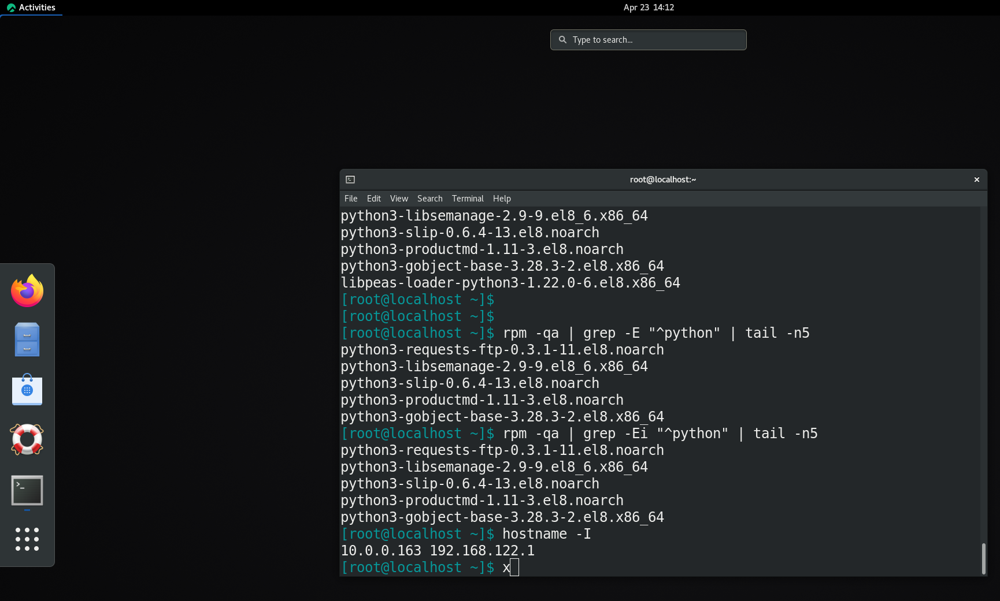
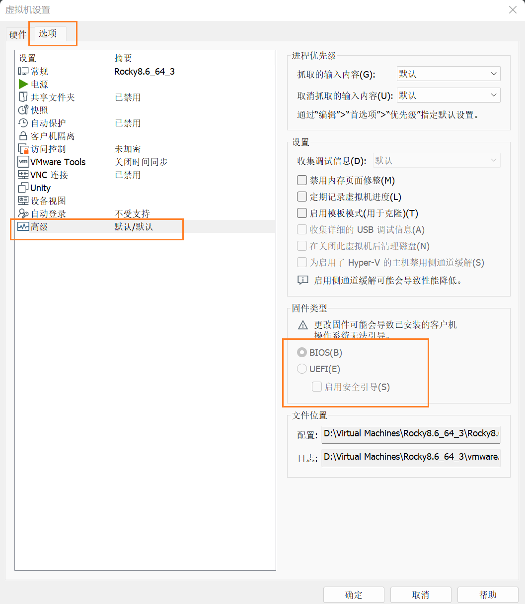
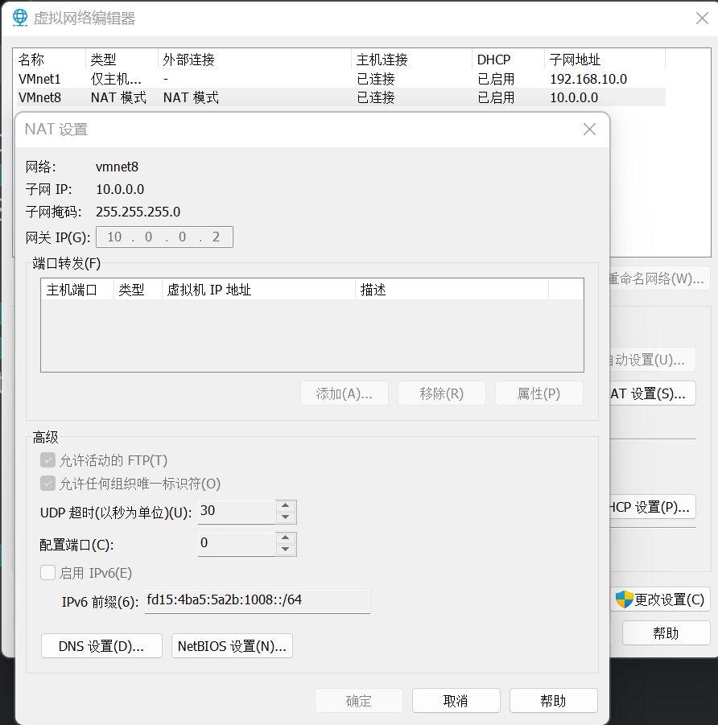

Rocky 学习

- 环境：Rocky8.6 桌面版


# 虚拟机安装带图形界面的 Rocky8.6 
- 环境：VMware 


# 虚拟机中使用配置

## 快捷键打开终端
- `Alt F1` 可显示出输入框，终端等图标


- 输入框中输入 `Keyboard" 添加一个命令 `gnome-terminal`，名字随便起，设置快捷键
如设置快捷键和 Ubuntu 中相同 `Ctrl Alt T`


# 修改密码
- 安装时有设置一个 root 账户，并设置密码

- 利用 `su -` 切换到安装时的 root 账户

- 利用 `passwd -d userName` 删除用户密码
```bash
[root@rocky8 lx]# passwd -d lx
Removing password for user lx.
passwd: Success
[root@rocky8 lx]# passwd -d root
Removing password for user root.
passwd: Success
[root@rocky8 lx]# 
```

- 利用 `passwd userName` 修改密码，这种方式设置密码不会做限制，很简单的密码也可以
```bash
[root@rocky8 lx]# passwd lx
Changing password for user lx.
New password: 
BAD PASSWORD: The password is a palindrome
Retype new password: 
passwd: all authentication tokens updated successfully.
```

- 如果是用户自己修改密码，用 `passwd` 命令，则设置的密码有要求，太简单不能成功
```bash
[lx@rocky8 ~]$ passwd 
Changing password for user lx.
New password: 
BAD PASSWORD: The password is a palindrome
passwd: Authentication token manipulation error
```

# 让用户能用 sudo 命令
- 安装时创建的普通用户默认不能使用 `sudo` 命令，其主要组为和用户名相同的普通组
```bash
[root@rocky8 lx]# id lx
uid=1000(lx) gid=1000(lx) groups=1000(lx)
```

- 用户的权限管理在 `/etc/sudoers` 文件中，有个 `wheel` 组能执行所有命令
可以用 `visudo` 命令打开该文件
```bash
## Allow root to run any commands anywhere
root    ALL=(ALL)       ALL

## Allows members of the 'sys' group to run networking, software,
## service management apps and more.
# %sys ALL = NETWORKING, SOFTWARE, SERVICES, STORAGE, DELEGATING, PROCESSES, LOCATE, DRIVERS

## Allows people in group wheel to run all commands
%wheel  ALL=(ALL)       ALL
```

初始没有以 wheel 组为附加组的用户
```bash
[root@rocky8 lx]# getent group wheel
wheel:x:10:
```

- 切换到 root 用户，将用户加入到 wheel 组中，wheel 作为附加组
```bash
[root@rocky8 lx]# usermod -aG wheel lx
[root@rocky8 lx]# 
[root@rocky8 lx]# id lx
uid=1000(lx) gid=1000(lx) groups=1000(lx),10(wheel)
[root@rocky8 lx]# 
[root@rocky8 lx]# getent group wheel
wheel:x:10:lx
```

# 修改提示符 PS1 
- 初始默认的提示符没有颜色，可以修改 `PS1` 变量来改提示符
默认的提示符格式为：
    - 用户名（\u）
    - @
    - 主机名的简写，只显示第一个点号前的内容(\h) 
    - 空格
    - 当前工作目录的basename，不显示全部路径（\W）

```bash
[root@rocky8 lx]# echo $PS1
[\u@\h \W]\$
```

- 仍使用该格式，只是加个颜色，如青蓝色
  在最前面加上`\e[36m`，其中 `\e[` 为颜色开始，`36` 表示字体颜色为青蓝色
  最后加上 `\e[0m` 表示颜色结束
  最后的格式如下：
```bash
[root@rocky8 lx]# echo -e "\n\nPS1=\"\e[36m${PS1}\e[0m\"" 


PS1="[\u@\h \W]\$ "
```

- 将修改后的 `PS1` 变量放到用户家目录的 `~/.bashrc` 文件最后
```bash
[root@rocky8 lx]# echo -e "\n\nPS1=\"\e[36m${PS1}\e[0m\""  >> ~lx/.bashrc 
[root@rocky8 lx]# echo -e "\n\nPS1=\"\e[36m${PS1}\e[0m\""  >> ~root/.bashrc 
[root@rocky8 lx]# 
[root@rocky8 lx]# tail -n3 ~/.bashrc 


PS1="[\u@\h \W]\$ "
```

- 将修改后的 `PS1` 变量放到 `/etc/skel/.bashrc` 文件最后，这样后面创建的登录用户提示符都会修改
```bash
[root@rocky8 lx]# echo -e "\n\nPS1=\"\e[36m${PS1}\e[0m\""  >> /etc/skel/.bashrc 
```
 
- 利用 `source(.)` 让配置文件生效
```bash
[root@rocky8 lx]# . ~/.bashrc 
```

## 更多自定义设置
> [Controlling-the-Prompt](https://www.gnu.org/savannah-checkouts/gnu/bash/manual/bash.html#Controlling-the-Prompt)
> [环境变量PS1介绍](https://hongjh.blog.csdn.net/article/details/121312038)
> [Bash PS1 customization examples](https://linuxhint.com/bash-ps1-customization/)
> [6.9 Controlling the Prompt](https://www.gnu.org/software/bash/manual/html_node/Controlling-the-Prompt.html)


- `man bash` 帮助文档查看环境变量 `$PS1` 的介绍


- 提示符说明：`man bash` 搜索 `PROMPTING`


- 注意 `\h` 显示主机名只到第一个 `.`前，之后的不显示，`\H` 显示完整主机名


- 示例


- 注意该变量设置最好在 `~/.bashrc` 中，如果在 `/etc/profile` 中设置，可能被覆盖
Ubuntu22.04 中 `~/.bashrc` 中会设置 `PS1`，因此覆盖之前的设置
不同 bash 版本可能有差异，注意脚本调用顺序和规则


# 创建自定义脚本使配置文件全局生效

## 两种 shell 脚本执行顺序
1. intercative login shell
- xshell 远程登录的用户为此类型
```bash
# 有 - 为 login shell
[root@rocky8-2 profile.d]$ echo $0
-bash

# 有 i 为 interactive shell
[root@rocky8-2 profile.d]$ echo $-
himBHs
```

- su - 登录的用户为此类型
```bash
[root@rocky8-2 profile.d]$ su - lx
[lx@rocky8-2 ~]$ echo $0
-bash
[lx@rocky8-2 ~]$ echo $-
himBHs
```

- 执行脚本顺序
    - /etc/profile
        - 调用 /etc/profile.d/*.sh 和 /etc/profile.d/sh.local 脚本文件
        - 调用 /etc/bashrc
    - ~/.bash_profile
        - 调用 ~/.bashrc
            - 调用 /etc/bashrc


2. interactive non-login shell

- 虚拟机图形界面登录的用户为此类型

- su 登录的用户，即没有加 `-` 为此类型
```bash
[root@rocky8-2 profile.d]$ su lx
[lx@rocky8-2 profile.d]$ echo $0
bash
[lx@rocky8-2 profile.d]$ echo $-
himBHs
```

- 执行脚本顺序
    - ~/.bashrc
        - 调用 /etc/bashrc

## 创建全局生效的自定义脚本

- 两种 shell 登录最后都会执行 `/etc/bashrc` 脚本

- `/etc/bashrc` 在最后会执行 `/etc/profile.d/*.sh` 

- 在 `/etc/profile.d` 目录创建 `custom.sh` 文件做自定义设置
```bash
# custom.sh

# set vi-style line editing interface
set -o vi

# set PS1 
PS1="\e[36m[\u@\h \W]\$ \e[0m"
```

**注意**：
`/etc/bashrc` 中通过定义 `BASHRCSOURCED` 变量防止该配置文件重复执行
1. interactive login shell 登录
如果使 login shell 登录，通过 /etc/profile 脚本通过 `.` 执行，该执行方式在当前 shell 环境
后面执行 ~/.bashrc 时又会执行 /etc/profile 脚本，因此需要防止在当前 shell 环境重复执行

2. interactive non-login shell 登录
执行 ~/.bashrc 时通过 `. /etc/bashrc` 方式在当前 shell 中执行一次
如果再次 `. ~/.bashrc`，不会重复执行 `/etc/bashrc` 文件

执行 `/etc/bashrc` 后可以 `echo $BASHRCSOURCED` 查看变量的值变成 `Y`
```bash
if [ -z "$BASHRCSOURCED" ]; then
   BASHRCSOURCED="Y"
```

因此，如果已经登录 shell 后再修改 `/etc/profile.d/custom.sh` 脚本，
不能通过 `. ~/.bashrc` 让自定义脚本生效，因为不会重复执行 `/etc/bashrc`
需要 `. /etc/profile.d/custom.sh` 使其在当前 shell 生效

# 修改 line editing interface 为 vi 风格

默认 shell 行编辑快捷键使用 emacs 风格快捷键，改为 vi 风格

```bash
[root@rocky8-2 profile.d]$ set -o | grep -Ei "^emacs|^vi"
emacs          	on
vi             	off
```

用 `set -o vi` 使其临时生效，或者写到配置文件中全局生效


# 修改历史记录的格式
> [HISTTIMEFORMAT](https://www.gnu.org/software/bash/manual/html_node/Bash-Variables.html#index-HISTTIMEFORMAT)

- `man bash` 后搜索 `HISTTIMEFORMAT` 可查看该变量的说明
- `man 3 strftime` 可查看日期和时间的格式
- 初始该变量没有值，用 `set` 查看也没该变量，缓冲区中历史记录格式用默认格式
```bash
[root@rocky8-3 ~]# echo $HISTTIMEFORMAT

[root@rocky8-3 ~]# set | grep -i HISTTIMEFORMAT
[root@rocky8-3 ~]# 
```
- 可指定该变量的格式写入到 `/etc/profile.d/custom.sh` 中，或者只设置当前用户的历史记录格式写到 `~/.bashrc` 文件中，如 `export HISTTIMEFORMAT="%F %T `whoami` "`
```bash
export HISTTIMEFORMAT="[%F %T $(whoami)] "
```

- 怎么让历史记录显示颜色？


# 修改主机名
- 主机名命名规则
大小写字母，数字，连字符（-），不能以连字符开头

```bash
[lx@rocky8 ~]$ whatis hostname
hostname (7)         - hostname resolution description
hostname (1)         - show or set the system's host name
hostname (5)         - Local hostname configuration file
[lx@rocky8 ~]$ man 7 hostname
```

```bash
Each  element  of  the hostname must be from 1 to 63 characters long and the entire host‐
       name, including the dots, can be at most 253 characters long.  Valid characters for host‐
       names  are  ASCII(7)  letters from a to z, the digits from 0 to 9, and the hyphen (-).  A
       hostname may not start with a hyphen.
```

- 查看主机名
`hostname` 或 `hostnamectl`

```bash
[root@rocky8 ~]$ hostname
rocky8
[root@rocky8 ~]$ cat /etc/hostname 
rocky8
[root@rocky8 ~]$ 
[root@rocky8 ~]$ hostnamectl --static 
rocky8
[root@rocky8 ~]$ hostnamectl --pretty 

[root@rocky8 ~]$ hostnamectl --transient 
rocky8
```

- 永久修改主机名 hostnamectl set-hostname
修改后提示符中不能立即看到效果，可以用 `bash` 重开一个 shell 进程看到效果
要当前 shell 中主机名生效，需要重启
```bash
[root@rocky8 ~]$ hostnamectl set-hostname "rocky8-1"
[root@rocky8 ~]$ hostname
rocky8-1
[root@rocky8 ~]$ bash
[root@rocky8-1 ~]$ exit
```

# 创建自定义 vim 配置文件
- vim 版本为 `version 8.0.1763`
- vimrc 文件如下
```bash
   system vimrc file: "/etc/vimrc"
     user vimrc file: "$HOME/.vimrc"
 2nd user vimrc file: "~/.vim/vimrc"
      user exrc file: "$HOME/.exrc"
       defaults file: "$VIMRUNTIME/defaults.vim"
  fall-back for $VIM: "/etc"
 f-b for $VIMRUNTIME: "/usr/share/vim/vim80"
```

- 系统 vimrc 文件为 `/etc/vimrc`，初始执行的文件，后面执行的文件中有相同配置会覆盖此文件的设置
- 执行完系统 vimrc 配置文件后，加载用户各自的配置文件
默认没有该文件，为用户创建的自定义配置，有两种路径
    - `$HOME/.vimrc`
    - `~/.vim/vimrc`
- 如果没有自定义的 vimrc 文件，则会执行 `$VIMRUNTIME/defaults.vim`，即使前面在 `/etc/vimrc` 中调用了 `/etc/vim/vimrc.local`，因此如果全局使用 `/etc/vim/vimrc.local` 文件，则需要禁用 `$VIMRUNTIME/defaults.vim` 文件，可以在 `$VIMRUNTIME/defaults.vim` 文件的最上面设置变量 `skip_defaults_vim` 变量，即 `let g:skip_defaults_vim = 1`
```vim
" $VIMRUNTIME/defaults.vim
" prevent $VIMRUNTIME/defaults.vim from being loaded                                                                                      |a
let g:skip_defaults_vim = 1    

" Bail out if something that ran earlier, e.g. a system wide vimrc, does not                                                              |b
" want Vim to use these default values.                                                                                                   |a
if exists('skip_defaults_vim')                                                                                                            |s
  finish                                                                                                                                  |e
endif 
```

- 在 `/etc/vimrc` 文件最后加上下面内容，执行 `/etc/vim/vimrc.local` 文件
创建 `/etc/vim/vimrc.local` 后文件中，将自定义的配置写入其中，可以让该配置全局生效，即所有用户使用  
```vim
" Source a global configuration file if available
if filereadable("/etc/vim/vimrc.local")
  source /etc/vim/vimrc.local
endif
```


# 修改网卡名  
> [NetworkInterfaceNames](https://wiki.debian.org/NetworkInterfaceNames)

- 以 root 身份执行，普通用户有些操作需要 sudo 命令执行
## 传统的网卡命名规则
- 传统的网卡命名统一叫 `ethX`，`X`为编号，如 `eth0`，`eth1` 等
- 编号根据启动时内核识别的顺序命名
- CentOS 6 之前版本采用

缺点：
- 如果机器上有多个网卡，一旦移除已存在的网卡或者新增网卡，
  则已存在的旧网卡名可能变化，可能造成安全隐患，如不便于防火墙制定规则管理

## 查看初始网卡名
查询可见初始网卡名为 `ens160`

- ip a
```bash
[root@rocky8 ~]$ ip a
1: lo: <LOOPBACK,UP,LOWER_UP> mtu 65536 qdisc noqueue state UNKNOWN group default qlen 1000
    link/loopback 00:00:00:00:00:00 brd 00:00:00:00:00:00
    inet 127.0.0.1/8 scope host lo
       valid_lft forever preferred_lft forever
    inet6 ::1/128 scope host 
       valid_lft forever preferred_lft forever
2: ens160: <BROADCAST,MULTICAST,UP,LOWER_UP> mtu 1500 qdisc mq state UP group default qlen 1000
    link/ether 00:0c:29:54:b6:1a brd ff:ff:ff:ff:ff:ff
    inet 10.0.0.162/24 brd 10.0.0.255 scope global dynamic noprefixroute ens160
       valid_lft 1759sec preferred_lft 1759sec
    inet6 fe80::20c:29ff:fe54:b61a/64 scope link noprefixroute 
       valid_lft forever preferred_lft forever
3: virbr0: <NO-CARRIER,BROADCAST,MULTICAST,UP> mtu 1500 qdisc noqueue state DOWN group default qlen 1000
    link/ether 52:54:00:96:30:10 brd ff:ff:ff:ff:ff:ff
    inet 192.168.122.1/24 brd 192.168.122.255 scope global virbr0
       valid_lft forever preferred_lft forever
```

- ip link show
```bash
[root@rocky8 ~]$ ip link show 
1: lo: <LOOPBACK,UP,LOWER_UP> mtu 65536 qdisc noqueue state UNKNOWN mode DEFAULT group default qlen 1000
    link/loopback 00:00:00:00:00:00 brd 00:00:00:00:00:00
2: ens160: <BROADCAST,MULTICAST,UP,LOWER_UP> mtu 1500 qdisc mq state UP mode DEFAULT group default qlen 1000
    link/ether 00:0c:29:54:b6:1a brd ff:ff:ff:ff:ff:ff
3: virbr0: <NO-CARRIER,BROADCAST,MULTICAST,UP> mtu 1500 qdisc noqueue state DOWN mode DEFAULT group default qlen 1000
    link/ether 52:54:00:96:30:10 brd ff:ff:ff:ff:ff:ff
```

- nmcli connection
```bash
[root@rocky8 ~]$ nmcli connection 
NAME    UUID                                  TYPE      DEVICE 
ens160  26fbfd70-8518-4b0d-a0bc-69669c59622a  ethernet  ens160 
virbr0  10ddff8f-58f4-45b8-ab58-a3ebd1caf6c5  bridge    virbr0 
```

## 查看启动方式 BIOS 还是 UEFI
> [Guide To Check UEFI or BIOS In Windows/Linux System](https://servonode.com/check-uefi-or-bios-in-widows-or-linux)


### 方法一：查看 /sys/firmware/efi 目录

`/sys/firmware/efi` 目录存在则为 UEFI 启动

- ubuntu20.04 UEFI 启动
```bash
[10:17:49 root@ubuntu2004 /sys/firmware]#ls
acpi  dmi  efi  memmap
[10:17:50 root@ubuntu2004 /sys/firmware]#
```

- rocky8.6 BIOS 启动
```bash
root@rocky86 ~ $ cd /sys/firmware/
root@rocky86 firmware $ ls
acpi  dmi  memmap  qemu_fw_cfg
```

### 方法二：dmesg

- ubuntu20.04 UEFI 启动
```bash
root@ubuntu2004 ~# dmesg | grep efi:
[    0.000000] efi: EFI v2.60 by HUAWEI
[    0.000000] efi:  ACPI 2.0=0x8f7fe014  SMBIOS=0x8c4ed000  SMBIOS 3.0=0x8c4eb000  ESRT=0x8c4e9c18  MEMATTR=0x88fd9018  MOKvar=0x88fd7000 
```

- rocky8.6 BIOS 启动
```bash
root@rocky86 firmware $ dmesg | grep efi
[    0.000000] clocksource: refined-jiffies: mask: 0xffffffff max_cycles: 0xffffffff, max_idle_ns: 1910969940391419 ns
[    5.408252] tsc: Refined TSC clocksource calibration: 2918.420 MHz
root@rocky86 firmware $ 
root@rocky86 firmware $ dmesg | grep efi:
```


### 方法三：适合虚拟机安装查看
- VMware ---> 虚拟机 ---> 设置 ---> 选项 ---> 高级



## 修改网卡命名规则为旧的命名规则
> [CentOS / RHEL 7 : How to modify Network Interface names](https://www.thegeekdiary.com/centos-rhel-7-how-to-modify-network-interface-names/)
> [Linux kernel parameters: what is the difference of net.ifnames=0 and biosdevname=0](https://unix.stackexchange.com/questions/637295/linux-kernel-parameters-what-is-the-difference-of-net-ifnames-0-and-biosdevname)
> [11.6. Consistent Network Device Naming Using biosdevname](https://access.redhat.com/documentation/en-us/red_hat_enterprise_linux/7/html/networking_guide/sec-consistent_network_device_naming_using_biosdevname)

### 编辑内核 boot 参数让网卡命名规则改为旧规则
- 编辑 `etc/default/grub` 文件，在 `GRUB_CMDLINE_LINUX` 的值中加入内核参数 `net.ifnames=0`
- 有的文档写的还要写一项 `biosdevname=0` ，rocky8.6 测试未写这个修改网卡名成功，具体含义见参考文档 

```bash
GRUB_TIMEOUT=5
GRUB_DISTRIBUTOR="$(sed 's, release .*$,,g' /etc/system-release)"
GRUB_DEFAULT=saved
GRUB_DISABLE_SUBMENU=true
GRUB_TERMINAL_OUTPUT="console"
GRUB_CMDLINE_LINUX="crashkernel=auto resume=/dev/mapper/rl_rocky8-swap rd.lvm.lv=rl_rocky8/root rd.lvm.lv=rl_rocky8/swap rhgb quiet net.ifnames=0"
GRUB_DISABLE_RECOVERY="true"
GRUB_ENABLE_BLSCFG=true
```

可以 `. /etc/default/grub` 该文件查看值

```bash
[root@rocky8 ~]$ . /etc/default/grub 
[root@rocky8 ~]$ 
[root@rocky8 ~]$ echo $GRUB_CMDLINE_LINUX 
crashkernel=auto resume=/dev/mapper/rl_rocky8-swap rd.lvm.lv=rl_rocky8/root rd.lvm.lv=rl_rocky8/swap rhgb quiet net.ifnames=0
```


### 重新生成新的 GRUB 配置文件并使其生效
需要先查询系统启动方式是 BIOS 还是 UEFI

- BIOS 启动

```bash
[root@rocky8-1 ~]$ grub2-mkconfig -o /boot/grub2/grub.cfg 
Generating grub configuration file ...
done
```

- UEFI 启动
未测试该情况，只需要将 grub.cfg 文件的路径修改一下，如 Ubuntu20.04 的路径为

```bash
root@ubuntu2004 ~# ls /boot/efi/EFI/
BOOT  ubuntu
root@ubuntu2004 ~# ls /boot/efi/EFI/ubuntu/grub.cfg 
/boot/efi/EFI/ubuntu/grub.cfg
```

rocky8.6 的路径为 `/boot/efi/EFI/redhat/grub.cfg`

### 修改 ifcfg 网卡配置文件

- 每个网卡的配置，包括 IP 地址等有一个单独的配置文件
- 配置文件的命名格式固定，前缀为 `ifcfg-`，后缀为网卡的设备名，即该配置文件中 `DEVICE` 变量的值
- 配置文件在 `/etc/sysconfig/network-scripts/` 目录中

```bash
[root@rocky8-1 ~]$ cd /etc/sysconfig/network-scripts/
[root@rocky8-1 network-scripts]$ ls
ifcfg-ens160
[root@rocky8-1 network-scripts]$ mv ifcfg-ens160 ifcfg-eth0
[root@rocky8-1 network-scripts]$ vim ifcfg-eth0
```

- 修改网卡配置文件中 `DEVICE` 和 `NAME`
- `DEVICE` 为网卡的设备名 
- `NAME` 为这个网卡整个配置的名字，用 `nmcli` 操作该网卡时使用的名字，`man nmcli` 查看帮助
- `NAME` 可以和 `DEVICE` 不同
- `DEVICE` 的名字必须和网卡配置文件名字的后缀相同
```bash
name
               if specified, the connection will use the name (else NM creates a name itself).
```
```bash
lx@rocky86 firmware $ nmcli connection 
NAME    UUID                                  TYPE      DEVICE 
eth1    9c92fad9-6ecb-3e6c-eb4d-8a47c6f50c04  ethernet  eth1   
virbr0  0aab604c-fa07-4672-9588-1cb101daaded  bridge    virbr0 
ens160  c2ef03db-c87c-4a0a-b30b-609635ecccdf  ethernet  --     
```

- `ifcfg-eth0` 配置文件内容如下：
```bash
TYPE=Ethernet
PROXY_METHOD=none
BROWSER_ONLY=no
BOOTPROTO=dhcp
DEFROUTE=yes
IPV4_FAILURE_FATAL=no
IPV6INIT=yes
IPV6_AUTOCONF=yes
IPV6_DEFROUTE=yes
IPV6_FAILURE_FATAL=no
NAME=eth0
UUID=26fbfd70-8518-4b0d-a0bc-69669c59622a
DEVICE=eth0
ONBOOT=yes
```

#### 查看配置文件的位置

- rpm 中查找 network 关键字，找到包名 NetworkManager
```bash
[root@localhost ~]$ rpm -qa | grep -i "network"
NetworkManager-1.40.0-6.el8_7.x86_64
NetworkManager-team-1.40.0-6.el8_7.x86_64
NetworkManager-wwan-1.40.0-6.el8_7.x86_64
NetworkManager-wifi-1.40.0-6.el8_7.x86_64
libvirt-daemon-driver-network-8.0.0-10.4.module+el8.7.0+1181+a332c78d.x86_64
NetworkManager-adsl-1.40.0-6.el8_7.x86_64
dracut-network-049-218.git20221019.el8_7.x86_64
NetworkManager-libnm-1.40.0-6.el8_7.x86_64
libvirt-daemon-config-network-8.0.0-10.4.module+el8.7.0+1181+a332c78d.x86_64
NetworkManager-config-server-1.40.0-6.el8_7.noarch
NetworkManager-bluetooth-1.40.0-6.el8_7.x86_64
glib-networking-2.56.1-1.1.el8.x86_64
containernetworking-plugins-1.1.1-3.module+el8.7.0+1154+147ffa21.x86_64
NetworkManager-tui-1.40.0-6.el8_7.x86_64
```

```bash
[root@localhost ~]$ rpm -qi NetworkManager
Name        : NetworkManager
Epoch       : 1
Version     : 1.40.0
Release     : 6.el8_7
Architecture: x86_64
Install Date: Sat 22 Apr 2023 09:29:28 PM CST
Group       : System Environment/Base
Size        : 6303352
License     : GPLv2+ and LGPLv2+
Signature   : RSA/SHA256, Wed 05 Apr 2023 12:31:12 AM CST, Key ID 15af5dac6d745a60
Source RPM  : NetworkManager-1.40.0-6.el8_7.src.rpm
Build Date  : Wed 05 Apr 2023 12:22:52 AM CST
Build Host  : ord1-prod-x86build003.svc.aws.rockylinux.org
Relocations : (not relocatable)
Packager    : infrastructure@rockylinux.org
Vendor      : Rocky
URL         : https://networkmanager.dev/
Summary     : Network connection manager and user applications
Description :
NetworkManager is a system service that manages network interfaces and
connections based on user or automatic configuration. It supports
Ethernet, Bridge, Bond, VLAN, Team, InfiniBand, Wi-Fi, mobile broadband
(WWAN), PPPoE and other devices, and supports a variety of different VPN
services.
```

- 查询包中的文件
配置文件在 `etc/` 目录下，因此根据关键字查找

用 `rpm -qc` 找不到该文件，因为配置文件在一个目录中
```bash
[root@localhost ~]$ rpm -qc NetworkManager
/etc/NetworkManager/NetworkManager.conf
```

查到下面最后一个目录为网卡配置文件所在目录 `/etc/sysconfig/network-scripts`
```bash
[root@localhost ~]$ rpm -ql NetworkManager | grep "/etc/"
/etc/NetworkManager
/etc/NetworkManager/NetworkManager.conf
/etc/NetworkManager/VPN
/etc/NetworkManager/conf.d
/etc/NetworkManager/dispatcher.d
/etc/NetworkManager/dispatcher.d/no-wait.d
/etc/NetworkManager/dispatcher.d/pre-down.d
/etc/NetworkManager/dispatcher.d/pre-up.d
/etc/NetworkManager/dnsmasq-shared.d
/etc/NetworkManager/dnsmasq.d
/etc/NetworkManager/system-connections
/etc/sysconfig/network-scripts
```

### 重启系统
- 有的文中写在重启前先禁用网卡：`systemctl disable NetworkManager`，测试时未禁用重启后也能生效
- reboot
如果之前禁用网络，重启后用 `systemctl enable --now NetworkManager` 开启网络管理，且需要加上 `--now` 参数让开启自动启动该功能
- 重启后查看网卡名是否生效
    - `ip a` 查看网卡是否生效
    - `ping` 测试网络是否正常

```bash
[lx@rocky8-1 ~]$ ip link
1: lo: <LOOPBACK,UP,LOWER_UP> mtu 65536 qdisc noqueue state UNKNOWN mode DEFAULT group default qlen 1000
    link/loopback 00:00:00:00:00:00 brd 00:00:00:00:00:00
2: eth0: <BROADCAST,MULTICAST,UP,LOWER_UP> mtu 1500 qdisc mq state UP mode DEFAULT group default qlen 1000
    link/ether 00:0c:29:54:b6:1a brd ff:ff:ff:ff:ff:ff
    altname enp3s0
    altname ens160
3: virbr0: <NO-CARRIER,BROADCAST,MULTICAST,UP> mtu 1500 qdisc noqueue state DOWN mode DEFAULT group default qlen 1000
    link/ether 52:54:00:96:30:10 brd ff:ff:ff:ff:ff:ff
[lx@rocky8-1 ~]$ 
[lx@rocky8-1 ~]$ ip addr show eth0
2: eth0: <BROADCAST,MULTICAST,UP,LOWER_UP> mtu 1500 qdisc mq state UP group default qlen 1000
    link/ether 00:0c:29:54:b6:1a brd ff:ff:ff:ff:ff:ff
    altname enp3s0
    altname ens160
    inet 10.0.0.162/24 brd 10.0.0.255 scope global dynamic noprefixroute eth0
       valid_lft 1592sec preferred_lft 1592sec
    inet6 fe80::20c:29ff:fe54:b61a/64 scope link noprefixroute 
       valid_lft forever preferred_lft forever
[lx@rocky8-1 ~]$ 
[lx@rocky8-1 ~]$ nmcli connection 
NAME    UUID                                  TYPE      DEVICE 
eth0    26fbfd70-8518-4b0d-a0bc-69669c59622a  ethernet  eth0   
virbr0  9eac4062-fdc2-4208-9aba-f053addb47bc  bridge    virbr0 
```

```bash
[lx@rocky8-1 ~]$ ping 10.0.0.111
PING 10.0.0.111 (10.0.0.111) 56(84) bytes of data.
64 bytes from 10.0.0.111: icmp_seq=1 ttl=64 time=1.73 ms
64 bytes from 10.0.0.111: icmp_seq=2 ttl=64 time=1.17 ms
64 bytes from 10.0.0.111: icmp_seq=3 ttl=64 time=0.700 ms
```

# 修改网卡 IP 
- 在 xshell 中使用多个虚拟机时，为了查看方便，将 IP 修改为方便辨认的格式
- 如 `rocky8.6` 安装多个虚拟机，第二个虚拟机该名字为 `10.0.0.82`

## 修改网卡配置文件
> [Understanding the Network interface configuration file /etc/sysconfig/network-scripts/ifcfg-eth#](https://www.thegeekdiary.com/understanding-the-network-interface-configuration-file-etc-sysconfig-network-scripts-ifcfg-eth/)
> [11.2. Interface Configuration Files](https://access.redhat.com/documentation/en-us/red_hat_enterprise_linux/6/html/deployment_guide/s1-networkscripts-interfaces)
> [Understanding the Network interface configuration file /etc/sysconfig/network-scripts/ifcfg-eth#](https://www.thegeekdiary.com/understanding-the-network-interface-configuration-file-etc-sysconfig-network-scripts-ifcfg-eth/)
> [Chapter 13. Network Scripts](https://mirror.apps.cam.ac.uk/pub/doc/redhat/redhat7.3/rhl-rg-en-7.3/ch-networkscripts.html)
> 查看网络配置参数：[nm-settings-ifcfg-rh](https://developer-old.gnome.org/NetworkManager/stable/nm-settings-ifcfg-rh.html)


### 查看默认网络参数
- `ip a` 查看 IP 地址，子网掩码，广播地址等

```bash
[root@rocky8-1 network-scripts]$ ip addr show eth0
2: eth0: <BROADCAST,MULTICAST,UP,LOWER_UP> mtu 1500 qdisc mq state UP group default qlen 1000
    link/ether 00:0c:29:54:b6:1a brd ff:ff:ff:ff:ff:ff
    altname enp3s0
    altname ens160
    inet 10.0.0.162/24 brd 10.0.0.255 scope global dynamic noprefixroute eth0
       valid_lft 1467sec preferred_lft 1467sec
    inet6 fe80::20c:29ff:fe54:b61a/64 scope link noprefixroute 
       valid_lft forever preferred_lft forever
```

1. 上面 IPv4 地址为 `10.0.0.162`
2. PREFIX 为 24，即子网掩码为 `255.255.255.0`

- `route -n` 查看默认路由

```bash
[root@rocky8-1 network-scripts]$ route -n
Kernel IP routing table
Destination     Gateway         Genmask         Flags Metric Ref    Use Iface
0.0.0.0         10.0.0.2        0.0.0.0         UG    100    0        0 eth0
10.0.0.0        0.0.0.0         255.255.255.0   U     100    0        0 eth0
192.168.122.0   0.0.0.0         255.255.255.0   U     0      0        0 virbr0
```

1. 上面可看到默认路由为 `10.0.0.2`

- 从虚拟机中查看（这里使用的是 NAT 网络）
编辑 ---> 虚拟网络编辑器 ---> NAT 设置




### 修改配置文件的参数
- BOOTPROTO
    - 地址配置协议，默认 dhcp
    - 需要修改为 none

- IPADDR
    - 指明 IP 地址，默认没有，由 DHCP 自动分配
    - 如果配置多个 IP，则第二个 IP 用 `IPADDR2`

- PREFIX 
    - 指定子网掩码位数，和 `NETMASK` 作用相同
    - 如 24 则子网掩码为 `255.255.255.0`

- GATEWAY
    - 默认网关
    - 可用 `route -n` 查看，`Destination` 为 `0.0.0.0` 对应的 `Gateway` 即为默认网关

- IPV4_FAILURE_FATAL
    - no
    This interface is not disabled if configuration fails
    - yes
    This interface is disabled if IPv4 or IPv6 configuration failes

```bash
TYPE=Ethernet
PROXY_METHOD=none
BROWSER_ONLY=no
BOOTPROTO=none
DEFROUTE=yes
IPADDR=10.0.0.82
PREFIX=24
GATEWAY=10.0.0.2
IPV4_FAILURE_FATAL=no
IPV6INIT=yes
IPV6_AUTOCONF=yes
IPV6_DEFROUTE=yes
IPV6_FAILURE_FATAL=no
NAME=eth0
UUID=26fbfd70-8518-4b0d-a0bc-69669c59622a
DEVICE=eth0
ONBOOT=yes
```

### 让新网卡配置文件生效
修改网卡配置文件后保存，并不能让配置立刻生效

- `nmcli connection down NAME`
`NAME` 为网卡配置文件中定义的 `NAME`
- `nmcli connection reload`
- `nmmcli connection up NAME`

```bash
[root@rocky8-1 network-scripts]$ nmcli connection down eth0
Connection 'eth0' successfully deactivated (D-Bus active path: /org/freedesktop/NetworkManager/ActiveConnection/2)


[root@rocky8-1 network-scripts]$ nmcli connection 
NAME    UUID                                  TYPE      DEVICE 
virbr0  9eac4062-fdc2-4208-9aba-f053addb47bc  bridge    virbr0 
eth0    26fbfd70-8518-4b0d-a0bc-69669c59622a  ethernet  --     


[root@rocky8-1 network-scripts]$ nmcli connection reload 

[root@rocky8-1 network-scripts]$ nmcli connection up eth0
Connection successfully activated (D-Bus active path: /org/freedesktop/NetworkManager/ActiveConnection/3)
```

检查新的 IP 是否生效
```bash
[root@rocky8-1 network-scripts]$ nmcli connection 
NAME    UUID                                  TYPE      DEVICE 
eth0    26fbfd70-8518-4b0d-a0bc-69669c59622a  ethernet  eth0   
virbr0  9eac4062-fdc2-4208-9aba-f053addb47bc  bridge    virbr0 

[root@rocky8-1 network-scripts]$ ip addr show eth0
2: eth0: <BROADCAST,MULTICAST,UP,LOWER_UP> mtu 1500 qdisc mq state UP group default qlen 1000
    link/ether 00:0c:29:54:b6:1a brd ff:ff:ff:ff:ff:ff
    altname enp3s0
    altname ens160
    inet 10.0.0.82/24 brd 10.0.0.255 scope global noprefixroute eth0
       valid_lft forever preferred_lft forever
    inet6 fe80::20c:29ff:fe54:b61a/64 scope link noprefixroute 
       valid_lft forever preferred_lft forever
```


#### reload, reapply and up 
> [nmcli](https://developer-old.gnome.org/NetworkManager/unstable/nmcli.html)
> [difference between nmcli connection reload and nmcli device reapply?](https://askubuntu.com/questions/1463458/difference-between-nmcli-connection-reload-and-nmcli-device-reapply)
> [RHEL8.x - issue with nmcli con reload](https://access.redhat.com/discussions/6303851)


`nmcli connection` 命令中 `reload` `reapply` `up` 三个子命令的区别？

- nmcli connection reload
> Reload all connection files from disk. NetworkManager does not monitor changes to connection. So you need to use this command in order to tell NetworkManager to re-read the connection profiles from disk when a change was made to them.


- nmcli connection reapply
> Attempt to update device with changes to the currently active connection made since it was last applied.


# 关闭防火墙
- 什么情况需要关闭 firewalld 
- 虚拟机中学习时做一些操作需要关闭防火墙
- `systemctl disable` 禁止服务开机启动，`--now` 禁止服务立即生效


```bash
[root@localhost lx]$ systemctl disable --now firewalld.service 
[root@localhost lx]$ systemctl status firewalld.service 
● firewalld.service - firewalld - dynamic firewall daemon
   Loaded: loaded (/usr/lib/systemd/system/firewalld.service; disabled; vendor prese>
   Active: inactive (dead) since Sun 2023-04-23 09:45:05 CST; 1s ago
     Docs: man:firewalld(1)
  Process: 1029 ExecStart=/usr/sbin/firewalld --nofork --nopid $FIREWALLD_ARGS (code>
 Main PID: 1029 (code=exited, status=0/SUCCESS)

Apr 23 09:08:56 localhost.localdomain systemd[1]: Starting firewalld - dynamic firew>
Apr 23 09:08:57 localhost.localdomain systemd[1]: Started firewalld - dynamic firewa>
Apr 23 09:08:57 localhost.localdomain firewalld[1029]: WARNING: AllowZoneDrifting is>
Apr 23 09:45:04 localhost.localdomain systemd[1]: Stopping firewalld - dynamic firew>
Apr 23 09:45:05 localhost.localdomain systemd[1]: firewalld.service: Succeeded.
Apr 23 09:45:05 localhost.localdomain systemd[1]: Stopped firewalld - dynamic firewa>
```

# 关闭 SELinux 
- 什么时候需要关闭？
- 虚拟机环境学习时暂时关闭

- `man selinux` 查看 selinux 的配置文件
- 根据提示将 `SELINUX` 的值设置为 `disabled`，即禁用 `SELinux` 安全策略

```bash
# /etc/selinux/config
# This file controls the state of SELinux on the system.
# SELINUX= can take one of these three values:
#     enforcing - SELinux security policy is enforced.
#     permissive - SELinux prints warnings instead of enforcing.
#     disabled - No SELinux policy is loaded.
#SELINUX=enforcing
SELINUX=disabled
# SELINUXTYPE= can take one of these three values:
#     targeted - Targeted processes are protected,
#     minimum - Modification of targeted policy. Only selected processes are protected. 
#     mls - Multi Level Security protection.
SELINUXTYPE=targeted
```

- 修改后用 `getenforce` 查看 SELinux 策略，未改变
```bash
[root@localhost lx]$ getenforce 
Enforcing
```

- 需要重启后生效（帮助文档中有说明）

```bash
[lx@localhost ~]$ getenforce 
Disabled

[lx@localhost ~]$ whatis getenforce 
getenforce (8)       - get the current mode of SELinux
```


# SSH 服务设置

## 查看系统是否安装 SSH 软件
- SSH (Secure Shell) 是一种网络协议，用于加密两台计算机之间的通信
- OpenSSH 为 SSH 的软件实现
- SSH 的软件架构为 Server-Client 模式
- OpenSSH 的客户端实现为 ssh
- OpenSSH 的服务端实现为 sshd
- rocky8.6 默认安装

- `rpm -q` 查询软件是否安装
需要写对软件名，不支持通配符查询
```bash
[root@rocky8-1 network-scripts]$ rpm -q openssh-server
openssh-server-8.0p1-17.el8_7.x86_64

[root@rocky8-1 network-scripts]$ rpm -q openssh-clients
openssh-clients-8.0p1-17.el8_7.x86_64
```

- `rpm -qa | grep -i "openssh"`
用 `grep` 在全部已安装的软件中搜索关键字，`-i` 忽略大小写

```bash
[root@rocky8-1 network-scripts]$ rpm -qa | grep -i "openssh"
openssh-askpass-8.0p1-17.el8_7.x86_64
openssh-server-8.0p1-17.el8_7.x86_64
openssh-clients-8.0p1-17.el8_7.x86_64
openssh-8.0p1-17.el8_7.x86_64
```

- `rpm -qi` 可查询软件的具体信息

## 查看配置文件位置
- `rpm -qc` 查看配置文件位置

```bash
[root@rocky8-1 network-scripts]$ rpm -qc openssh-server
/etc/pam.d/sshd
/etc/ssh/sshd_config
/etc/sysconfig/sshd


[root@rocky8-1 network-scripts]$ rpm -qc openssh-clients
/etc/ssh/ssh_config
/etc/ssh/ssh_config.d/05-redhat.conf
```

## 查看 SSH 服务是否开启
- `systemctl status sshd`
- `Active` 项显示 `active(running)` 则表示服务开启
- 默认监听端口为 `22`
- 默认监听地址为 `0.0.0.0`
- `systemctl status sshd` 或者 `ss -tlpn` 均可查看

```bash
[root@rocky8-1 network-scripts]$ systemctl status sshd
● sshd.service - OpenSSH server daemon
   Loaded: loaded (/usr/lib/systemd/system/sshd.service; enabled; vendor preset: ena>
   Active: active (running) since Sat 2023-04-22 15:28:35 CST; 1h 1min ago
     Docs: man:sshd(8)
           man:sshd_config(5)
 Main PID: 1129 (sshd)
    Tasks: 1 (limit: 11058)
   Memory: 1.9M
   CGroup: /system.slice/sshd.service
           └─1129 /usr/sbin/sshd -D -oCiphers=aes256-gcm@openssh.com,chacha20-poly13>

Apr 22 15:28:35 rocky8-1 systemd[1]: Starting OpenSSH server daemon...
Apr 22 15:28:35 rocky8-1 sshd[1129]: Server listening on 0.0.0.0 port 22.
Apr 22 15:28:35 rocky8-1 sshd[1129]: Server listening on :: port 22.
Apr 22 15:28:35 rocky8-1 systemd[1]: Started OpenSSH server daemon.
```

- `ss -tnpl` 也可看到 sshd 服务已开启处于监听状态
  
```bash
[root@rocky8-1 network-scripts]$ ss -tlpn
State      Recv-Q     Send-Q         Local Address:Port         Peer Address:Port    Process                                                                              
LISTEN     0          128                  0.0.0.0:111               0.0.0.0:*        users:(("rpcbind",pid=925,fd=4),("systemd",pid=1,fd=322))                           
LISTEN     0          32             192.168.122.1:53                0.0.0.0:*        users:(("dnsmasq",pid=1910,fd=6))                                                   
LISTEN     0          128                  0.0.0.0:22                0.0.0.0:*        users:(("sshd",pid=1129,fd=3))                                                      
LISTEN     0          5                  127.0.0.1:631               0.0.0.0:*        users:(("cupsd",pid=1130,fd=7))                                                     
LISTEN     0          128                     [::]:111                  [::]:*        users:(("rpcbind",pid=925,fd=6),("systemd",pid=1,fd=324))                           
LISTEN     0          128                     [::]:22                   [::]:*        users:(("sshd",pid=1129,fd=4))                                                      
LISTEN     0          5                      [::1]:631                  [::]:*        users:(("cupsd",pid=1130,fd=6)) 
```


### 监听地址 `0.0.0.0` 
> [How to read NETSTAT -AN resluts](https://sites.google.com/site/xiangyangsite/home/technical-tips/linux-unix/networks-related-commands-on-linux/how-to-read-netstat--an-results)
> &nbsp;
> If it says 0.0.0.0 on the Local Address column, it means that port is listening on all 'network interfaces' (i.e. your computer, your modem(s) and your network card(s)).
  
- 监听地址 `0.0.0.0` 表示监听本主机上的全部网络接口
- 如果地址为 `127.0.0.1` 则只针对换回地址


> [What's the difference between IP address 0.0.0.0 and 127.0.0.1?](https://serverfault.com/questions/78048/whats-the-difference-between-ip-address-0-0-0-0-and-127-0-0-1)


## 允许 root 登录和空密码登录
- 本地 root 默认可以登录，也可以设置空密码
- 这里的 root 登录是指通过 SSH 协议允许客户端以 root 身份登录，并非本地 root 登录
- 允许空密码登录也是通过 SSH 协议连接时可以空密码登录
- 如用 XShell 连接登录时，修改设置后能以 root 身份和空密码登录
- 通过 `rpm -qc openssh-server` 查询到 sshd 的配置文件位置
- 编辑 `/etc/ssh/sshd_config` 配置文件
- `PermitRootLogin` 的值设置为 `yes` 允许 root 登录
- `PermitEmptyPasswords` 的值设置为 `yes` 允许空密码登录


```bash
[root@rocky8-1 network-scripts]$ rpm -qc openssh-server 
/etc/pam.d/sshd
/etc/ssh/sshd_config
/etc/sysconfig/sshd
```

```bash
PermitRootLogin yes
PermitEmptyPasswords yes
```

- 修改设置后重启服务

```bash
[root@rocky8-1 network-scripts]$ systemctl restart sshd.service
```

# 安装 mysql

## 查询 mysql 是否安装
- `rpm -qa | grep -i "mysql"` 查询是否安装 `mysql` 
`rpm -qa` 查询全部已安装的包

```bash
[root@rocky8-2 ~]$ rpm -qa | grep -i "mysql"
[root@rocky8-2 ~]$ echo $?
1
```

- `yum list` 或 `yum search` 可以查找 yum 所管理的全部包，包括未安装的

```bash
[root@rocky8-2 ~]$ yum list | grep -Ei "^mysql" | tr -s '[[:blank:]]' '\t'
mysql.x86_64	8.0.30-1.module+el8.6.0+1057+4d6a1721	appstream	
mysql-common.x86_64	8.0.30-1.module+el8.6.0+1057+4d6a1721	appstream	
mysql-devel.x86_64	8.0.30-1.module+el8.6.0+1057+4d6a1721	appstream	
mysql-errmsg.x86_64	8.0.30-1.module+el8.6.0+1057+4d6a1721	appstream	
mysql-libs.x86_64	8.0.30-1.module+el8.6.0+1057+4d6a1721	appstream	
mysql-selinux.noarch	1.0.5-1.el8_6	appstream	
mysql-server.x86_64	8.0.30-1.module+el8.6.0+1057+4d6a1721	appstream	
mysql-test.x86_64	8.0.30-1.module+el8.6.0+1057+4d6a1721	appstream	
```

## yum 安装

- 安装 mysql-server
```bash
yum install -y mysql-server
```

- 查看已安装的包，默认将客户端一起安装
```bash
[root@localhost lx]$ rpm -qa | grep mysql
mysql-8.0.30-1.module+el8.6.0+1057+4d6a1721.x86_64
mysql-common-8.0.30-1.module+el8.6.0+1057+4d6a1721.x86_64
mysql-server-8.0.30-1.module+el8.6.0+1057+4d6a1721.x86_64
mysql-errmsg-8.0.30-1.module+el8.6.0+1057+4d6a1721.x86_64
```

## 查看配置文件
- 客户端没有配置文件
```bash
[root@localhost lx]$ rpm -qc mysql
```

- 查看服务端配置文件
```bash
[root@localhost lx]$ rpm -qc mysql-server
/etc/logrotate.d/mysqld
/etc/my.cnf.d/mysql-default-authentication-plugin.cnf
/etc/my.cnf.d/mysql-server.cnf
/var/log/mysql/mysqld.log
```

## 配置文件生效顺序
- `mysql --help | less` 查看简要帮助说明

```bash
Default options are read from the following files in the given order:
/etc/my.cnf /etc/mysql/my.cnf ~/.my.cnf 
```

### /etc/my.cnf

```bash
#
# This group is read both both by the client and the server
# use it for options that affect everything
#
[client-server]

#
# include all files from the config directory
#
!includedir /etc/my.cnf.d
```

### /etc/my.cnf.d/mysql-server.cnf
- `/etc/my.cnf` 配置文件中调用 `my.cnf.d` 目录下的全部文件

```bash
# /etc/my.cnf.d/mysql-server.cnf
#
# This group are read by MySQL server.
# Use it for options that only the server (but not clients) should see
#
# For advice on how to change settings please see
# http://dev.mysql.com/doc/refman/en/server-configuration-defaults.html

# Settings user and group are ignored when systemd is used.
# If you need to run mysqld under a different user or group,
# customize your systemd unit file for mysqld according to the
# instructions in http://fedoraproject.org/wiki/Systemd

[mysqld]
datadir=/var/lib/mysql
socket=/var/lib/mysql/mysql.sock
log-error=/var/log/mysql/mysqld.log
pid-file=/run/mysqld/mysqld.pid
```

### /etc/my.cnf.d/mysql-default-authentication-plugin.cnf
- `/etc/my.cnf` 配置文件中调用 `my.cnf.d` 目录下的全部文件

```bash
# /etc/my.cnf.d/mysql-default-authentication-plugin.cnf
# 
# MySQL 8.0.4 introduced 'caching_sha2_password' as its default authentication plugin.
# It is faster and provides better security then the previous default authentication plugin.
#
# Until now (09/2018), it does not work with some other software (eg. MariaDB client, MariaDB connectors,  ...)
#
# This configuration file changes MySQL default server configuration, so it behaves the same way as in MySQL 5.7.
#
# To change the behaviour back to the upstream default, comment out the following lines:

[mysqld]
default_authentication_plugin=mysql_native_password
```


## 启动 mysql 服务
- 启动 mysql 服务并设置开机启动

```bash
systemctl enable --now mysqld.service 
```

```bash
[root@localhost ~]$ systemctl status mysqld.service 
● mysqld.service - MySQL 8.0 database server
   Loaded: loaded (/usr/lib/systemd/system/mysqld.service; enabled; vendor preset: disabled)
   Active: active (running) since Sun 2023-04-23 11:02:49 CST; 15min ago
  Process: 4145 ExecStopPost=/usr/libexec/mysql-wait-stop (code=exited, status=0/SUCCESS)
  Process: 4324 ExecStartPost=/usr/libexec/mysql-check-upgrade (code=exited, status=0/SUCCESS)
  Process: 4233 ExecStartPre=/usr/libexec/mysql-prepare-db-dir mysqld.service (code=exited, status=0/SUCCESS)
  Process: 4208 ExecStartPre=/usr/libexec/mysql-check-socket (code=exited, status=0/SUCCESS)
 Main PID: 4269 (mysqld)
   Status: "Server is operational"
    Tasks: 38 (limit: 11045)
   Memory: 363.5M
   CGroup: /system.slice/mysqld.service
           └─4269 /usr/libexec/mysqld --basedir=/usr

Apr 23 11:02:45 localhost.localdomain systemd[1]: Starting MySQL 8.0 database server...
Apr 23 11:02:49 localhost.localdomain systemd[1]: Started MySQL 8.0 database server.
```

- 查看监听状态
监听端口 `3306`，监听地址为全部("*")
```bash
[root@localhost ~]$ ss -tnlp | grep mysql
LISTEN 0      70                 *:33060            *:*    users:(("mysqld",pid=4269,fd=22))                        
LISTEN 0      128                *:3306             *:*    users:(("mysqld",pid=4269,fd=24))                        
```

# 安装 mycli
- mycli 是基于 python 开发的，用 pip 包管理器

## 升级 python

### 查看是否安装 python 和 pip
```bash
[root@localhost ~]$ rpm -qa | grep -Ei "^python" | tail -n5
python3-requests-ftp-0.3.1-11.el8.noarch
python3-libsemanage-2.9-9.el8_6.x86_64
python3-slip-0.6.4-13.el8.noarch
python3-productmd-1.11-3.el8.noarch
python3-gobject-base-3.28.3-2.el8.x86_64
```

```bash
[root@localhost ~]$ python3 --version
Python 3.6.8
```

```bash
[root@localhost ~]$ rpm -qa | grep pip
python3-pip-wheel-9.0.3-22.el8.rocky.0.noarch
python3-pip-9.0.3-22.el8.rocky.0.noarch
platform-python-pip-9.0.3-22.el8.rocky.0.noarch
pipewire-libs-0.3.6-1.el8.x86_64
pipewire-0.3.6-1.el8.x86_64
libpipeline-1.5.0-2.el8.x86_64


[root@localhost ~]$ pip3 --version
pip 9.0.3 from /usr/lib/python3.6/site-packages (python 3.6)
```


### 查看是否有更新的版本 python 和 pip 版本

```bash
[root@localhost ~]$ yum list | grep -Ei "^python" | tail -n5 | tr -s "[[:blank:]]" "\t"
python39-tkinter.x86_64	3.9.13-2.module+el8.7.0+1092+55aa9635	appstream	
python39-toml.noarch	0.10.1-5.module+el8.4.0+574+843c4898	appstream	
python39-urllib3.noarch	1.25.10-4.module+el8.5.0+673+10283621	appstream	
python39-wheel.noarch	1:0.35.1-4.module+el8.5.0+673+10283621	appstream	
python39-wheel-wheel.noarch	1:0.35.1-4.module+el8.5.0+673+10283621	appstream	
```

### 升级
根据 yum 仓库中可用的最新 python 版本安装，会将 python-pip 一起升级

```bash
[root@localhost ~]$ yum install -y python39
Last metadata expiration check: 2:08:01 ago on Sun 23 Apr 2023 09:47:27 AM CST.
Dependencies resolved.
============================================================================================================================================
 Package                                Architecture        Version                                            Repository              Size
============================================================================================================================================
Installing:
 python39                               x86_64              3.9.13-2.module+el8.7.0+1092+55aa9635              appstream               32 k
Installing dependencies:
 python39-libs                          x86_64              3.9.13-2.module+el8.7.0+1092+55aa9635              appstream              8.2 M
 python39-pip-wheel                     noarch              20.2.4-7.module+el8.7.0+1064+ad564229              appstream              1.1 M
 python39-setuptools-wheel              noarch              50.3.2-4.module+el8.5.0+673+10283621               appstream              496 k
Installing weak dependencies:
 python39-pip                           noarch              20.2.4-7.module+el8.7.0+1064+ad564229              appstream              1.9 M
 python39-setuptools                    noarch              50.3.2-4.module+el8.5.0+673+10283621               appstream              870 k
Enabling module streams:
 python39                                                   3.9                                                                            

Transaction Summary
```

### 查看 python 新版本
软件包的名字为 python39，因此 `rpm -q` 查询时输入 `python39` 才能找到
```bash
[root@localhost ~]$ rpm -q python39
python39-3.9.13-2.module+el8.7.0+1092+55aa9635.x86_64
```

包版本为 3.9.13，可执行文件为 python3.9，因此用 `python3.9 --version` 查看版本
```bash
[root@localhost ~]$ python3 --version
Python 3.6.8
[root@localhost ~]$ python39 --version
bash: python39: command not found...
Similar command is: 'python3'
[root@localhost ~]$ 
[root@localhost ~]$ python3.9 --version
Python 3.9.13
```

`rpm -qi python39` 查看包的说明信息
```bash
[root@localhost ~]$ rpm -qi python39
Name        : python39
Version     : 3.9.13
Release     : 2.module+el8.7.0+1092+55aa9635
Architecture: x86_64
Install Date: Sun 23 Apr 2023 11:55:34 AM CST
Group       : Unspecified
Size        : 24848
License     : Python
Signature   : RSA/SHA256, Thu 17 Nov 2022 12:03:16 AM CST, Key ID 15af5dac6d745a60
Source RPM  : python39-3.9.13-2.module+el8.7.0+1092+55aa9635.src.rpm
Build Date  : Wed 16 Nov 2022 11:46:22 PM CST
Build Host  : ord1-prod-x86build003.svc.aws.rockylinux.org
Relocations : (not relocatable)
Packager    : infrastructure@rockylinux.org
Vendor      : Rocky
URL         : https://www.python.org/
Summary     : Version 3.9 of the Python interpreter
Description :
Python 3.9 is an accessible, high-level, dynamically typed, interpreted
programming language, designed with an emphasis on code readability.
It includes an extensive standard library, and has a vast ecosystem of
third-party libraries.

The python39 package provides the "python3.9" executable: the reference
interpreter for the Python language, version 3.
The majority of its standard library is provided in the python39-libs package,
which should be installed automatically along with python39.
The remaining parts of the Python standard library are broken out into the
python39-tkinter and python39-test packages, which may need to be installed
separately.

Documentation for Python is provided in the python39-docs package.

Packages containing additional libraries for Python are generally named with
the "python39-" prefix.

For the unversioned "python" executable, see manual page "unversioned-python".
```

```bash
[root@localhost ~]$ rpm -q python39
python39-3.9.13-2.module+el8.7.0+1092+55aa9635.x86_64

[root@localhost ~]$ python3.9 --version
Python 3.9.13
```


### 查看 pip 的新版本
使用升级后的新版本安装，安装 python39 时看到同时安装了 python-pip，查看该包的信息

```bash
[root@localhost ~]$ rpm -q python39-pip
python39-pip-20.2.4-7.module+el8.7.0+1064+ad564229.noarch
```
```bash
[root@localhost ~]$ rpm -qi python39-pip
Name        : python39-pip
Version     : 20.2.4
Release     : 7.module+el8.7.0+1064+ad564229
Architecture: noarch
Install Date: Sun 23 Apr 2023 11:55:35 AM CST
Group       : Unspecified
Size        : 8430295
License     : MIT and Python and ASL 2.0 and BSD and ISC and LGPLv2 and MPLv2.0 and (ASL 2.0 or BSD)
Signature   : RSA/SHA256, Wed 09 Nov 2022 01:54:01 AM CST, Key ID 15af5dac6d745a60
Source RPM  : python3x-pip-20.2.4-7.module+el8.7.0+1064+ad564229.src.rpm
Build Date  : Wed 09 Nov 2022 01:12:53 AM CST
Build Host  : ord1-prod-x86build001.svc.aws.rockylinux.org
Relocations : (not relocatable)
Packager    : infrastructure@rockylinux.org
Vendor      : Rocky
URL         : https://pip.pypa.io/
Summary     : A tool for installing and managing Python3 packages
Description :
pip is a package management system used to install and manage software packages
written in Python. Many packages can be found in the Python Package Index
(PyPI). pip is a recursive acronym that can stand for either "Pip Installs
Packages" or "Pip Installs Python".
```

- 查看 `/usr/bin` 中可执行文件的名字 
```bash
[root@localhost ~]$ rpm -ql python39-pip | grep "/usr/bin"
/usr/bin/pip-3
/usr/bin/pip-3.9
/usr/bin/pip3
/usr/bin/pip3.9
```

## pip 安装 mycli

- 直接安装失败

```bash
  WARNING: Retrying (Retry(total=3, connect=None, read=None, redirect=None, status=None)) after connection broken by 'NewConnectionError('<pip._vendor.urllib3.connection.HTTPSConnection object at 0x7fad8099e670>: Failed to establish a new connection: [Errno 101] Network is unreachable')': /packages/61/8c/4243cc0820dcb619edb30a997ef0a0697f7a80ef14341544de4dbac0fdc3/mycli-1.26.1-py2.py3-none-any.whl
```

- 使用国内资源
> [doubanio](https://pypi.doubanio.com/simple)

```bash
pip3.9 install mycli -i https://pypi.doubanio.com/simple
```

```bash
[root@localhost ~]$ mycli --version
Version: 1.26.1
```


