# 学习资源
> [学习 Shell 脚本编程的免费资源 | Linux 中国](https://zhuanlan.zhihu.com/p/155613380)


## 官方文档
> man 手册官方文档：[bash(1) — Linux manual page](https://man7.org/linux/man-pages/man1/bash.1.html#OPTIONS)
> gnu 官方文档：[Bash Reference Manual](https://www.gnu.org/software/bash/manual/bash.html)


## 学习网站
> [Bash 脚本教程](https://wangdoc.com/bash/intro)
> [learnshell](https://www.learnshell.org/)
> [linuxcommand](http://linuxcommand.org/lc3_learning_the_shell.php)
> [Advanced Bash-Scripting Guide](https://tldp.org/LDP/abs/html/index.html)
> [学习 shell 有什么好书推荐？](https://www.zhihu.com/question/19745611/answer/129024703)
> [The Unix School](https://www.theunixschool.com/p/shell-scripts.html)
> [BashGuide](http://mywiki.wooledge.org/BashGuide)
> [Shell & Utilities: Detailed Toc](https://pubs.opengroup.org/onlinepubs/9699919799/utilities/contents.html)
> [sh - shell, the standard command language interpreter](https://pubs.opengroup.org/onlinepubs/9699919799/)
> [Linux Bash Shell Scripting Tutorial Wiki](https://bash.cyberciti.biz/guide/Main_Page)


## 书籍
> [Learing the Korn Shell](https://docstore.mik.ua/orelly/unix3/korn/)


## 博客

## 脚本示例
> [The UNIX School: Shell Scripts](https://www.theunixschool.com/p/shell-scripts.html)

## 练习
> [牛客刷题练习](https://www.nowcoder.com/exam/oj?page=1&tab=SHELL%E7%AF%87&topicId=195)

# 学习过程
1. 零基础学习
学习 shell 前应先学 Linux 基本知识。
在 [learnshell](https://www.learnshell.org/) 上学习，该网站讲的详细，可以在线练习，但内容少。
将 [Bash 脚本教程](https://wangdoc.com/bash/intro) 教程看完一遍。

> [Shell Scripting Tutorial](https://www.tutorialspoint.com/unix/shell_scripting.htm) 
> 要查询一些用法在官网：[bash manual](https://www.gnu.org/savannah-checkouts/gnu/bash/manual/bash.html#Introduction)


# BASH 命令格式
> [bash(1) — Linux manual page](https://man7.org/linux/man-pages/man1/bash.1.html#OPTIONS)

- 环境：ubuntu 22.04
- `man bash` 查看
- `bash [options] [command_string | file]`

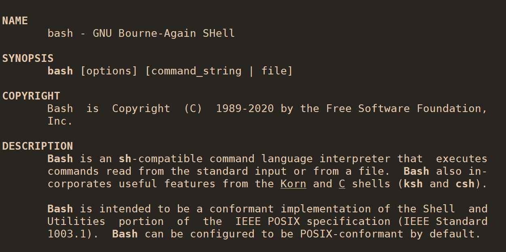

## OPTIONS
> [Bash Script Class: Shell Options](https://www.youtube.com/watch?v=26t2LMtrDOc&t=349s&ab_channel=NIH_HPC)
> [Chapter 33.Options](https://tldp.org/LDP/abs/html/options.html)
> [6.1 Invoking Bash](https://www.gnu.org/software/bash/manual/html_node/Invoking-Bash.html)


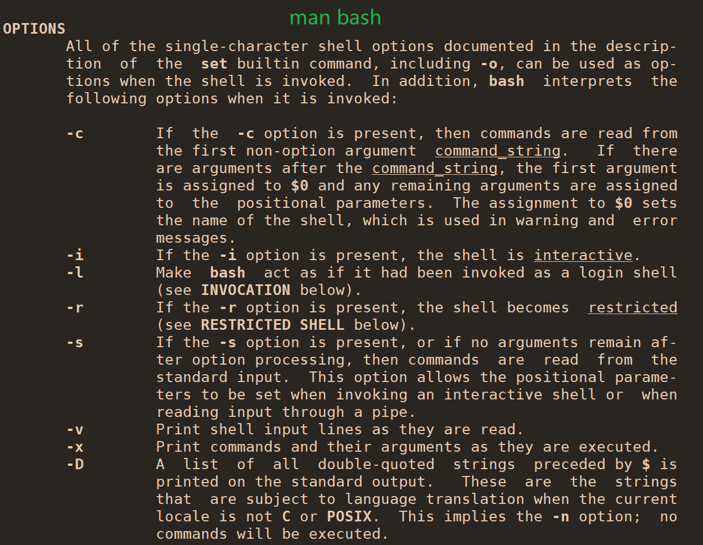

> All of the single-character shell options documented in the description of the `set` builtin command, including `-o`, can be used as options when shell is invlked.


### shell 内置但不能用 set 设置的一些选项
- `echo $-` 可以查看这些选项中哪些设置了
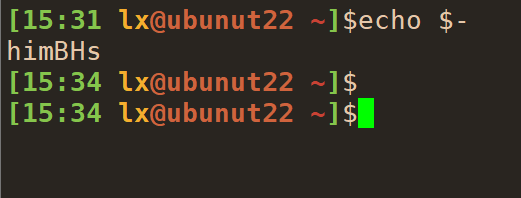

#### -c
- 不是太明白用处


#### -i interactive shell
- 如果设置，则 shell is `interactive`
- `echo $-` 可查看该选项是否设置
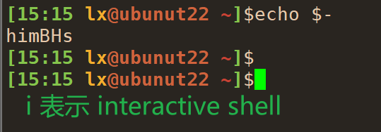


#### -l login shell
> make `bash` act as if it had been invoked as a login shell.

- 可以让当前的 shell 变成 login shell，这样加载的 bash startup files 不同，相当于执行 `exec bash --login`


#### r restricted shell
> make the shell a restricted shell

#### -s stdin

> if the `-s` option is present, or if no arguments remain after option processing, then the commands are read from the standard input.
> this option allows the positional parameters to be set when invoking an interactive shell or when reading input through a pipe.

- `echo $-` 可以查看该选项是否设置


#### -v verbose
> print each command to `stdout` before executing it

- `set` 可以设置该选项，因此可以通过 `set` 命令查看是否设置该参数
- 设置该参数后会将输入的命令作为输出到 `stdout`，但不会扩展命令
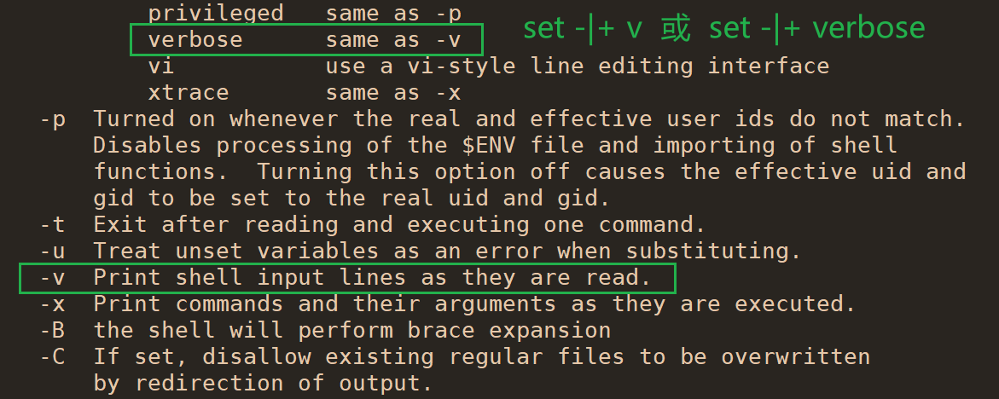  
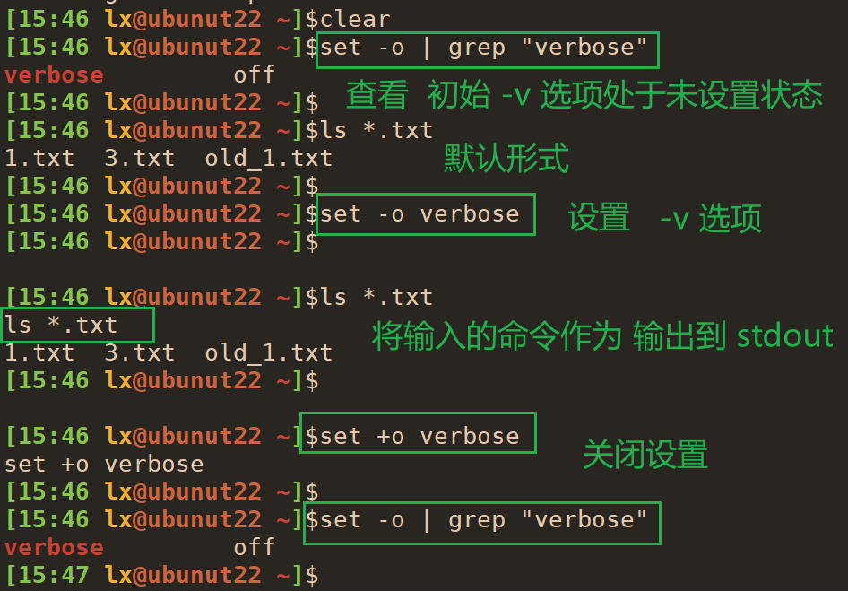
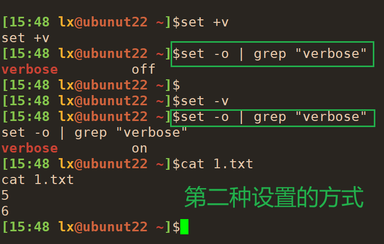

#### -x xtrace
> similar to `-v`, but expands commands

- 可以通过 `set` 命令设置
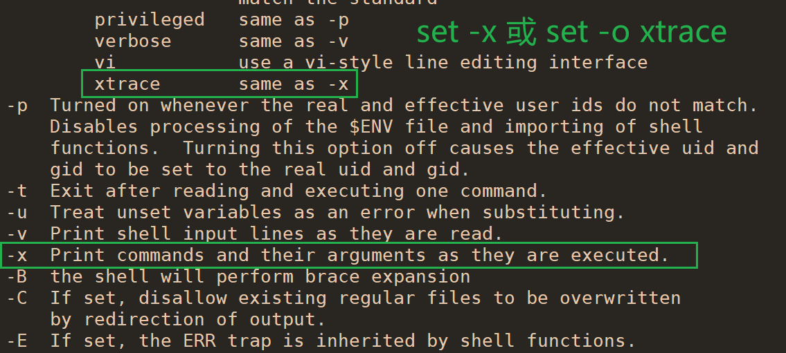
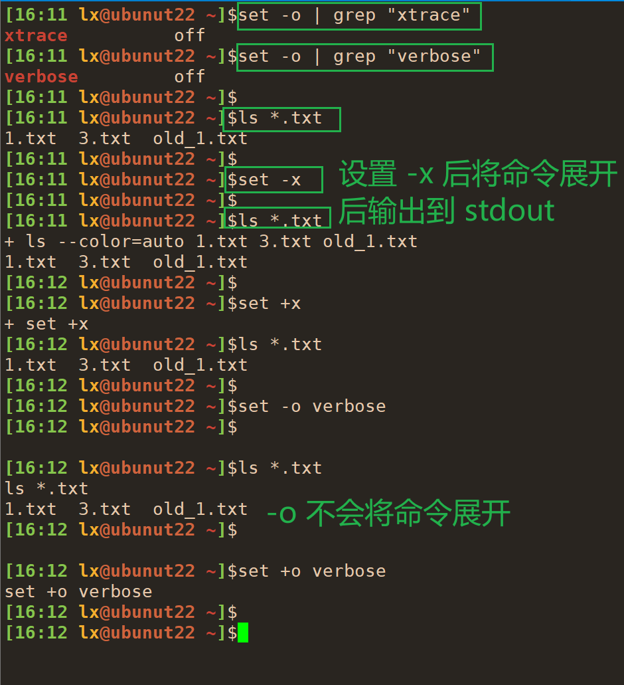

#### -d double-quoted string
> a list of all double-quoted strings preceded by `$` is printed on the standard output.
> these strings that are subject to language translation when the current locale is not `c` or `posix`.
> this implies the `-n` option; no commands will be executed.

- 不能在 `set` 命令中设置
- 包含 `-n` 选项的作用，扩展 `$`后面双引号的内容，不执行该命令，做语法检查


#### --
> a `--` signals the end of options and disables further option processing.
> any arguments after the `--` are treated as filenames and arguments.
> an argument of `-` is equivalent to `--`.


### set options
> [4.3.1 the set builtin](https://www.gnu.org/software/bash/manual/bash.html#the-set-builtin)

> set [-abefhkmnptuvxbcehpt] [-o option-name] [--] [-] [argument …]
> set [+abefhkmnptuvxbcehpt] [+o option-name] [--] [-] [argument …]

- old options
- `set --help | less` 查看帮助说明
- `-` 设置选项
- `+` 取消设置选项
- 在 `shell` 中用 `set` 命令设置的选项只是临时生效，除非写道配置文件中

#### set -|+ o 查看全部的选项
- `set -o` 和 `set +o` 都可以查看全部选项的设置状态，只是结果显示格式不同
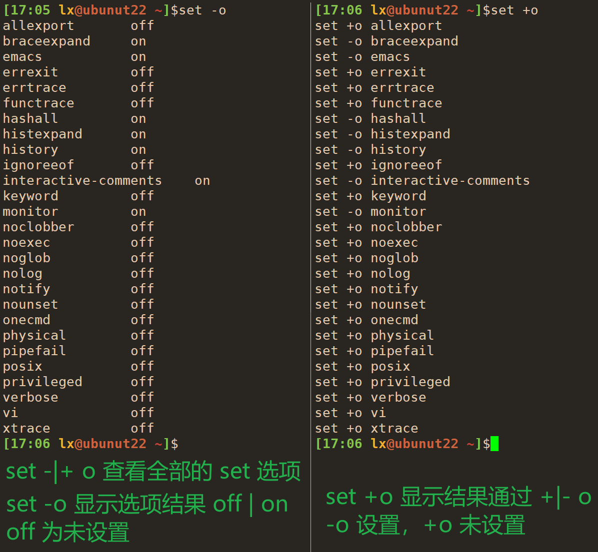

#### 设置或禁用某个选项
- 有的选项有两种格式，如 `-v` 与 `-o verbose` 格式
- 写 `set -|+v` 或 `set -|+o verbose` 都一样
- 可通过 `set -o | grep "verbose"` 查看 `-v` 选项是否设置
  
#### -a | -o allexport
> [4.3.1 the set builtin](https://www.gnu.org/software/bash/manual/bash.html#the-set-builtin)
> [set(1p) — linux manual page](https://man7.org/linux/man-pages/man1/set.1p.html)

> each variable or function that is created or modified is given the export attribute and marked for export to the environment of subsequent commands.


- 创建的变量自动变为环境变量，相当于加上 `export` 属性
- `man bash` 查看的帮助中没有提到 `functin`，`gnu.org` 文档中提到 `funtion` 也适用，未测试

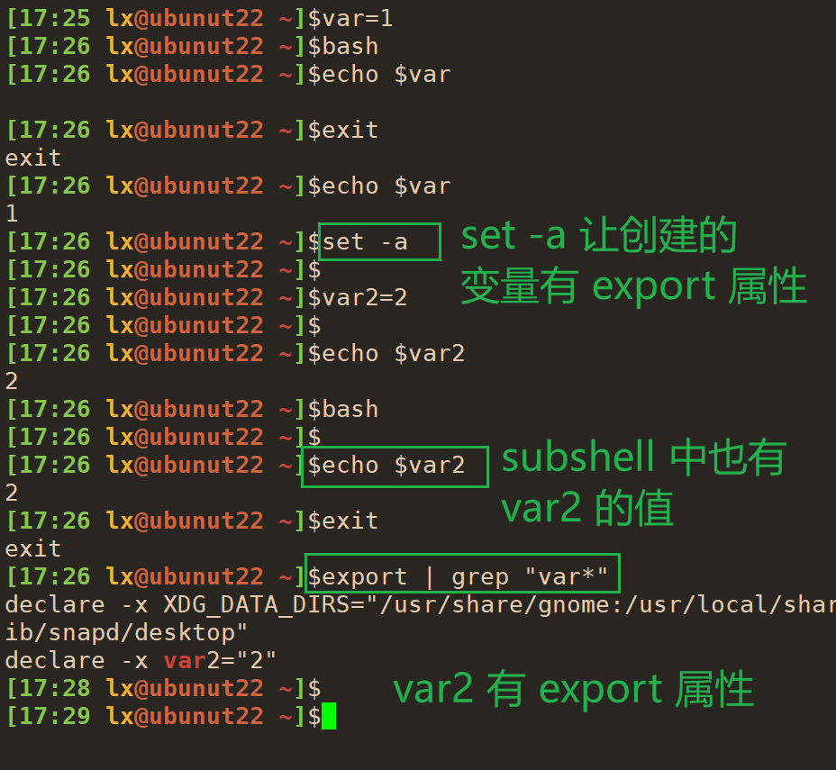


#### -b | -o notify
> cause the status of terminated background jobs to be reported immediately, rather than before printing the next primary prompt.

- ubuntu 22.04 默认未设置

#### -e | -o errexit
- exit immediately if a command exits with a non-zero status

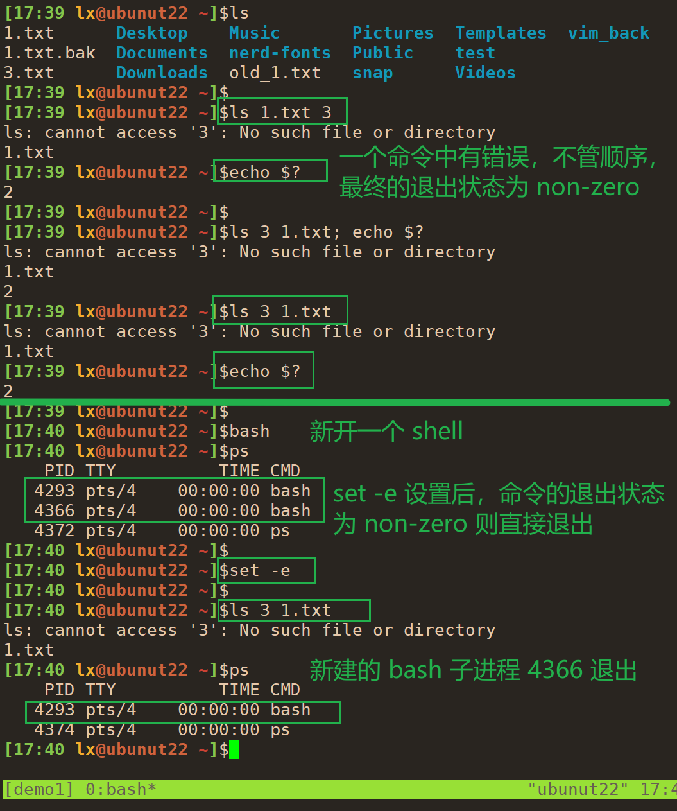


#### -f | -o noglob
> disable filename expansion(globbing)

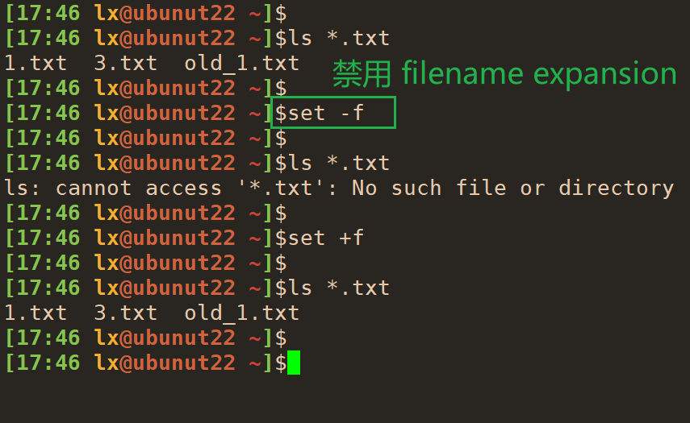


#### -h | -o hashall
> locate and remember (hash) commands as they are looked up for execution.

- `echo $-` 可看到该选项是默认设置
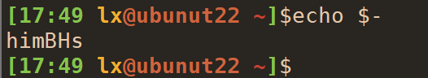

- 或者用 `set -o | grep "hashall` 查看
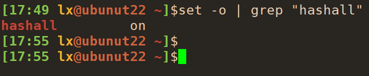

- 开启该功能，则执行过的外部命令会存在 `hash` 缓存中，下次再执行时直接从 `hash` 缓存中找命令的路径
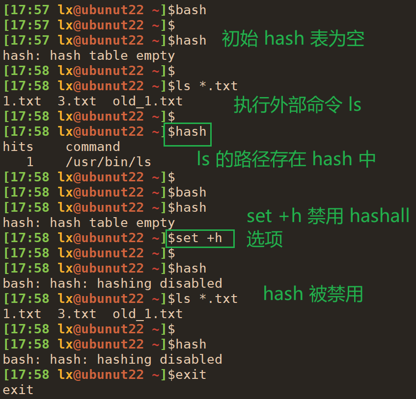


#### -c | -o noclobber
> uppercase c
> if set, disallow existing regular files to be overwritten by redirection of output

- 默认没有设置该选项，即重定向可以覆盖原有文件内容
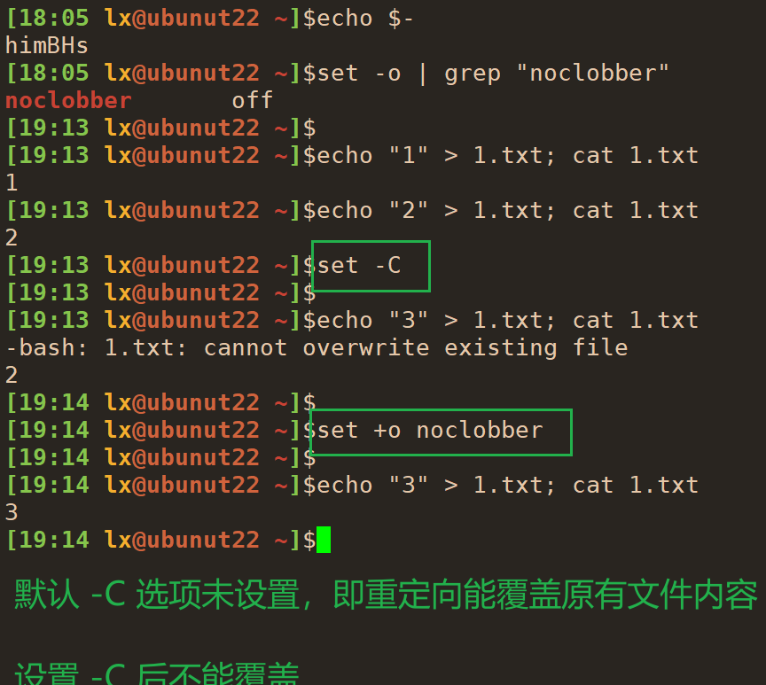

#### -m | -o monitor
> job control is enabled


- 默认开启该设置


#### -n | -o noglob
> read commands but do not execute them
> an interactive shell may ignore this option

- 读取命令但不执行，可以用来检查 shell 脚本语法错误
- interactive shell 设置该选项失败，默认未设置
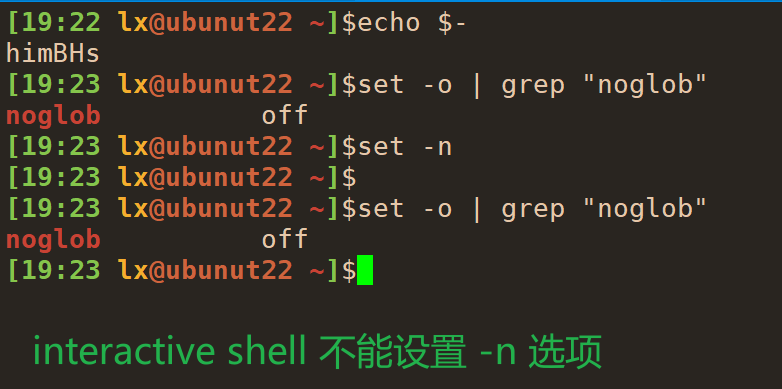


#### -t | -o onecmd
> exit after reading and executing one command

#### -u | -o nounset
> treat unset variable as an error when substituting

- 默认未开启，如果 `echo $var` 而 `var` 未设置，则输出空，退出状态为 0
- 设置后为设置的变量认为错误，退出状态 non-zero

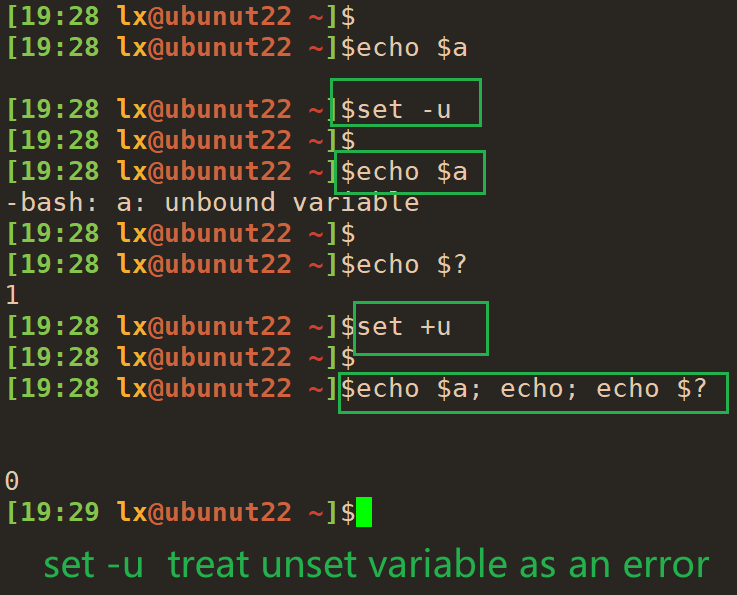


#### -v | -o verbose
> print each command to `stdout` before executing it

- `set` 可以设置该选项，因此可以通过 `set` 命令查看是否设置该参数
- 设置该参数后会将输入的命令作为输出到 `stdout`，但不会扩展命令
  


#### -x | -o xtrace
> similar to `-v`, but expands commands

- 可以通过 `set` 命令设置


#### -b | -o braceexpand
> the shell will perform brace expansion

- 默认开启该设置，`echo $-` 可看到 `b` 选项
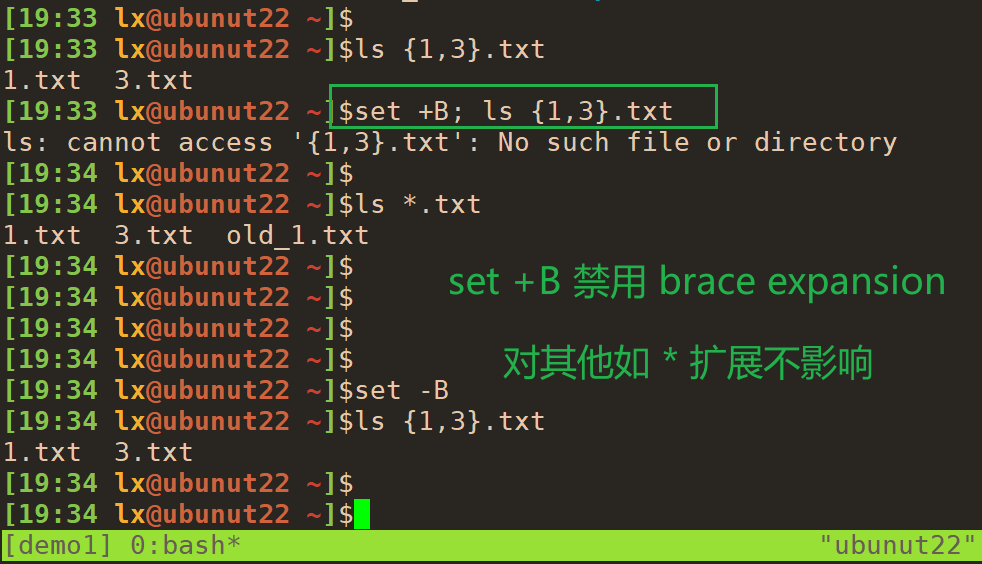


#### -h | -o hisexpand
> enable ! style history substitution.

- 默认设置，即 `echo $-` 看到的 `h`
- 通过 `history` 命令找到历史命令的编号，可以通过 `!num` 执行历史命令

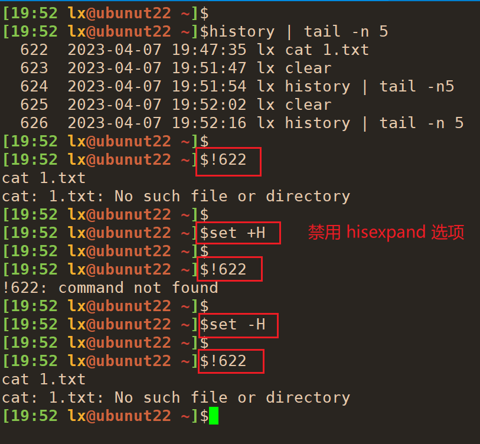

#### -p | -o physical
> if set, do not resolve symbolic links when executing commands such as `cd` which change the current directory

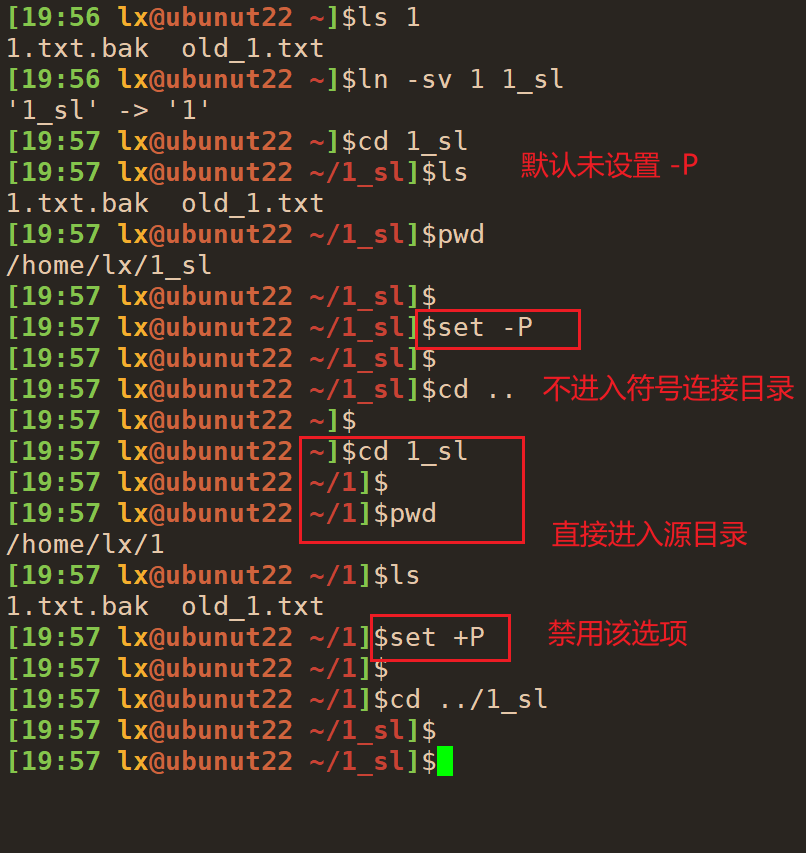


#### -o emacs
> [8 command line editing](https://www.gnu.org/software/bash/manual/bash.html#command-line-editing)

> use an emacs-style line editing interface
> this also affects the editing interface used for `read -e`

- 默认选项
- emacs 风格的的快捷键，如回到行首等和 vi 快捷键不同
- 例在写命令时用 `ctrl b` 想左移动一个字符，相当于 vi 在普通模式下的 `h` 

#### -o vi
> use a vi-style line editing interface

- 设置后默认为 insert 模式，按下 `esc` 或者 `ctrl [` 可切换到 normal 模式

#### -p | -o privileged


#### -o ignoreeof
> the shell whill not exit upon reading eof

#### -o -o interactive-comments
> allow comments to appear in interactive commands


#### --
> assign any remaining arguments to the positional parameters
> if there are no remaining arguments, the positional parameters are unset
> the -x and -v options are turned off


#### -
> assign any remaining arguments to the positional parameters
> the -x and -v options are turned off


### shopt options
> [4.3.2 the shopt builtin](https://www.gnu.org/software/bash/manual/bash.html#the-shopt-builtin)

> shopt [-pqsu] [-o] [optname …]

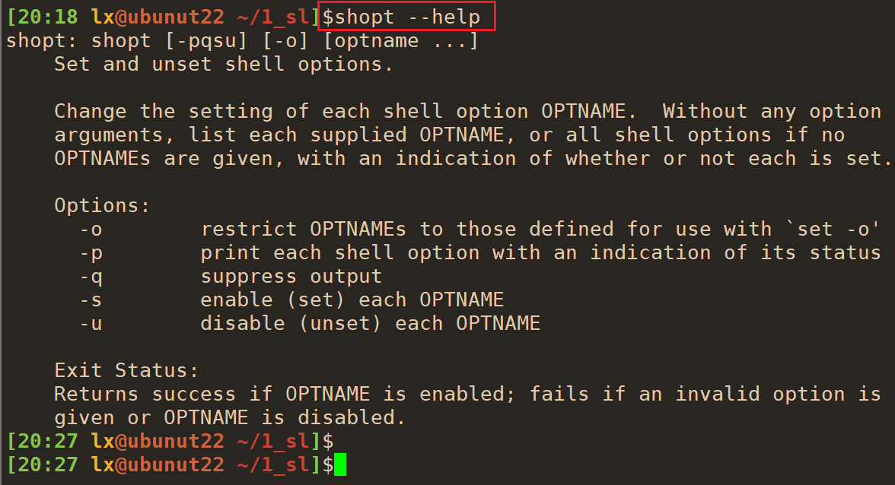


- new options
- 包含 `set` 中的旧选项

#### shopt -o 显示 set 的选项
- 和 `set -o` 显示效果相同，兼容 `set` 选项 
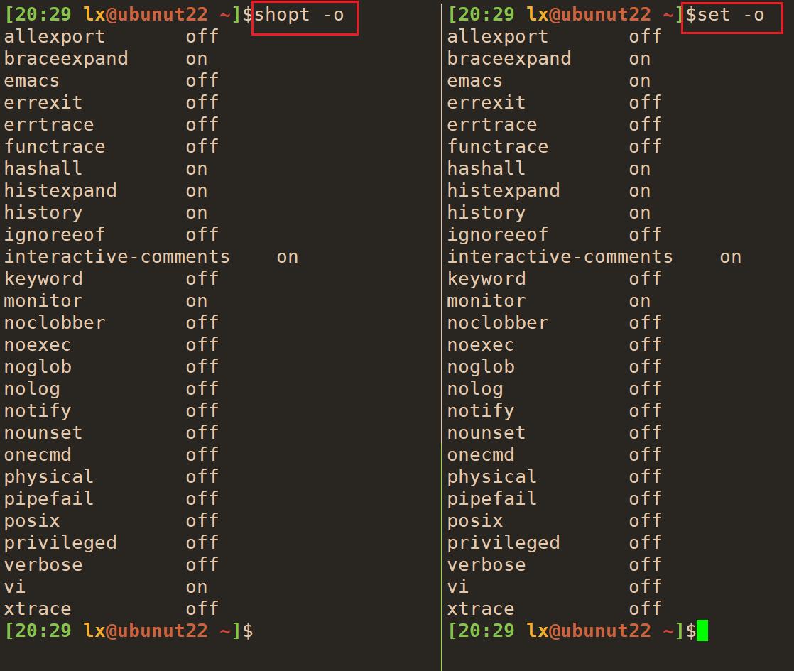


#### shopt -p 显示全部选项及其状态
- `shopt -p | less`，`-u` 表示 `unset`，`-s` 表示 `set`
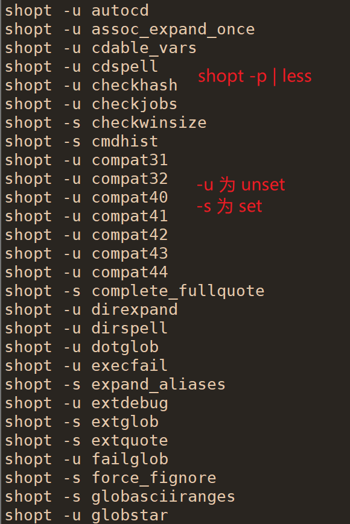

- 也可用 `shopt | less` 查看，结果显示不同，用 `on` 和 `off` 表示其状态

#### shopt -q 查看某个选项是否存在
- 不输出结果，可通过 return status 查看选项是否开启
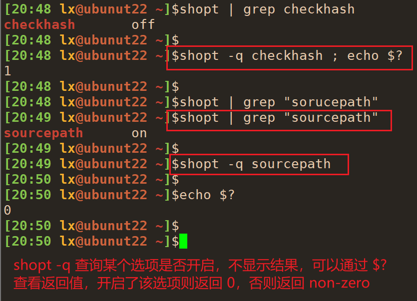

- 如果查询的选项有多个，则只要有一个选项未设置，返回 non-zero
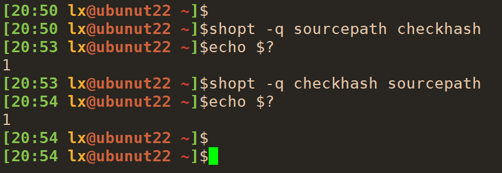


#### shopt -s 开启一个或多个选项
> enable (set) each optname

#### shopt -u 禁用一个或多个选项
> disable (unset) each optname

# 查看全部支持的有效 login shell
- `cat /etc/shells` 查看
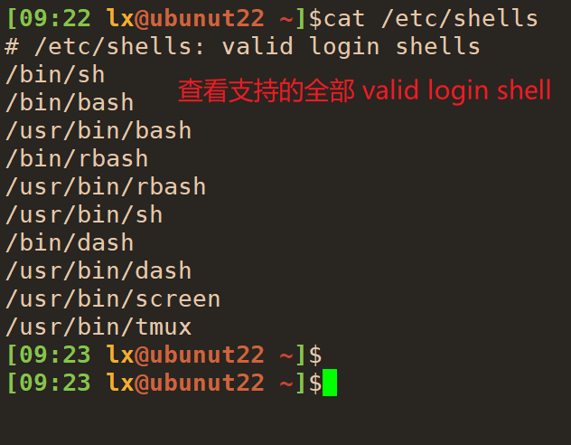


# 查看当前用户的默认 shell
- 当前用户的默认 shell 不一定是当前正在使用的 shell
- `echo $shell`
- `getent passwd $user`
- `grep "^$user" /etc/passwd`

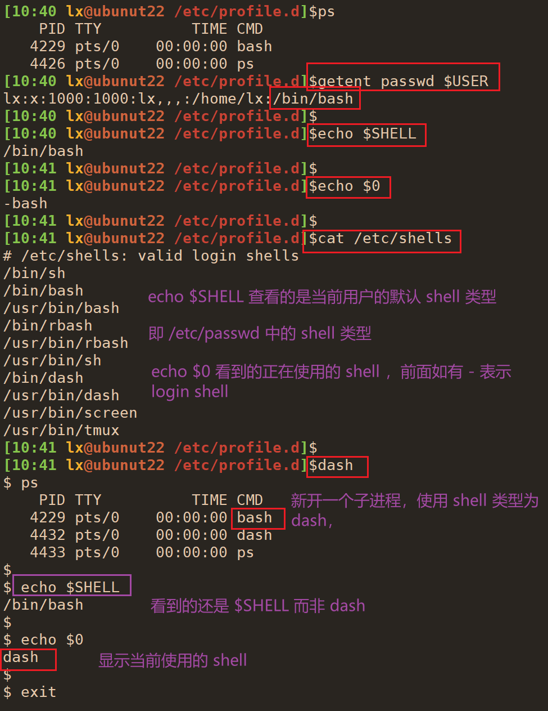

# 查看当前使用的 shell
> [how do i find out what shell i am using on linux/unix?](https://www.cyberciti.biz/tips/how-do-i-find-out-what-shell-im-using.html)


- `echo $0` 可查看当前使用的 shell 类型，不一定是当前默认的 shell
- `ps` 命令也可查看，一般在倒数第二个（pid 第二大），最下方的为 `ps` 命令的 pid
- `ps -p $$` 可查看，`-p` 指定查看的 pid，`$$` 显示当前进程的 pid，即当前 shell 的 pid
  


# 修改当前默认 shell

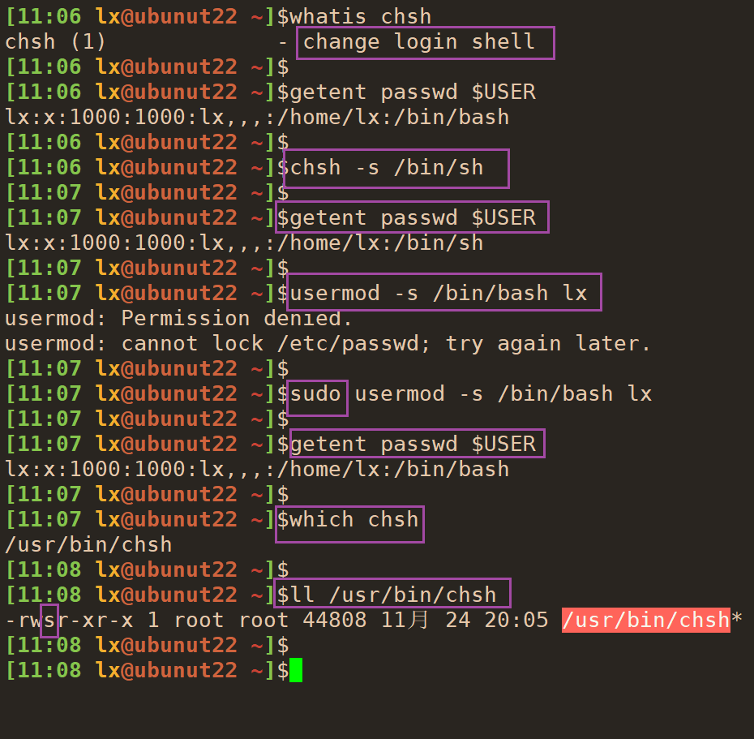
## usermod -s 
- 需要 root 权限

## chsh -s
- change login shell
- 不需要 root 权限
- `chsh` 有 `s` 权限，普通用户执行时以 root 身份执行该命令


# interactive, non-interactive, login, and non-login shells
> [bash 的环境配置文件](http://cn.linux.vbird.org/linux_basic/0320bash_4.php#settings_bashrc)
> [what is the difference between login and non-login shell?](https://tecadmin.net/difference-between-login-and-non-login-shell/)
> [interactive, non-interactive, login, non-login shells in linux](https://www.baeldung.com/linux/interactive-non-interactive-login-non-login-shells)
> [6.1 invoking bash](https://www.gnu.org/software/bash/manual/html_node/invoking-bash.html)


**********************
## 查看当前 shell 是 login shell 还是 non-login shell 
> a login shell is one whose first character of argument zero is `-`, or one inviked whith `--login` optin.

- 用 `echo $0` 查看 shell 类型，有 `-` 前缀为 login shell


- 或者用 `shopt login_shell` 查看，状态为 `on` 则为 login shell
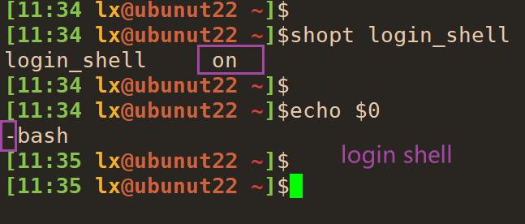


## 查看当前 shell 是 interactive shell 还是 non-interactive shell
> [6.3.2 is this shell interactive](https://www.gnu.org/software/bash/manual/html_node/is-this-shell-interactive_003f.html)


- `echo $-` 查看，有 `i` flag 则为 `interactive shell`，`i` 为 shell 内置的 `-i` 选项


### 脚本中判断
- startup scrips 默认`ps1` 只在 `interactive shell` 中有，在 `non-interactive shell` 中未设置，如 `/etc/bash.bashrc`
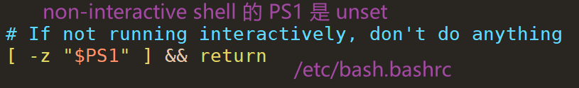

- 通过 `$-` 查看是否有 `i` 判断


## login-shell
1. ubuntu 22.04 带图形界面版本测试

- 登录系统默认进入的是 `tty2`，是 login shell

- 用户最开始登录系统创建的是 login shell（tty2），但如果是图形界面，在登录后启动图形化接口，这时进入 pts 伪终端，无需再次登录，查看可以发现该登录为 non-login shell（ubuntu 22.02）, 但用 w 命令看不到 pts 登录
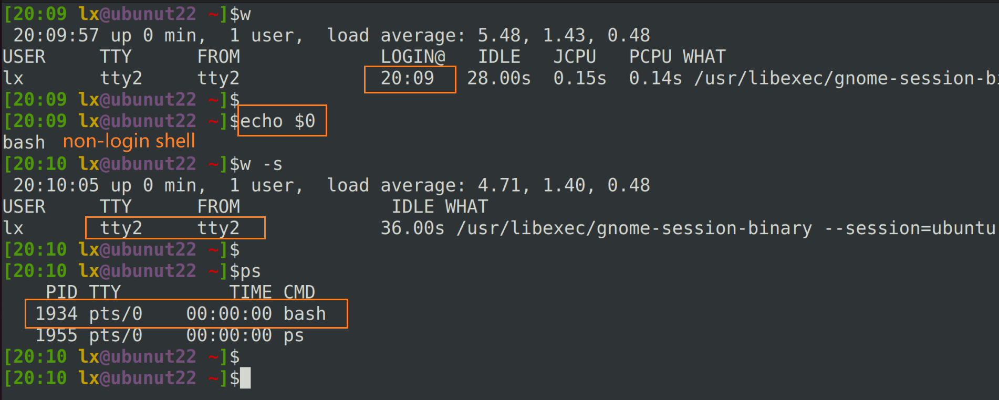

- 图形界面登录后再用 xshell 远程连接，登录 shell 为 login shell，登录设备是 pts 伪终端
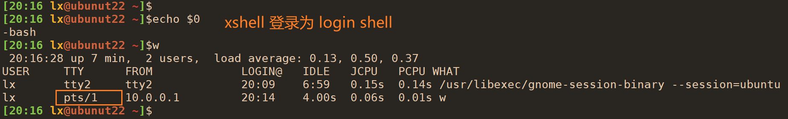
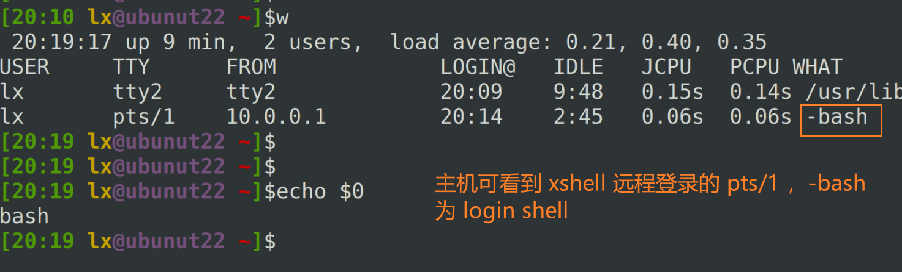 

- `ctrl a|t f1` 切换终端，此时变成 `tty3`，但仍是图形界面登录，图形界面登录的仍是 pts
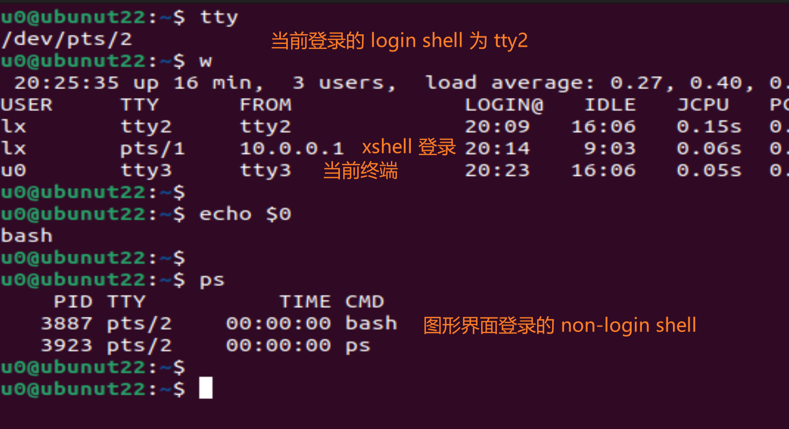

- 在一个图形界面用 `init 3` 进入 cli 命令行界面后，此时用 `tty` 查看其设备，`f1` ~ `f6` 分别对应的变为 `tty1` ~ `tty6`？


- `su -` 即 `su -l` 创建的也是 login shell，但 `tty` 查看仍是一个终端设备
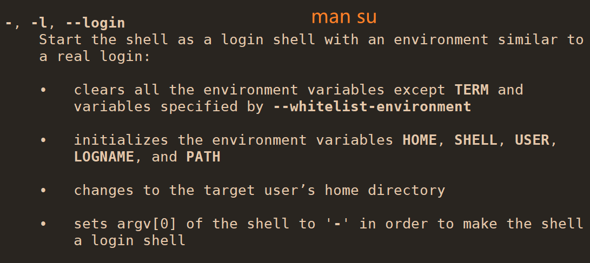
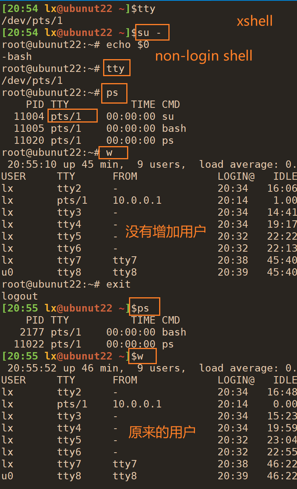


- ssh 登录的用户创建 login shell


## non-login shell
- `w` 命令看不到 non-login shell 登录的用户
  

## interactive shell behavior
> [6.3.3 interactive shell behavior](https://www.gnu.org/software/bash/manual/html_node/interactive-shell-behavior.html)


# bash 环境配置文件的执行规则（bash startup files）
> [bash 的环境配置文件](http://cn.linux.vbird.org/linux_basic/0320bash_4.php#settings_bashrc)
> [6.2 bash startup files](https://www.gnu.org/software/bash/manual/html_node/bash-startup-files.html)
> [bash-doc 4.3-6ubuntu1/usr/share/doc/bash/examples/startup-files](https://www.apt-browse.org/browse/ubuntu/trusty/main/all/bash-doc/4.3-6ubuntu1/file/usr/share/doc/bash/examples/startup-files)


- 不同 bash 版本其具体一些配置文件的执行可能不同，可以看该脚本中的代码查看其执行顺序

- **环境：ubuntu 22.04 和 ubuntu 20.04**
- 图形界面登录时，开始登录的 tty 设备为 `interactive login shell`，然后通过图形界面登录为 `interactive non-login`
- `interactive login shell` 登录


## interactive login shell 或使用 `--login` 选项
> [6.2 bash startup files](https://www.gnu.org/software/bash/manual/html_node/bash-startup-files.html)
> &nbsp;
> when bash is invoked as an **interactive login shell**, or as a **non-interactive shell with the `--login` option**, it **first** reads and executes commands from the file `/etc/profile`.
> &nbsp;
> if that file exists, it looks for `~/.bash_profile`, `~/.bash_login`, and `~/.profile`, **in that oeder**, and reads and executes commands from the first one that **exists and is readable**.
> &nbsp;
> the `--noprofile` option may be used when the shell is started to inhibit this behavior.
> &nbsp;
> when an **interactive login shell exits, or a non-interactive login shell** executes the `exit` builtin command, **bash reads and executes commands** from the file `~/.bash_logout`, if it exists.
> &nbsp;
> The --noprofile option may be used when the shell is started to inhibit this behavior.

&nbsp;

- 非图形界面通过 tty 登录，为 `interactive login shell`
- 图形界面登录显示通过 tty 登录，再通过图形化接口登录，登录为 `interactive non-login shell`
- ssh 远程登录为 `interacitve login shell`
- 指定 `-l` 选项登录，如 `su - username` 或 `su -l username`, 或 `su --login username` 切换用户登录为 `interactive login shell`

1. 首先执行 `/etc/profile` 文件
- 执行 `/etc/profile` 文件时，该文件中可能调用其他文件，如 ubunut 22.04 和 ubuntu 20.04 中调用 `/etc/profile.d` 目录下的全部文件。
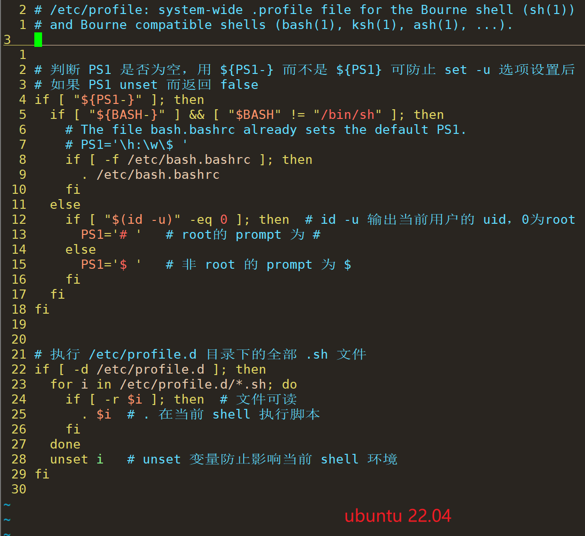

2. 按照顺序依次查找 `~/.bash_profile, ~/.bash_login 和 ~/.profile` 并执行第一个找到的且可读的文件
- 只有 `~/.bash_profile` 和 `~/.bash_login` 均不存在才会读 `~/.profile`，且按照该顺序查找文件

- ubuntu 22.04 和 ubuntu 20.04 用户家目录中没有 `~/.bash_profile` 和 `~/.bash_login`文件，但有 `~/.profile` 文件，因此执行的是 `~/.profile` 文件

- ubuntu 22.04 `~/.profile` 文件中会调用 `~/.bashrc` 执行
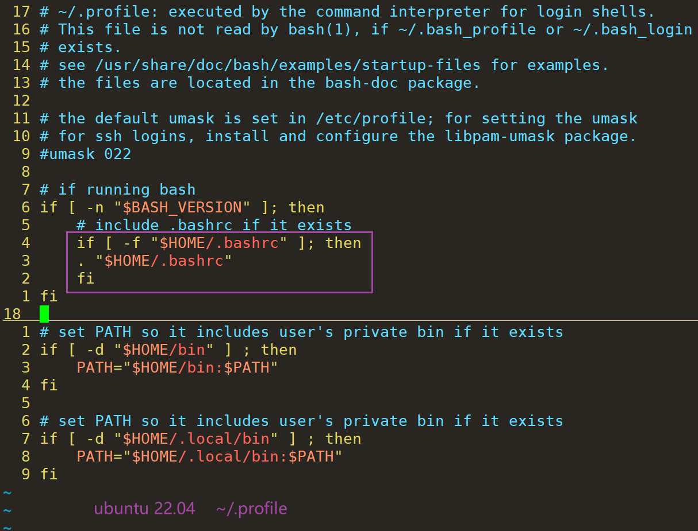

- rocky8.6 家目录中有 `~/.bash_profile`
```bash
# rocky8.6
# .bash_profile
  
# Get the aliases and functions
if [ -f ~/.bashrc ]; then
        . ~/.bashrc
fi

# User specific environment and startup programs
```

- **在找到的配置文件中可能调用其他的配置文件，不同的 bash 版本可能调用的文件有差异，具体要看对应的脚本**


## Interactive non-login shell 登录
> [6.2 Bash Startup Files](https://www.gnu.org/software/bash/manual/html_node/Bash-Startup-Files.html)
> &nbsp;
> When an **interactive shell** that is **not a login shell** started, Bash reads and executes commands from `~/.bashrc`, if that file exist.
> &nbsp;
> This may be inhibited by using the `--norc` option.
> &nbsp;
> The `--rcfile file` option will force Bash to read and execute commands from `file` instead of `~/.bashrc`.

&nbsp;

- ubuntu 22.04 和 ubuntu 20.04 图形界面登录之前已经有 tty 设备登录，图形界面重新登录的为 pts 设备，为 `interactive non-login shell`，不会重新读 `/etc/profile` 文件，直接执行 `~/.bashrc` 文件

- 登录一个 shell 后，执行 `bash` 或 `sh` 时新开启一个 shell 子进程为 `interactive non-login shell`

- 通过 `su username` 切换用户，即未用 `-l` 选项，则登录的 shell 也为 `interactive non-login shell`

1. 执行 `~/.bashrc` 文件
- 该文件是 `interactive login shell` 直接执行的文件，`interactive non-login shell` 通过 `~/.profile` 文件调用该文件执行

- 第 `5~8` 行是保证只有 `interactive shell` 执行，即 `echo $-` 的结果中有 `i` 标志


## non-interactive shell 登录
> [6.2 Bash Startup Files](https://www.gnu.org/software/bash/manual/html_node/Bash-Startup-Files.html)
> &nbsp;
> When Bash is started non-interactively, to run a shell script, for example, it looks for the variable BASH_ENV in the environment, expands its value if it appears there, and uses the expanded value as the name of a file to read and execute. Bash behaves as if the following command were executed: 
```bash
if [ -n "$BASH_ENV" ]; then . "$BASH_ENV"; fi
```
> &nbsp;
> If a non-interactive shell is invoked with the --login option, Bash attempts to read and execute commands from the login shell startup files.


- 执行 shell 脚本时，`PATH` 环境变量不会查找文件

- 这种情况不清楚？ 在什么场景？


## Invoked with name sh
> [6.2 Bash Startup Files](https://www.gnu.org/software/bash/manual/html_node/Bash-Startup-Files.html)

## Invoked in POSIX mode
> [6.2 Bash Startup Files](https://www.gnu.org/software/bash/manual/html_node/Bash-Startup-Files.html)


## Invoked by remote shell daemon
> [6.2 Bash Startup Files](https://www.gnu.org/software/bash/manual/html_node/Bash-Startup-Files.html)


## Invoked by remote shell daemon
> [6.2 Bash Startup Files](https://www.gnu.org/software/bash/manual/html_node/Bash-Startup-Files.html)


# Bash 环境配置文件的用途说明
## /etc/profile

### ubuntu 22.02 


- 在当前 shell 中执行 `/etc/profile.d` 目录下的全部 `.sh` 脚本
- 自定义一些设置最好不修改，而是新写脚本放到 `/etc/profile.d` 目录中，以 `.sh` 结尾即可保证执行

```bash
  1 # /etc/profile: system-wide .profile file for the Bourne shell (sh(1))   
  2 # and Bourne compatible shells (bash(1), ksh(1), ash(1), ...).
  3 
  4 
  5 # 判断 PS1 是否为空，用 ${PS1-} 而不是 ${PS1} 可防止 set -u 选项设置后
  6 # 如果 PS1 unset 而返回 false
  7 if [ "${PS1-}" ]; then
  8   if [ "${BASH-}" ] && [ "$BASH" != "/bin/sh" ]; then
  9     # The file bash.bashrc already sets the default PS1.
 10     # PS1='\h:\w\$ '
 11     if [ -f /etc/bash.bashrc ]; then
 12       . /etc/bash.bashrc
 13     fi
 14   else
 15     if [ "$(id -u)" -eq 0 ]; then  # id -u 输出当前用户的 uid，0为root
 16       PS1='# '   # root的 prompt 为 #
 17     else
 18       PS1='$ '   # 非 root 的 prompt 为 $
 19     fi
 20   fi
 21 fi
 22 
 23 
 24 # 执行 /etc/profile.d 目录下的全部 .sh 文件
 25 if [ -d /etc/profile.d ]; then
 26   for i in /etc/profile.d/*.sh; do
 27     if [ -r $i ]; then  # 文件可读
 28       . $i  # . 在当前 shell 执行脚本
 29     fi
 30   done
 31   unset i   # unset 变量防止影响当前 shell 环境
 32 fi
```


### rocky8.6

- rocky 8.6 `/etc/profile` 文件中内容更多
- 注释中写明最好不要修改该文件，而是将自定义设置放在 `/etc/profile.d` 目录中以 `.sh` 为后缀

```bash
  1 # /etc/profile
  2 
  3 # System wide environment and startup programs, for login setup
  4 # Functions and aliases go in /etc/bashrc
  5 
  6 # It's NOT a good idea to change this file unless you know what you
  7 # are doing. It's much better to create a custom.sh shell script in
  8 # /etc/profile.d/ to make custom changes to your environment, as this
  9 # will prevent the need for merging in future updates.
 10 
 11 pathmunge () {
 12     case ":${PATH}:" in
 13         *:"$1":*)
 14             ;;
 15         *)
 16             if [ "$2" = "after" ] ; then
 17                 PATH=$PATH:$1
 18             else
 19                 PATH=$1:$PATH
 20             fi
 21     esac
 22 }
 23 
 24 # id 命令的路径为 /usr/bin/id 显示当前shell 用户的 id 信息
    # id -u 显示 uid, id -ru 显示 real ID，而非 EUID 
    # 有些程序加了 suid 权限后执行时以其他身份运行，因此 EUID 不是实际 ID
    # 该部分根据当前用户，设置一些变量，如 shell 内置变量 EUID 等
 25 if [ -x /usr/bin/id ]; then
 26     if [ -z "$EUID" ]; then
 27         # ksh workaround
 28         EUID=`/usr/bin/id -u`
 29         UID=`/usr/bin/id -ru`
 30     fi
 31     USER="`/usr/bin/id -un`"
 32     LOGNAME=$USER
 33     MAIL="/var/spool/mail/$USER"
 34 fi
 35 
 36 # Path manipulation
    # $EUID 为 0 表示当前程序以 root 身份执行
    # 如果 EUID 为 root，则检查 /usr/local/sbin 和 /usr/sbin 放在环境变量的最前面（这两个路径不存在时）
    # root login shell 方式登录，echo $PATH 的值如下：
    # /usr/local/sbin:/usr/local/bin:/usr/sbin:/usr/bin:/root/bin
    #
    # 如果是普通用户，则将 /usr/local/sbin 和 /usr/sbin 放在 PATH 环境变量的最后
    # 如普通用户 lx 登录（su -l lx）, echo $PATH 的值如下：
    # /home/lx/.local/bin:/home/lx/bin:/usr/local/bin:/usr/bin:/usr/local/sbin:/usr/sbin

 37 if [ "$EUID" = "0" ]; then
 38     pathmunge /usr/sbin
 39     pathmunge /usr/local/sbin
 40 else
 41     pathmunge /usr/local/sbin after
 42     pathmunge /usr/sbin after
 43 fi
 44 
    # 主机名 hostname
 45 HOSTNAME=`/usr/bin/hostname 2>/dev/null`
    # 命令行中显示的历史记录的最大数目
 46 HISTSIZE=1000
 47 if [ "$HISTCONTROL" = "ignorespace" ] ; then
 48     export HISTCONTROL=ignoreboth
 49 else
 50     export HISTCONTROL=ignoredups
 51 fi
 52 
 53 export PATH USER LOGNAME MAIL HOSTNAME HISTSIZE HISTCONTROL
 54 
 55 # By default, we want umask to get set. This sets it for login shell
 56 # Current threshold for system reserved uid/gids is 200
 57 # You could check uidgid reservation validity in
 58 # /usr/share/doc/setup-*/uidgid file
 59 if [ $UID -gt 199 ] && [ "`/usr/bin/id -gn`" = "`/usr/bin/id -un`" ]; then
 60     umask 002
 61 else
 62     umask 022
 63 fi
 64 
 65 for i in /etc/profile.d/*.sh /etc/profile.d/sh.local ; do
 66     if [ -r "$i" ]; then
 67         if [ "${-#*i}" != "$-" ]; then
 68             . "$i"
 69         else
 70             . "$i" >/dev/null
 71         fi
 72     fi
 73 done
 74 
 75 unset i
 76 unset -f pathmunge
 77 
 78 if [ -n "${BASH_VERSION-}" ] ; then
 79         if [ -f /etc/bashrc ] ; then
 80                 # Bash login shells run only /etc/profile
 81                 # Bash non-login shells run only /etc/bashrc
 82                 # Check for double sourcing is done in /etc/bashrc.
 83                 . /etc/bashrc
 84        fi
 85 fi
```


## ~/.profile
### ubuntu 22.02 带图形界面
```bash
  1 # ~/.profile: executed by the command interpreter for login shells.      
  2 # This file is not read by bash(1), if ~/.bash_profile or ~/.bash_login
  3 # exists.
  4 # see /usr/share/doc/bash/examples/startup-files for examples.
  5 # the files are located in the bash-doc package.
  6 
  7 # the default umask is set in /etc/profile; for setting the umask
  8 # for ssh logins, install and configure the libpam-umask package.
  9 #umask 022
 10 
 11 # if running bash
 12 if [ -n "$BASH_VERSION" ]; then
 13     # include .bashrc if it exists
 14     if [ -f "$HOME/.bashrc" ]; then
 15     . "$HOME/.bashrc"
 16     fi
 17 fi
 18 
 19 # set PATH so it includes user's private bin if it exists
 20 if [ -d "$HOME/bin" ] ; then
 21     PATH="$HOME/bin:$PATH"
 22 fi
 23 
 24 # set PATH so it includes user's private bin if it exists
 25 if [ -d "$HOME/.local/bin" ] ; then
 26     PATH="$HOME/.local/bin:$PATH"
 27 fi
```

- login shell 才会读

- 只有 `~/.bash_profile` 和 `~/.bash_login` 均不存在才会读
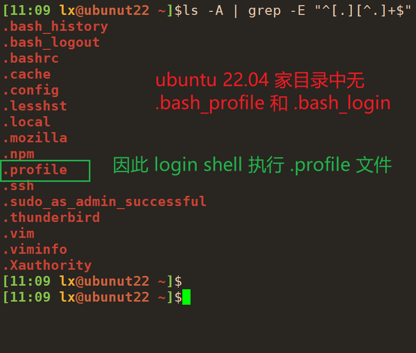

- 注释中提到的 `/usr/share/doc/bash/examples/startup-files` 找不到 `examples` 目录，可从 [bash-doc 4.3-6ubuntu1/usr/share/doc/bash/examples/startup-files](https://www.apt-browse.org/browse/ubuntu/trusty/main/all/bash-doc/4.3-6ubuntu1/file/usr/share/doc/bash/examples/startup-files) 查看

- 该文件会执行家目录中的 `~/.bashrc` 文件

- 如果用户家目录中有 `bin` 或 `.local/bin` 文件夹，则会将这两个路径加入到 PATH 环境变量中，ubuntu 22.04 中默认无这两个目录，用户可以自己创建，如将可执行文件放到 `~/bin` 目录下，则可执行文件执行时不需要写全路径，可以直接执行了

- 


- ubunut 20.04 `Ctrl A|t F1` 和 `Ctrl A|t F2` 都能进入图形界面

- login shell 和 non-login shell 创建时执行的一些环境设置脚本不同


# 引号和转义
> [引号和转义](https://wangdoc.com/bash/quotation)

# bash Quoting
> 在线帮助文档：[3.1.2 Quoting](https://www.gnu.org/savannah-checkouts/gnu/bash/manual/bash.html#Quoting)


- `man bash` 搜索 `QUOTING` 查看帮助文档


## 单引号
> [单引号](https://wangdoc.com/bash/quotation#单引号)

- 单引号包围的任何特殊字符都会变成普通字符
- 如果要使用单引号，不能用 `\` 转义，因为 `\` 变成普通字符，没有转义功能，可以在双引号中使用单引号


## 双引号
- 除了 `$` `\` 反向单引号（**`**） 其他字符均视为普通字符
- 显示双引号还是需要转义


## 不加引号时转义特殊字符
### 哪些字符需要转义
> 只有部分：[Special Characters and Quoting](https://www.oreilly.com/library/view/learning-the-bash/1565923472/ch01s09.html)
> [3.1.2.4 ANSI-C Quoting](https://www.gnu.org/savannah-checkouts/gnu/bash/manual/bash.html#ANSI_002dC-Quoting)


- 注意 `\` 后按换行表示换行继续写，不是转义
- `man bash` 中列出的 ANSI-C 一些转义


# Lists of Commands
> [List of Commands](https://www.gnu.org/savannah-checkouts/gnu/bash/manual/bash.html#Lists)


- A `list` is a sequence of one or more pipelines separated by one of the operators `;`, `&`, `&&`, or `||`, and optionally ternimated by one of `;`, `&`, or a `newline`.


## ;
- 用 `;` 分开的命令顺序执行
- 返回状态值为最后一条命令的执行结果
- 不用 `;` 分开时一条命令中只要有错误的结果，则返回错误


## &
- 命令以 `&` 结束则 shell 异步地在子进程中执行
- 命令在后台执行
- 返回状态值为 0（true）

## &&
- 前面的命令执行成功才会执行右边的命令
- left associativity


## ||
- 左边的命令执行错误才会执行右边的命令
- left associativity


## && 和 || 组合


# shell expansion
> 在线官方文档：[3.5 Shell Expansions](https://www.gnu.org/savannah-checkouts/gnu/bash/manual/bash.html#Shell-Expansions)
> [Bash 的模式扩展](https://wangdoc.com/bash/expansion)


- shell 先将命令分成 tokens
- 然后进行扩展，**按照一定顺序**，注意扩展的顺序


- 扩展完成后再执行命令


## { } brace expansion 
> [3.5.1 Brace Expansion](https://www.gnu.org/savannah-checkouts/gnu/bash/manual/bash.html#Brace-Expansion)
> [大括号扩展](https://wangdoc.com/bash/expansion#大括号扩展)


- 花括号扩展是第一个扩展的，在其他扩展之前，因此，花括号中不能放其他扩展格式


### {a,b,c}
- 里面的逗号前后不能有空格


### {x..y[..incr]}
- {x..y[..incr]} x，y 可以是整型或字母

- 


## ~ tilde expansion 
> [3.5.2 Tilde Expansion](https://www.gnu.org/savannah-checkouts/gnu/bash/manual/bash.html#Tilde-Expansion)
Error loading webview: Error: Could not register service worker: InvalidStateError: Failed to register a ServiceWorker: The document is in an invalid state.

- `man bash` 搜索 `Tilde Expansion` 查看帮助说明


//NOTE: 参数扩展
## ${ } shell parameter expansion

> [3.5.3 Shell Parameter Expansion](https://www.gnu.org/savannah-checkouts/gnu/bash/manual/bash.html#Shell-Parameter-Expansion)
> [变量扩展](https://wangdoc.com/bash/expansion#变量扩展)
> [2.6.2 Parameter Expansion](https://pubs.opengroup.org/onlinepubs/9699919799/utilities/V3_chap02.html#tag_18_06_02)


### `$` 和 `${ }` 两种写法比较
- 如果变量后面还有参数，只能用 `${ }` 的形式


### ${parameter:-word} 为输出参数添加默认值
- `parameter` set and not null, 输出 `parameter`
- `parameter` set 但为空，也输出 `word`
- `parameter` unset，输出 `word`


### ${parameter-word} 为输出参数添加默认值
- `parameter` 不为空，输出 `parameter`
- `parameter` set 但为空，输出 `parameter`
- `parameter` unset，输出 `word`
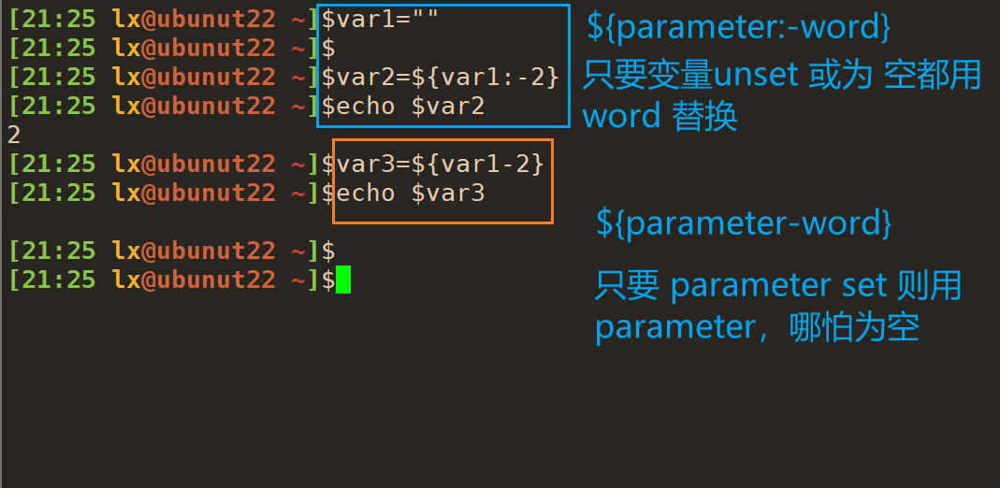

******************
#### ${parameter-} 和 ${parameter} 区别
> [Is "${PS1-}" valid syntax and how does it differ from plain "$PS1"?](https://unix.stackexchange.com/questions/352110/is-ps1-valid-syntax-and-how-does-it-differ-from-plain-ps1)


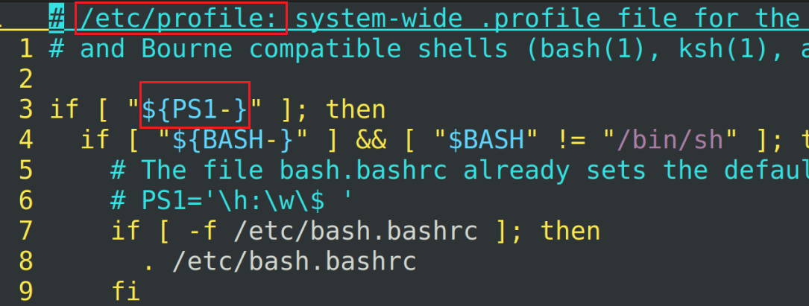

ubuntu 22.04 中的 `/etc/profile` 配置文件中使用 `${PS1-}` 的用法，看着和 `${PS1}` 的效果相同，因为默认的值 `word` 为空，如果 `PS1` 未设置，都为空。

但如果 `set -u` 选项设置了，即 `parameter` 未设置则输出错误而非空：
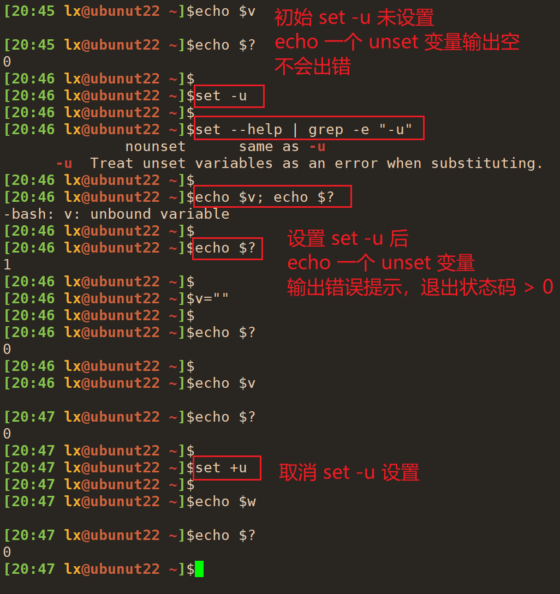

这种情况下两种写法的结果不同：
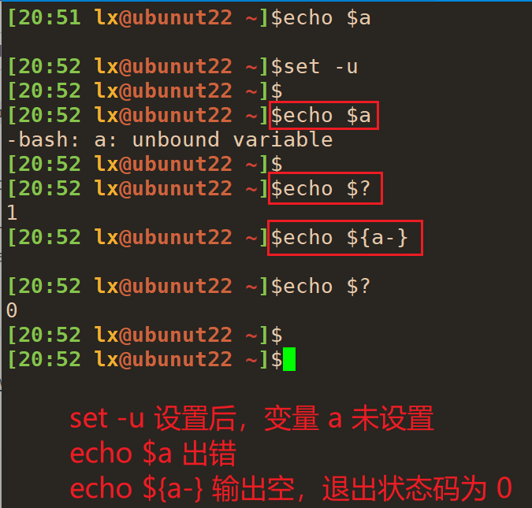


### ${parameter:=word} 为变量赋默认值
- 变量 `parameter` 不存在，则将默认值 `word` 复制给该变量


### ${parameter:?word} 变量为空则输出错误提示到标准错误


### ${parameter:+word} 变量存在则用默认值替换
- 和 `${parameter:-word}` 的效果相反


### ${parameter:offset:length} 截取部分内容


- substring expansion
- `offset` 定义偏移量，如果为 0，则从第一个字符开始截取
- `length` 定义截取的长度，不指定则截取到最后
- `offset` 是负数则从最后开始数偏移量，最后一个字符是 `-1`，不指定长度，则默认到最后
- `offset` 是负数时，负数要与分隔符 `:` 至少间隔一个空格


## $(command) 子命令扩展
> [Difference between $() and () in Bash](https://stackoverflow.com/questions/39110485/difference-between-and-in-bash)
> [3.5.4 Command Substitution](https://www.gnu.org/savannah-checkouts/gnu/bash/manual/bash.html#Command-Substitution)
> [子命令扩展](https://wangdoc.com/bash/expansion#子命令扩展)


- 注意区分 `$()` 和 `()`，前者将命令展开成字符串，后者将多个命令组合成一个 group 执行
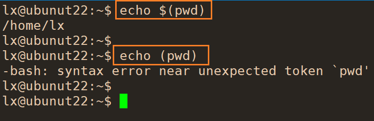

- subshell 中执行命令，和 () 相似
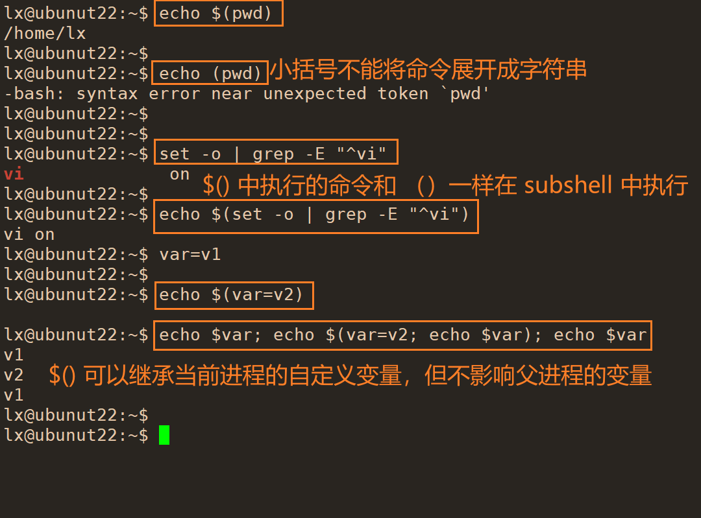

- Replace the command substitution with the standard output of the command, with any trailing newlines deleted.

- 或者 **`command`**写法，这种写法是旧写法

- `man bash` 查看帮助


## $(( expression )) 算数扩展
> [3.5.5 Arithmetic Expansion](https://www.gnu.org/savannah-checkouts/gnu/bash/manual/bash.html#Arithmetic-Expansion)
> [6.5 Shell Arithmetic](https://www.gnu.org/savannah-checkouts/gnu/bash/manual/bash.html#Shell-Arithmetic)
> [Bash 的算术运算](https://wangdoc.com/bash/arithmetic)


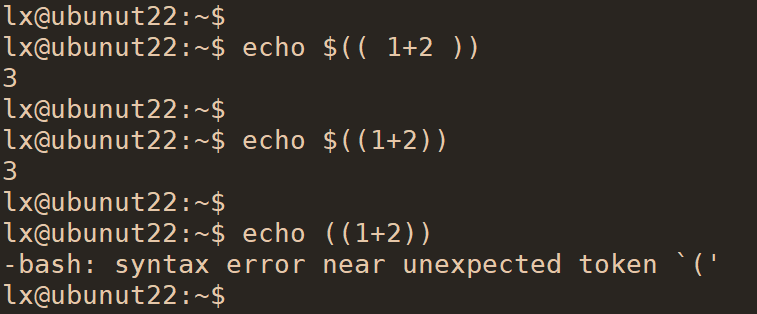

- `man bash` 查看帮助


- 只支持整数的算数运算


## <(list) 或 >(list) Process Substitution
> [3.5.6 Process Substitution](https://www.gnu.org/savannah-checkouts/gnu/bash/manual/bash.html#Process-Substitution)
> [Process substitution](https://en.wikipedia.org/wiki/Process_substitution)
> [Chapter 23. Process Substitution](https://tldp.org/LDP/abs/html/process-sub.html)

- `man bash` 查看帮助


## Word Splitting

> [3.5.7 Word Splitting](https://www.gnu.org/savannah-checkouts/gnu/bash/manual/bash.html#Word-Splitting)
> [What is word splitting? Why is it important in shell programming?](https://unix.stackexchange.com/questions/26661/what-is-word-splitting-why-is-it-important-in-shell-programming)


## Filename Expansion
> [3.5.8 Filename Expansion](https://www.gnu.org/savannah-checkouts/gnu/bash/manual/bash.html#Filename-Expansion)
> [3.5.8.1 Pattern Matching](https://www.gnu.org/savannah-checkouts/gnu/bash/manual/bash.html#Pattern-Matching)
> [Think You Understand Wildcards? Think Again.](https://medium.com/@leedowthwaite/why-most-people-only-think-they-understand-wildcards-63bb9c2024ab)


### * 扩展
> [3.5.8.1 Pattern Matching](https://www.gnu.org/savannah-checkouts/gnu/bash/manual/bash.html#Pattern-Matching)


- multi-character wildcard
- 匹配 0 个或多个字符
- `*` 默认不匹配隐藏隐藏文件


- `*` 可以匹配空字符


#### shopt -s dotglob 让 * 匹配隐藏文件
> [4.3.2 The Shopt Builtin](https://www.gnu.org/savannah-checkouts/gnu/bash/manual/bash.html#The-Shopt-Builtin)


### ？扩展
- `?` 匹配单个字符，必须有字符，不匹配空字符
- `?` 也可以匹配汉字


### [...] 扩展
- `[aA]b` 匹配 `ab` 或 `Ab`


- `[start-end]` 方式不同 bash 版本，扩展方式可能不同，可查看 [3.5.8.1 Pattern Matching](https://www.gnu.org/savannah-checkouts/gnu/bash/manual/bash.html#Pattern-Matching) 的说明


### 扩展模式匹配操作符 Extended globbing
- `extglob` 即 `Extended globbing`，扩展的通配符
- 需要 `extglob` 处于可用状态则可以使用


#### ?(pattern-list)  匹配 0 到 1 个匹配的模式


#### *(pattern-list)  匹配 0 到 多 个匹配的模式


#### +(pattern-list)  匹配 1 到 多 个匹配的模式


#### @(pattern-list)  匹配给定模式中的一种


#### !(pattern-list)  匹配给定模式以外的字符


## Quote Removal
> [3.5.9 Quote Removal](https://www.gnu.org/savannah-checkouts/gnu/bash/manual/bash.html#Quote-Removal)


# 特殊参数


# 变量
## 变量名
- 区分大小写
- 字母、数字和下划线，不以数字开头
- 不与保留变量名相同


## declare 指定变量类型

- `help declare`

### -i

### -a

### -A
### -x


## 变量赋值
### 双引号

- `$` 有特殊含义
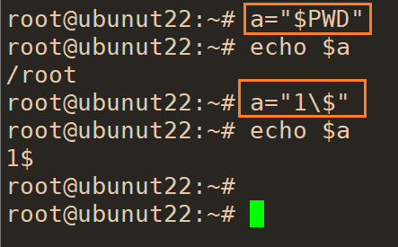

### 单引号


### read 从标准输入赋值给变量


## export 设置为环境变量

## set 显示全部变量


## unset 取消变量

# Bash Conditional Expressions
> [Bash Conditional Expressions](https://www.gnu.org/savannah-checkouts/gnu/bash/manual/bash.html#Bash-Conditional-Expressions)

- When used with `[[`, the `<` and `>` operators sort lexicographically using the current locale. The `test` command uses ASCII ordering.


## 文件判断

- Unless otherwise specified, primaries that operate on files follow **symbolic links** and operate on the **target of the link**, rather than the link itself.


### 选项

 

### -a|-e 判断文件是否存在
- `-a` 和 `-e` 都是判断文件是否存在
- 有的版本用 `-a` 可能有问题，最好用 `-e`
- 这种判断文件不区分文件类型


### -f|-d|-b|-c|-p|-h|-L|S 根据文件类型判断
- `-f` 判断普通文件（regular file），符号链接和硬链接文件也会判断
- `-d` 判断目录
- `-b` 判断块文件（block special file）
- `-c` 判断字符文件（character special file）
- `-p` 判断管道文件（named pipe）
- `-h` 和 `-L` 都是判断符号链接
- `-S` 判断套接字文件（socket）


### -r|-w|-x 根据文件权限判断
- 注意 root 判断时特殊性，文件没有 r 和 w，root 也有这两项权限
- 只要文件中 u, g 或 o 有一个有 x，权限，则 root 有 x，否则 root 也没 x 权限
- 符号链接文件判断的是源文件


### -u|-g|-k 根据文件特殊权限判断
- `-u` 为设置 `SUID` 权限
- `-g` 为设置 `SGID` 权限
- `-k` 为设置 `SBIT` 权限
- 如果是符号链接文件，直接判断的是源文件而非符号链接文件


### -N 判断文件是否修改过


### -O|-G 文件存在且有有效的 UID|GID
- `-O` 文件存在且有有效的 UID
- `-G` 文件存在且有有效的 GID

### file1 -ef file2 两个文件相同
- equal file
- 两个文件同属某个文件的**硬链接**或者一个为另一个的**硬链接**
- 两个文件的 inode 号相同，且属于一个分区的一个文件系统

### file1 -nt file2 比较两个文件的时间
- newer than
- 比较的是 mtime
- file1 必须存在
- file2 不存在，file1 存在，返回 true


### file1 -ot file2
- older than
- 比较 mtime
- file1 不存在，file2 存在，返回 true


## 变量判断

### -v varname  判断变量是否赋值
- True if the shell variable varname is set (has been assigned a value)
- 变量赋值为空也可以 


### -R varname 变量是 name reference
- True if the shell variable is set and is a name reference

## -o optname shell 选项判断
> [The Set Builtin](https://www.gnu.org/savannah-checkouts/gnu/bash/manual/bash.html#The-Set-Builtin)

- True if the shell option optname is enabled


## 字符串判断

### -z 字符串长度为零
- 字符串长度为 zero 则为 true
- 字符串最好用双引号包围
- 字符串中仅一个空格也不为空


### -n 字符串长度不为零
- 字符串长度为 non-zero 则为真
- 可以直接写字符串判断


### 字符串是否相等
- 两种格式：string1 == string2 或 string1 = string2
- 等号前后需要有空格，否则变成变量赋值
- `=` should be used with the `test` command for POSIX conformance


### 字符串比较
- string1 != string2
- string1 < string2 
- string1 > string2


## 整型数值比较
> [Shell Basic Operators](https://www.tutorialspoint.com/unix/unix-basic-operators.htm)


- Arg1 and Arg2 mau be positive or negative intergers


# Shell Arithmetic
> [Shell Arithmetic](https://www.gnu.org/savannah-checkouts/gnu/bash/manual/bash.html#Shell-Arithmetic)


# Looping
- 语句后加上 `;` 来代替换行
- 用 `;` 分割命令，使得多个命令写在同一行
- 条件中如果写 `:` 相当于 `true`
  
  
## until
```bash
until [ condition ]
do
...
done
```
或
```bash
until [ condition ]; do
...
done
```

- `until` 后面的条件不满足则执行循环，满足则退出循环
- 最后的退出状态为最后一条指令的执行结果

## while

```bash
while [ condition ]
do
...
done
```

- 满足条件则执行循环


### while read
- 从标准输入读写入变量中
- 


//TODO: 补充脚本
### 脚本示例
#### 判断一个网站能否访问
- `curl www.baidu.com` 可以测试写的网站能否访问
- 能访问则返回 0，不能访问返回非0


#### 监控分区利用率
- 设置一个阈值，最大的分区利用率超过阈值则报警并发邮件
- 报警时提示超过阈值的设备文件
- `df` 命令查看分区利用率，`sed` 取出利用率数值，`sort` 排序
- ubuntu 22.04 虚拟机中设备 `/dev/sda` 等格式，ubuntu 20.04 物理机不是该名字


## for

### for ... do ... done
```bash
for arg in [list]
do
...
done
```
```bash
for var in con1 con2 con3 ...
do
...
done
```

### for ((exp1; expr2; exper3))
> [Syntax error: Bad for loop variable](https://stackoverflow.com/questions/30358065/syntax-error-bad-for-loop-variable)


- 用这种格式，执行时可以正常执行，但 `sh -n` 检查时提示 `bad for loop variable`，改用 `bash -n` 无错误


## continue

# Conditional Constructs
## if
```bash
if [ condition ]; then
...
fi
```
```bash
if [ condition ]; then
...
elif [condition ]; then
...
else
...
fi
```

## case

```bash
case "$var" in
    "$con1")
        ...
    ;;
    "$con2|$con3")
        ...
    ;;
    *)
        ...
    ;;
esac
```

## select
> [select](https://www.gnu.org/savannah-checkouts/gnu/bash/manual/bash.html#index-select)


- 方便生成菜单
- select name [in words ...]; do conmmand; done
- words 会被扩展，产生一系列项，每项最前面是一个数字
- 如果省略 `in words` 部分，则默认用 `$@`
- select display the `PS3` prompt and reads a line from the standard input
- 遇到 EOF 则终止并返回 1
- The line read is saved in the variable `REPLY`
- 可以用 `break` 终止


```bash
select name in words
do
...
done
```

# Operators
> [Shell Basic Operators](https://www.tutorialspoint.com/unix/unix-basic-operators.htm#)


## Boolean Operators
- `!` logical negation
- `-o` logical **OR**
- `-a` logical **AND**


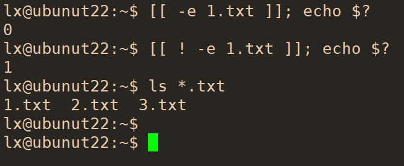


## [ expression ] Test Expression
- 方括号的两边要有空格
- 字符串比较时最好用双引号包围


## [[ expression ]] Test Expression
> [conditional expression](https://www.gnu.org/savannah-checkouts/gnu/bash/manual/bash.html#index-_005b_005b)
> [Are double square brackets [[ ]] preferable over single square brackets [ ] in Bash?](https://stackoverflow.com/questions/669452/are-double-square-brackets-preferable-over-single-square-brackets-in-b)


- The words between the [[ and ]] do not undergo word splitting and filename expansion.
- Conditional operators such as `-f` must be unquoted to be recognized as primaries.


### == 和 !=
- 右边的字符串被认为是 [Pattern Matching](https://www.gnu.org/savannah-checkouts/gnu/bash/manual/bash.html#Pattern-Matching)


- 使用通配符，不能用引号包围
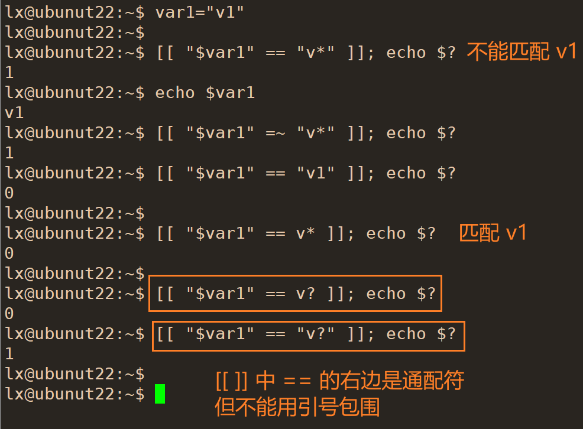
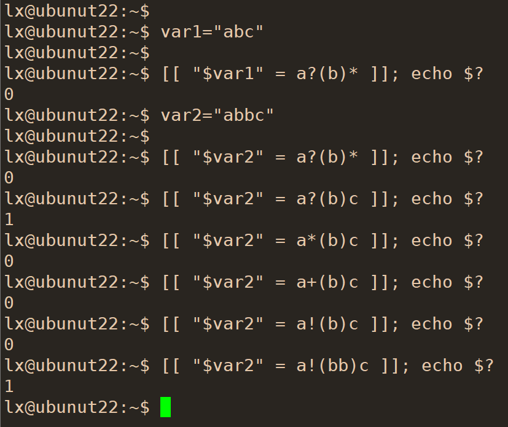

### =~ 
- 右侧的字符串会被认为是 POSIX extended regular expression pattern and matched accordingly.
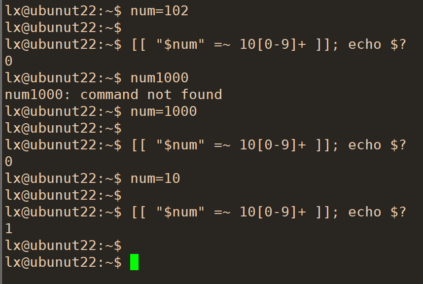

### 判断文件后缀

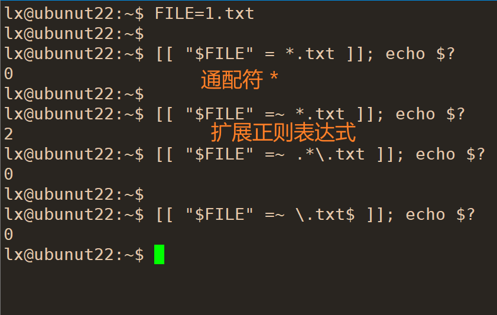

### 判断合法 IPv4 地址


## , comma operator
- 逗号连接多个算术操作，返回最后一个的值

## $'...' 进制转换
- 将八进制或十六进制的数值转换为 ASCII 或 UNICODE 字符


//TODO: 位置变量
# Positional Parameters
> [Positional Parameters](https://www.gnu.org/savannah-checkouts/gnu/bash/manual/bash.html#Positional-Parameters)


## ?
- `$?` 查看上个命令的退出状态值

## $
- `$$` expands to the process ID of the shell
- In a subshell, it expands to the process ID of the **invoking shell, not the subshell** 


# Command Execution Environment
> [Command Execution Environment](https://www.gnu.org/savannah-checkouts/gnu/bash/manual/bash.html#Command-Execution-Environment)


# subprocess
> [8.6. Shell Subprocesses and Subshells](https://docstore.mik.ua/orelly/unix3/korn/ch08_06.htm)


- 直接执行 `bash` 会开启一个子进程，但该子进程不继承父进程的自定义变量，别名和 `set -o` 设置等
- 执行一个 shell 脚本时，不同的调用脚本方式可以在当前进程执行（继承父进程的自定义变量，别名，set -o 等的临时设置）或者在一个 subprocess 中执行（不继承父进程的自定义变量等）


# subshell
> [Command Execution Environment](https://www.gnu.org/savannah-checkouts/gnu/bash/manual/bash.html#Command-Execution-Environment)
> [8.6. Shell Subprocesses and Subshells](https://docstore.mik.ua/orelly/unix3/korn/ch08_06.htm)


- A subshell is a copy of the shell process.
- 区分 subshell 和 subprocess


# 多个命令组合为一个整体 Grouping Commands
> [Grouping Commands](https://www.gnu.org/savannah-checkouts/gnu/bash/manual/bash.html#Command-Grouping)


- Bash 提供两种方法将多个命令组合成一个 group，因此执行时作为一个 unit。
- When commands are grouped, redirections may be applied to the entire command list.


## (list)
> [Command Execution Environment](https://www.gnu.org/savannah-checkouts/gnu/bash/manual/bash.html#Command-Execution-Environment)
> [Do parentheses really put the command in a subshell?](https://unix.stackexchange.com/questions/138463/do-parentheses-really-put-the-command-in-a-subshell)


- 圆括号中的命令会在 subshell 中执行

- 圆括号中的变量赋值不会影响父进程

- Commands grouped with parentheses are invoked in a subshell environment that is a duplicate of the shell environment, except that traps caught by the shell are reset to the values that the shell inherited from its parent at invocation.

- shell 调用 fork 函数来创建的子进程，因此子进程继承父进程的自定义的变量，别名，用 `set -o` 临时设置的参数等环境

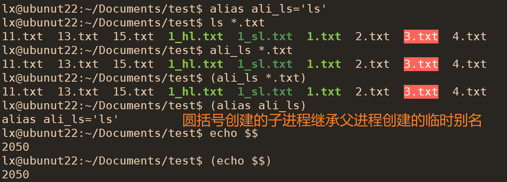
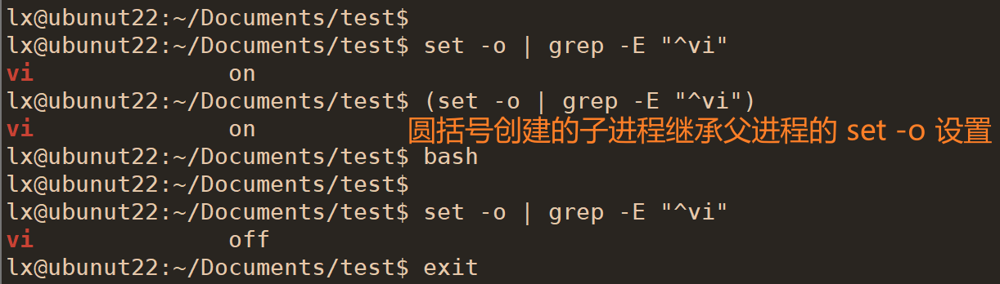

- 圆括号创建了子进程后，子进程和父进程用独立的虚拟内存空间，因此子进程中的临时设置和自定义变量等不会影响父进程


用途：
- 多个命令组合一起执行
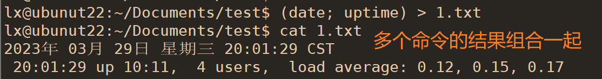

- 临时做一些设置不影响父进程
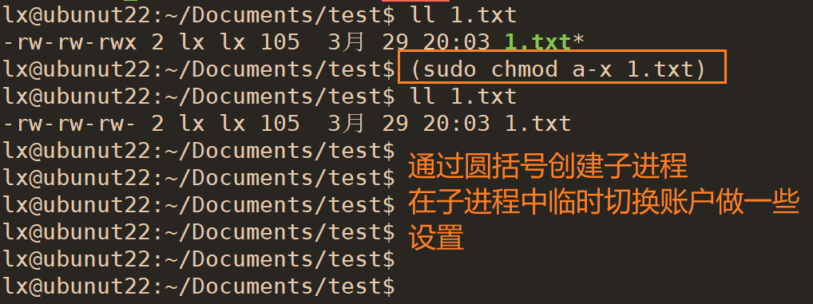
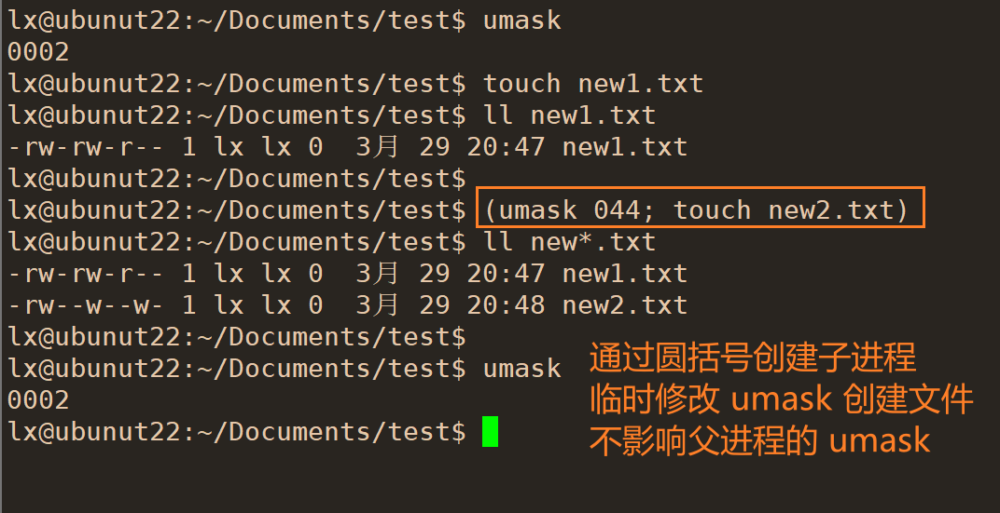
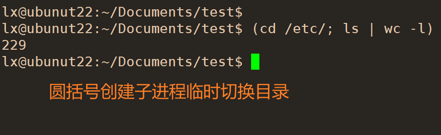

## {}
> [{ list; }](https://www.gnu.org/savannah-checkouts/gnu/bash/manual/bash.html#index-_007b)

- 当前进程中执行命令
- 可以将多个命令组合成一个整体，但不开启新的进程
- 注意花括号两边要有空格，list 后面要有分号

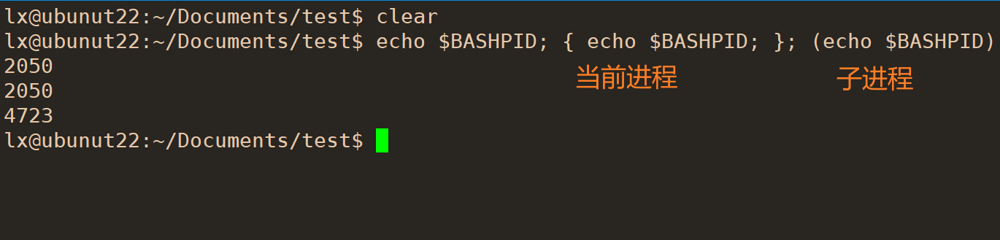


# | pipeline
> [pipeline](https://www.gnu.org/savannah-checkouts/gnu/bash/manual/bash.html#Pipelines)


- 管道的左边必须要有标准输出，管道的右边要能支持标准输入（仅输入命令后回车，终端会等待输入）
- 管道的两边都会开启子进程
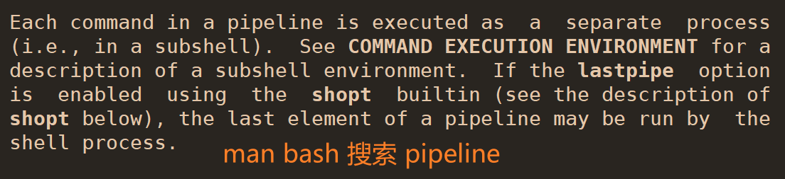
- 管道的退出状态（exit status）是管道中最后一个命令执行的退出状态
- If the lastpipe option is enabled using the **shopt** builtin (see (The Shopt Builtin)[https://www.gnu.org/savannah-checkouts/gnu/bash/manual/bash.html#The-Shopt-Builtin]), the last element of a pipeline may be run by the shell process when job control is not active.


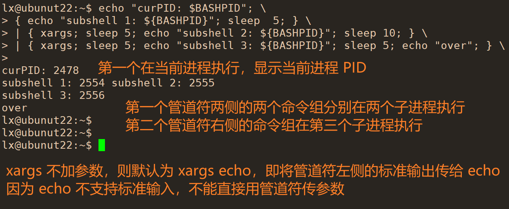


# Command Substitution

# Process Substitution 
> [Chapter 23. Process Substitution](https://tldp.org/LDP/abs/html/process-sub.html)

- `<(list)` 或 `>(list)`


# word splitting
> [Word Splitting](https://www.gnu.org/savannah-checkouts/gnu/bash/manual/bash.html#Word-Splitting)


# shell 内置命令
> [Shell Builtin Commands](https://www.gnu.org/savannah-checkouts/gnu/bash/manual/bash.html#Shell-Builtin-Commands)


## Bourne Shell Builtins
> [Bourne Shell Builtins](https://www.gnu.org/savannah-checkouts/gnu/bash/manual/bash.html#Shell-Builtin-Commands)


### : null command
> [a colon](https://www.gnu.org/savannah-checkouts/gnu/bash/manual/bash.html#Shell-Builtin-Commands)


- `: [arguments]`
- `NOP`
- It may be considered as a synonym for the shell builtin `true`
- exit status is `true` (0)
- 如果在 `while` 循环的条件中写 `:` ，则相当于条件为 `true`
- <font color=red>provide a placeholder where a binary operation is expected</font>，命令开头写 `:` 当占位符，这样 shell 不会将它后面的字符当作命令
- `: >` 将文件清空，仅适用普通文件


```bash
# 相当于 while true
while :
do
...
done
```

```bash
if condition
then :  # do nothing 
else
...
fi
```

### . A Period
> [a period](https://www.gnu.org/savannah-checkouts/gnu/bash/manual/bash.html#index-_002e)


- `. filename [arguments]`

- 和命令 `source` 效果相同

- Read and execute commands from the filename arguments in the **current shell context**.
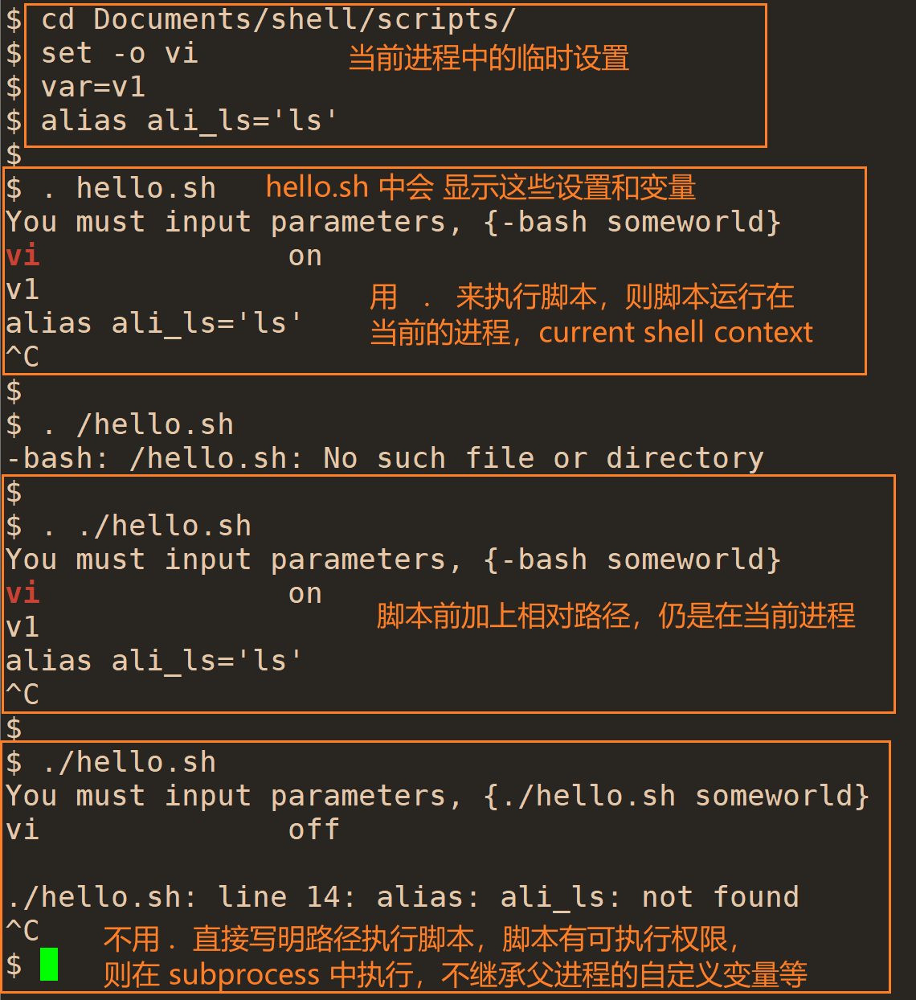

- 用 `.` 执行脚本，脚本可以没有 `x` 权限
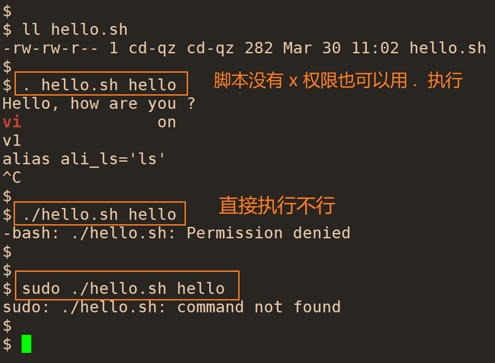

- 如果执行时带参数，则脚本中用位置变量来获取参数的值

- return status 时最后一条执行的命令的 exit status

- 如果没命令执行，则 exit status 为 0

- 如果文件名不存在或者文件不可读，则 return status 是非零


### break
> [break](https://www.gnu.org/savannah-checkouts/gnu/bash/manual/bash.html#index-break)


- break [n] 

- Exit from a `for, while, until, or select` loop

- 后面可以指定一个数字，最小为 1，表名当层的循环

- 不指定则退出最当层循环，即 n 为 1
  
- 如果 n 为 2，则退出当层，和该层外面一层的循环


### continue
> [continue](https://www.gnu.org/savannah-checkouts/gnu/bash/manual/bash.html#index-continue)


- `continue [n]`
- Resume the next iteration of an enclosing `for, while, or select` loop.
- 同 `break` 相同，当层循环的 n 为 1，默认的 n 为 1 


### exit


### eval
> [eval](https://www.gnu.org/savannah-checkouts/gnu/bash/manual/bash.html#index-eval)


### exec


### export


### cd
> [cd](https://www.gnu.org/savannah-checkouts/gnu/bash/manual/bash.html#index-cd)


- Change the current working directory.

- If the directory is not supplied, the value of the `HOME` shell variable is used.

- If the shell variable `[CDPATH](https://www.theunixschool.com/2012/04/what-is-cdpath.html)` exists, it is used as a search path: each directory name in `CDPATH` is searched for directory, with alternative directory names in `CDPATH` separated by a colon (`:`). **If directory begins with a slash, `CDPATH` is not used.** 


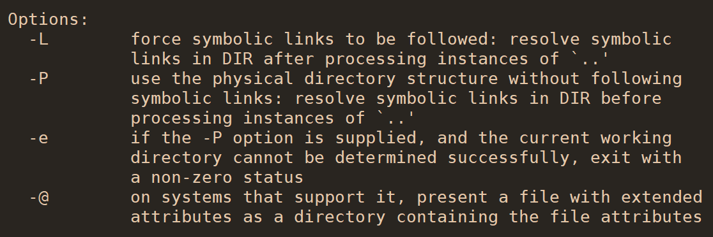

#### -P 进入源目录而非符号链接目录

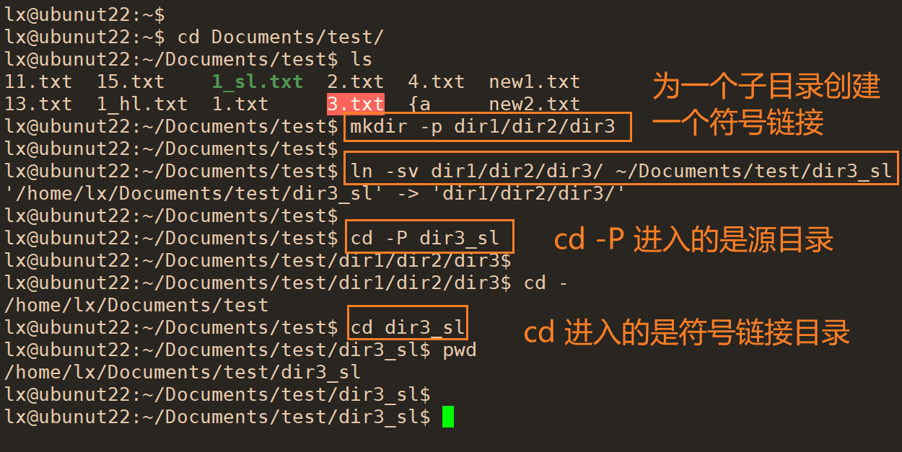

#### -e 退出状态


#### - 切换到上次的工作目录
- 切换到 `OLDPWD` 环境变量的值所代表的目录


## Bash Builtin Commands
## let

## read
> [read](https://www.gnu.org/savannah-checkouts/gnu/bash/manual/bash.html#index-read)


## shift
> [shift](https://www.gnu.org/savannah-checkouts/gnu/bash/manual/bash.html#index-shift)

- shift [n]，默认 `n` 为1，即移除最左边的第 `n` 个参数，如果为 1，则原来的第二个参数变为第一个
- 如果参数数目很多或者不固定，在脚本中可以用 shift，取走一个参数后，用 shift 移走第一个参数，这样原来的第二个参数变成第一个，脚本中只用 `$1` 取参数


# 环境变量

## CDPATH
> [What is CDPATH](https://www.theunixschool.com/2012/04/what-is-cdpath.html)
> [Hack 1. Use CDPATH to define the base directory for cd command](https://linux.101hacks.com/cd-command/cdpath/)


## PWD

## OLDPWD


# Shell Functions
> [Shell Functions](https://www.gnu.org/savannah-checkouts/gnu/bash/manual/bash.html#Shell-Functions)