# 学习资源  
> [学习 Shell 脚本编程的免费资源 | Linux 中国](https://zhuanlan.zhihu.com/p/155613380)  
> [电子书和shell脚本示例](https://pan.baidu.com/s/1g006A023DukmKht1k1ZrMg?pwd=jvlj)  
      
## 官方文档  
> man 手册官方文档：[bash(1) — Linux manual page](https://man7.org/linux/man-pages/man1/bash.1.html#OPTIONS)  
> gnu 官方文档：[Bash Reference Manual](https://www.gnu.org/software/bash/manual/bash.html)  
      
## 学习网站  
> [Bash 脚本教程](https://wangdoc.com/bash/intro)  
> [learnshell](https://www.learnshell.org/)  
> [linuxcommand](http://linuxcommand.org/lc3_learning_the_shell.php)  
> [Advanced Bash-Scripting Guide](https://tldp.org/LDP/abs/html/index.html)  
> [学习 shell 有什么好书推荐？](https://www.zhihu.com/question/19745611/answer/129024703)  
> [The Unix School](https://www.theunixschool.com/p/shell-scripts.html)  
> [BashGuide](http://mywiki.wooledge.org/BashGuide)  
> [Shell & Utilities: Detailed Toc](https://pubs.opengroup.org/onlinepubs/9699919799/utilities/contents.html)  
> [sh - shell, the standard command language interpreter](https://pubs.opengroup.org/onlinepubs/9699919799/)  
> [Linux Bash Shell Scripting Tutorial Wiki](https://bash.cyberciti.biz/guide/Main_Page)  
> [Advanced Bash-Scripting Guide](https://tldp.org/LDP/abs/html/)  
      
## 书籍  
> [Learing the Korn Shell](https://docstore.mik.ua/orelly/unix3/korn/)  
      
## 博客  
      
## 脚本示例  
> [The UNIX School: Shell Scripts](https://www.theunixschool.com/p/shell-scripts.html)  
      
## 练习  
> [牛客刷题练习](https://www.nowcoder.com/exam/oj?page=1&tab=SHELL%E7%AF%87&topicId=195)  
      
# 学习过程  
1. 零基础学习  
学习 shell 前应先学 Linux 基本知识。  
在 [learnshell](https://www.learnshell.org/) 上学习，该网站讲的详细，可以在线练习，但内容少。  
将 [Bash 脚本教程](https://wangdoc.com/bash/intro) 教程看完一遍。  
      
> [Shell Scripting Tutorial](https://www.tutorialspoint.com/unix/shell_scripting.htm)  
> 要查询一些用法在官网：[bash manual](https://www.gnu.org/savannah-checkouts/gnu/bash/manual/bash.html#Introduction)  
      
      
# BASH 命令格式  
> [bash(1) — Linux manual page](https://man7.org/linux/man-pages/man1/bash.1.html#OPTIONS)  
      
- 环境：ubuntu 22.04  
- `man bash` 查看  
- `bash [options] [command_string | file]`  
      
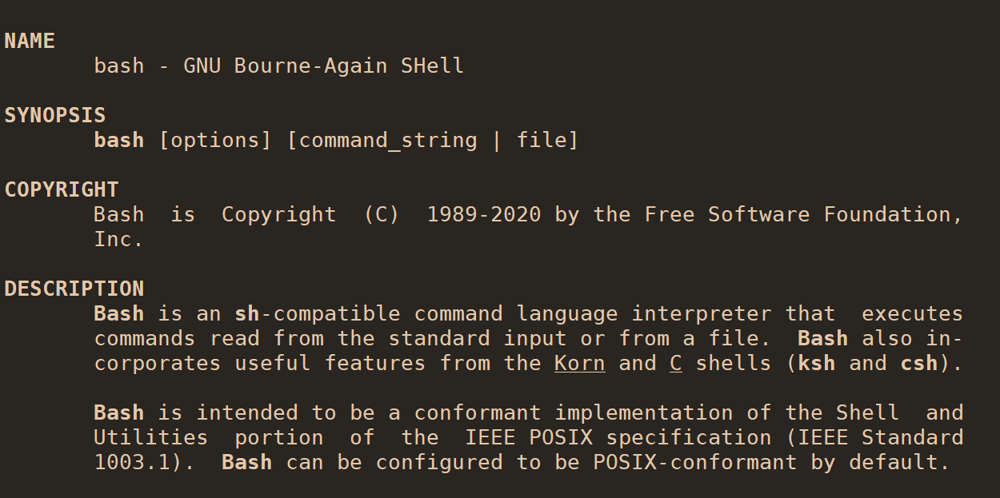  
      
## OPTIONS  
> [Bash Script Class: Shell Options](https://www.youtube.com/watch?v=26t2LMtrDOc&t=349s&ab_channel=NIH_HPC)  
> [Chapter 33.Options](https://tldp.org/LDP/abs/html/options.html)  
> [6.1 Invoking Bash](https://www.gnu.org/software/bash/manual/html_node/Invoking-Bash.html)  
      
      
  
      
> All of the single-character shell options documented in the description of the `set` builtin command, including `-o`, can be used as options when shell is invlked.  
      
      
### shell 内置的一些选项  
- `echo $-` 可以查看这些选项中哪些设置了  
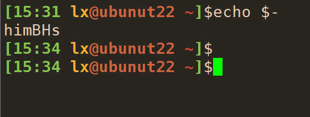  
      
#### -c  
bash -c 是一个用于在命令行中执行指定命令的选项。它允许你在命令行中直接执行包含多个命令或复杂命令的字符串。这个选项在编写脚本或需要在命令行中执行复杂命令时非常有用。  
    
```bash  
[root@docker dockerfile]$ bash 'echo "hello world"'  
bash: echo "hello world": No such file or directory  
[root@docker dockerfile]$ bash -c 'echo "hello world"'  
hello world  
```  
    
```bash  
[root@docker dockerfile]$ bash -c 'echo "Starting the process"; pwd; echo "Finished the process"'  
Starting the process  
/docker-02/dockerfile  
Finished the process  
```  
In this example, the Bash shell code passed as an argument to `bash -c` runs three commands (`echo`, `pwd`, and `echo`) and prints out status messages before and after the command execution.  
    
#### -i interactive shell  
- 如果设置，则 shell is `interactive`  
- `echo $-` 可查看该选项是否设置  
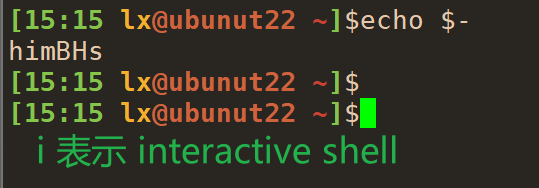  
      
      
#### -l login shell  
> make `bash` act as if it had been invoked as a login shell.  
      
- 可以让当前的 shell 变成 login shell，这样加载的 bash startup files 不同，相当于执行 `exec bash --login`  
      
      
#### r restricted shell  
> make the shell a restricted shell  
      
#### -s stdin  
      
> if the `-s` option is present, or if no arguments remain after option processing, then the commands are read from the standard input.  
> this option allows the positional parameters to be set when invoking an interactive shell or when reading input through a pipe.  
      
- `echo $-` 可以查看该选项是否设置  
  
      
      
#### -v verbose  
> print each command to `stdout` before executing it  
      
- `set` 可以设置该选项，因此可以通过 `set` 命令查看是否设置该参数  
- 设置该参数后会将输入的命令作为输出到 `stdout`，但不会扩展命令  
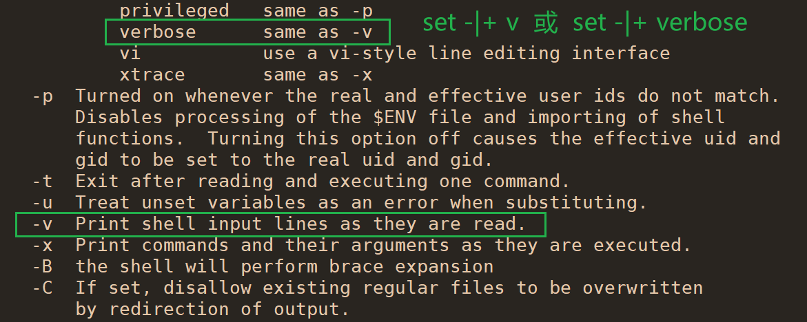  
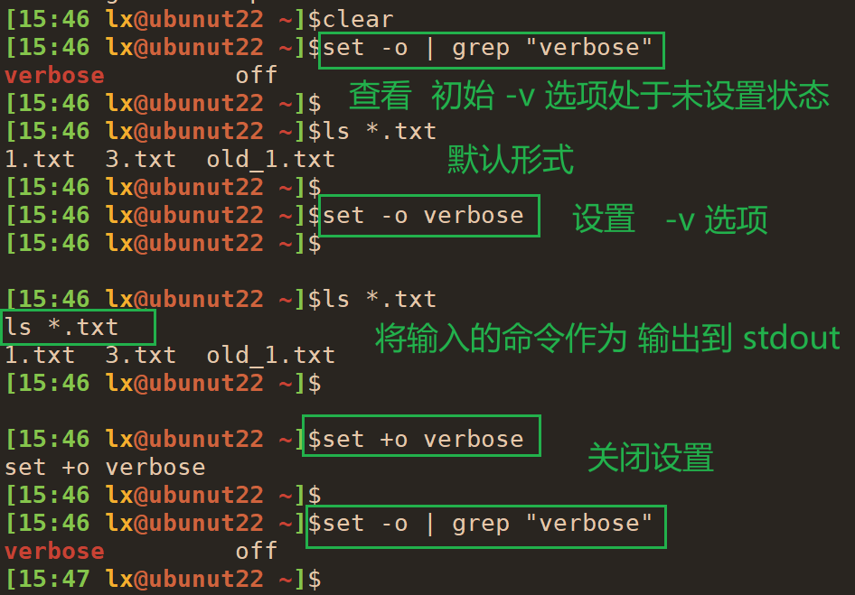  
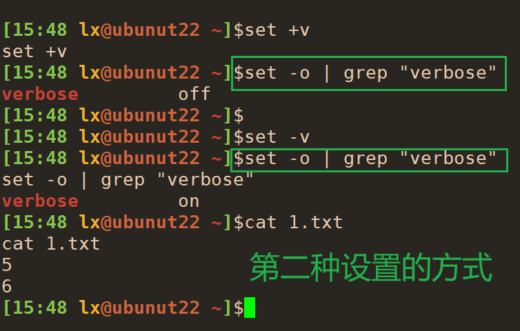  
      
#### -x xtrace  
> similar to `-v`, but expands commands  
      
- 可以通过 `set` 命令设置  
  
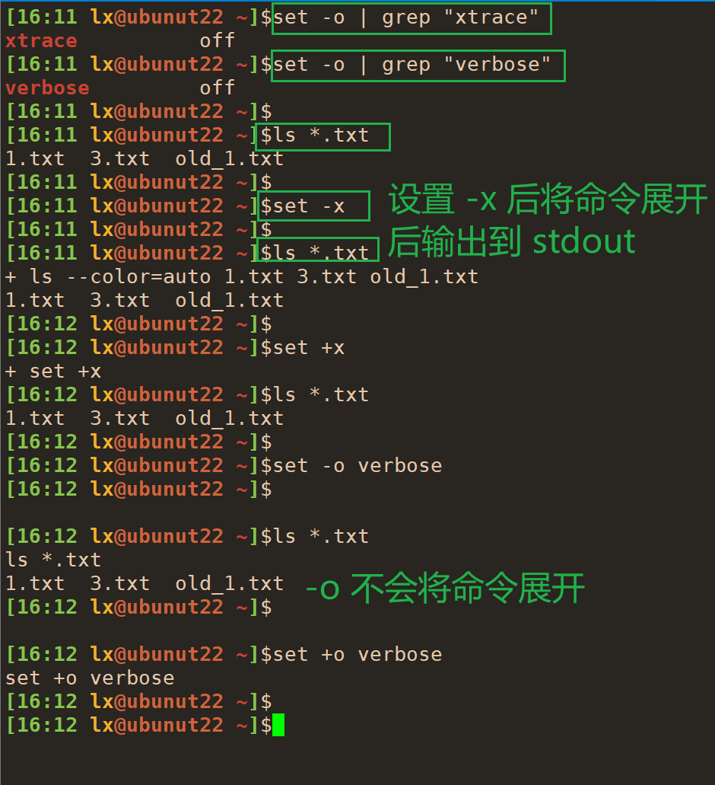  
      
#### -d double-quoted string  
> a list of all double-quoted strings preceded by `$` is printed on the standard output.  
> these strings that are subject to language translation when the current locale is not `c` or `posix`.  
> this implies the `-n` option; no commands will be executed.  
      
- 不能在 `set` 命令中设置  
- 包含 `-n` 选项的作用，扩展 `$`后面双引号的内容，不执行该命令，做语法检查  
      
      
#### --  
> a `--` signals the end of options and disables further option processing.  
> any arguments after the `--` are treated as filenames and arguments.  
> an argument of `-` is equivalent to `--`.  
      
加上 `--` 可以放置后面的参数或文件名被当成 option  
      
### set options  
> [4.3.1 the set builtin](https://www.gnu.org/software/bash/manual/bash.html#the-set-builtin)  
      
> set [-abefhkmnptuvxbcehpt] [-o option-name] [--] [-] [argument …]  
> set [+abefhkmnptuvxbcehpt] [+o option-name] [--] [-] [argument …]  
      
- old options  
- `set --help | less` 查看帮助说明  
- `-` 设置选项  
- `+` 取消设置选项  
- 在 `shell` 中用 `set` 命令设置的选项只是临时生效，除非写到配置文件中  
      
#### set -|+ o 查看全部的选项  
- `set -o` 和 `set +o` 都可以查看全部选项的设置状态，只是结果显示格式不同  
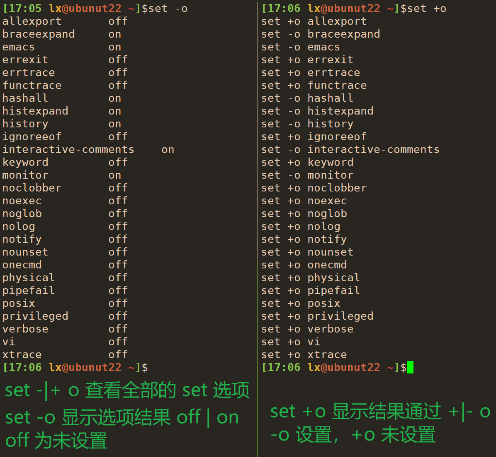  
      
#### 设置或禁用某个选项  
- 有的选项有两种格式，如 `-v` 与 `-o verbose` 格式  
- 写 `set -|+v` 或 `set -|+o verbose` 都一样  
- 可通过 `set -o | grep "verbose"` 查看 `-v` 选项是否设置  
        
#### -a | -o allexport  
> [4.3.1 the set builtin](https://www.gnu.org/software/bash/manual/bash.html#the-set-builtin)  
> [set(1p) — linux manual page](https://man7.org/linux/man-pages/man1/set.1p.html)  
      
> each variable or function that is created or modified is given the export attribute and marked for export to the environment of subsequent commands.  
      
- 创建的变量自动变为环境变量，相当于加上 `export` 属性  
- `man bash` 查看的帮助中没有提到 `functin`，`gnu.org` 文档中提到 `funtion` 也适用，未测试  
      
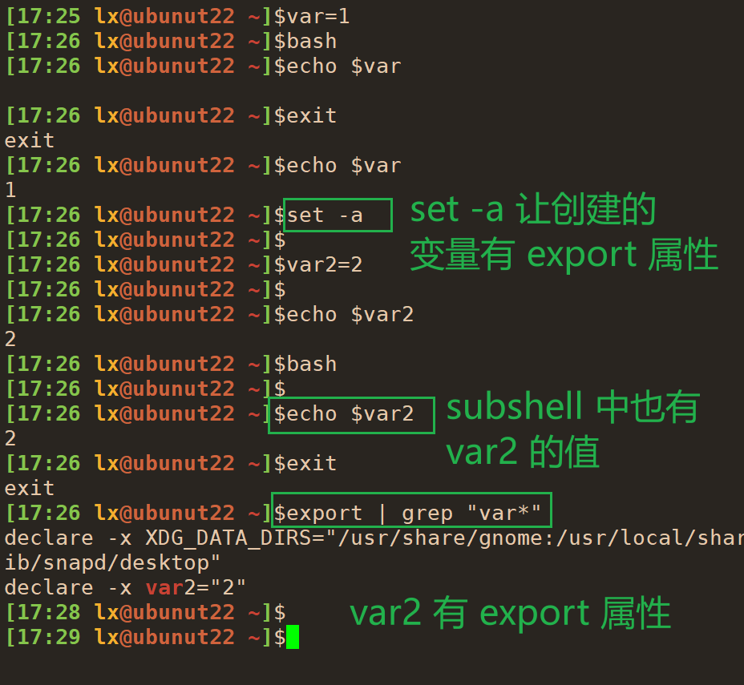  
      
      
#### -b | -o notify  
> cause the status of terminated background jobs to be reported immediately, rather than before printing the next primary prompt.  
      
- ubuntu 22.04 默认未设置  
      
#### -e | -o errexit  
- exit immediately if a command exits with a non-zero status  
      
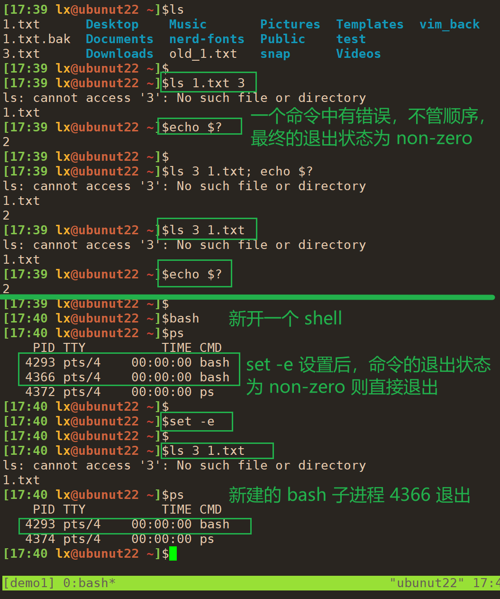  
      
如果命令出错则退出  
      
#### -f | -o noglob  
> disable filename expansion(globbing)  
      
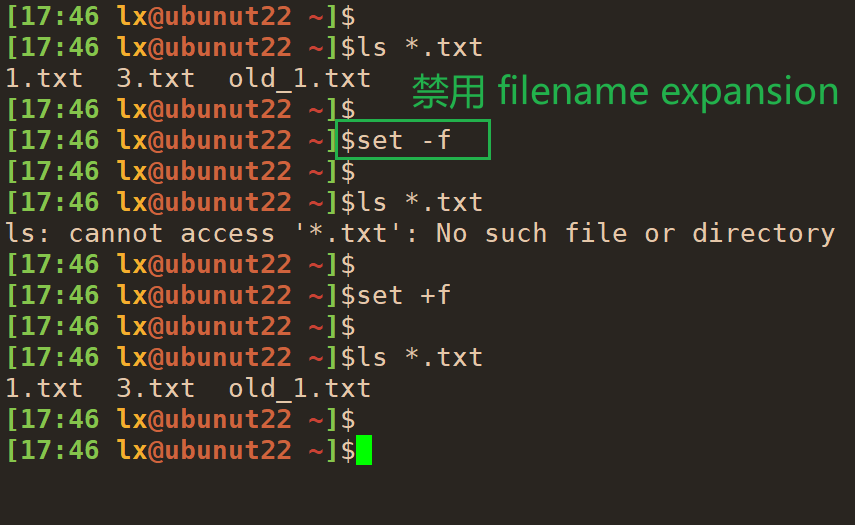  
      
      
#### -h | -o hashall  
> locate and remember (hash) commands as they are looked up for execution.  
      
- `echo $-` 可看到该选项是默认设置  
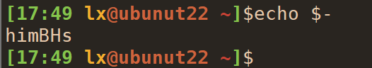  
      
- 或者用 `set -o | grep "hashall` 查看  
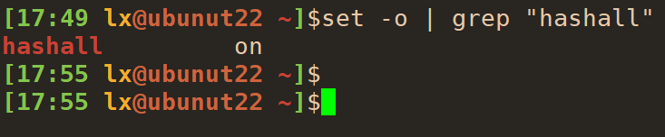  
      
- 开启该功能，则执行过的外部命令会存在 `hash` 缓存中，下次再执行时直接从 `hash` 缓存中找命令的路径  
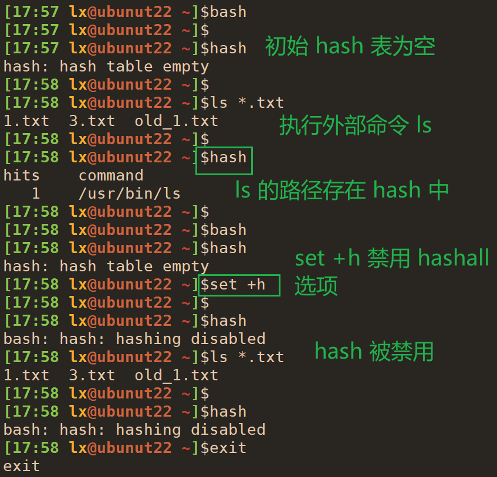  
      
      
#### -c | -o noclobber  
> uppercase c  
> if set, disallow existing regular files to be overwritten by redirection of output  
      
- 默认没有设置该选项，即重定向可以覆盖原有文件内容  
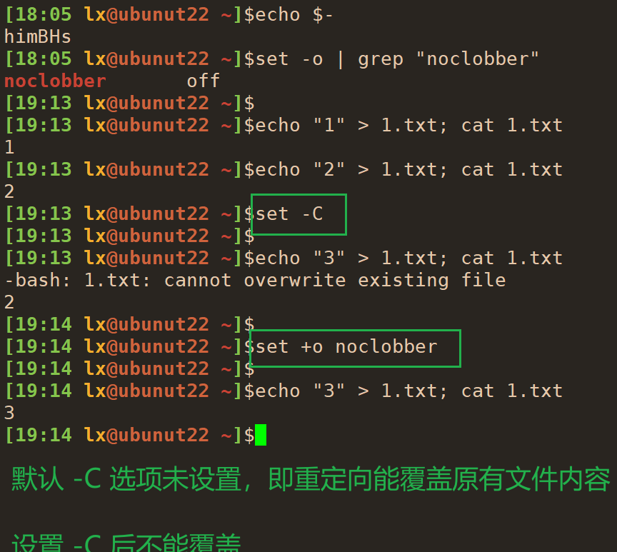  
      
#### -m | -o monitor  
> job control is enabled  
      
- 默认开启该设置  
      
      
#### -n | -o noglob  
> read commands but do not execute them  
> an interactive shell may ignore this option  
      
- 读取命令但不执行，可以用来检查 shell 脚本语法错误  
- interactive shell 设置该选项失败，默认未设置  
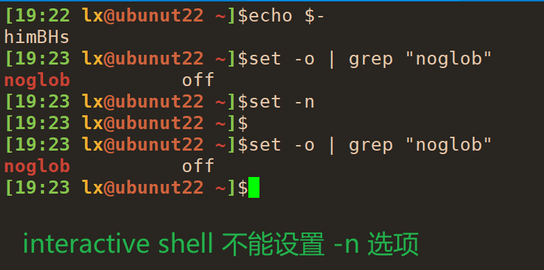  
      
      
#### -t | -o onecmd  
> exit after reading and executing one command  
      
#### -u | -o nounset  
> treat unset variable as an error when substituting  
      
- 默认未开启，如果 `echo $var` 而 `var` 未设置，则输出空，退出状态为 0  
- 设置后为设置的变量认为错误，退出状态 non-zero  
      
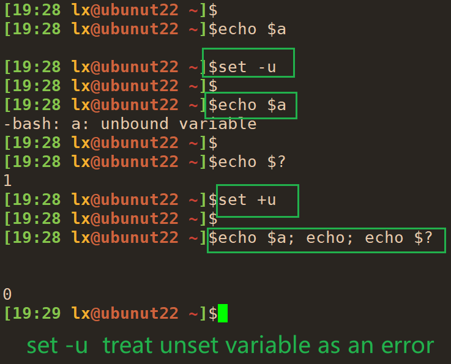  
      
      
#### -v | -o verbose  
> print each command to `stdout` before executing it  
      
- `set` 可以设置该选项，因此可以通过 `set` 命令查看是否设置该参数  
- 设置该参数后会将输入的命令作为输出到 `stdout`，但不会扩展命令  
  
  
  
      
#### -x | -o xtrace  
> similar to `-v`, but expands commands  
      
- 可以通过 `set` 命令设置  
  
  
      
      
#### -b | -o braceexpand  
> the shell will perform brace expansion  
      
- 默认开启该设置，`echo $-` 可看到 `b` 选项  
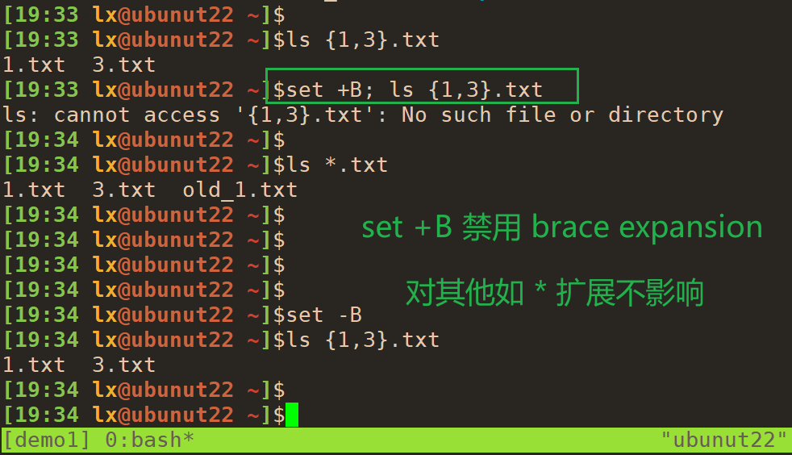  
      
      
#### -h | -o hisexpand  
> enable ! style history substitution.  
      
- 默认设置，即 `echo $-` 看到的 `h`  
- 通过 `history` 命令找到历史命令的编号，可以通过 `!num` 执行历史命令  
      
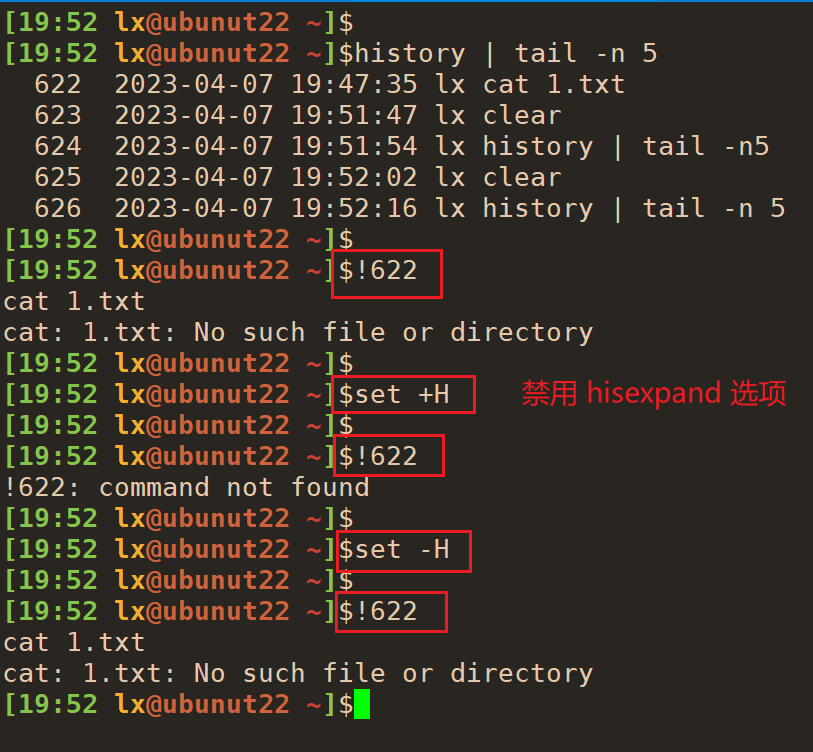  
      
#### -p | -o physical  
> if set, do not resolve symbolic links when executing commands such as `cd` which change the current directory  
      
  
      
      
#### -o emacs  
> [8 command line editing](https://www.gnu.org/software/bash/manual/bash.html#command-line-editing)  
      
> use an emacs-style line editing interface  
> this also affects the editing interface used for `read -e`  
      
- 默认选项  
- emacs 风格的的快捷键，如回到行首等和 vi 快捷键不同  
- 例在写命令时用 `ctrl b` 想左移动一个字符，相当于 vi 在普通模式下的 `h`  
      
#### -o vi  
> use a vi-style line editing interface  
      
- 设置后默认为 insert 模式，按下 `esc` 或者 `ctrl [` 可切换到 normal 模式  
      
#### -p | -o privileged  
      
      
#### -o ignoreeof  
> the shell whill not exit upon reading eof  
      
#### -o -o interactive-comments  
> allow comments to appear in interactive commands  
      
      
#### --  
> assign any remaining arguments to the positional parameters  
> if there are no remaining arguments, the positional parameters are unset  
> the -x and -v options are turned off  
      
      
#### -  
> assign any remaining arguments to the positional parameters  
> the -x and -v options are turned off  
      
      
### shopt options  
> [4.3.2 the shopt builtin](https://www.gnu.org/software/bash/manual/bash.html#the-shopt-builtin)  
      
> shopt [-pqsu] [-o] [optname …]  
      
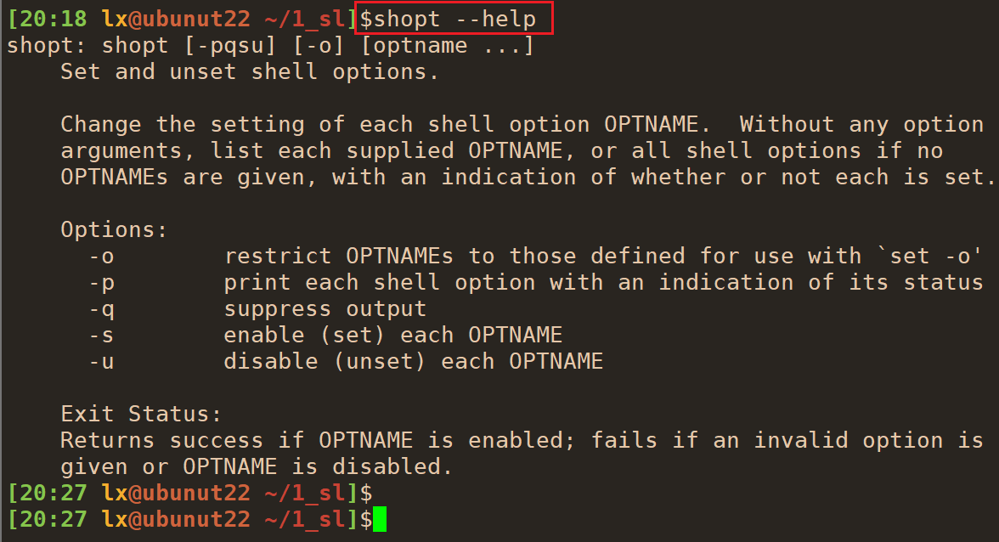  
      
      
- new options  
- 包含 `set` 中的旧选项  
      
#### shopt -o 显示 set 的选项  
- 和 `set -o` 显示效果相同，兼容 `set` 选项  
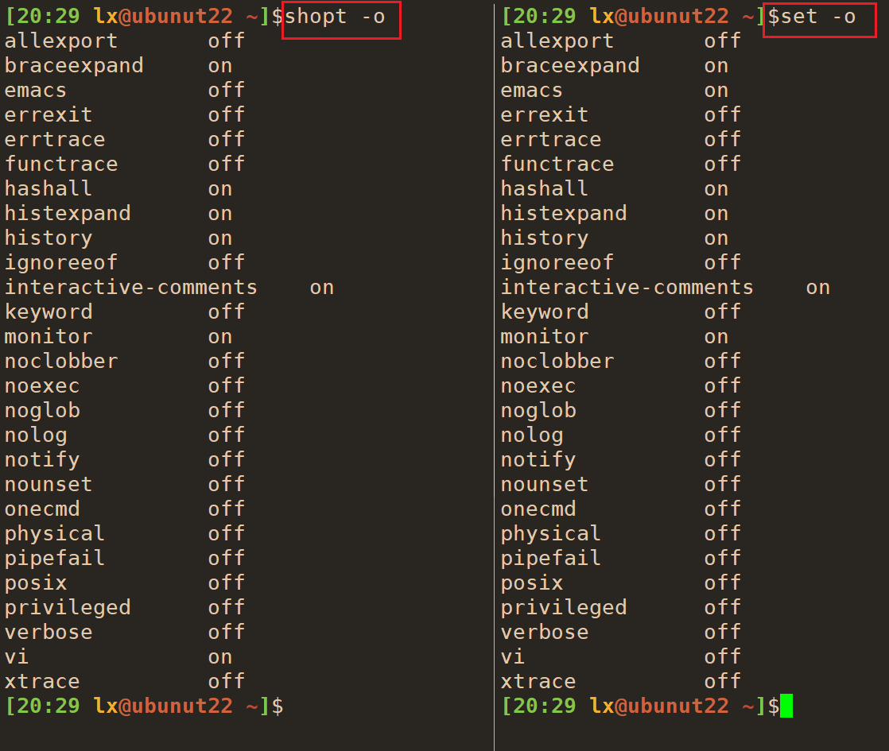  
      
      
#### shopt -p 显示全部选项及其状态  
- `shopt -p | less`，`-u` 表示 `unset`，`-s` 表示 `set`  
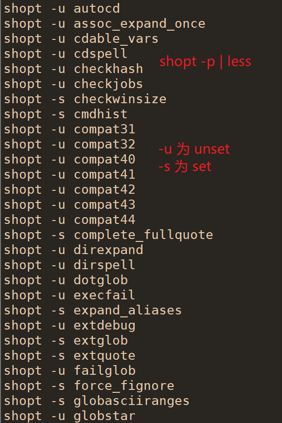  
      
- 也可用 `shopt | less` 查看，结果显示不同，用 `on` 和 `off` 表示其状态  
      
#### shopt -q 查看某个选项是否存在  
- 不输出结果，可通过 return status 查看选项是否开启  
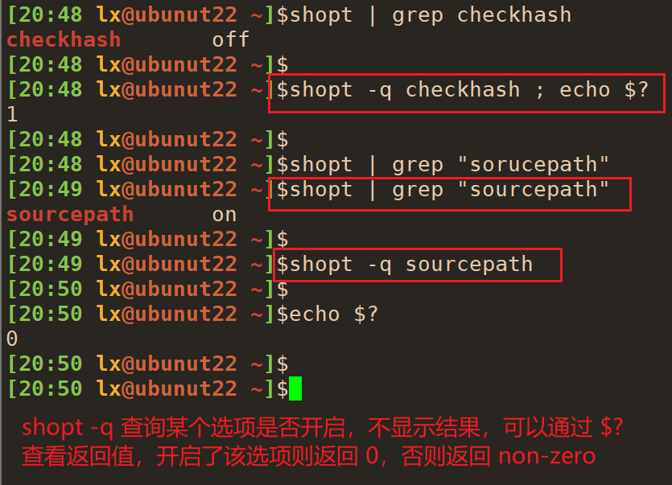  
      
- 如果查询的选项有多个，则只要有一个选项未设置，返回 non-zero  
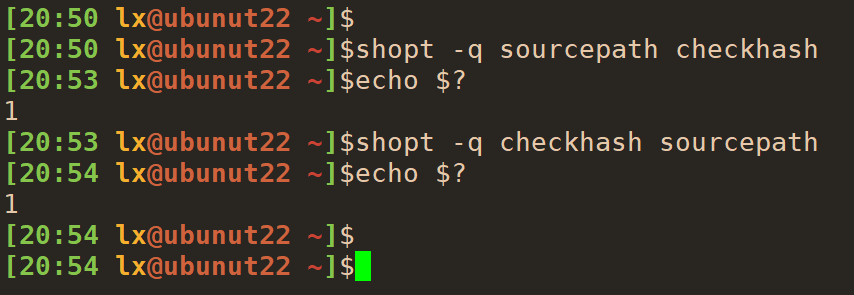  
      
      
#### shopt -s 开启一个或多个选项  
> enable (set) each optname  
      
#### shopt -u 禁用一个或多个选项  
> disable (unset) each optname  
      
# 查看全部支持的有效 login shell  
- `cat /etc/shells` 查看  
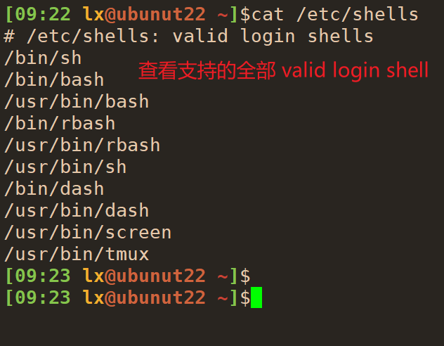  
      
      
# 查看当前用户的默认 shell  
- 当前用户的默认 shell 不一定是当前正在使用的 shell  
- `echo $shell`  
- `getent passwd $user`  
- `grep "^$user" /etc/passwd`  
      
  
      
# 查看当前使用的 shell  
> [how do i find out what shell i am using on linux/unix?](https://www.cyberciti.biz/tips/how-do-i-find-out-what-shell-im-using.html)  
      
      
- `echo $0` 可查看当前使用的 shell 类型，不一定是当前默认的 shell  
- `ps` 命令也可查看，一般在倒数第二个（pid 第二大），最下方的为 `ps` 命令的 pid  
- `ps -p $$` 可查看，`-p` 指定查看的 pid，`$$` 显示当前进程的 pid，即当前 shell 的 pid  
        
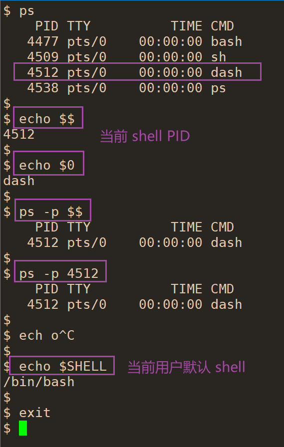  
      
      
# 修改当前默认 shell  
      
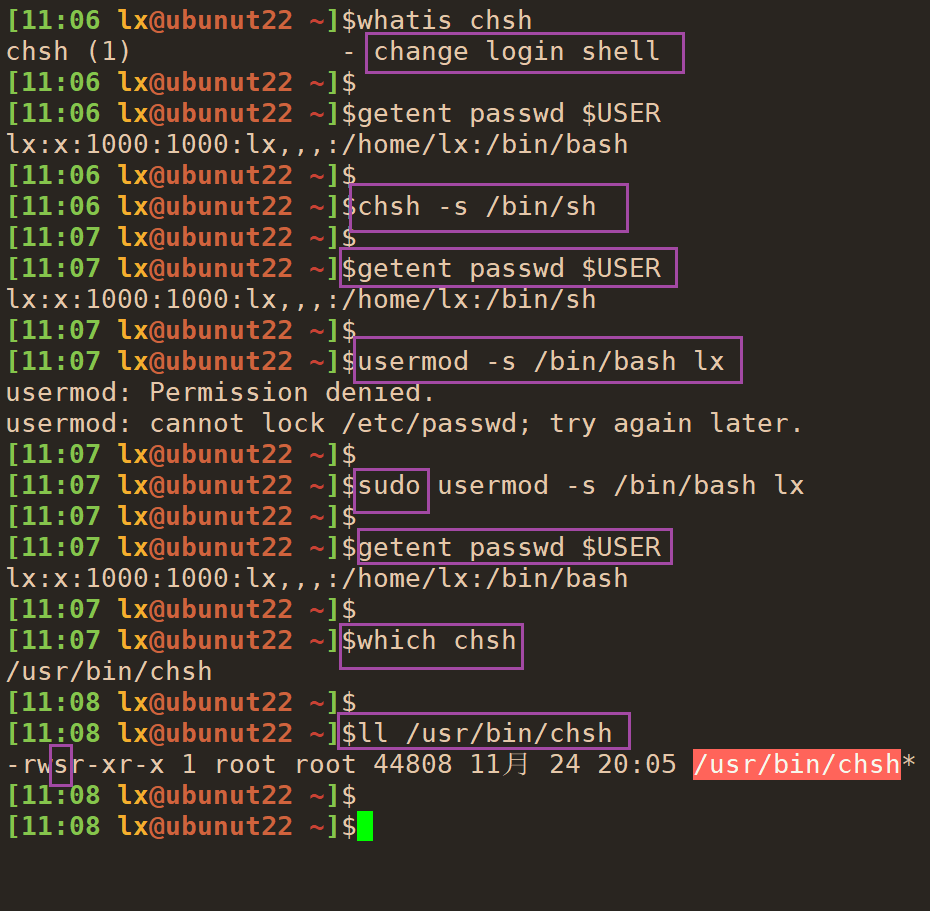  
      
## usermod -s  
- 需要 root 权限  
      
## chsh -s  
- change login shell  
- 不需要 root 权限  
- `chsh` 有 `s` 权限，普通用户执行时以 root 身份执行该命令  
      
# interactive, non-interactive, login, and non-login shells  
> [bash 的环境配置文件](http://cn.linux.vbird.org/linux_basic/0320bash_4.php#settings_bashrc)  
> [what is the difference between login and non-login shell?](https://tecadmin.net/difference-between-login-and-non-login-shell/)  
> [interactive, non-interactive, login, non-login shells in linux](https://www.baeldung.com/linux/interactive-non-interactive-login-non-login-shells)  
> [6.1 invoking bash](https://www.gnu.org/software/bash/manual/html_node/invoking-bash.html)  
> [The role of shells in the Linux environment](https://bash.cyberciti.biz/guide/The_role_of_shells_in_the_Linux_environment)  
      
## 查看当前 shell 是 login shell 还是 non-login shell  
> a login shell is one whose first character of argument zero is `-`, or one inviked whith `--login` optin.  
      
- 用 `echo $0` 查看 shell 类型，有 `-` 前缀为 login shell  
  
      
- 或者用 `shopt login_shell` 查看，状态为 `on` 则为 login shell  
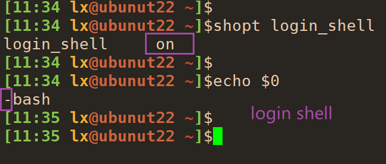  
      
      
## 查看当前 shell 是 interactive shell 还是 non-interactive shell  
> [6.3.2 is this shell interactive](https://www.gnu.org/software/bash/manual/html_node/is-this-shell-interactive_003f.html)  
      
      
- `echo $-` 查看，有 `i` flag 则为 `interactive shell`，`i` 为 shell 内置的 `-i` 选项  
  
      
      
### 脚本中判断  
- startup scrips 默认`ps1` 只在 `interactive shell` 中有，在 `non-interactive shell` 中未设置，如 `/etc/bash.bashrc`  
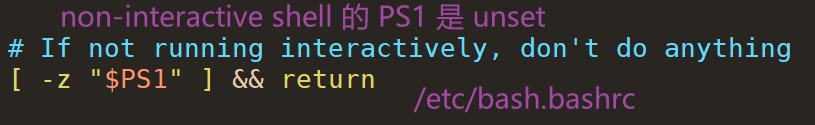  
      
- 通过 `$-` 查看是否有 `i` 判断  
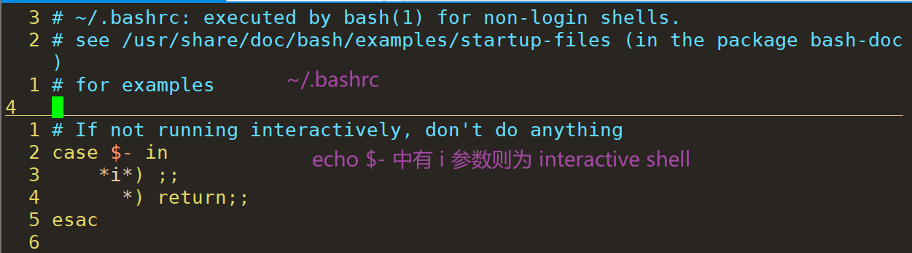  
      
      
## login-shell  
### ubuntu 22.04 带图形界面版本  
      
- 登录系统默认进入的是 `tty2`，是 login shell  
      
- ubunut 22.04 和 20.04 `Ctrl A|t F1` 和 `Ctrl A|t F2` 都能进入图形界面  
      
- 用户最开始登录系统创建的是 login shell（tty2），但如果是图形界面，在登录后启动图形化接口，这时进入 pts 伪终端，无需再次登录，查看可以发现该登录为 non-login shell（ubuntu 22.02）, 但用 w 命令看不到 pts 登录  
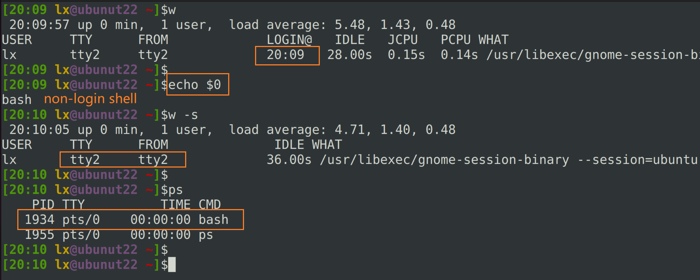  
      
- 图形界面登录后再用 xshell 远程连接，登录 shell 为 login shell，登录设备是 pts 伪终端  
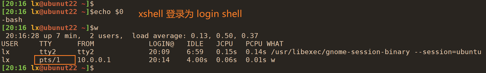  
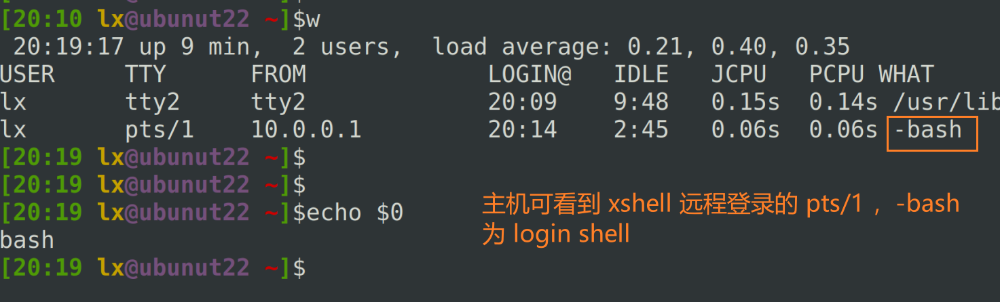  
      
- `ctrl a|t f1` 切换终端，此时变成 `tty3`，但仍是图形界面登录，图形界面登录的仍是 pts  
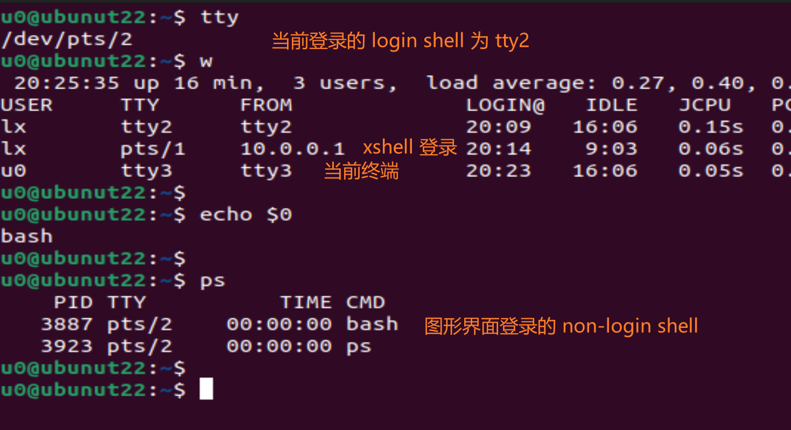  
      
- 在一个图形界面用 `init 3` 进入 cli 命令行界面后，此时用 `tty` 查看其设备，`f1` ~ `f6` 分别对应的变为 `tty1` ~ `tty6`？  
      
- `su -` 即 `su -l` 创建的也是 login shell，但 `tty` 查看仍是一个终端设备  
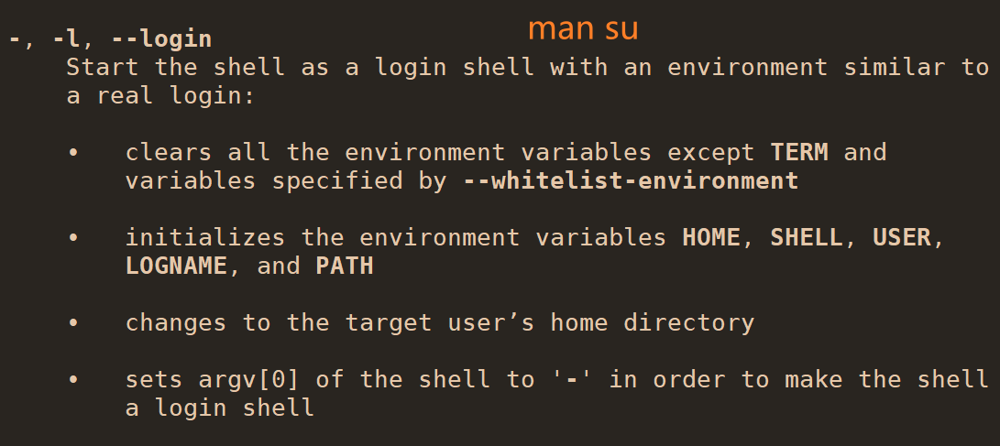  
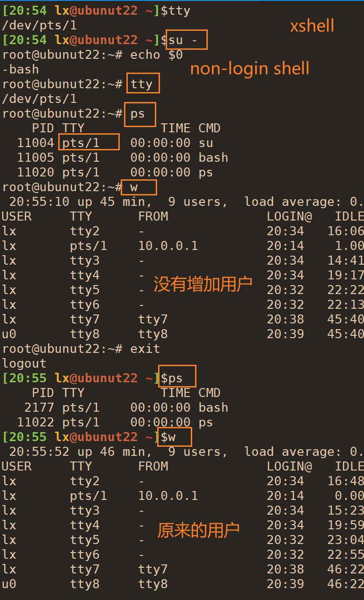  
      
- ssh 登录的用户创建 login shell  
      
      
## non-login shell  
- `w` 命令看不到 non-login shell 登录的用户  
        
      
## interactive shell behavior  
> [6.3.3 interactive shell behavior](https://www.gnu.org/software/bash/manual/html_node/interactive-shell-behavior.html)  
      
- The shell will accept commands from the keyboard and execute them.  
      
# bash 环境配置文件的执行规则（bash startup files）  
> [bash 的环境配置文件](http://cn.linux.vbird.org/linux_basic/0320bash_4.php#settings_bashrc)  
> [6.2 bash startup files](https://www.gnu.org/software/bash/manual/html_node/bash-startup-files.html)  
> [bash-doc 4.3-6ubuntu1/usr/share/doc/bash/examples/startup-files](https://www.apt-browse.org/browse/ubuntu/trusty/main/all/bash-doc/4.3-6ubuntu1/file/usr/share/doc/bash/examples/startup-files)  
      
      
  
      
      
- 不同 bash 版本其具体一些配置文件的执行可能不同，可以看该脚本中的代码查看其执行顺序  
      
- **环境：ubuntu 22.04 和 ubuntu 20.04**  
- 图形界面登录时，开始登录的 tty 设备为 `interactive login shell`，然后通过图形界面登录为 `interactive non-login`  
- `interactive login shell` 登录  
      
      
## Interactive login shell 或使用 `--login` 选项  
> [6.2 bash startup files](https://www.gnu.org/software/bash/manual/html_node/bash-startup-files.html)  
> &nbsp;  
> when bash is invoked as an **interactive login shell**, or as a **non-interactive shell with the `--login` option**, it **first** reads and executes commands from the file `/etc/profile`.  
> &nbsp;  
> if that file exists, it looks for `~/.bash_profile`, `~/.bash_login`, and `~/.profile`, **in that oeder**, and reads and executes commands from the first one that **exists and is readable**.  
> &nbsp;  
> the `--noprofile` option may be used when the shell is started to inhibit this behavior.  
> &nbsp;  
> when an **interactive login shell exits, or a non-interactive login shell** executes the `exit` builtin command, **bash reads and executes commands** from the file `~/.bash_logout`, if it exists.  
> &nbsp;  
> The --noprofile option may be used when the shell is started to inhibit this behavior.  
      
- 非图形界面通过 tty 登录，为 `interactive login shell`  
- 图形界面登录显示通过 tty 登录，再通过图形化接口登录，登录为 `interactive non-login shell`  
- ssh 远程登录为 `interacitve login shell`  
- 指定 `-l` 选项登录，如 `su - username` 或 `su -l username`, 或 `su --login username` 切换用户登录为 `interactive login shell`  
      
1. 首先执行 `/etc/profile` 文件  
- 执行 `/etc/profile` 文件时，该文件中可能调用其他文件，如 ubunut 22.04 和 ubuntu 20.04 中调用 `/etc/profile.d` 目录下的全部文件。  
  
      
2. 按照顺序依次查找 `~/.bash_profile, ~/.bash_login 和 ~/.profile` 并执行第一个找到的且可读的文件  
- 只有 `~/.bash_profile` 和 `~/.bash_login` 均不存在才会读 `~/.profile`，且按照该顺序查找文件  
      
- ubuntu 22.04 和 ubuntu 20.04 用户家目录中没有 `~/.bash_profile` 和 `~/.bash_login`文件，但有 `~/.profile` 文件，因此执行的是 `~/.profile` 文件  
      
- ubuntu 22.04 `~/.profile` 文件中会调用 `~/.bashrc` 执行  
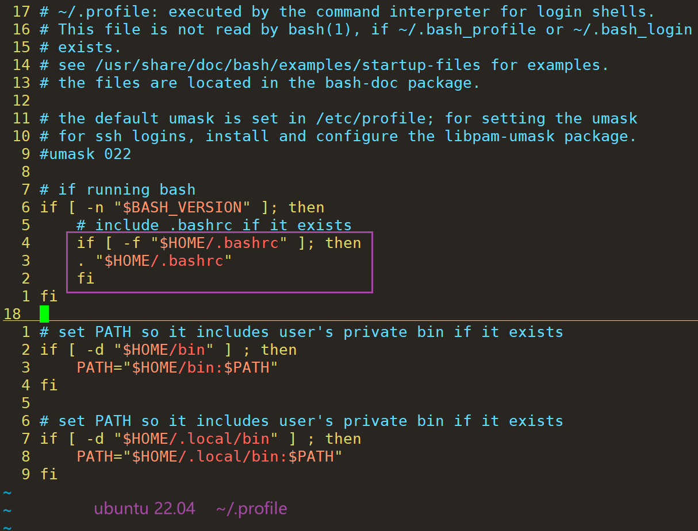  
      
- rocky8.6 家目录中有 `~/.bash_profile`  
```bash  
# rocky8.6  
# .bash_profile  
        
# Get the aliases and functions  
if [ -f ~/.bashrc ]; then  
        . ~/.bashrc  
fi  
      
# User specific environment and startup programs  
```  
      
- **在找到的配置文件中可能调用其他的配置文件，不同的 bash 版本可能调用的文件有差异，具体要看对应的脚本**  
      
      
## Interactive non-login shell 登录  
> [6.2 Bash Startup Files](https://www.gnu.org/software/bash/manual/html_node/Bash-Startup-Files.html)  
> &nbsp;  
> When an **interactive shell** that is **not a login shell** started, Bash reads and executes commands from `~/.bashrc`, if that file exist.  
> &nbsp;  
> This may be inhibited by using the `--norc` option.  
> &nbsp;  
> The `--rcfile file` option will force Bash to read and execute commands from `file` instead of `~/.bashrc`.  
      
&nbsp;  
      
- ubuntu 22.04 和 ubuntu 20.04 图形界面登录之前已经有 tty 设备登录，图形界面重新登录的为 pts 设备，为 `interactive non-login shell`，不会重新读 `/etc/profile` 文件，直接执行 `~/.bashrc` 文件  
      
- 登录一个 shell 后，执行 `bash` 或 `sh` 时新开启一个 shell 子进程为 `interactive non-login shell`  
      
- 通过 `su username` 切换用户，即未用 `-l` 选项，则登录的 shell 也为 `interactive non-login shell`  
      
1. 执行 `~/.bashrc` 文件  
- 该文件是 `interactive login shell` 直接执行的文件，`interactive non-login shell` 通过 `~/.profile` 文件调用该文件执行  
      
- 第 `5~8` 行是保证只有 `interactive shell` 执行，即 `echo $-` 的结果中有 `i` 标志  
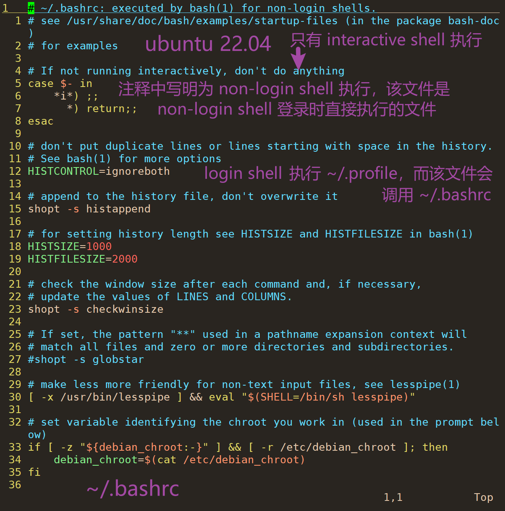  
      
      
## non-interactive shell 登录  
> [6.2 Bash Startup Files](https://www.gnu.org/software/bash/manual/html_node/Bash-Startup-Files.html)  
> &nbsp;  
> When Bash is started non-interactively, to run a shell script, for example, it looks for the variable BASH_ENV in the environment, expands its value if it appears there, and uses the expanded value as the name of a file to read and execute. Bash behaves as if the following command were executed:  
```bash  
if [ -n "$BASH_ENV" ]; then . "$BASH_ENV"; fi  
```  
> &nbsp;  
> If a non-interactive shell is invoked with the --login option, Bash attempts to read and execute commands from the login shell startup files.  
      
      
- 执行 shell 脚本时，`PATH` 环境变量不会查找文件  
      
- 这种情况不清楚？ 在什么场景？  
      
      
## Invoked with name sh  
> [6.2 Bash Startup Files](https://www.gnu.org/software/bash/manual/html_node/Bash-Startup-Files.html)  
      
## Invoked in POSIX mode  
> [6.2 Bash Startup Files](https://www.gnu.org/software/bash/manual/html_node/Bash-Startup-Files.html)  
      
      
## Invoked by remote shell daemon  
> [6.2 Bash Startup Files](https://www.gnu.org/software/bash/manual/html_node/Bash-Startup-Files.html)  
      
      
## Invoked by remote shell daemon  
> [6.2 Bash Startup Files](https://www.gnu.org/software/bash/manual/html_node/Bash-Startup-Files.html)  
      
      
# Bash 环境配置文件的用途说明  
## /etc/profile  
      
### ubuntu 22.04  
  
      
- 在当前 shell 中执行 `/etc/profile.d` 目录下的全部 `.sh` 脚本  
- 自定义一些设置最好不修改，而是新写脚本放到 `/etc/profile.d` 目录中，以 `.sh` 结尾即可保证执行  
      
```bash  
  1 # /etc/profile: system-wide .profile file for the Bourne shell (sh(1))  
  2 # and Bourne compatible shells (bash(1), ksh(1), ash(1), ...).  
  3  
  4  
  5 # 判断 PS1 是否为空，用 ${PS1-} 而不是 ${PS1} 可防止 set -u 选项设置后  
  6 # 如果 PS1 unset 而返回 false  
  7 if [ "${PS1-}" ]; then  
  8   if [ "${BASH-}" ] && [ "$BASH" != "/bin/sh" ]; then  
  9     # The file bash.bashrc already sets the default PS1.  
 10     # PS1='\h:\w\$ '  
 11     if [ -f /etc/bash.bashrc ]; then  
 12       . /etc/bash.bashrc  
 13     fi  
 14   else  
 15     if [ "$(id -u)" -eq 0 ]; then  # id -u 输出当前用户的 uid，0为root  
 16       PS1='# '   # root的 prompt 为 #  
 17     else  
 18       PS1='$ '   # 非 root 的 prompt 为 $  
 19     fi  
 20   fi  
 21 fi  
 22  
 23  
 24 # 执行 /etc/profile.d 目录下的全部 .sh 文件  
 25 if [ -d /etc/profile.d ]; then  
 26   for i in /etc/profile.d/*.sh; do  
 27     if [ -r $i ]; then  # 文件可读  
 28       . $i  # . 在当前 shell 执行脚本  
 29     fi  
 30   done  
 31   unset i   # unset 变量防止影响当前 shell 环境  
 32 fi  
```  
      
      
### rocky8.6  
- rocky 8.6 `/etc/profile` 文件中内容更多  
- 注释中写明最好不要修改该文件，而是将自定义设置放在 `/etc/profile.d` 目录中以 `.sh` 为后缀  
      
```bash  
  1 # /etc/profile  
  2  
  3 # System wide environment and startup programs, for login setup  
  4 # Functions and aliases go in /etc/bashrc  
  5  
  6 # It's NOT a good idea to change this file unless you know what you  
  7 # are doing. It's much better to create a custom.sh shell script in  
  8 # /etc/profile.d/ to make custom changes to your environment, as this  
  9 # will prevent the need for merging in future updates.  
 10  
 11 pathmunge () {  
 12     case ":${PATH}:" in  
 13         *:"$1":*)  
 14             ;;  
 15         *)  
 16             if [ "$2" = "after" ] ; then  
 17                 PATH=$PATH:$1  
 18             else  
 19                 PATH=$1:$PATH  
 20             fi  
 21     esac  
 22 }  
 23  
 24 # id 命令的路径为 /usr/bin/id 显示当前shell 用户的 id 信息  
    # id -u 显示 uid, id -ru 显示 real ID，而非 EUID  
    # 有些程序加了 suid 权限后执行时以其他身份运行，因此 EUID 不是实际 ID  
    # 该部分根据当前用户，设置一些变量，如 shell 内置变量 EUID 等  
 25 if [ -x /usr/bin/id ]; then  
 26     if [ -z "$EUID" ]; then  
 27         # ksh workaround  
 28         EUID=`/usr/bin/id -u`  
 29         UID=`/usr/bin/id -ru`  
 30     fi  
 31     USER="`/usr/bin/id -un`"  
 32     LOGNAME=$USER  
 33     MAIL="/var/spool/mail/$USER"  
 34 fi  
 35  
 36 # Path manipulation  
    # $EUID 为 0 表示当前程序以 root 身份执行  
    # 如果 EUID 为 root，则检查 /usr/local/sbin 和 /usr/sbin 放在环境变量的最前面（这两个路径不存在时）  
    # root login shell 方式登录，echo $PATH 的值如下：  
    # /usr/local/sbin:/usr/local/bin:/usr/sbin:/usr/bin:/root/bin  
    #  
    # 如果是普通用户，则将 /usr/local/sbin 和 /usr/sbin 放在 PATH 环境变量的最后  
    # 如普通用户 lx 登录（su -l lx）, echo $PATH 的值如下：  
    # /home/lx/.local/bin:/home/lx/bin:/usr/local/bin:/usr/bin:/usr/local/sbin:/usr/sbin  
      
 37 if [ "$EUID" = "0" ]; then  
 38     pathmunge /usr/sbin  
 39     pathmunge /usr/local/sbin  
 40 else  
 41     pathmunge /usr/local/sbin after  
 42     pathmunge /usr/sbin after  
 43 fi  
 44  
    # 主机名 hostname  
 45 HOSTNAME=`/usr/bin/hostname 2>/dev/null`  
      
    # 命令行中显示的历史记录的最大数目  
 46 HISTSIZE=1000  
      
    # 设置 HISTCONTROL 的值，控制哪些命令会保存在历史记录中  
    # ignorespace 表示以空格开头的命令不保存在历史记录中  
    # ignoredups 表示和上一条相同的命令不保存在历史记录中  
 47 if [ "$HISTCONTROL" = "ignorespace" ] ; then  
 48     export HISTCONTROL=ignoreboth  
 49 else  
 50     export HISTCONTROL=ignoredups  
 51 fi  
 52  
    # 将上述设置好的变量导出为环境变量  
 53 export PATH USER LOGNAME MAIL HOSTNAME HISTSIZE HISTCONTROL  
 54  
 55 # By default, we want umask to get set. This sets it for login shell  
 56 # Current threshold for system reserved uid/gids is 200  
 57 # You could check uidgid reservation validity in  
 58 # /usr/share/doc/setup-*/uidgid file  
    # rocky8.6 从 /etc/login.defs 文件中可看到 SYS_UID_MIN 为 201，即系统用户的最小 UID 为 201  
    # UID 大于 199，且 guid 的 name 和 uid 的 name 相同，则 umask 为 002  
    # 默认创建一个用户时其主要组的名字和用户名相同  
    # 如果 guid name 和 uid name 不同，或者 uid ≤ 199，则 umask 为 022  
    # 因此 root umask 默认为 022  
 59 if [ $UID -gt 199 ] && [ "`/usr/bin/id -gn`" = "`/usr/bin/id -un`" ]; then  
 60     umask 002  
 61 else  
 62     umask 022  
 63 fi  
 64  
    # 执行 /etc/profile.d 和 /etc/profile.d 中的后缀为 .sh 和 .sh.local 的文件  
    # 自定义的脚本最好放到 /etc/profile.d 目录中执行  
    # 这些脚本必须是可读的，有 r 权限，但没有 r 权限的脚本，root 也能读  
    # 执行的方式是用 . ，因此执行的脚本在当前的 shell 环境，即执行 /etc/profile 的 shell 环境  
 65 for i in /etc/profile.d/*.sh /etc/profile.d/sh.local ; do  
 66     if [ -r "$i" ]; then  
 67         if [ "${-#*i}" != "$-" ]; then # 判断是否是 interactive shell，即 $- 是否含有 i 标志  
 68             . "$i"  
 69         else  
 70             . "$i" >/dev/null  
 71         fi  
 72     fi  
 73 done  
 74  
    # 将定义的变量和函数 unset，防止影响执行脚本的环境  
 75 unset i  
 76 unset -f pathmunge  # unset -f : treat each NAME as a shell function  
 77  
    # 执行 /etc/bashrc 文件，要 BASH_VERSION 内容不为空  
    # BASH_VERSION 后加的 - 表名 BASH_VERSION unset 时为空  
    # 如果 set -u 设置(变量 unset 则输出错误，而不是输出空)，加上 - 可以防止输出错误  
 78 if [ -n "${BASH_VERSION-}" ] ; then  
 79         if [ -f /etc/bashrc ] ; then  
 80                 # Bash login shells run only /etc/profile  
 81                 # Bash non-login shells run only /etc/bashrc  
 82                 # Check for double sourcing is done in /etc/bashrc.  
 83                 . /etc/bashrc  
 84        fi  
 85 fi  
```  
      
1. 第 67 行 `[ "${-#*i}" != "$-" ]` 解释  
> [What does "${-#*i}" != "$-" mean?](https://unix.stackexchange.com/questions/129231/what-does-i-mean)  
> [${parameter#[word]}](https://pubs.opengroup.org/onlinepubs/9699919799/utilities/V3_chap02.html#tag_18_06_02)  
      
- `$-` 显示当前 shell 设置的 flags，如 `himBHs`  
- 后面加上 `#*i` 表示从 `$-` 的结果中查找 `i`，并将找到的第一个 `i` 及其前面的字符全删除  
- 因此前面结果的 `mBHs`  
- 如果 `$-` 结果不含 `i`，则不会删除任何字符，两个字符串相同  
- 因此可以通过两个字符串不等得出有 `i` 标志  
- ubuntu 22.04 中的判断方法如下，更好理解：  
```bash  
    # If not running interactively, don't do anything  
  1 case $- in  
  2     *i*) ;;  
  3       *) return;;  
  4 esac  
```  
      
2. 注意脚本中执行其他脚本的顺序，先调用 `/etc/profile.d`，再到 `/etc/bashrc`  
      
      
## /etc/profile.d 目录  
- 默认会有一些文件存在，被 `/etc/profile` 调用  
- 可以自定义加上一些文件放改目录中，见 `/etc/profile` 脚本中说明  
- ubuntu 22.04 目录内容如下：  
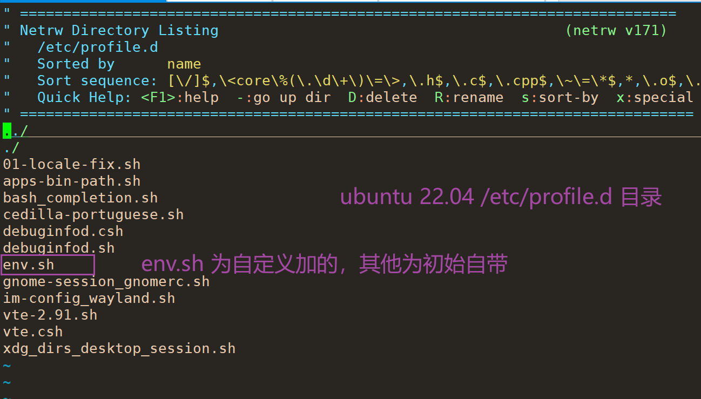  
- rocky8.6 中该目录的文件更多  
      
## ~/bash_profile  
- ubuntu 22.04, ubuntu 20.04 无该文件  
- rocky 8.6 有该文件，调用 `~/.bashrc`  
```bash  
# rocky8.6  
# .bash_profile  
        
# Get the aliases and functions  
if [ -f ~/.bashrc ]; then  
        . ~/.bashrc  
fi  
      
# User specific environment and startup programs  
```  
      
## ~/bash_login  
- ubuntu 22.04, ubuntu 20.04 和 rocky 8.6 均无  
      
## ~/.profile  
- rocky 8.6 无  
- ubuntu 22.04, ubuntu 20.04 有  
      
```bash  
    # ubuntu 22.04  
  1 # ~/.profile: executed by the command interpreter for login shells.  
  2 # This file is not read by bash(1), if ~/.bash_profile or ~/.bash_login  
  3 # exists.  
  4 # see /usr/share/doc/bash/examples/startup-files for examples.  
  5 # the files are located in the bash-doc package.  
  6  
  7 # the default umask is set in /etc/profile; for setting the umask  
  8 # for ssh logins, install and configure the libpam-umask package.  
  9 #umask 022  
 10  
 11 # if running bash  
 12 if [ -n "$BASH_VERSION" ]; then  
 13     # include .bashrc if it exists  
 14     if [ -f "$HOME/.bashrc" ]; then  
 15     . "$HOME/.bashrc"  
 16     fi  
 17 fi  
 18  
 19 # set PATH so it includes user's private bin if it exists  
    # 如果用户家目录中有 bin 或 .local/bin 目录，则将该目录加入 PATH 环境变量  
    # 默认没有该目录，可以新建目录，将自定义的一些可执行文件放入该目录中执行  
 20 if [ -d "$HOME/bin" ] ; then  
 21     PATH="$HOME/bin:$PATH"  
 22 fi  
 23  
 24 # set PATH so it includes user's private bin if it exists  
 25 if [ -d "$HOME/.local/bin" ] ; then  
 26     PATH="$HOME/.local/bin:$PATH"  
 27 fi  
```  
      
- login shell 才会执行该文件  
      
- 只有 `~/.bash_profile` 和 `~/.bash_login` 均不存在才会读  
  
      
- 注释中提到的 `/usr/share/doc/bash/examples/startup-files` 找不到 `examples` 目录，可从 [bash-doc 4.3-6ubuntu1/usr/share/doc/bash/examples/startup-files](https://www.apt-browse.org/browse/ubuntu/trusty/main/all/bash-doc/4.3-6ubuntu1/file/usr/share/doc/bash/examples/startup-files) 查看  
      
- 该文件会执行家目录中的 `~/.bashrc` 文件  
      
- 如果用户家目录中有 `bin` 或 `.local/bin` 文件夹，则会将这两个路径加入到 PATH 环境变量中，  
  ubuntu 22.04 中默认无这两个目录，用户可以自己创建，如将可执行文件放到 `~/bin` 目录下，  
  则可执行文件执行时不需要写全路径，可以直接执行了  
      
      
## ~/.bashrc  
- `non-login shell` 执行，但 `login shell` 执行 `~/.profile` 或其他文件时会调用  
      
### ubuntu 22.04  
```bash  
    # ubuntu 22.04  
    # non-login shell 登录时直接执行该文件  
    # login-shell 登录是通过其他文件调用该文件  
  1 # ~/.bashrc: executed by bash(1) for non-login shells.  
  2 # see /usr/share/doc/bash/examples/startup-files (in the package bash-doc)  
  3 # for examples  
  4  
  5 # If not running interactively, don't do anything  
    # $- 变量展开有 i 表示为 interactive shell  
  6 case $- in  
  7     *i*) ;;  # 包含 i  
  8       *) return;;  
  9 esac  
 10  
 11 # don't put duplicate lines or lines starting with space in the history.  
 12 # See bash(1) for more options  
    # rocky8.6 将该变量设置放在 /etc/profile 文件中  
 13 HISTCONTROL=ignoreboth  
 14  
 15 # append to the history file, don't overwrite it  
    # set histappend 选项，默认开启，将历史追加到历史记录文件而非覆盖  
 16 shopt -s histappend  
 17  
 18 # for setting history length see HISTSIZE and HISTFILESIZE in bash(1)  
    # rocky8.6 将该变量设置放在 /etc/profile 文件中  
 19 HISTSIZE=1000  # 命令行中显示的历史命令的最大数目  
 20 HISTFILESIZE=2000  # 历史命令记录文件中的最大历史命令数目  
 21  
 22 # check the window size after each command and, if necessary,  
 23 # update the values of LINES and COLUMNS.  
    # 如果当前窗口从最大到缩小一半，执行 man bash，则窗口缩小后显示的内容  
    # 自动按照新的窗口大小排列  
 24 shopt -s checkwinsize  
 25  
 26 # If set, the pattern "**" used in a pathname expansion context will  
 27 # match all files and zero or more directories and subdirectories.  
 28 #shopt -s globstar  
 29  
 30 # make less more friendly for non-text input files, see lesspipe(1)  
 31 [ -x /usr/bin/lesspipe ] && eval "$(SHELL=/bin/sh lesspipe)"  
 32  
 33 # set variable identifying the chroot you work in (used in the prompt below)  
 34 if [ -z "${debian_chroot:-}" ] && [ -r /etc/debian_chroot ]; then  
 35     debian_chroot=$(cat /etc/debian_chroot)  
 36 fi  
 37  
 38 # set a fancy prompt (non-color, unless we know we "want" color)  
    # echo $TERM 结果为 xterm-256color 表面终端类型  
 39 case "$TERM" in  
 40     xterm-color|*-256color) color_prompt=yes;;  
 41 esac  
 42  
 43 # uncomment for a colored prompt, if the terminal has the capability; turned  
 44 # off by default to not distract the user: the focus in a terminal window  
 45 # should be on the output of commands, not on the prompt  
 46 #force_color_prompt=yes  
 47  
 48 if [ -n "$force_color_prompt" ]; then  
 49     if [ -x /usr/bin/tput ] && tput setaf 1 >&/dev/null; then  
 50         # We have color support; assume it's compliant with Ecma-48  
 51         # (ISO/IEC-6429). (Lack of such support is extremely rare, and such  
 52         # a case would tend to support setf rather than setaf.)  
 53         color_prompt=yes  
 54     else  
 55         color_prompt=  
 56     fi  
 57 fi  
 58  
    # 设置 PS1 的值，因此如果用户想自定义 PS1，如果在 /etc/profile 或 /etc/profile.d 中定义  
    # 会被这里的定义的覆盖  
 59 if [ "$color_prompt" = yes ]; then  
 60     PS1='${debian_chroot:+($debian_chroot)}\[\033[01;32m\]\u@\h\[\033[00m\]:\[\033[01;34m\]\w\[\033[00m\]\$ '  
 61 else  
 62     PS1='${debian_chroot:+($debian_chroot)}\u@\h:\w\$ '  
 63 fi  
 64 unset color_prompt force_color_prompt  
 65  
 66 # If this is an xterm set the title to user@host:dir  
 67 case "$TERM" in  
 68 xterm*|rxvt*)  
 69     PS1="\[\e]0;${debian_chroot:+($debian_chroot)}\u@\h: \w\a\]$PS1"  
 70     ;;  
 71 *)  
 72     ;;  
 73 esac  
 74  
 75 # enable color support of ls and also add handy aliases  
 76 if [ -x /usr/bin/dircolors ]; then  
 77     test -r ~/.dircolors && eval "$(dircolors -b ~/.dircolors)" || eval "$(dircolors -b)"  
 78     alias ls='ls --color=auto'  
 79     #alias dir='dir --color=auto'  
 80     #alias vdir='vdir --color=auto'  
 81  
 82     alias grep='grep --color=auto'  
 83     alias fgrep='fgrep --color=auto'  
 84     alias egrep='egrep --color=auto'  
 85 fi  
 86  
 87 # colored GCC warnings and errors  
 88 #export GCC_COLORS='error=01;31:warning=01;35:note=01;36:caret=01;32:locus=01:quote=01'  
 89  
 90 # some more ls aliases  
 91 alias ll='ls -alF'  
 92 alias la='ls -A'  
 93 alias l='ls -CF'  
 94  
 95 # Add an "alert" alias for long running commands.  Use like so:  
 96 # sleep 10; alert  
 97 alias alert='notify-send --urgency=low -i "$([ $? = 0 ] && echo terminal || echo error)" \  
    "$(history|tail -n1|sed -e '\''s/^\s*[0-9]\+\s*//;s/[;&|]\s*aler    t$//'\'')"'  
 98  
 99 # Alias definitions.  
100 # You may want to put all your additions into a separate file like  
101 # ~/.bash_aliases, instead of adding them here directly.  
102 # See /usr/share/doc/bash-doc/examples in the bash-doc package.  
    # 自定义的别名可以新建一个文件 ~/.bash_aliases，然后写道该文件中  
103  
104 if [ -f ~/.bash_aliases ]; then  
105     . ~/.bash_aliases  
106 fi  
107  
108 # enable programmable completion features (you don't need to enable  
109 # this, if it's already enabled in /etc/bash.bashrc and /etc/profile  
110 # sources /etc/bash.bashrc).  
    # shopt -q 不输出结果，可从返回状态中获取结果  
111 if ! shopt -oq posix; then  
112   if [ -f /usr/share/bash-completion/bash_completion ]; then  
113     . /usr/share/bash-completion/bash_completion  
114   elif [ -f /etc/bash_completion ]; then  
115     . /etc/bash_completion  
116   fi  
117 fi  
```  
      
- `non-login shell` 登录执行该文件  
- `login-shell` 登录是通过其他文件调用该文件  
- 定义一些变量如 `HISTSIZE` 等，rocky 8.6 在 `/etc/profile` 中定义  
- 定义 PS1 变量，因此用户想自定义该变量，如果在 `/etc/profile` 中定义，则会被覆盖  
- 调用 `~/.bash_aliases` 文件，该文件默认没有，如果用户需要自定义别名，可以新建  
- 调用 `/etc/bash_completion` 文件  
      
### rocky8.6  
```bash  
  1 # rocky8.6 .bashrc  
  2  
  3 # Source global definitions  
  4 if [ -f /etc/bashrc ]; then  
  5         . /etc/bashrc  
  6 fi  
  7  
  8 # User specific environment  
    # ubuntu 22.04 在 ~/.profile 中设置  
  9 if ! [[ "$PATH" =~ "$HOME/.local/bin:$HOME/bin:" ]]  
 10 then  
 11     PATH="$HOME/.local/bin:$HOME/bin:$PATH"  
 12 fi  
 13 export PATH  
 14  
 15 # Uncomment the following line if you don't like systemctl's auto-paging feature:  
 16 # export SYSTEMD_PAGER=  
 17  
 18 # User specific aliases and functions  
```  
      
- `non-login shell` 登录执行该文件  
- `login-shell` 登录是通过其他文件调用该文件  
- 调用 `/etc/bashrc`，Ubuntu 22.04 没有该调用  
- 如果用户家目录中有 `bin` 或 `.local/bin` 文件夹，则会将这两个路径加入到 PATH 环境变量中，  
  默认无这两个目录，用户可以自己创建，如将可执行文件放到 `~/bin` 目录下，  
  则可执行文件执行时不需要写全路径，可以直接执行了  
  ubuntu 22.04 在 ~/.profile 中设置这个  
- rocky8.6 中这里会调用 `/etc/bashrc`，该文件中设置 PS1，umask 等值，和 `/etc/profile` 差不多  
- `/etc/bashrc` 文件在最后会执行 `/etc/profile.d` 目录中的文件  
      
      
## /etc/bashrc  
- rocky8.6 在 `~/.bashrc` 文件中调用  
- ubuntu 22.04 和 ubuntu 20.04 无此文件  
      
      
# Bash Logout Scripts  
## ~/.bash_logout  
> [Bash Logout Scripts](https://bash.cyberciti.biz/guide/The_role_of_shells_in_the_Linux_environment)  
      
> When a `login` shell exits, bash reads and executes commands from the file $HOME/.bash_log, if it exists.  
      
### ubunut 22.04  
```bash  
  1 # ~/.bash_logout: executed by bash(1) when login shell exits.  
  2  
  3 # when leaving the console clear the screen to increase privacy  
  4  
  5 if [ "$SHLVL" = 1 ]; then  
  6     [ -x /usr/bin/clear_console ] && /usr/bin/clear_console -q  
  7 fi  
```  
      
# Bash and Command Types  
> [Bash and Command Types](https://bash.cyberciti.biz/guide/Shell_commands#Bash_and_Command_Types)  
      
- Aliases  
   - `ll`  
- Keywords  
- Functions  
- Built in  
   - `pwd`  
- Files  
   - /bin/ls  
      
      
# 脚本规范  
## Shebang  
> [Shebang](https://bash.cyberciti.biz/guide/Shebang)  
- 脚本第一行  
- 以 `#!` 开头，后面跟 shell 类型，且为完整路径，如 `#!/bin/bash`  
      
      
//TODO: 未看#!/usr/bin/env bash  
### #!/usr/bin/env bash 和 #!/bin/bash  
> [Make Linux/Unix Script Portable With #!/usr/bin/env As a Shebang](https://www.cyberciti.biz/tips/finding-bash-perl-python-portably-using-env.html)  
> [What is the difference between "#!/usr/bin/env bash" and "#!/usr/bin/bash"?](https://stackoverflow.com/questions/16365130/what-is-the-difference-between-usr-bin-env-bash-and-usr-bin-bash)  
      
      
## 注释  
- 以 `#` 开头单行注释  
- 可以在 vim 配置文件中自动生成注释  
- 非必须，但可以使脚本更规范，解释功能  
      
```bash  
  1 #! /bin/sh  
    # ubunutu 20.04 /etc/init.d/network-manager  
  2 ### BEGIN INIT INFO  
  3 # Provides:          network-manager  
  4 # Required-Start:    $remote_fs dbus udev  
  5 # Required-Stop:     $remote_fs dbus udev  
  6 # Should-Start:      $syslog  
  7 # Should-Stop:       $syslog  
  8 # Default-Start:     2 3 4 5  
  9 # Default-Stop:      0 1 6  
 10 # Short-Description: network connection manager  
 11 # Description:       Daemon for automatically switching network  
 12 #                    connections to the best available connection.  
 13 ### END INIT INFO  
 14  
 15 PATH=/usr/local/sbin:/usr/local/bin:/sbin:/bin:/usr/sbin:/usr/bin  
 16 DESC="network connection manager"  
 17 NAME="NetworkManager"  
 18  
 19 DAEMON=/usr/sbin/$NAME  
 20  
 21 PIDFILE=/run/$NAME/$NAME.pid  
 22  
 23 SCRIPTNAME=/etc/init.d/network-manager  
 ```  
      
### 多行注释  
- 利用 Here documents 写多行注释  
```bash  
<<COMMENT1  
   说明  
   说明  
COMMENT1  
```  
      
      
## 定义好环境变量  
- 非必须，有需要最好设置  
      
      
# 本地执行 shell 脚本的方式  
> [script 的运行方式差异 (source, sh script, ./script)](http://cn.linux.vbird.org/linux_basic/0340bashshell-scripts_2.php#some_ex_run)  
      
      
## source (.)  
- 在当前的 shell 环境中执行，不新建子进程  
- 不需要脚本有 x 权限  
- 脚本要有 r 权限  
      
- 测试方式  
   - 写一个脚本，脚本中定义一个变量，不为环境变量，set 变量后不 unset  
   - 用 `.` 或 `source` 执行脚本后，`echo` 查看变量的值  
      
      
      
## 直接执行脚本  
- 脚本需要有 r 和 x 权限  
- 在一个新的子进程中执行  
- 需要写明路径  
- 如 `./test.sh`  
      
## 指定 shell 执行脚本  
- 脚本要有 r 权限，可以没有 x 权限  
- 如果不在当前目录，需要指明路径；当前目录不用  
- 在新子进程中执行脚本  
- 通过管道传给 bash 执行，同样在子进程执行  
- 通过 Here string 传给 bash 执行，同样在子进程执行  
      
```bash  
# 当前目录  
bash test.sh  
      
# 上级目录  
bash 1/test.sh  
      
# 当前目录  
cat test.sh | bash  
      
# Here string 当前目录  
bash <<< $(cat test.sh)  
```  
      
# 本地不需要路径执行脚本  
- `non-login shell` 只执行 `~/.bashrc`  
## rocky8.6  
- `~/.bashrc` 中将 `~/bin` 和  `~/.local/bin` 两个目录（如果存在）加到 PATH 环境变量中，因此将脚本放在这两个目录下可以在任意地方输入脚本名字执行。（注意不能是子目录，必须直接在这两个目录下）  
      
- ubuntu 22.04 的 `~/.bashrc` 文件中没有环境变量的设置，在 `~/.profile` 文件中，而该文件 `non-login shell` 不会执行，需要将 PATH 添加到 `~/.bashrc` 文件中  
      
      
# 执行远程主机的脚本  
ubuntu22.04 中利用 ssh 执行远程主机 rocky8 上的脚本  
```bash  
[root@ubuntu22-c0 ~]$ ssh root@10.0.0.82 "cat /root/shell_scripts/test.sh"  
#!/bin/bash  
      
. /etc/os-release  
echo $PRETTY_NAME  
[root@ubuntu22-c0 ~]$ ssh root@10.0.0.82 "bash /root/shell_scripts/test.sh"  
Rocky Linux 8.7 (Green Obsidian)  
```  
      
# 调试脚本  
> [Debug a script](https://bash.cyberciti.biz/guide/Debug_a_script)  
      
## -x  
- `set --help | less` 可以看到 `-x` 的作用  
- `man bash` 也可看到 `-x` 选项解释  
- Print commands and their arguments as they are executed  
- `-x` 选项会将命令和参数展开  
- 可以 `bash -x script_name`，或者在脚本中加上 `set -x`  
      
## -v  
- `set --help | less` 可以看到 `-v` 的作用  
- `man bash` 也可看到 `-v` 选项解释  
- Print shell input lines as they are read  
- 会将读到的命令显示在输出结果上，但不展开  
      
## -n  
- `set --help | less` 可以看到 `-n` 的作用  
- Read commands but do not execute them  
- 只读命令但不执行，该选项写到脚本中不起作用  
- 用 `bash -n script_name` 方式可以起作用，检查语法错误，不检查命令错误  
- 如果没有问题，不输出，有错误则提示错误  
      
```bash  
  1 #!/bin/bash  
  2  
    # test.sh  
  3 set -n  
  4 #set -o noexec  
  5  
  6 echo "Hello ${LOGNAME}"  
  7 echo "Today is $(date)"  
  8  
  9 case $- in  
 10     *i*)  
 11         echo "current shell is an interactive shell"  
 12         ;;  
 13     *)  
 14         echo "current shell is a non-interactive shell"  
 15         ;;  
 16 esac  
 17  
 18 shopt -oq noexec;  
 19 [ $? ] && echo "noexec is unset" || echo "noexec is set"  
 20  
 21 echo "end"  
 22  
 23 set +n  
 ```  
      
直接在当前目录执行 `. test.sh`，结果如下：  
```bash  
Hello lx  
Today is 2023年 04月 09日 星期日 15:58:12 CST  
current shell is an interactive shell  
noexec is unset  
end  
```  
      
如果用 `bash -n test.sh`，则不输出任何内容  
      
      
# 引号和转义  
> [引号和转义](https://wangdoc.com/bash/quotation)  
> 在线帮助文档：[3.1.2 Quoting](https://www.gnu.org/savannah-checkouts/gnu/bash/manual/bash.html#Quoting)  
> [Quoting](https://bash.cyberciti.biz/guide/Quoting)  
      
- `man bash` 搜索 `QUOTING` 查看帮助文档  
  
      
      
## 单引号  
> [单引号](https://wangdoc.com/bash/quotation#单引号)  
      
- 单引号包围的任何特殊字符都会变成普通字符  
- 如果要使用单引号，不能用 `\` 转义，因为 `\` 变成普通字符，没有转义功能，可以在双引号中使用单引号  
      
  
      
## 双引号  
- 除了 `$` `\` 反向单引号（**`**） 其他字符均视为普通字符  
- 显示双引号还是需要转义  
      
  
  
      
      
## 不加引号时转义特殊字符  
### 哪些字符需要转义  
> 只有部分：[Special Characters and Quoting](https://www.oreilly.com/library/view/learning-the-bash/1565923472/ch01s09.html)  
> [3.1.2.4 ANSI-C Quoting](https://www.gnu.org/savannah-checkouts/gnu/bash/manual/bash.html#ANSI_002dC-Quoting)  
      
      
- 注意 `\` 后按换行表示换行继续写，不是转义  
- `man bash` 中列出的 ANSI-C 一些转义  
  
  
      
      
# Lists of Commands  
> [List of Commands](https://www.gnu.org/savannah-checkouts/gnu/bash/manual/bash.html#Lists)  
      
      
- A `list` is a sequence of one or more pipelines separated by one of the operators `;`, `&`, `&&`, or `||`, and optionally ternimated by one of `;`, `&`, or a `newline`.  
      
      
## ;  
- 用 `;` 分开的命令顺序执行  
- 返回状态值为最后一条命令的执行结果  
- 不用 `;` 分开时一条命令中只要有错误的结果，则返回错误  
      
  
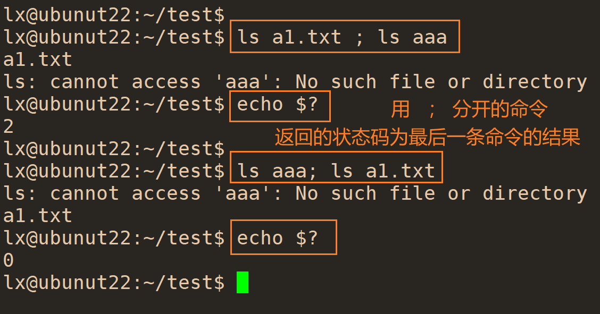  
      
      
## &  
- 命令以 `&` 结束则 shell 异步地在子进程中执行  
- 命令在后台执行  
- 返回状态值为 0（true）  
      
## &&  
- 前面的命令执行成功才会执行右边的命令  
- left associativity  
      
      
## ||  
- 左边的命令执行错误才会执行右边的命令  
- left associativity  
      
      
## && 和 || 组合  
      
  
      
      
# shell expansion  
> 在线官方文档：[3.5 Shell Expansions](https://www.gnu.org/savannah-checkouts/gnu/bash/manual/bash.html#Shell-Expansions)  
> [Bash 的模式扩展](https://wangdoc.com/bash/expansion)  
      
- shell 先将命令分成 tokens  
- 然后进行扩展，**按照一定顺序**，注意扩展的顺序  
  
  
      
- 扩展完成后再执行命令  
      
      
## { } brace expansion  
> [3.5.1 Brace Expansion](https://www.gnu.org/savannah-checkouts/gnu/bash/manual/bash.html#Brace-Expansion)  
> [大括号扩展](https://wangdoc.com/bash/expansion#大括号扩展)  
      
      
- 花括号扩展是第一个扩展的，在其他扩展之前  
  
      
      
### {a,b,c}  
- 里面的逗号前后不能有空格  
  
      
      
### {x..y[..incr]}  
- {x..y[..incr]} x，y 可以是整型或字母  
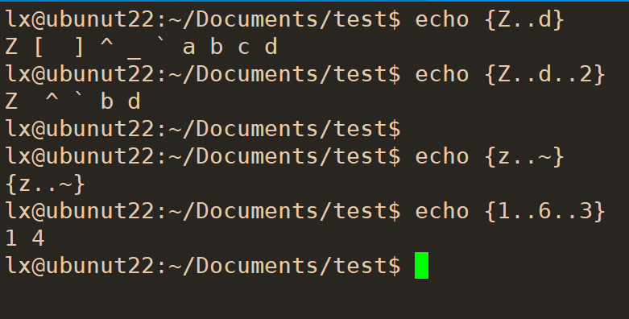  
- 数字前加 0 进行对齐  
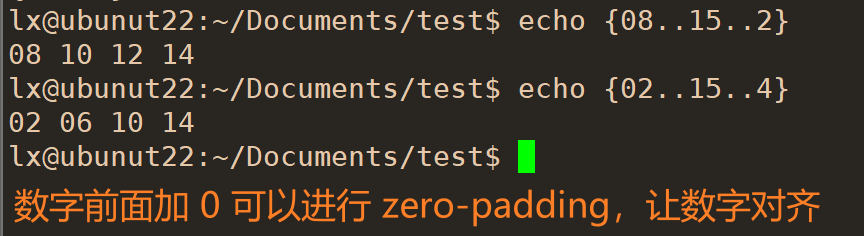  
      
  
  
  
      
## ~ tilde expansion  
> [3.5.2 Tilde Expansion](https://www.gnu.org/savannah-checkouts/gnu/bash/manual/bash.html#Tilde-Expansion)  
Error loading webview: Error: Could not register service worker: InvalidStateError: Failed to register a ServiceWorker: The document is in an invalid state.  
      
- `man bash` 搜索 `Tilde Expansion` 查看帮助说明  
  
  
      
      
//LABEL: 参数扩展  
## ${ } shell parameter expansion  
> [3.5.3 Shell Parameter Expansion](https://www.gnu.org/savannah-checkouts/gnu/bash/manual/bash.html#Shell-Parameter-Expansion)  
> [变量扩展](https://wangdoc.com/bash/expansion#变量扩展)  
> [2.6.2 Parameter Expansion](https://pubs.opengroup.org/onlinepubs/9699919799/utilities/V3_chap02.html#tag_18_06_02)  
      
      
  
      
  
      
  
      
### `$` 和 `${ }` 两种写法比较  
- 如果变量后面还有参数，只能用 `${ }` 的形式  
  
      
      
### ${parameter:-word} 为输出参数添加默认值  
> [Default shell variables value](https://bash.cyberciti.biz/guide/Default_shell_variables_value)  
      
- `parameter` set and not null, 输出 `parameter`  
- `parameter` set 但为空，也输出 `word`  
- `parameter` unset，输出 `word`  
      
  
  
      
      
### ${parameter-word} 为输出参数添加默认值  
- `parameter` 不为空，输出 `parameter`  
- `parameter` set 但为空，输出 `null`  
- `parameter` unset，输出 `word`  
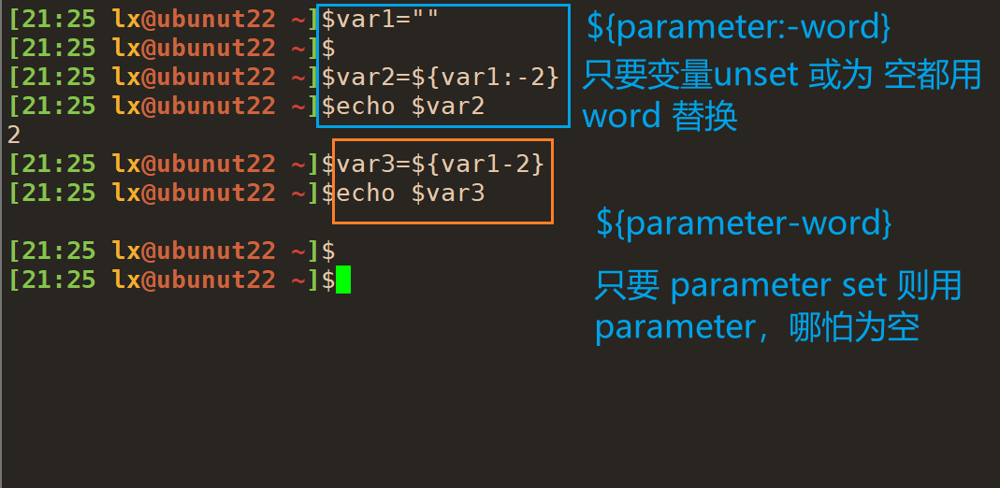  
      
#### ${parameter-} 和 ${parameter} 区别  
> [Is "${PS1-}" valid syntax and how does it differ from plain "$PS1"?](https://unix.stackexchange.com/questions/352110/is-ps1-valid-syntax-and-how-does-it-differ-from-plain-ps1)  
> [2.6.2 Parameter Expansion](https://pubs.opengroup.org/onlinepubs/9699919799/utilities/V3_chap02.html#tag_18_06_02)  
      
      
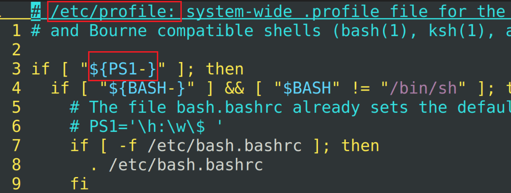  
      
ubuntu 22.04 中的 `/etc/profile` 配置文件中使用 `${PS1-}` 的用法，看着和 `${PS1}` 的效果相同，因为默认的值 `word` 为空，如果 `PS1` 未设置，都为空。  
      
但如果 `set -u` 选项设置了，即 `parameter` 未设置则输出错误而非空：  
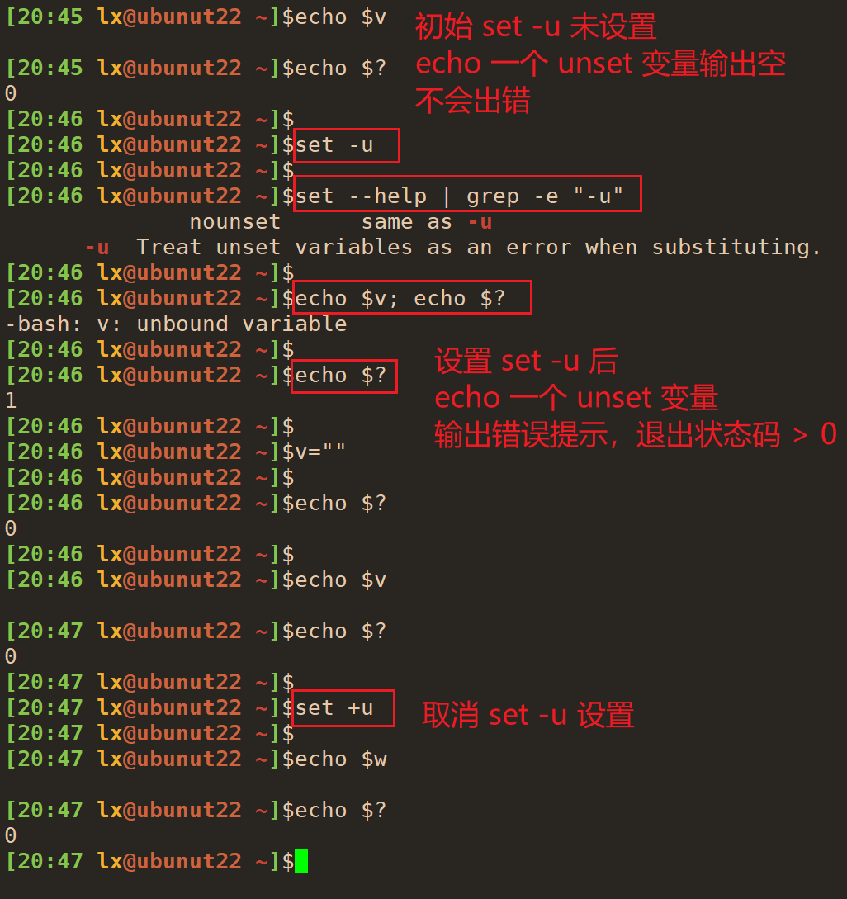  
      
这种情况下两种写法的结果不同：  
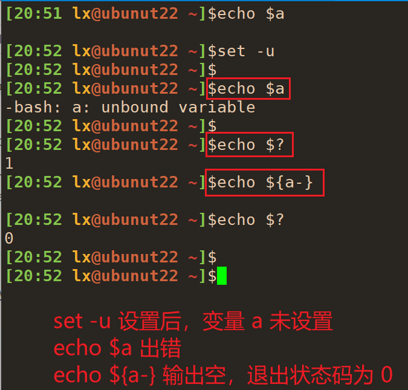  
      
      
### ${parameter=word} 为变量赋默认值  
- 变量 `parameter` 未设置，则将默认值 `word` 赋值给该变量  
- 变量 `parameter` 设置但为空，则输出空  
      
### ${parameter:=word} 为变量赋默认值  
- 变量 `parameter` 未设置或为空，则将默认值 `word` 赋值给该变量  
      
  
      
### ${parameter:?word} 变量为空则输出错误提示到标准错误  
  
  
      
### ${parameter:+word} 变量存在则用默认值替换  
- 和 `${parameter:-word}` 的效果相反  
      
  
  
      
### ${parameter:offset:length} 截取部分内容  
  
      
- substring expansion  
- `offset` 定义偏移量，如果为 0，则从第一个字符开始截取  
- `length` 定义截取的长度，不指定则截取到最后  
- `offset` 是负数则从最后开始数偏移量，最后一个字符是 `-1`，不指定长度，则默认到最后  
- `offset` 是负数时，负数要与分隔符 `:` 至少间隔一个空格  
      
  
      
      
### ${parameter#word} 按模式匹配移除部分字符串  
> [Shell Parameter Expansion](https://www.gnu.org/savannah-checkouts/gnu/bash/manual/bash.html#Shell-Parameter-Expansion)  
      
      
根据 `word` 模式来匹配 `parameterr`， 移除变量 `parameter` 中最从开头到最短匹配到 `word` 的内容  
      
```bash  
[root@docker nginx]$ str="aaabcd-efffffg"  
[root@docker nginx]$ str1=${str#a}  
[root@docker nginx]$ echo $str1  
aabcd-efffffg  
[root@docker nginx]$ str1=${str#*-}  
[root@docker nginx]$ echo $str1  
efffffg  
```  
上面中 `*-` 为匹配模式，如果写成 `str1=${str-}` 则只匹配以 `-` 开头  
      
      
### ${parameter##word}  
和上面相同，但是做最长匹配  
      
```bash  
[root@docker nginx]$ str="aaabcd-efffffg-123"  
[root@docker nginx]$ str1=${str##-}  
[root@docker nginx]$ echo $str1  
aaabcd-efffffg-123  
[root@docker nginx]$ str1=${str##*-}  
[root@docker nginx]$ echo $str1  
123  
```  
      
```bash  
[root@docker nginx]$ str="aa-abcd-efffffg-123"  
[root@docker nginx]$ str1=${str##a}  
[root@docker nginx]$ echo $str1  
a-abcd-efffffg-123  
```  
```bash  
[root@docker nginx]$ str="aa-abcd-efffffg-123"  
[root@docker nginx]$ str1=${str##*a}  
[root@docker nginx]$ echo $str1  
bcd-efffffg-123  
```  
      
### ${parameter%word} 按模式匹配移除部分字符串  
从尾部匹配开始移除字符串，最短匹配  
      
```bash  
[root@docker nginx]$ str="test.txt"  
[root@docker nginx]$ str="test.txt.txt"  
[root@docker nginx]$ str1=${str%.txt}  
[root@docker nginx]$ echo $str1  
test.txt  
```  
      
### ${parameter%%word} 按模式匹配移除部分字符串  
从尾部匹配开始移除字符串，最长匹配  
      
```bash  
[root@docker nginx]$ str="test.txt.txt"  
[root@docker nginx]$ str1=${str%%.txt}  
[root@docker nginx]$ echo $str1  
test.txt  
```  
```bash  
[root@docker nginx]$ str="test.txt.txt"  
[root@docker nginx]$ str1=${str%%.*}  
[root@docker nginx]$ echo $str1  
test  
```  
    
### ${parameter,,pattern} 字符串转换为小写  
```bash  
root@ubuntu2204c12:/home/lx/shell_scripts# b="CAT"  
root@ubuntu2204c12:/home/lx/shell_scripts# echo ${b,,}  
cat  
```  
    
### ${parameter^^pattern} 字符串转换为大写  
```bash  
root@ubuntu2204c12:/home/lx/shell_scripts# echo ${a^^}  
HELLO  
```  
    
      
## $(command) 子命令扩展  
> [Difference between $() and () in Bash](https://stackoverflow.com/questions/39110485/difference-between-and-in-bash)  
> [3.5.4 Command Substitution](https://www.gnu.org/savannah-checkouts/gnu/bash/manual/bash.html#Command-Substitution)  
> [子命令扩展](https://wangdoc.com/bash/expansion#子命令扩展)  
      
- 注意区分 `$()` 和 `()`，前者将命令展开成字符串，后者将多个命令组合成一个 group 执行  
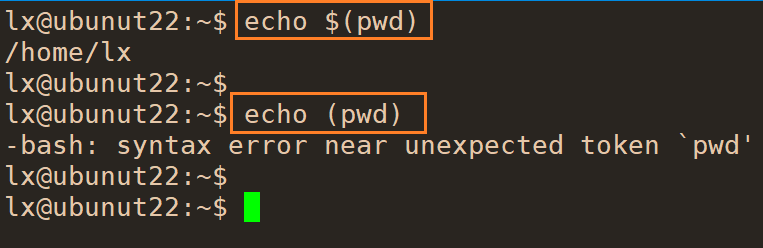  
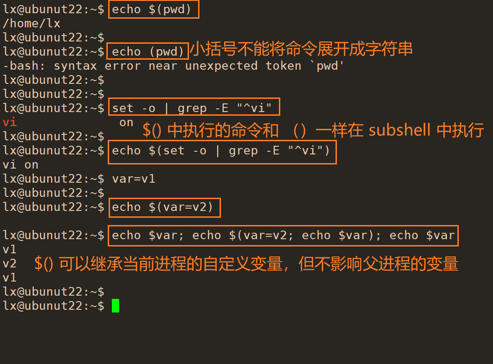  
      
- Replace the command substitution with the standard output of the command, with any trailing newlines deleted.  
      
- 或者 **`command`**写法，这种写法是旧写法  
      
- `man bash` 查看帮助  
  
  
  
      
      
//LABEL: 算术运算  
## $(( expression )) 算术扩展  
> [3.5.5 Arithmetic Expansion](https://www.gnu.org/savannah-checkouts/gnu/bash/manual/bash.html#Arithmetic-Expansion)  
> [6.5 Shell Arithmetic](https://www.gnu.org/savannah-checkouts/gnu/bash/manual/bash.html#Shell-Arithmetic)  
> [Bash 的算术运算](https://wangdoc.com/bash/arithmetic)  
> [Perform arithmetic operations](https://bash.cyberciti.biz/guide/Perform_arithmetic_operations)  
      
  
      
- `man bash` 查看帮助  
  
  
      
      
- 只支持整数的算数运算  
  
  
      
      
区分 `(( ))` 和 `[ ]` 用于条件测试：  
```bash  
[root@ubuntu22-c0 ~]$ a=3; until (( a < 0 )); do echo "Bye!"; let a-=1; done  
Bye!  
Bye!  
Bye!  
Bye!  
[root@ubuntu22-c0 ~]$ a=3; until [ $a -lt 0 ]; do echo "Bye!"; let a-=1; done  
Bye!  
Bye!  
Bye!  
Bye!  
```  
    
```bash  
root@ubuntu2204c12:/home/lx/shell_scripts# num=$((RANDOM % 7 + 31))  
root@ubuntu2204c12:/home/lx/shell_scripts# echo $num  
33  
```  
      
## <(list) 或 >(list) Process Substitution  
> [3.5.6 Process Substitution](https://www.gnu.org/savannah-checkouts/gnu/bash/manual/bash.html#Process-Substitution)  
> [Process substitution](https://en.wikipedia.org/wiki/Process_substitution)  
> [Chapter 23. Process Substitution](https://tldp.org/LDP/abs/html/process-sub.html)  
      
- `man bash` 查看帮助  
  
      
      
Process substitution is a feature available in many Unix-like shells, including Bash, that allows you to treat the output of a command or commands as a file-like object. It is represented by `<(...)` or `>(...)` syntax.  
      
With process substitution, you can easily pass the output of one command as input to another command, or even as the argument to a command that expects a file as input.  
This can be useful in various scenarios, such as comparing the output of two commands, redirecting output to a command that doesn't accept standard input, or passing command output as a filename argument.  
      
1. Comparing command output:  
```bash  
diff <(command1) <(command2)  
```  
This compares the output of `command1` and `command2` and shows the differences between them using the `diff` command.  
      
2. Redirecting output to a command:  
```bash  
command1 >(command2)  
```  
This redirects the output of `command1` as input to `command2`. `command2` can be any command that accepts input from a file. For example, you can use it to gzip the output of a command directly:  
      
      
```bash  
echo "Hello, world!" >(gzip > output.gz)  
```  
This gzips the output of `echo "Hello, world!"` and saves it to the file `output.gz`.  
      
```bash  
[root@ubuntu22-c0 ~]$ bc < <(echo "1+2")  
3  
```  
      
3. Passing command output as a filename argument:  
```bash  
command1 <(command2)  
```  
This passes the output of `command2` as a filename argument to `command1`. For instance, you can use it to count the number of lines in the output of a command:  
      
```bash  
wc -l <(ls)  
```  
This counts the number of lines in the output of the `ls` command.  
      
      
```bash  
[root@ubuntu22-c0 ~]$ ll <(id)  
lr-x------ 1 root root 64 Sep  3 17:07 /dev/fd/63 -> 'pipe:[57258]'  
```  
      
      
Overall, process substitution provides a powerful and convenient method for manipulating command output in various ways. It allows you to treat command output as if it were a file, enabling more flexibility and efficiency in your shell scripts.  
      
## Word Splitting  
> [3.5.7 Word Splitting](https://www.gnu.org/savannah-checkouts/gnu/bash/manual/bash.html#Word-Splitting)  
> [What is word splitting? Why is it important in shell programming?](https://unix.stackexchange.com/questions/26661/what-is-word-splitting-why-is-it-important-in-shell-programming)  
      
      
Word splitting is a process in shell scripting where a string is broken down into individual words or tokens, based on a set of delimiters.  
The shell by default splits the command line into words using a set of characters known as the Internal Field Separator (`IFS`).  
The default value of `IFS` includes whitespace characters such as space, tab, and newline.  
      
1. Basic Word Splitting:  
When you enter a command in the shell, the shell splits it into words based on the `IFS` value, and then performs certain expansions and substitutions. For example:  
      
```bash  
[root@ubuntu22-c0 ~]$ echo hello    world  
hello world  
```  
      
In this case, the shell splits the command based on the whitespace characters present, and it treats multiple spaces as a single delimiter. So, the output will be: `Hello World`.  
      
2. Command Substitution:  
Word splitting also takes place during command substitution, which occurs when a command is enclosed within `$(...)` or backticks (`...`). The output of the enclosed command is substituted as a single word, even if it contains spaces. For example:  
      
```bash  
[root@ubuntu22-c0 ~]$ echo "Today is $(date)"  
Today is Sun Sep  3 05:45:55 PM CST 2023  
```  
      
The shell executes the `date` command and substitutes its output within the double quotes.  
      
3. Explicit Disabling of Word Splitting:  
You can disable word splitting for specific variables by enclosing them in double quotes (`"..."`).  
This prevents the value of the variable from being split into multiple words, preserving spaces. For example:  
      
```bash  
[root@ubuntu22-c0 ~]$ myvar="hello    world"  
[root@ubuntu22-c0 ~]$ echo $myvar  
hello world  
```  
      
In this case, the variable `myvar` contains multiple consecutive spaces.  
But when we use `echo "$myvar"`, the shell treats it as a single word and preserves the spaces.  
      
4. Customizing IFS:  
You can customize the `IFS` variable to define your own set of delimiters for word splitting. For example, setting `IFS` to a colon (`:`) allows splitting based on colons. Here's an example:  
      
```bash  
[root@ubuntu22-c0 ~]$  myvar="one:two:three"  
[root@ubuntu22-c0 ~]$ IFS=":"  
[root@ubuntu22-c0 ~]$ for word in $myvar; do  
> echo "$word";  
> done  
one  
two  
three  
```  
      
In this example, we set `IFS` to a colon (`:`) and then loop through the words in `myvar` using a `for` loop.  
The shell splits the value of `myvar` based on the colon delimiter we specified.  
      
## Filename Expansion  
> [3.5.8 Filename Expansion](https://www.gnu.org/savannah-checkouts/gnu/bash/manual/bash.html#Filename-Expansion)  
> [3.5.8.1 Pattern Matching](https://www.gnu.org/savannah-checkouts/gnu/bash/manual/bash.html#Pattern-Matching)  
> [Think You Understand Wildcards? Think Again.](https://medium.com/@leedowthwaite/why-most-people-only-think-they-understand-wildcards-63bb9c2024ab)  
      
      
  
  
  
  
      
      
### * 扩展  
> [3.5.8.1 Pattern Matching](https://www.gnu.org/savannah-checkouts/gnu/bash/manual/bash.html#Pattern-Matching)  
      
  
      
- multi-character wildcard  
- 匹配 0 个或多个字符  
- `*` 默认不匹配隐藏隐藏文件  
  
  
      
- `*` 可以匹配空字符  
  
      
#### shopt -s dotglob 让 * 匹配隐藏文件  
> [4.3.2 The Shopt Builtin](https://www.gnu.org/savannah-checkouts/gnu/bash/manual/bash.html#The-Shopt-Builtin)  
      
      
  
      
      
### ？扩展  
- `?` 匹配单个字符，必须有字符，不匹配空字符  
- `?` 也可以匹配汉字  
      
  
  
      
### [...] 扩展  
- `[aA]b` 匹配 `ab` 或 `Ab`  
  
  
      
      
- `[start-end]` 方式不同 bash 版本，扩展方式可能不同，可查看 [3.5.8.1 Pattern Matching](https://www.gnu.org/savannah-checkouts/gnu/bash/manual/bash.html#Pattern-Matching) 的说明  
  
  
  
      
### 扩展模式匹配操作符 Extended globbing  
- `extglob` 即 `Extended globbing`，扩展的通配符  
- 需要 `extglob` 处于可用状态则可以使用  
  
  
  
      
      
#### ?(pattern-list)  匹配 0 到 1 个匹配的模式  
  
      
#### *(pattern-list)  匹配 0 到 多 个匹配的模式  
  
      
#### +(pattern-list)  匹配 1 到 多 个匹配的模式  
  
      
#### @(pattern-list)  匹配给定模式中的一种  
  
      
#### !(pattern-list)  匹配给定模式以外的字符  
  
      
      
## Quote Removal  
> [3.5.9 Quote Removal](https://www.gnu.org/savannah-checkouts/gnu/bash/manual/bash.html#Quote-Removal)  
      
      
# 特殊参数  
  
      
- $? 查看上条命令的退出状态  
```bash  
[root@mysql shell_scripts]$ ls > /dev/null ; echo $?  
0  
```  
      
- $$ 查看当前进程的 PID  
```bash  
[root@mysql shell_scripts]$ echo $$  
6126  
[root@mysql shell_scripts]$  ps -l  
F S   UID     PID    PPID  C PRI  NI ADDR SZ WCHAN  TTY          TIME CMD  
0 S     0    6126    6117  0  80   0 - 56617 -      pts/2    00:00:00 bash  
0 R     0    7881    6126  0  80   0 - 63826 -      pts/2    00:00:00 ps  
```  
      
- $0  
```bash  
[root@mysql shell_scripts]$ echo $0  
-bash  
```  
      
- $-  
```bash  
[root@mysql shell_scripts]$ echo $-  
himBHs  
```  
      
//LABEL: 变量  
# 变量  
## 变量名  
- 区分大小写  
- 字母、数字和下划线，不以数字开头  
- 不与保留变量名相同  
      
## set 查看全部变量和函数  
> [Variables](https://bash.cyberciti.biz/guide/Variables)  
      
- `set | less` 查看  
- 导出的结果针对当前的 shell 环境  
- 包括内置变量，自定义变量和导出的环境变量  
- 也会输出函数  
      
      
      
## 内置变量  
### IFS 单词分隔符  
> [$IFS](https://bash.cyberciti.biz/guide/$IFS)  
      
- Internal Field Separator  
- word splitting  
- 默认为 <space>, <tab>, <newline>  
      
```bash  
cat -A <<< "$IFS"  
```  
输出：  
```bash  
 ^I$  
$  
```  
      
但用 `echo $IFS | cat -A` 输出为 `$`  
      
### PS1  
- 内置变量，不是环境变量  
      
### PS2  
      
### UID  
      
### BASHPID  
- 当前进程 PID  
```bash  
[root@ubuntu22-c0 ~]$ echo $BASHPID  
3143  
[root@ubuntu22-c0 ~]$ ps  
    PID TTY          TIME CMD  
   3143 pts/1    00:00:00 bash  
   3257 pts/1    00:00:00 ps  
[root@ubuntu22-c0 ~]$ echo $$  
3143  
```  
      
### RANDOM  
随机数  
      
```bash  
[root@ubuntu22-c0 ~]$ echo $RANDOM  
25582  
[root@ubuntu22-c0 ~]$ env | grep RANDOM  
[root@ubuntu22-c0 ~]$ echo $RANDOM  
20700  
```  
      
//LABEL: 环境变量  
## 环境变量  
      
### 内置环境变量  
#### $TERM  
> [$TERM variable](https://bash.cyberciti.biz/guide/%24TERM_variable)  
      
#### MAIL  
      
#### PATH  
      
#### 下划线 前一个命令的最后一个参数  
下划线表示前一个命令的最后一个参数  
```bash  
[root@ubuntu22-c0 ~]$ whatis printenv  
printenv (1)         - print all or part of environment  
[root@ubuntu22-c0 ~]$ echo $_  
printenv  
```  
      
也可以用 `!$`  
#### LANG  
```bash  
[root@ubuntu22-c0 ~]$ echo $LANG  
en_US.UTF-8  
```  
      
#### PWD 当前工作目录  
#### OLDPWD 上次的工作目录  
```bash  
[root@ubuntu22-c0 ~]$ cd /etc  
[root@ubuntu22-c0 etc]$ cd -  
/root  
[root@ubuntu22-c0 ~]$ echo $OLDPWD  
/etc  
```  
    
或者用 `~-`  
```bash  
[root@docker dockerfile]$ echo ~-  
/root  
[root@docker dockerfile]$ echo $OLDPWD  
/root  
```  
      
### USER  
      
### SHLVL 显示 shell 嵌套深度  
```bash  
[root@ubuntu22-c0 ~]$ echo $SHLVL  
1  
[root@ubuntu22-c0 ~]$ bash  
[root@ubuntu22-c0 ~]$ bash  
[root@ubuntu22-c0 ~]$ echo $SHLVL  
3  
[root@ubuntu22-c0 ~]$ w  
 10:24:13 up 16 min,  1 user,  load average: 0.15, 0.17, 0.11  
USER     TTY      FROM             LOGIN@   IDLE   JCPU   PCPU WHAT  
root     pts/0    10.0.0.1         10:11    1.00s  0.22s  0.00s w  
[root@ubuntu22-c0 ~]$ ps  
    PID TTY          TIME CMD  
   1687 pts/0    00:00:00 bash  
   1884 pts/0    00:00:00 bash  
   1894 pts/0    00:00:00 bash  
   1905 pts/0    00:00:00 ps  
```  
      
## env 查看当前的环境变量  
- `env | less` 查看  
- 导出的结果针对当前的 shell 环境  
- 导出的仅环境变量  
- 有些可能变化，如进入到不同的目录中，环境变量 `PWD` 会变化  
      
## printenv 查看当前全部环境变量  
- `printenv | less` 查看  
- 和 `env` 看到的相同  
      
      
## export 查看当前的环境变量  
> [What's the difference between set, export and env and when should I use each?](https://askubuntu.com/questions/205688/whats-the-difference-between-set-export-and-env-and-when-should-i-use-each)  
      
      
- `export | less` 查看  
### 查看进程的环境变量  
查看当前进程的 PID  
```bash  
[root@ubuntu22-c0 ~]$ echo $$  
1687  
[root@ubuntu22-c0 ~]$ ps  
    PID TTY          TIME CMD  
   1687 pts/0    00:00:00 bash  
   2027 pts/0    00:00:00 ps  
```  
      
查看进程的环境变量  
```bash  
[root@ubuntu22-c0 ~]$ cat /proc/$$/environ  
USER=rootLOGNAME=rootHOME=/rootPATH=/usr/local/sbin:/usr/local/bin:/usr/sbin:/usr/bin:/sbin:/bin:/usr/games:/usr/local/games:/snap/binSHELL=/bin/bashTERM=xtermDISPLAY=localhost:10.0XDG_SESSION_ID=1XDG_RUNTIME_DIR=/run/user/0DBUS_SESSION_BUS_ADDRESS=unix:path=/run/user/0/busXDG_SESSION_TYPE=ttyXDG_SESSION_CLASS=userMOTD_SHOWN=pamLANG=en_US.UTF-8SSH_CLIENT=10.0.0.1 56669 22SSH_CONNECTION=10.0.0.1 56669 10.0.0.200 22SSH_TTY=/dev/pts/0[root@ubuntu22-c0 ~]$  
```  
      
## declare 指定变量类型  
- `help declare`  
      
### -i  
- interget  
### -a  
- array  
      
### -A  
- associative array  
### -x  
- 将变量导出为环境变量  
      
      
## 变量赋值  
### 双引号  
- `$` 有特殊含义  
```bash  
[root@ubuntu22-c0 ~]$ a="$PWD"  
[root@ubuntu22-c0 ~]$ echo $a  
/root  
[root@ubuntu22-c0 ~]$ b="\$PWD"  
[root@ubuntu22-c0 ~]$ echo $b  
$PWD  
```  
      
### 单引号  
```bash  
[root@ubuntu22-c0 ~]$ a='$PWD'  
[root@ubuntu22-c0 ~]$ echo $a  
$PWD  
```  
      
### read 从标准输入赋值给变量  
> [read](https://www.gnu.org/savannah-checkouts/gnu/bash/manual/bash.html#index-read)  
> [read Command Syntax](https://bash.cyberciti.biz/guide/Getting_User_Input_Via_Keyboard)  
      
      
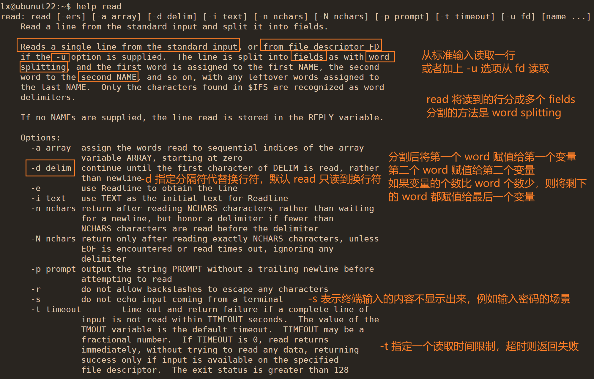  
      
- read [options] [name ...]  
- read 将输入值分配给一个或多个变量，从标准输入读值，每个 word 分配给一个变量，剩余的全部内容分配给最后一个变量  
- $IFS 作为默认 word delimiters  
- 如果没有变量名，则将读入内容保存到 REPLY 变量中  
      
      
```bash  
[root@ubuntu22-c0 ~]$ read  
a1  
[root@ubuntu22-c0 ~]$ echo $REPLY  
a1  
[root@ubuntu22-c0 ~]$ read  
a b c  
[root@ubuntu22-c0 ~]$ echo $REPLY  
a b c  
```  
```bash  
[root@ubuntu22-c0 ~]$ read -p "> " var1 var2  
> a1 a2 a3  
[root@ubuntu22-c0 ~]$ echo $var1  
a1  
[root@ubuntu22-c0 ~]$ echo $var2  
a2 a3  
```  
```bash  
[root@ubuntu22-c0 ~]$ read -p "> " var1  
> a b c  
[root@ubuntu22-c0 ~]$ echo $var1  
a b c  
```  
      
#### read -p 指定输入内容时的提示  
```bash  
[root@ubuntu22-c0 ~]$ read -p "input number: "  
input number: 1 2 3  
[root@ubuntu22-c0 ~]$ echo $REPLY  
1 2 3  
```  
      
#### read -s 不显示输入内容  
如用于输入密码  
      
#### read -n 指定输入长度  
      
#### read -d 指定结束符  
默认为换行符  
      
### 设置空变量  
```bash  
var=  
var=""  
```  
      
## 为变量设置默认值  
- 见 `${ } shell parameter expansion`  
      
      
      
## unset 取消变量  
      
> unset [-f][-v][-n] [name ...]  
      
- 在脚本中设置的临时变量最好在最后 unset，以免影响执行环境  
- 无选项时默认将 name 当作变量，如果未找到变量，则从函数中查找  
- 有些变量，如 readonly 变量不能 unset  
      
### -f unset function  
      
### -v unset variable  
      
### -n nameref 属性变量  
> Unset the variable itself rather than the variable it references.  
      
      
# Bash Conditional Expressions  
> [Bash Conditional Expressions](https://www.gnu.org/savannah-checkouts/gnu/bash/manual/bash.html#Bash-Conditional-Expressions)  
      
> When used with `[[`, the `<` and `>` operators sort lexicographically using the current locale.  
> The `test` command uses ASCII ordering.  
      
      
      
## 文件判断  
      
- Unless otherwise specified, primaries that operate on files follow **symbolic links** and operate on the **target of the link**, rather than the link itself.  
      
      
### 选项  
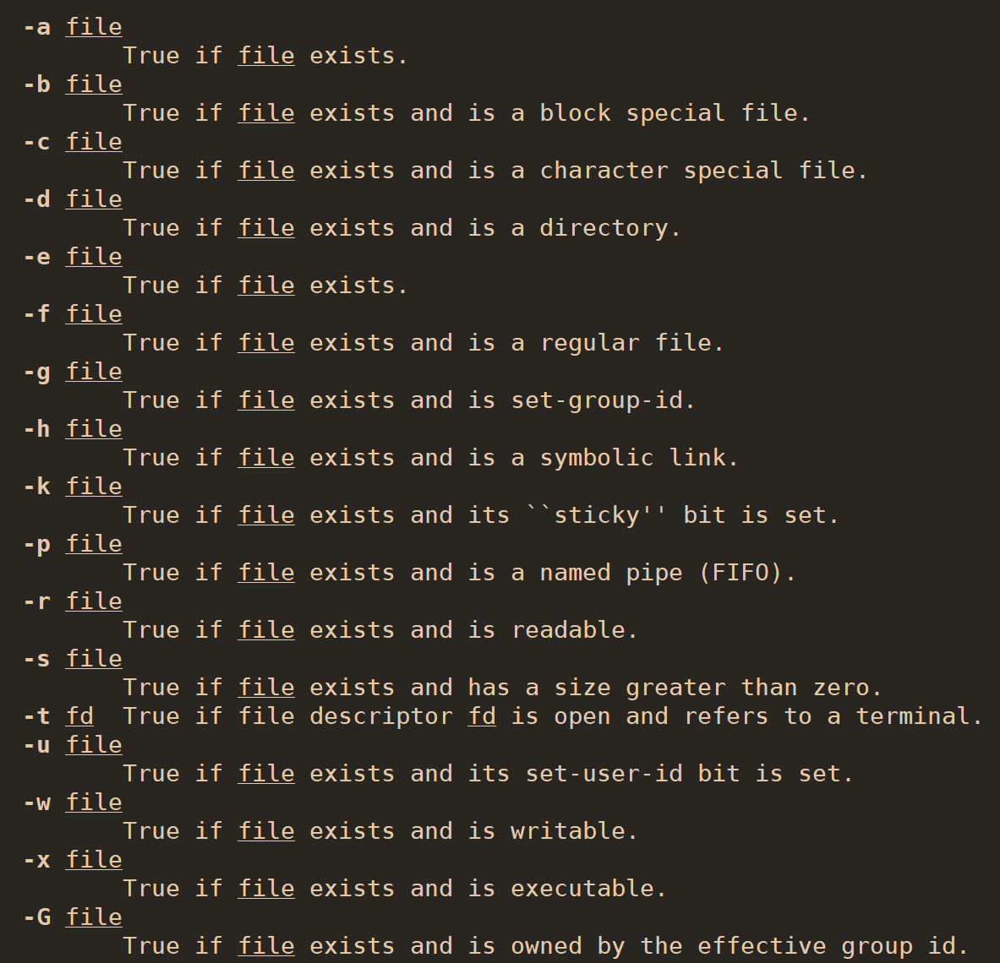  
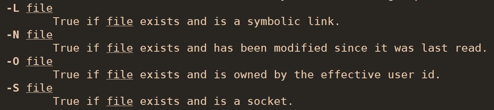  
      
### -a|-e 判断文件是否存在  
- `-a` 和 `-e` 都是判断文件是否存在  
- 有的版本用 `-a` 可能有问题，最好用 `-e`  
- 这种判断文件不区分文件类型  
      
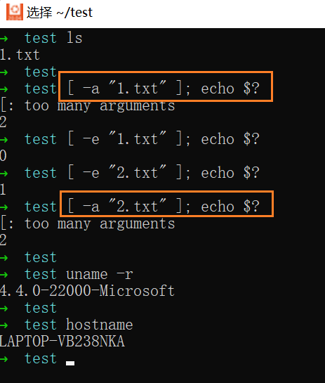  
      
      
### -f|-d|-b|-c|-p|-h|-L|S 根据文件类型判断  
- `-f` 判断普通文件（regular file），符号链接和硬链接文件也会判断  
- `-d` 判断目录  
- `-b` 判断块文件（block special file）  
- `-c` 判断字符文件（character special file）  
- `-p` 判断管道文件（named pipe）  
- `-h` 和 `-L` 都是判断符号链接  
- `-S` 判断套接字文件（socket）  
      
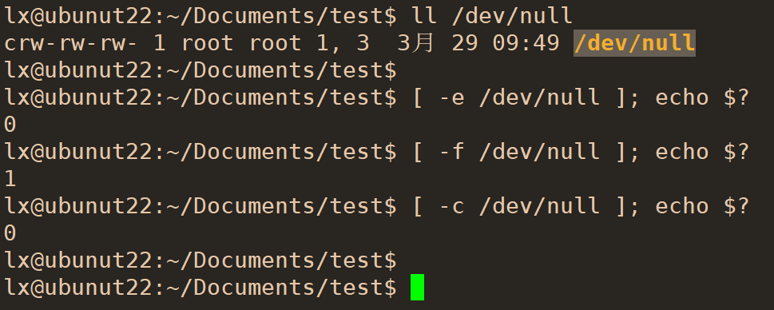  
  
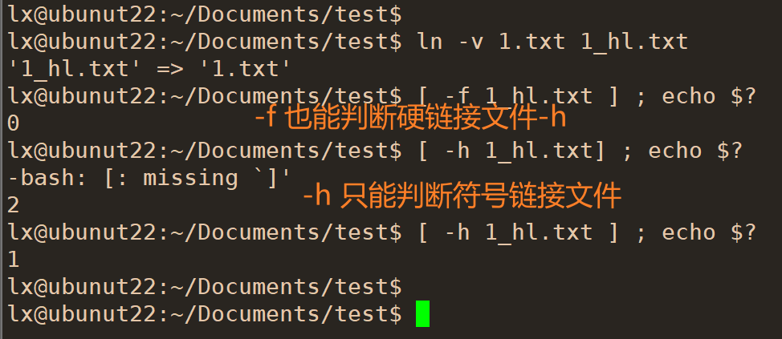  
      
      
### -r|-w|-x 根据文件权限判断  
- 注意 root 判断时特殊性，文件没有 r 和 w，root 也有这两项权限  
- 只要文件中 u, g 或 o 有一个有 x，权限，则 root 有 x，否则 root 也没 x 权限  
- 符号链接文件判断的是源文件  
      
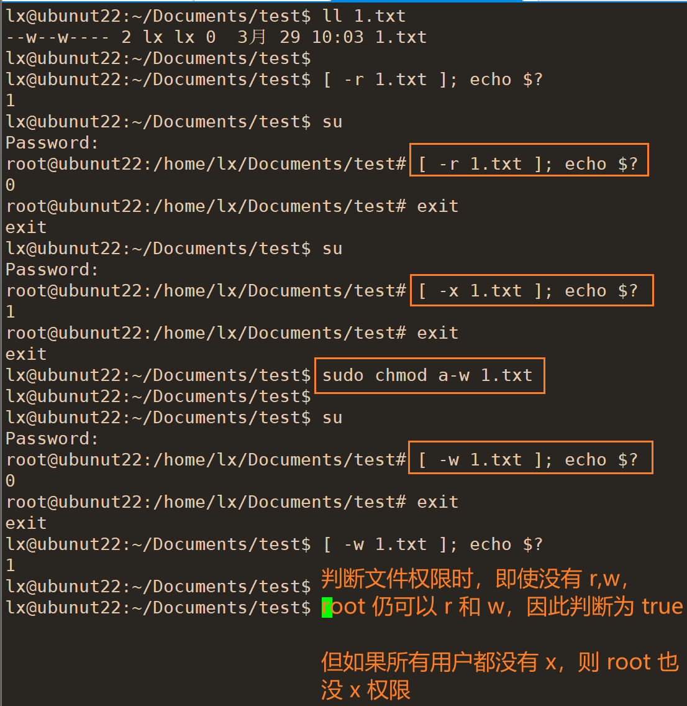  
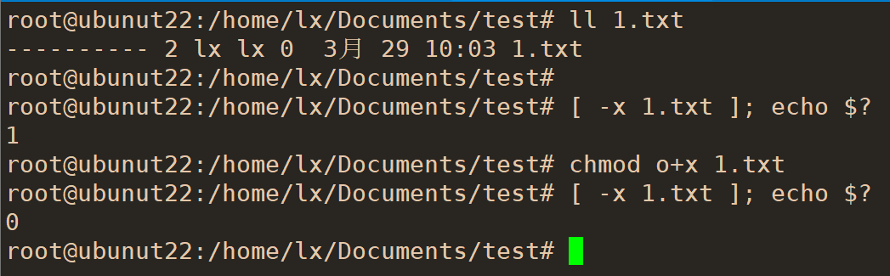  
  
      
### -u|-g|-k 根据文件特殊权限判断  
- `-u` 为设置 `SUID` 权限  
- `-g` 为设置 `SGID` 权限  
- `-k` 为设置 `SBIT` 权限  
- 如果是符号链接文件，直接判断的是源文件而非符号链接文件  
      
  
      
      
### -N 判断文件是否修改过  
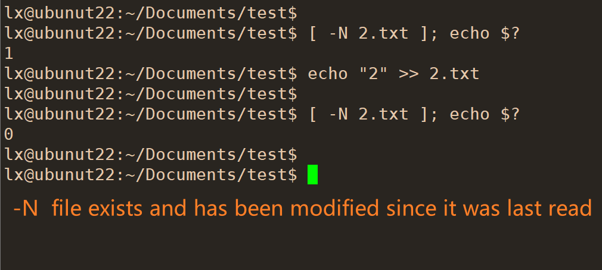  
      
      
### -O|-G 文件存在且有有效的 UID|GID  
- `-O` 文件存在且有有效的 UID  
- `-G` 文件存在且有有效的 GID  
      
### file1 -ef file2 两个文件相同  
- equal file  
- 两个文件同属某个文件的**硬链接**或者一个为另一个的**硬链接**  
- 两个文件的 inode 号相同，且属于一个分区的一个文件系统  
      
### file1 -nt file2 比较两个文件的时间  
- newer than  
- 比较的是 mtime  
- file1 必须存在  
- file2 不存在，file1 存在，返回 true  
      
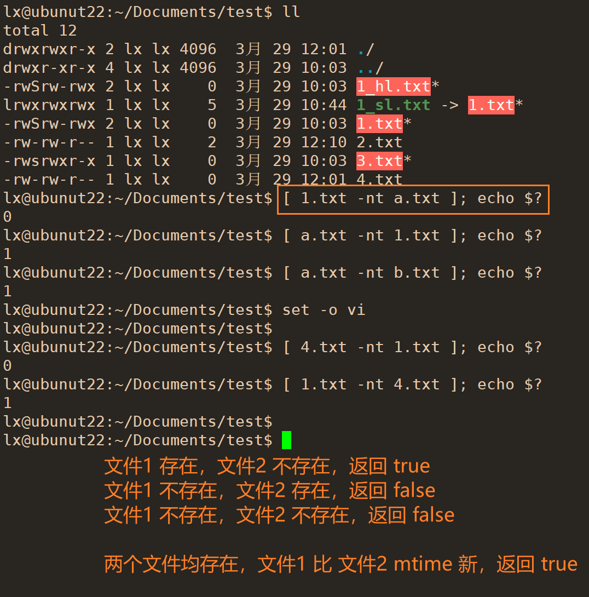  
      
      
### file1 -ot file2  
- older than  
- 比较 mtime  
- file1 不存在，file2 存在，返回 true  
      
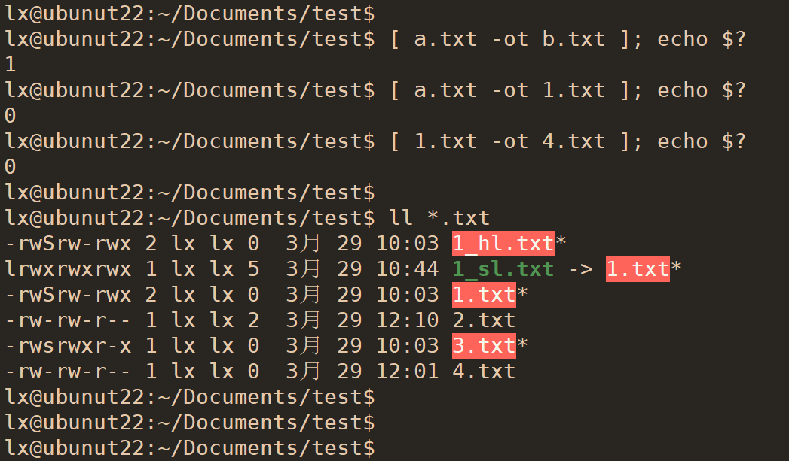  
      
      
## 变量判断  
      
### -v varname  判断变量是否赋值  
- True if the shell variable varname is set (has been assigned a value)  
- 变量赋值为空也可以  
  
      
      
### -R varname 变量是 name reference  
- True if the shell variable is set and is a name reference  
      
## -o optname shell 选项判断  
> [The Set Builtin](https://www.gnu.org/savannah-checkouts/gnu/bash/manual/bash.html#The-Set-Builtin)  
      
- True if the shell option optname is enabled  
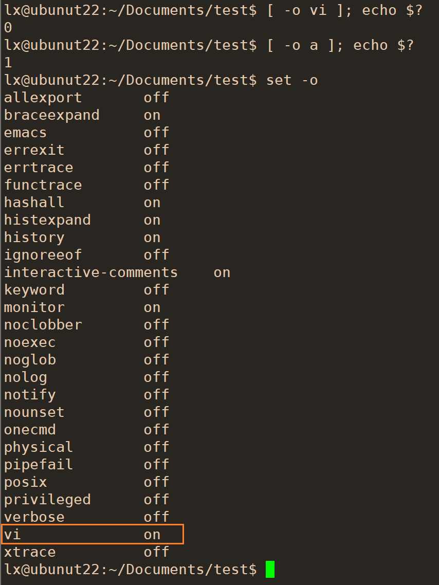  
      
      
## 字符串判断  
      
### -z 字符串长度为零  
- 字符串长度为 zero 则为 true  
- 字符串最好用双引号包围  
- 字符串中仅一个空格也不为空  
      
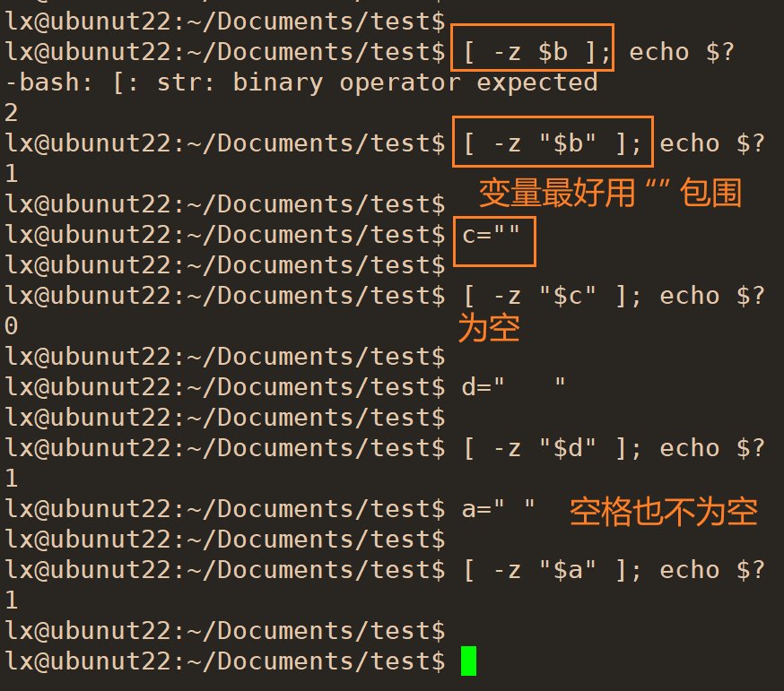  
      
      
### -n 字符串长度不为零  
- 字符串长度为 non-zero 则为真  
- 可以直接写字符串判断  
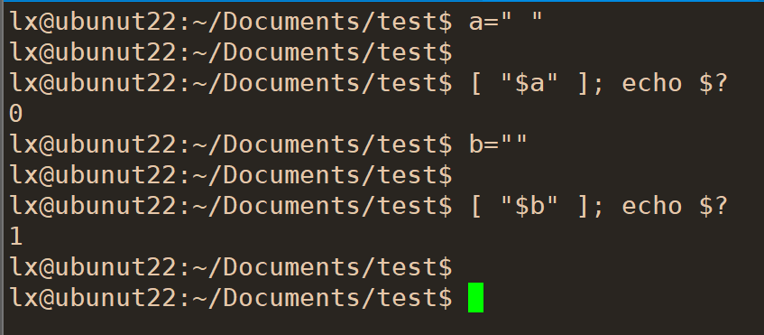  
      
      
### 字符串是否相等  
- 两种格式：string1 == string2 或 string1 = string2  
- 等号前后需要有空格，否则变成变量赋值  
- `=` should be used with the `test` command for POSIX conformance  
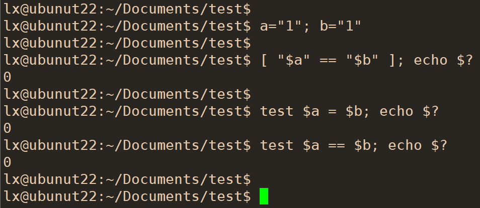  
      
### 字符串比较  
- string1 != string2  
- string1 < string2  
- string1 > string2  
      
  
      
## 整型数值比较  
> [Shell Basic Operators](https://www.tutorialspoint.com/unix/unix-basic-operators.htm)  
      
  
      
- Arg1 and Arg2 mau be positive or negative intergers  
      
      
# Shell Arithmetic  
> [Shell Arithmetic](https://www.gnu.org/savannah-checkouts/gnu/bash/manual/bash.html#Shell-Arithmetic)  
      
      
  
      
      
      
# Looping  
- 语句后加上 `;` 来代替换行  
- 用 `;` 分割命令，使得多个命令写在同一行  
- 条件中如果写 `:` 相当于 `true`  
  
        
## until  
```bash  
until [ condition ]  
do  
...  
done  
```  
或  
```bash  
until [ condition ]; do  
...  
done  
```  
      
- `until` 后面的条件不满足则执行循环，满足则退出循环  
- 最后的退出状态为最后一条指令的执行结果  
      
## while  
```bash  
while [ condition ]  
do  
...  
done  
```  
      
- 满足条件则执行循环  
      
### while read  
> [Bash: while read line](https://linuxhint.com/while_read_line_bash/)  
      
- 从标准输入读写入变量中  
- 遍历文件或文本的每一行  
      
```bash  
[root@ubuntu22-c0 ~]$ echo $PS2  
read:  
[root@ubuntu22-c0 ~]$ cat <<EOF > test.txt  
read: a b c  
read: 1  
read: 2 3  
read: EOF  
[root@ubuntu22-c0 ~]$ cat test.txt  
a b c  
1  
2 3  
```  
```bash  
[root@ubuntu22-c0 ~]$ n=1; while read line; do echo line$n: $line; let n+=1;  done < test.txt  
line1: a b c  
line2: 1  
line3: 2 3  
```  
```bash  
[root@ubuntu22-c0 ~]$ n=1; while read l1 l2; do echo line$n: $l1, $l2; let n+=1;  done < test.txt  
line1: a, b c  
line2: 1,  
line3: 2, 3  
```  
      
### 示例  
- 判断一个网站能否访问  
```bash  
[root@ubuntu22-c0 ~]$ cat site.txt  
www.baidu.com  
www.jd.com  
www.google.com  
[root@ubuntu22-c0 ~]$ while read url; do  
read: curl -s --connect-timeout 1 $url &> /dev/null || echo "access $url failed"  
read: done < site.txt  
access www.google.com failed  
```  
      
- 查看 shell 为 /sbin/nologin 的用户和 UID  
```bash  
[root@ubuntu22-c0 ~]$ while read line; do  
read:    if [[ "$line" =~ /sbin/nologin$ ]]; then  
read:        echo $line | cut -d":" -f1,3  
read:    fi  
read: done < /etc/passwd  
```  
```bash  
[root@ubuntu22-c0 ~]$ grep "/sbin/nologin" /etc/passwd | cut -d":" -f1,3  
```  
      
      
## for  
### for ... do ... done  
```bash  
for arg in [list]  
do  
...  
done  
```  
```bash  
for var in con1 con2 con3 ...  
do  
...  
done  
```  
      
### for ((exp1; expr2; exper3))  
> [Syntax error: Bad for loop variable](https://stackoverflow.com/questions/30358065/syntax-error-bad-for-loop-variable)  
      
- 用这种格式，执行时可以正常执行，但 `sh -n` 检查时提示 `bad for loop variable`，改用 `bash -n` 无错误  
      
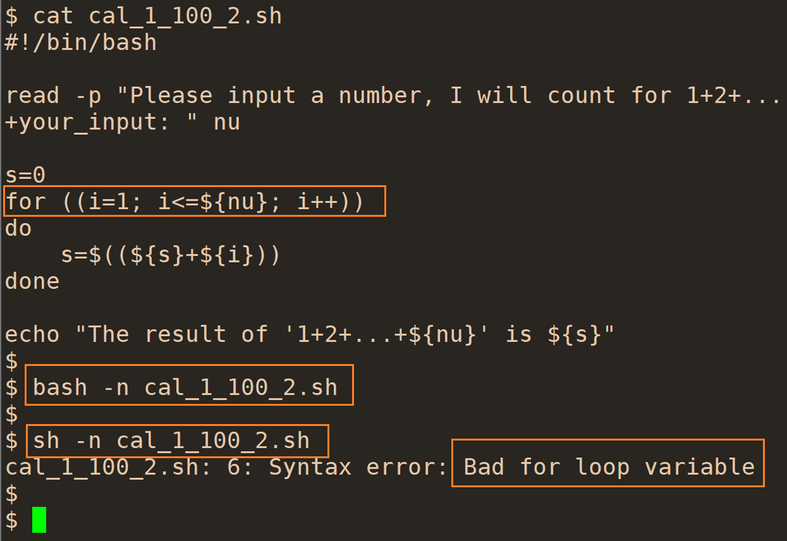  
      
## 循环控制语句 continue  
> [continue](https://www.gnu.org/savannah-checkouts/gnu/bash/manual/bash.html#index-continue)  
      
      
- `continue [n]`  
- Resume the next iteration of an enclosing `for, while, or select` loop.  
- 同 `break` 相同，当层循环的 n 为 1，默认的 n 为 1  
      
      
## 循环控制语句 break  
> [break](https://www.gnu.org/savannah-checkouts/gnu/bash/manual/bash.html#index-break)  
      
- break [n]  
      
- Exit from a `for, while, until, or select` loop  
      
- 后面可以指定一个数字，最小为 1，表名当层的循环  
      
- 不指定则退出最当层循环，即 n 为 1  
        
- 如果 n 为 2，则退出当层，和该层外面一层的循环  
      
# Conditional Constructs  
## if  
```bash  
if [ condition ]; then  
...  
fi  
```  
```bash  
if [ condition ]; then  
...  
elif [condition ]; then  
...  
else  
...  
fi  
```  
      
## case  
```bash  
case "$var" in  
    "$con1")  
        ...  
    ;;  
    "$con2|$con3")  
        ...  
    ;;  
    *)  
        ...  
    ;;  
esac  
```  
      
## select  
> [select](https://www.gnu.org/savannah-checkouts/gnu/bash/manual/bash.html#index-select)  
      
      
- 方便生成菜单  
- select name [in words ...]; do conmmand; done  
- words 会被扩展，产生一系列项，每项最前面是一个数字  
- 如果省略 `in words` 部分，则默认用 `$@`  
- select display the `PS3` prompt and reads a line from the standard input  
- 遇到 EOF 则终止并返回 1  
- The line read is saved in the variable `REPLY`  
- 可以用 `break` 终止  
      
      
```bash  
select name in words  
do  
...  
done  
```  
      
# Operators  
> [Shell Basic Operators](https://www.tutorialspoint.com/unix/unix-basic-operators.htm#)  
      
## Boolean Operators  
- `!` logical negation  
- `-o` logical **OR**  
- `-a` logical **AND**  
      
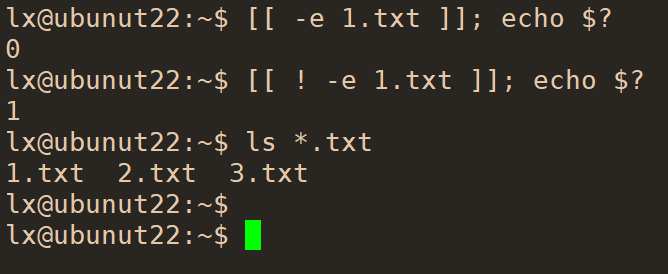  
      
## [ expression ] Test Expression  
- 方括号的两边要有空格  
- 字符串比较时最好用双引号包围  
      
### 区分 (( )) 和 [ ]  
In shell scripting, both `(( ))` and `[ ]` (or its equivalent `test` command) can be used for conditional tests. However, they differ in terms of syntax and functionality.  
      
1. `(( ))`:  
   - Syntax: `(( expression ))`  
   - Functionality: `(( ))` is primarily used for arithmetic expressions and performs numerical comparisons.  
   - Example:  
     ```bash  
     if (( 5 > 3 )); then  
         echo "5 is greater than 3"  
     fi  
     ```  
      
2. `[ ]` or `test` command:  
   - Syntax: `[ expression ]` or `test expression`  
   - Functionality: `[ ]` or `test` command is used for various types of conditional tests, including string comparisons, file existence checks, and numerical comparisons.  
   - Example:  
     ```bash  
     if [ "$var1" = "$var2" ]; then  
         echo "var1 is equal to var2"  
     fi  
     ```  
      
Here are some key differences between `(( ))` and `[ ]`:  
      
- Expression Type: `(( ))` deals with arithmetic expressions, while `[ ]` handles various types of expressions, such as string comparisons, file checks, and numerical comparisons.  
      
- Comparison Operators: `(( ))` uses arithmetic comparison operators like `<`, `>`, `<=`, `>=`, `==`, `!=`, etc., whereas `[ ]` uses string-specific comparison operators such as `=`, `!=`, `-eq`, `-ne`, `-lt`, `-gt`, `-le`, `-ge`, etc.  
      
- Variable Expansion: `(( ))` automatically expands variables, so you don't need to use the dollar sign `$` to reference variables. On the other hand, `[ ]` requires variable expansion using the dollar sign `$`, like `[ "$var" = "value" ]`.  
      
- True/False Values: In `(( ))`, a value of 0 is considered false, and any non-zero value is considered true. In `[ ]`, an exit status of 0 indicates true, and a non-zero exit status indicates false.  
      
- And/Or Operations: `(( ))` uses `&&` and `||` for logical AND and OR operations, respectively. `[ ]` uses `-a` and `-o` for AND and OR operations, respectively, or you can also use `&&` and `||` within `[ ]` in some shells.  
      
Overall, `(( ))` is mainly used for arithmetic comparisons, while `[ ]` or `test` command is more versatile and can handle a wider range of conditional tests.  
      
## [[ expression ]] Test Expression  
> [conditional expression](https://www.gnu.org/savannah-checkouts/gnu/bash/manual/bash.html#index-_005b_005b)  
> [Are double square brackets [[ ]] preferable over single square brackets [ ] in Bash?](https://stackoverflow.com/questions/669452/are-double-square-brackets-preferable-over-single-square-brackets-in-b)  
      
      
- The words between the [[ and ]] do not undergo word splitting and filename expansion.  
- Conditional operators such as `-f` must be unquoted to be recognized as primaries.  
      
      
### == 和 !=  
- 右边的字符串被认为是 [Pattern Matching](https://www.gnu.org/savannah-checkouts/gnu/bash/manual/bash.html#Pattern-Matching)  
  
      
- 使用通配符，不能用引号包围  
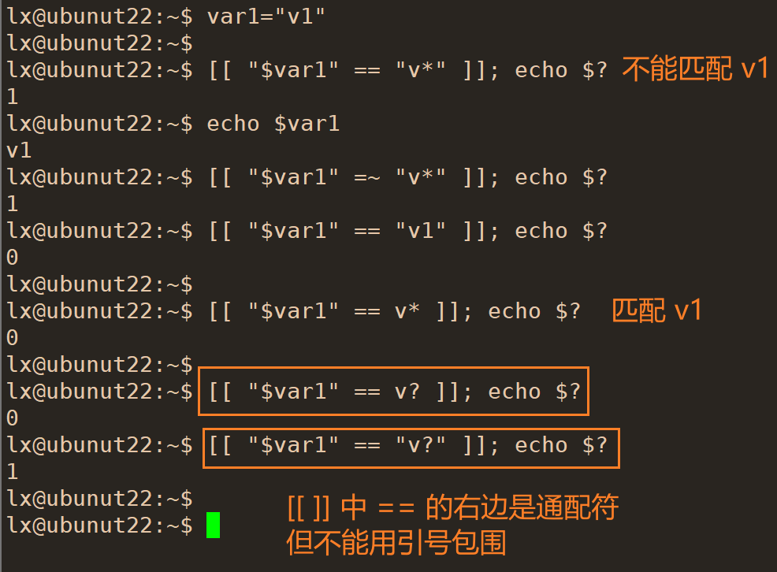  
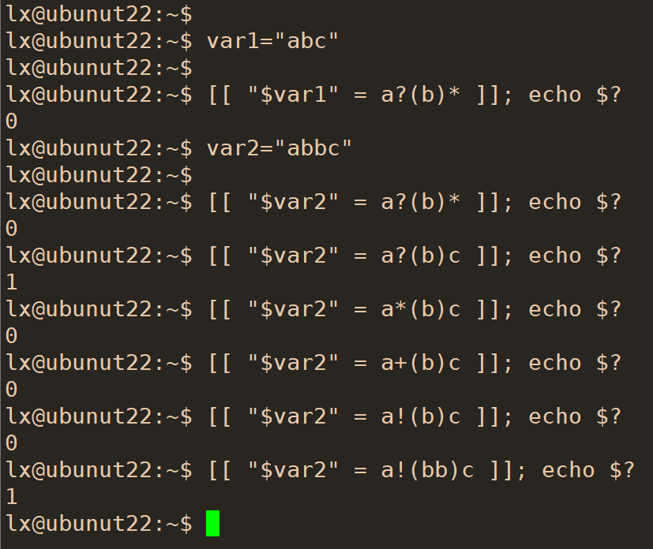  
      
### =~ 模式匹配  
- 左侧的字符串能否被右侧的正则表达式的模式匹配  
- 表达式位于 `[[ ]]` 为扩展的正则表达式  
- 右侧的字符串会被认为是 POSIX extended regular expression pattern and matched accordingly.  
      
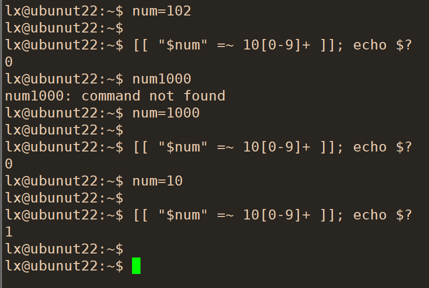  
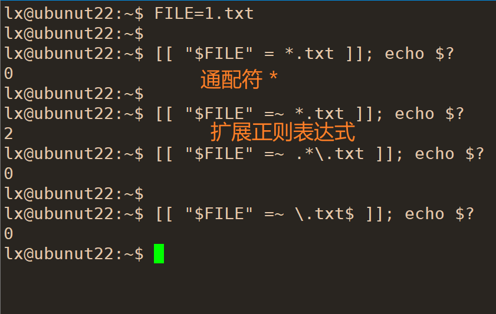  
    
- 可以添加标识  
    
      
## , comma operator  
- 逗号连接多个算术操作，返回最后一个的值  
      
## $'...' 进制转换  
- 将八进制或十六进制的数值转换为 ASCII 或 UNICODE 字符  
      
  
      
      
//TODO: 位置变量  
# Positional Parameters  
> [Positional Parameters](https://www.gnu.org/savannah-checkouts/gnu/bash/manual/bash.html#Positional-Parameters)  
      
## ?  
- `$?` 查看上个命令的退出状态值  
      
## $  
- `$$` expands to the process ID of the shell  
- In a subshell, it expands to the process ID of the **invoking shell, not the subshell**  
      
# Command Execution Environment  
> [Command Execution Environment](https://www.gnu.org/savannah-checkouts/gnu/bash/manual/bash.html#Command-Execution-Environment)  
      
      
# subprocess  
> [8.6. Shell Subprocesses and Subshells](https://docstore.mik.ua/orelly/unix3/korn/ch08_06.htm)  
      
- 直接执行 `bash` 会开启一个子进程，但该子进程不继承父进程的自定义变量，别名和 `set -o` 设置等  
- 执行一个 shell 脚本时，不同的调用脚本方式可以在当前进程执行（继承父进程的自定义变量，别名，set -o 等的临时设置）或者在一个 subprocess 中执行（不继承父进程的自定义变量等）  
      
A subprocess refers to the execution of an external command or script within the current shell script or command. It creates a separate process to run the command and communicates with it through input/output streams or by using command-line arguments.  
      
```bash  
#!/bin/bash  
      
# Execute an external command using subprocess  
output=$(ls -l)  
      
# Print the output  
echo "$output"  
```  
      
# subshell  
> [Command Execution Environment](https://www.gnu.org/savannah-checkouts/gnu/bash/manual/bash.html#Command-Execution-Environment)  
> [8.6. Shell Subprocesses and Subshells](https://docstore.mik.ua/orelly/unix3/korn/ch08_06.htm)  
      
      
A subshell refers to creating a child shell environment within the current shell,  
which operates as a separate instance with its own set of variables and environment.  
      
Any changes made within the subshell do not affect the parent shell.  
The subshell is useful for executing multiple commands together while keeping their environment isolated.  
      
例如通过 `( )` 创建一个 subshell  
```bash  
[root@ubuntu22-c0 ~]$ cat subshell.sh  
#!/bin/bash  
      
# Perform operations within a subshell  
(  
    # Assign a value to a variable within the subshell  
    count=10  
      
    # Print the variable value within the subshell  
    echo "Inside subshell: count = $count"  
)  
      
# Print the variable value outside the subshell  
echo "Outside subshell: count = $count"  
[root@ubuntu22-c0 ~]$ . subshell.sh  
Inside subshell: count = 10  
Outside subshell: count =  
```  
      
A 'subprocess' refers to executing an external command as a separate process,  
while a 'subshell' refers to creating an isolated shell environment within the current shell script.  
      
      
# 多个命令组合为一个整体 Grouping Commands  
> [Grouping Commands](https://www.gnu.org/savannah-checkouts/gnu/bash/manual/bash.html#Command-Grouping)  
      
- Bash 提供两种方法将多个命令组合成一个 group，因此执行时作为一个 unit。  
- When commands are grouped, redirections may be applied to the entire command list.  
      
## (list)  
> [Command Execution Environment](https://www.gnu.org/savannah-checkouts/gnu/bash/manual/bash.html#Command-Execution-Environment)  
> [Do parentheses really put the command in a subshell?](https://unix.stackexchange.com/questions/138463/do-parentheses-really-put-the-command-in-a-subshell)  
      
      
- 圆括号中的命令会在 subshell 中执行  
- 圆括号中的变量赋值不会影响父进程  
- Commands grouped with parentheses are invoked in a subshell environment that is a duplicate of the shell environment, except that traps caught by the shell are reset to the values that the shell inherited from its parent at invocation.  
- shell 调用 fork 函数来创建的子进程，因此子进程继承父进程的自定义的变量，别名，用 `set -o` 临时设置的参数等环境  
      
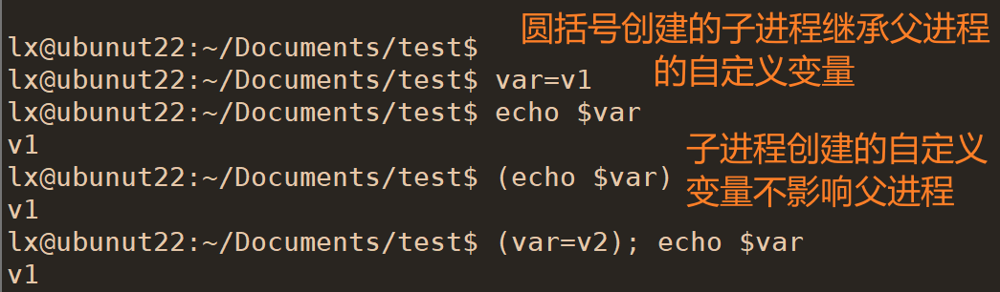  
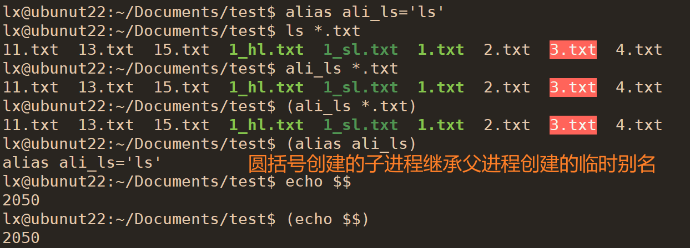  
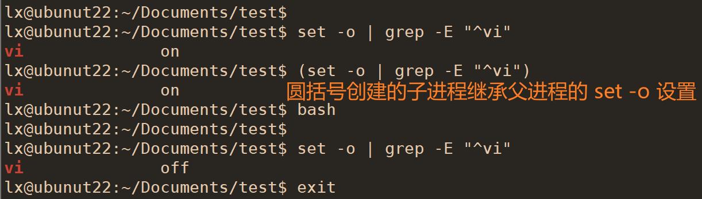  
      
- 圆括号创建了子进程后，子进程和父进程用独立的虚拟内存空间，因此子进程中的临时设置和自定义变量等不会影响父进程  
      
      
用途：  
- 多个命令组合一起执行  
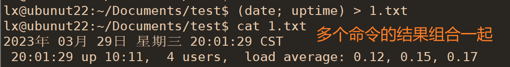  
      
- 临时做一些设置不影响父进程  
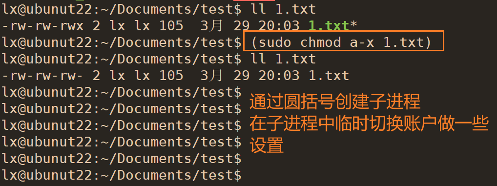  
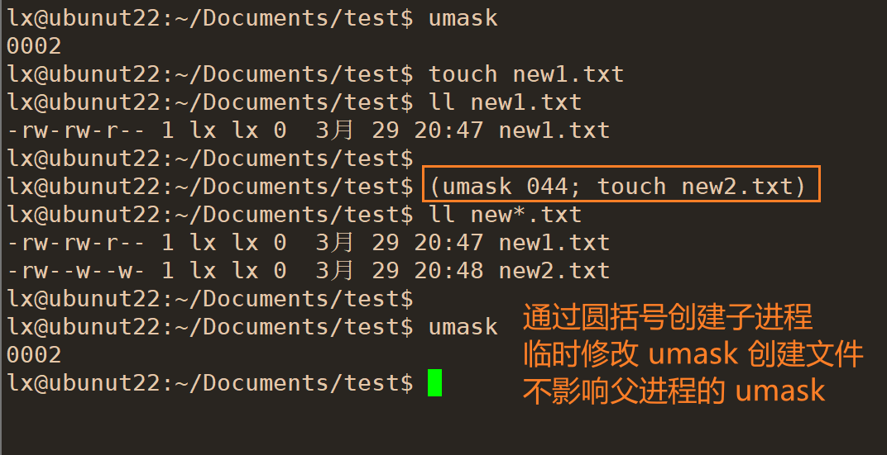  
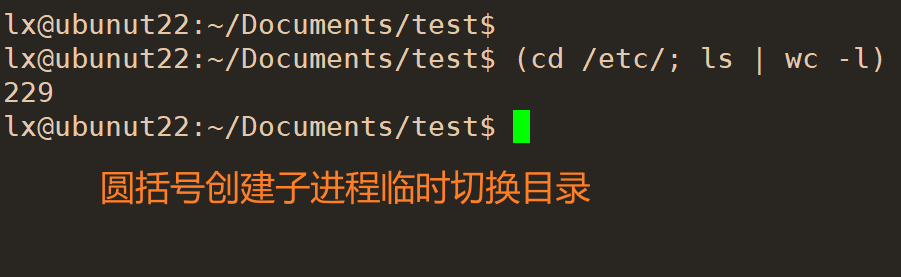  
      
## { list; }  
> [{ list; }](https://www.gnu.org/savannah-checkouts/gnu/bash/manual/bash.html#index-_007b)  
      
- 当前进程中执行命令  
- 可以将多个命令组合成一个整体，但不开启新的进程  
- 注意花括号两边要有空格，list 后面要有分号  
      
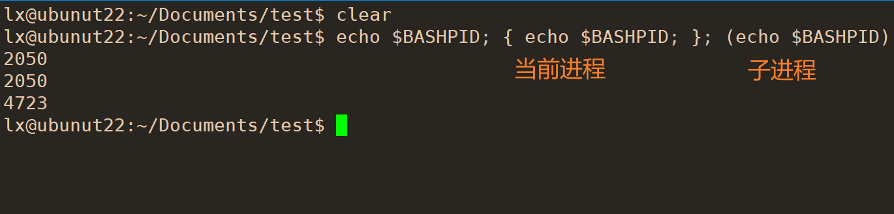  
      
      
# | pipeline  
> [pipeline](https://www.gnu.org/savannah-checkouts/gnu/bash/manual/bash.html#Pipelines)  
      
- 管道的左边必须要有标准输出，管道的右边要能支持标准输入（仅输入命令后回车，终端会等待输入）  
- 管道的两边都会开启子进程  
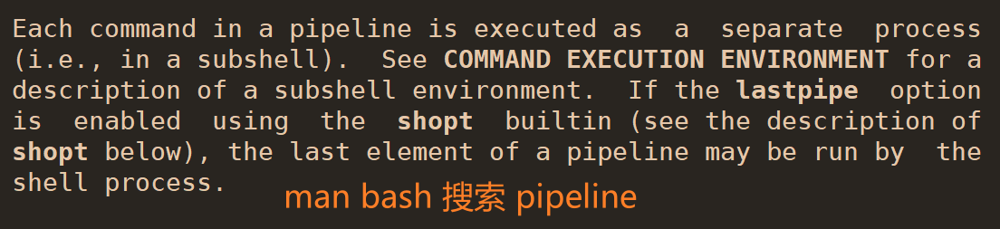  
- 管道的退出状态（exit status）是管道中最后一个命令执行的退出状态  
- If the lastpipe option is enabled using the **shopt** builtin [The Shopt Builtin](https://www.gnu.org/savannah-checkouts/gnu/bash/manual/bash.html#The-Shopt-Builtin), the last element of a pipeline may be run by the shell process when job control is not active.  
      
      
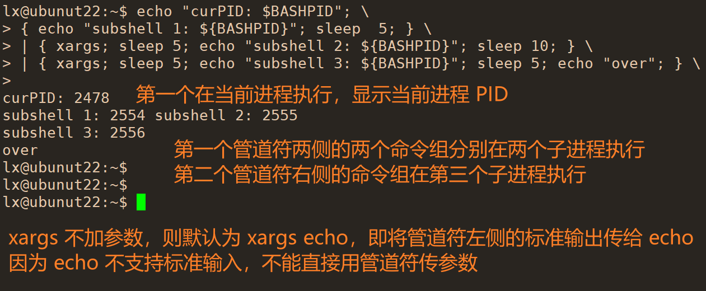  
      
      
# shell 内置命令（builtin commands）  
> [Shell Builtin Commands](https://www.gnu.org/savannah-checkouts/gnu/bash/manual/bash.html#Shell-Builtin-Commands)  
      
      
## Bourne Shell Builtins  
> [Bourne Shell Builtins](https://www.gnu.org/savannah-checkouts/gnu/bash/manual/bash.html#Shell-Builtin-Commands)  
      
      
### : null command  
> [a colon](https://www.gnu.org/savannah-checkouts/gnu/bash/manual/bash.html#Shell-Builtin-Commands)  
      
      
- `: [arguments]`  
- `NOP`  
- It may be considered as a synonym for the shell builtin `true`  
- exit status is `true` (0)  
- 如果在 `while` 循环的条件中写 `:` ，则相当于条件为 `true`  
- <font color=red>provide a placeholder where a binary operation is expected</font>，命令开头写 `:` 当占位符，这样 shell 不会将它后面的字符当作命令  
- `: >` 将文件清空，仅适用普通文件  
      
```bash  
[root@ubuntu22-c0 ~]$ :  
[root@ubuntu22-c0 ~]$ echo $?  
0  
```  
      
  
  
      
```bash  
# 相当于 while true  
while :  
do  
...  
done  
```  
      
```bash  
if condition  
then :  # do nothing  
else  
...  
fi  
```  
      
### . A Period  
> [a period](https://www.gnu.org/savannah-checkouts/gnu/bash/manual/bash.html#index-_002e)  
      
      
- `. filename [arguments]`  
      
- 和命令 `source` 效果相同  
      
- Read and execute commands from the filename arguments in the **current shell context**.  
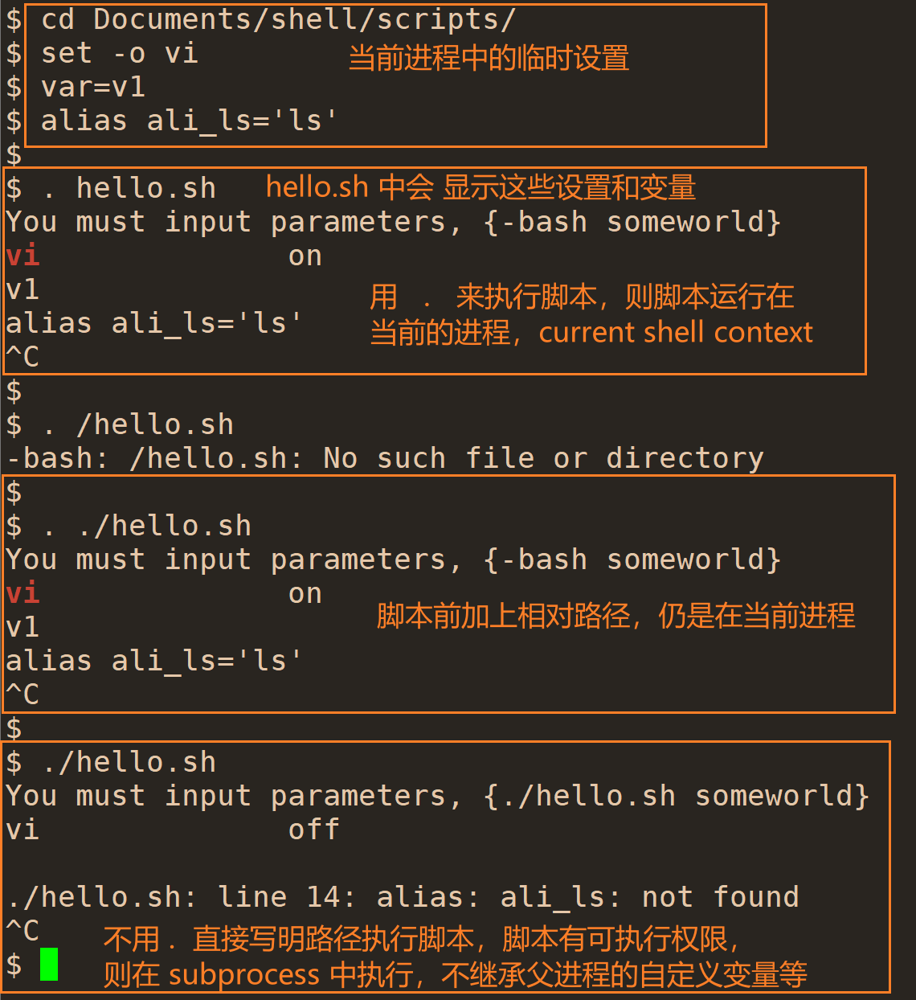  
      
- 用 `.` 执行脚本，脚本可以没有 `x` 权限  
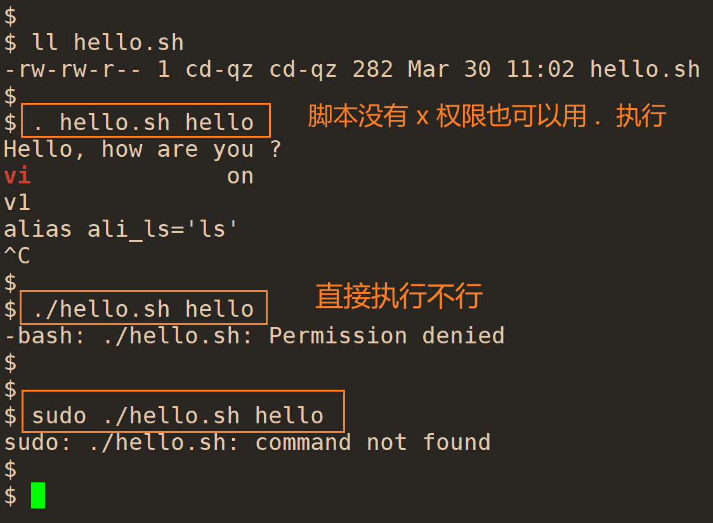  
      
- 如果执行时带参数，则脚本中用位置变量来获取参数的值  
      
- return status 时最后一条执行的命令的 exit status  
      
- 如果没命令执行，则 exit status 为 0  
      
- 如果文件名不存在或者文件不可读，则 return status 是非零  
      
      
### break  
> [break](https://www.gnu.org/savannah-checkouts/gnu/bash/manual/bash.html#index-break)  
      
- break [n]  
      
- Exit from a `for, while, until, or select` loop  
      
- 后面可以指定一个数字，最小为 1，表名当层的循环  
      
- 不指定则退出最当层循环，即 n 为 1  
        
- 如果 n 为 2，则退出当层，和该层外面一层的循环  
      
      
### continue  
> [continue](https://www.gnu.org/savannah-checkouts/gnu/bash/manual/bash.html#index-continue)  
      
      
- `continue [n]`  
- Resume the next iteration of an enclosing `for, while, or select` loop.  
- 同 `break` 相同，当层循环的 n 为 1，默认的 n 为 1  
      
      
### exit  
      
      
### eval  
> [eval](https://www.gnu.org/savannah-checkouts/gnu/bash/manual/bash.html#index-eval)  
      
- eval 会先扫描命令进行全部的置换，再执行命令  
- 适用于需要多次扫描的变量  
      
```bash  
[root@ubuntu22-c0 ~]$ n=4  
[root@ubuntu22-c0 ~]$ echo {1..$n}  
{1..4}  
[root@ubuntu22-c0 ~]$ eval echo {1..$n}  
1 2 3 4  
```  
      
      
### exec  
子进程中创建的变量，即使用 export 导出为环境变量，但在父进程中无法使用该变量  
      
可以用 exec  
      
#### exec $@  
In shell scripting, `exec $@` is a command often used to replace the current shell process with a new command or script, while preserving command-line arguments passed to the script.  
      
The `exec` command in shell is used to execute a command that replaces the current shell process. When `exec` is used without any command, it replaces the current process with the specified command. `$@` is a special variable that represents all command-line arguments passed to the script or function.  
      
So, when you use `exec $@`, it essentially replaces the current shell with the command and arguments that were passed to the script or function. This is commonly used when you want to execute a command without creating a new process, allowing the command to directly take over the shell process.  
      
      
1. Example with a shell script:  
```bash  
[root@ubuntu22-c0 ~]$ cat test.sh  
#!/bin/bash  
      
echo "Hello, world!"  
exec $@  
[root@ubuntu22-c0 ~]$ . test.sh sh  
Hello, world!  
# ps  
    PID TTY          TIME CMD  
   4038 pts/1    00:00:00 sh  
   4105 pts/1    00:00:00 ps  
# echo $-  
smi  
# echo $0  
sh  
```  
当执行 test.sh 脚本，给脚本传递的参数 `sh` 被 `$@` 捕获，该参数替换当前的 shell 进程，因此执行完当前 shell 变成 sh  
      
In the above example, the `exec $@` line ensures that the executed command takes over the current shell process, effectively replacing it. This can be useful in situations where you want the executed command to have the same environment settings and privileges as the original shell process.  
      
Please note that using `exec` will effectively terminate the script or function at that point, as the control flow will be transferred to the new command. Therefore, any code after `exec` will not be executed.  
      
      
### export  
> [export](https://www.gnu.org/software/bash/manual/html_node/Bourne-Shell-Builtins.html#index-export)  
      
> export [-fn] [-p] [name[=value]]  
> Make each name to be passed to child process in the environment.  
      
- 导出变量为环境变量，但是临时的，退出重新登录就无该变量  
- 导出后其子进程可以使用  
      
#### -f  
- 导出为函数  
- 默认为变量  
      
#### -n  
- Remove the export property from each NAME  
- 如果后面没有参数，则将全部变量的 export 属性移除  
      
#### -p  
- Display a list of all exported variables and functions  
      
      
      
### cd  
> [cd](https://www.gnu.org/savannah-checkouts/gnu/bash/manual/bash.html#index-cd)  
      
      
- Change the current working directory.  
      
- If the directory is not supplied, the value of the `HOME` shell variable is used.  
      
- If the shell variable `[CDPATH](https://www.theunixschool.com/2012/04/what-is-cdpath.html)` exists, it is used as a search path: each directory name in `CDPATH` is searched for directory, with alternative directory names in `CDPATH` separated by a colon (`:`). **If directory begins with a slash, `CDPATH` is not used.**  
      
      
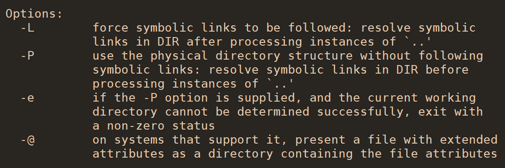  
      
#### -P 进入源目录而非符号链接目录  
      
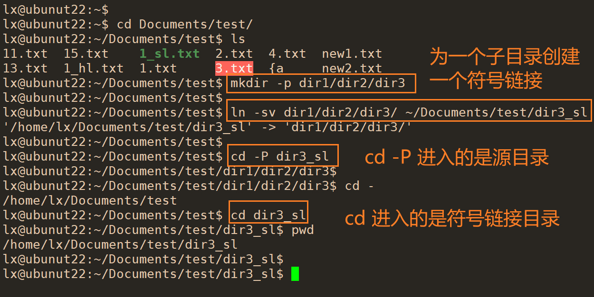  
      
#### -e 退出状态  
      
  
      
#### - 切换到上次的工作目录  
- 切换到 `OLDPWD` 环境变量的值所代表的目录  
      
      
## Bash Builtin Commands  
> [4.2 Bash Builtin Commands](https://www.gnu.org/software/bash/manual/html_node/Bash-Builtins.html)  
      
### let  
In shell scripting, the `let` command is used to perform arithmetic operations and update the value of variables. It allows you to easily perform calculations within your shell scripts.  
      
1. Basic Syntax:  
```bash  
let varname=expression  
```  
      
2. Arithmetic Operations:  
You can use common arithmetic operations, such as addition (+), subtraction (-), multiplication (*), division (/), and modulus (%), within the `let` command. Parentheses can be used to enforce precedence.  
      
Example:  
```bash  
[root@ubuntu22-c0 ~]$ let result="5+3"  
[root@ubuntu22-c0 ~]$ echo $result  
8  
```  
      
3. Increment and Decrement:  
The `let` command can be used to increment or decrement the value of a variable by a specified amount using the `+=` and `-=` operators.  
      
Example:  
```bash  
[root@ubuntu22-c0 ~]$ a=1; let a+=1; echo $a  
2  
```  
      
4. Bitwise Operations:  
The `let` command also supports bitwise operations, such as bitwise AND (`&`), bitwise OR (`|`), bitwise exclusive OR (`^`), bitwise left shift (`<<`), and bitwise right shift (`>>`).  
      
Example:  
```bash  
[root@ubuntu22-c0 ~]$ let "r=10&6"  
[root@ubuntu22-c0 ~]$ echo $r  
2  
[root@ubuntu22-c0 ~]$ let "r=10|6"; echo $r  
14  
[root@ubuntu22-c0 ~]$ let "r=10^6"; echo $r  
12  
[root@ubuntu22-c0 ~]$ let "r=10 << 2"; echo $r  
40  
[root@ubuntu22-c0 ~]$ let "r=10 >> 2"; echo $r  
2  
```  
      
### read 从标准输入读取一行内容  
> [read](https://www.gnu.org/savannah-checkouts/gnu/bash/manual/bash.html#index-read)  
> [read Command Syntax](https://bash.cyberciti.biz/guide/Getting_User_Input_Via_Keyboard)  
      
      
  
      
- $IFS 作为默认 word delimiters  
- 如果没有变量名，则将读入内容保存到 REPLY 变量中  
      
#### -p prompt 输入数据的提示  
- 在读数据前输出 PROMPT 字符串，不带换行符  
      
#### -t timeout 指定输入的时间  
- 时间单位为秒  
      
#### -s 不显示输入的内容  
- 适合输入密码的情况，看不到输入内容  
      
#### -r 不对 \ 转义  
- Do not allow backslashes to escape any characters  
- 如果输入的内容中有很多 `\` 时可用该选项  
      
      
### shift  
> [shift](https://www.gnu.org/savannah-checkouts/gnu/bash/manual/bash.html#index-shift)  
      
- shift [n]，默认 `n` 为1，即移除最左边的第 `n` 个参数，如果为 1，则原来的第二个参数变为第一个  
- 如果参数数目很多或者不固定，在脚本中可以用 shift，取走一个参数后，用 shift 移走第一个参数，这样原来的第二个参数变成第一个，脚本中只用 `$1` 取参数  
      
      
### printf  
> [printf](https://www.gnu.org/software/bash/manual/html_node/Bash-Builtins.html#index-printf)  
      
> printf [-v var] format [arguments]  
      
- `-v var` assign the output to shell variable `VAR` rather than display it on the standard output  
      
The `printf` command in the shell is used for formatted printing.  
It allows you to display text and variables with specific formatting options.  
      
```bash  
printf FORMAT [ARGUMENT]...  
```  
- `FORMAT` specifies the format string.  
- `ARGUMENT` (optional) represents the values or variables to be displayed.  
      
The `FORMAT` string can contain plain text and format specifiers, which start with a percent symbol `%`. Here are some commonly used format specifiers:  
      
- `%s`: Prints a string.  
- `%d` or `%i`: Prints a signed decimal integer.  
- `%f`: Prints a floating-point number.  
- `%c`: Prints a single character.  
- `%%`: Prints a literal percent symbol (%).  
      
Now, let's see some examples to understand how `printf` works:  
      
1. Printing a simple string:  
```bash  
printf "Hello, world!\n"  
```  
Output:  
```  
Hello, world!  
```  
      
2. Printing a variable:  
```bash  
name="John"  
printf "My name is %s\n" "$name"  
```  
Output:  
```  
My name is John  
```  
      
3. Formatting numbers:  
```bash  
number=42  
printf "Decimal: %d, Hexadecimal: %x, Octal: %o\n" "$number" "$number" "$number"  
```  
Output:  
```  
Decimal: 42, Hexadecimal: 2a, Octal: 52  
```  
      
4. Controlling width and precision:  
```bash  
float_value=3.14159  
printf "Float: %.2f\n" "$float_value"  
```  
Output:  
```  
Float: 3.14  
```  
      
5. Printing multiple values:  
```bash  
age=25  
gender="Male"  
printf "Name: %s, Age: %d, Gender: %s\n" "$name" "$age" "$gender"  
```  
Output:  
```  
Name: John, Age: 25, Gender: Male  
```  
      
LABEL: 函数  
# Shell Functions  
> [Shell Functions](https://www.gnu.org/savannah-checkouts/gnu/bash/manual/bash.html#Shell-Functions)  
      
## 环境函数  
类似环境变量，也可以定义环境函数，让子进程使用父进程的函数  
      
- declare -xf function_name  
- export -f function_name  
      
      
## 查看函数  
### declare -F 查看当前已定义的函数名  
```bash  
[root@ubuntu22-c0 ~]$ declare -F | head -n5  
declare -f __expand_tilde_by_ref  
declare -f __get_cword_at_cursor_by_ref  
declare -f __git_eread  
declare -f __git_ps1  
declare -f __git_ps1_colorize_gitstring  
```  
      
### declare -f 查看当前已定义的函数定义  
```bash  
[root@ubuntu22-c0 ~]$ declare -f | head  
__expand_tilde_by_ref ()  
{  
    if [[ ${!1-} == \~* ]]; then  
        eval $1="$(printf ~%q "${!1#\~}")";  
    fi  
}  
__get_cword_at_cursor_by_ref ()  
{  
    local cword words=();  
    __reassemble_comp_words_by_ref "$1" words cword;  
[root@ubuntu22-c0 ~]$  
```  
      
## unset -f 取消函数定义  
      
## 函数调用  
- 在交互式环境下定义函数  
- 将函数和脚本文件放在一起  
- 在文件中只定义函数  
      
函数在被调用时创建，返回时终止  
      
      
## 函数参数  
- func arg1 arg2 ...  
函数名后面以空白分隔参数列表  
      
- 函数体中用位置变量 $1, $2 等调用参数，或使用 $@, $*, $# 等  
      
## 函数变量  
### 普通变量  
函数外定义，仅在当前 shell 中有效，可在函数内修改  
      
### 环境变量  
当前 shell 和子 shell 中有效  
      
### 局部变量  
使用 local 定义，仅能在函数体内定义，仅在函数体内有效  
      
如果函数外有变量和函数内的同名，则在函数内使用变量时用的是函数内定义的变量  
      
## 函数返回值  
- 默认返回值为函数体最后一条命令的退出状态码  
- 可以用 return 自定义函数返回值，return 之后的语句不再执行  
   - return  
   返回值为前一条语句的退出状态码  
   - return 0  
   无错误返回  
   - return 1-255  
   有错误返回  
      
- exit 也可以结束函数执行并自定义返回值，但 exit 会中断整个脚本的执行，return 只会中断函数执行  
如果在当前 shell 执行一个脚本用 exit 退出，如用 source 命令执行脚本，则当前终端也会退出  
      
## 内置函数  
    
### getopts  
> [getopts](https://www.gnu.org/savannah-checkouts/gnu/bash/manual/bash.html#index-getopts)  
> [Small getopts tutorial](https://web.archive.org/web/20200507131743/https:/wiki.bash-hackers.org/howto/getopts_tutorial)  
> [Shell脚本中的while getopts用法小结](https://www.cnblogs.com/kevingrace/p/11753294.html)  
    
    
    
      
# 数组 array  
- 数值索引编号从 0 开始，可支持自定义索引，及关联索引  
- 支持稀疏格式数组，即索引不连续  
      
## 数组声明  
- declare -a 声明为 indexted array  
- declare -A 声明为 associated array  
      
## 数组赋值  
      
```bash  
[root@ubuntu22-c0 ~]$ declare -a arr_0  
[root@ubuntu22-c0 ~]$ arr_0[0]="a"  
[root@ubuntu22-c0 ~]$ arr_0[2]="c"  
```  
      
```bash  
[root@ubuntu22-c0 ~]$ declare -a arr_1  
[root@ubuntu22-c0 ~]$ arr_1=("1" "2" "3")  
```  
      
```bash  
[root@ubuntu22-c0 ~]$ declare -a arr_2  
[root@ubuntu22-c0 ~]$ arr_2=([0]="1" [3]="3")  
```  
      
```bash  
[root@ubuntu22-c0 ~]$ declare -a arr_3  
[root@ubuntu22-c0 ~]$ read -a arr_3  
a0 a1 a2  
```  
      
```bash  
[root@ubuntu22-c0 ~]$ arr=({a..e})  
[root@ubuntu22-c0 ~]$ echo ${arr[*]}  
a b c d e  
```  
## 查看全部数组  
- declare -a  
      
      
## 引用数组  
- 引用特定数组元素  
```bash  
[root@ubuntu22-c0 ~]$ echo ${arr_0[0]}  
a  
[root@ubuntu22-c0 ~]$ echo ${arr_0[1]}  
      
[root@ubuntu22-c0 ~]$ echo ${arr_0[2]}  
c  
```  
不写下标则显示第一个元素  
```bash  
[root@ubuntu22-c0 ~]$ echo $arr_0  
a  
```  
      
- 引用全部数组元素  
```bash  
[root@ubuntu22-c0 ~]$ echo ${arr_1[*]}  
1 2 3  
[root@ubuntu22-c0 ~]$ echo ${arr_1[@]}  
1 2 3  
```  
      
${arr_1[*]} treats the array as a single string  
${arr_1[@]} treats each element of the array as a separate word  
    
    
将脚本的参数保存到数组中  
```bash  
# 将命令行参数保存到数组中 不包括脚本名称  
# 使用括号将 $@ 包裹起来，以确保每个参数作为数组中的一个元素。  
# 同时，使用引号将其括起来，可以保留参数中的空格和特殊字符  
# 如 ./test.sh -a about -b "buy now" -c "hello world" foo bar baz  
# 需要将 buy now 作为数组的一个元素，则用引号括起来  
all_args=("$@")  
```  
    
将脚本名称和全部参数保存到数组中  
```bash  
# 将脚本名称添加到数组中  
args=("$0")  
    
# 将命令行参数添加到数组中  
for arg in "$@"; do  
  args+=("$arg")  
done  
    
# 显示参数的位置和值  
for ((i=0; i<${#args[@]}; i++)); do  
  echo "第 $i 个参数：${args[$i]}"  
done  
```  
    
      
## 显示所有数组下标  
```bash  
[root@ubuntu22-c0 ~]$ echo ${!arr[*]}  
0 1 2 3 4  
```  
      
## 查看数组长度  
```bash  
[root@ubuntu22-c0 ~]$ echo ${arr_0[0]}  
a  
[root@ubuntu22-c0 ~]$ echo ${arr_0[1]}  
      
[root@ubuntu22-c0 ~]$ echo ${arr_0[2]}  
c  
```  
```bash  
[root@ubuntu22-c0 ~]$ echo ${#arr_1[*]}  
3  
[root@ubuntu22-c0 ~]$ echo ${#arr_1[@]}  
3  
```  
      
## 删除数组元素  
```bash  
[root@ubuntu22-c0 ~]$ echo ${arr_1[@]}  
1 2 3  
[root@ubuntu22-c0 ~]$ echo ${#arr_1[@]}  
3  
[root@ubuntu22-c0 ~]$ echo ${!arr_1[@]}  
0 1 2  
```  
      
```bash  
[root@ubuntu22-c0 ~]$ unset arr_1[1]  
```  
      
```bash  
[root@ubuntu22-c0 ~]$ echo ${arr_1[@]}  
1 3  
[root@ubuntu22-c0 ~]$ echo ${#arr_1[@]}  
2  
[root@ubuntu22-c0 ~]$ echo ${!arr_1[@]}  
0 2  
```  
      
## 取部分数组元素  
- ${array[@]:offset:number}  
- ${array[*]:offset:number}  
      
offset: 要跳过的元素个数  
number: 要取出的元素个数，不写则取偏移量后的全部元素  
      
```bash  
[root@ubuntu22-c0 ~]$ num=({0..10})  
[root@ubuntu22-c0 ~]$ echo ${num[*]}  
0 1 2 3 4 5 6 7 8 9 10  
[root@ubuntu22-c0 ~]$ echo ${num[*]:3:4}  
3 4 5 6  
```  
      
      
## 关联数组  
- 关联数组必须先声明再使用，declare -A 声明  
- 关联数组可以自定义下标  
      
```bash  
[root@ubuntu22-c0 ~]$ declare -A arr_4  
[root@ubuntu22-c0 ~]$ arr_4=([a]=1 [b]=2 [c]=3)  
[root@ubuntu22-c0 ~]$ echo ${arr_4[*]}  
3 2 1  
[root@ubuntu22-c0 ~]$ echo ${!arr_4[*]}  
c b a  
[root@ubuntu22-c0 ~]$ arr_4[d]=5  
[root@ubuntu22-c0 ~]$ echo ${!arr_4[*]}  
d c b a  
```  
      
```bash  
[root@ubuntu22-c0 ~]$ for i in ${!arr_4[*]}; do  
> echo ${arr_4[$i]};  
> done  
5  
3  
2  
1  
```  
      
# 创建 shell 脚本时自动添加注释  
在 vim 配置文件添加下面自动命令  
```vim  
" 自动命令组 为 shell 脚本创建时自动添加说明信息  
augroup shellScriptAutoCmds  
autocmd!  
autocmd BufNewFile *.sh exec ":call AddShellScriptHeader()"  
function! AddShellScriptHeader()  
        call setline(1,"#!/bin/bash")  
        call setline(2,"#")  
        call setline(3,"#********************************************************************")  
        call setline(4,"#Author:            my name")  
        call setline(5,"#Date:              ".strftime("%Y-%m-%d"))  
        call setline(6,"#FileName:          ".expand("%"))  
        call setline(7,"#URL:               http://github.com")  
        call setline(8,"#Description:       shell script")  
        call setline(9,"#Copyright (C):     ".strftime("%Y")." All rights reserved")  
        call setline(10,"#********************************************************************")  
        call setline(11,"")  
        call setline(12,"")  
        call setline(13,"")  
endfunction  
autocmd BufNewFile * :normal G  
augroup END  
```  
      
# 信号捕捉工具 trap  
      
# shell 脚本  
> [电子书和shell脚本示例](https://pan.baidu.com/s/1g006A023DukmKht1k1ZrMg?pwd=jvlj)  
    
## 注意事项  
1. 幂等性  
执行多次结果相同，做一些条件判断，如以操作过则不重复执行等  
2. 注意执行环境  
是否需要加上环境变量，防止使用的某些命令不能执行  
3. 临时变量使用完后释放  
可以用 unset 释放创建的一些临时变量，防止干扰当前环境  
4. 注意处理标准输出和错误输出情况  
输出是否不显示，不显示则将内容重定向到 /dev/null  
5. 注意后续可扩展和易读性  
多使用变量，方便后续维护和可读  
6. 先有再完善  
写脚本时，先将其实现，后续逐步完善  
7. 为脚本添加可执行权限  
8. vim 中配置自动执行命令生成注释  
可以在 vim 配置文件中设置自动命令每次新建 .sh 脚本自动生成注释  
      
## ubuntu22.04 初始化脚本  
- 环境  
vmware 中安装 ubuntu22.04 无图形界面系统  
      
1. 修改软件源  
2. 安装并配置 git  
3. 配置 vim  
- 从 git 拉取 vim 配置文件，使其全局生效  
- 注意不同 vim 版本设置区别  
  先配置 vim 8.2 版本 （ubuntu22.04 安装版本），以后优化兼容其他版本  
- 配置新建 shell 脚本时自动添加注释  
4. 修改语言环境  
5. 修改时区  
6. 修改 bug  
见初始化笔记中记录的 bug  
