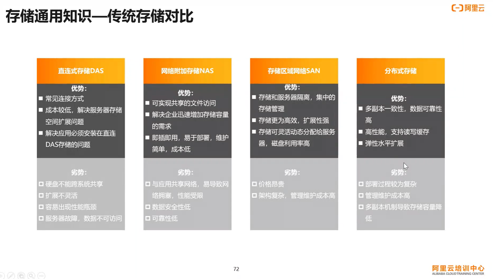
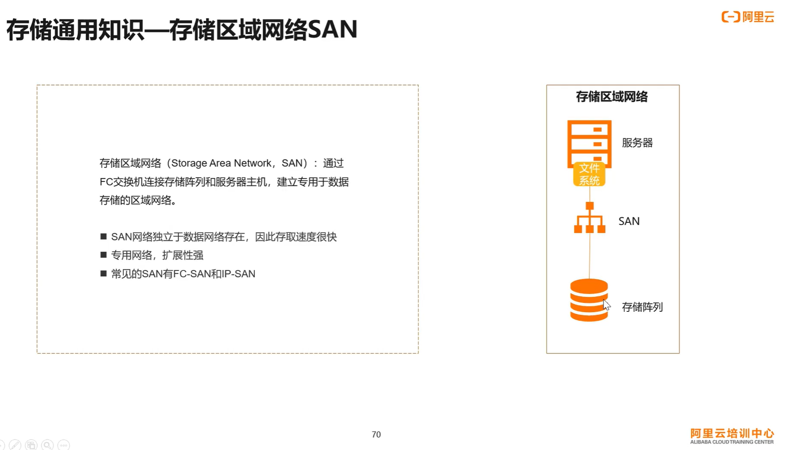
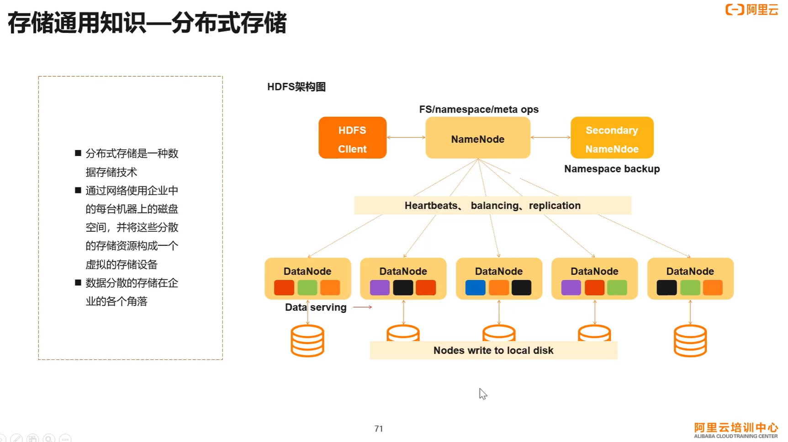
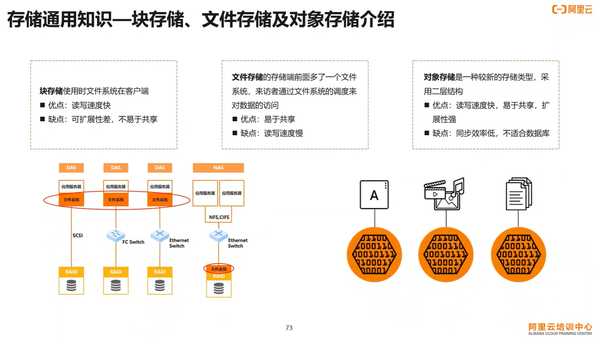

网络文件共享服务和数据同步  

> [Linux文件共享NAS和数据实时同步](https://www.bilibili.com/video/BV1ed4y1d77Y/?spm_id_from=333.999.0.0)  
> 鸟哥的Linux私房菜 服务器架设篇 第三版 第13章 文件服务器之一：NFS 服务器  
  
# 存储类型  
> [NAS vs SAN - Network Attached Storage vs Storage Area Network](https://www.youtube.com/watch?v=3yZDDr0JKVc&ab_channel=PowerCertAnimatedVideos)  


  

  
## 直连式存储 DAS  
- PC 中的硬盘或只有一个外部 SCSI 接口的硬盘簇（JBOD, just a bunch of disks）  
- DAS 指存储设备直接连接到服务器的总线上，存储设备只与一台独立的主机连接，其他主机不能使用这个存储设备  
- DAS 存储设备与服务器主机之间的连接通道通常采用 SCSI 连接  
  
## 网络附加存储 NAS  
- 存储设备通过标准的网络拓扑结构添加到一群计算机上  
- NAS 是文件级的存储方法，多用来进行文件共享  
- 即插即用，一般支持多台计算机，用户通过网络协议访问文档  
  
缺点：  
- NAS 备份过程中消耗网络带宽  
  
  
## 存储区域网络 SAN  
- 块级别的访问  
- SAN（Storage Area Network）存储是一种计算机存储架构，用于连接多台服务器和存储设备，以提供高性能、高可用性和可扩展的存储解决方案  
- SAN 将存储设备（如磁盘阵列、磁带库）与服务器通过专用的高速网络（如光纤通道）连接起来，形成一个独立的存储网络，与数据网络隔离      
- 允许任何服务器连接任何存储阵列  
- 可扩展性好  
- 高可用性  
- 适合大型应用或数据库系统  
  
缺点：  
- 成本高  
- 复杂  

  

  
## 分布式存储  
> [What is distributed storage, and why does it matter?](https://telnyx.com/resources/what-is-distributed-storage)  

  

## 文件存储、块存储和对象存储

  

  

### 对象存储  
> [什么是对象存储OSS](https://help.aliyun.com/zh/oss/product-overview/what-is-oss?spm=a2c4g.11174283.0.0.8f076987EcUKFU)  
> [对象概述](https://help.aliyun.com/zh/oss/user-guide/overview-18?spm=a2c4g.11186623.0.0.3dbc58afO7rqtt)  


对象存储是一种存储架构，用于存储和管理大规模数据的分布式存储系统  
与传统的文件系统或块存储不同，对象存储将数据组织为对象（Object），并为每个对象分配唯一的标识符（ID）  
每个对象包含数据本身以及与其关联的元数据（如对象的名称、大小、创建时间等）  

# 存储产品的性能指标    
## IOPS  
IOPS（Input/Output Operations Per Second）是衡量存储设备或存储系统性能的指标之一。它表示每秒钟能够执行的输入/输出操作的数量。IOPS通常用于衡量存储设备的读取和写入速度，特别是在随机访问模式下的性能。  

IOPS的值越高，表示存储设备或存储系统能够处理更多的输入/输出请求，具有更高的性能。IOPS的大小取决于多个因素，包括存储设备的类型（如硬盘驱动器或固态硬盘）、存储设备的规格（如转速、缓存大小）、存储系统的架构和配置等。  

在实际应用中，不同类型的存储设备和存储系统具有不同的IOPS能力。传统的机械硬盘驱动器（HDD）通常具有较低的IOPS，通常在几十到几百个IOPS范围内。而固态硬盘（SSD）通常具有更高的IOPS，可以达到几千甚至数万个IOPS。此外，通过使用多个存储设备进行并行操作或采用存储阵列等技术，可以进一步提高整个存储系统的IOPS能力。  

IOPS的重要性在于它对于许多应用场景的性能至关重要。例如，在数据库系统中，高IOPS能够提供快速的数据检索和处理能力，提高数据库的响应速度。在虚拟化环境中，高IOPS可以支持多个虚拟机之间的并发访问，提高系统的整体性能。  

## 吞吐量  
存储设备的吞吐量是指在一定时间内从存储设备读取或写入的数据量。它通常以数据传输速率（单位为字节/秒或位/秒）来表示，表示存储设备在数据传输方面的性能。  

存储设备的吞吐量受多个因素影响，包括存储设备的类型、接口类型、转速、缓存大小、数据传输协议等。  

以下是一些常见存储设备的吞吐量特点：

1. 机械硬盘驱动器（HDD）：传统的HDD通常具有较低的吞吐量。其吞吐量受到硬盘转速和数据密度的影响，一般在几十到几百兆字节/秒的范围内。  

2. 固态硬盘（SSD）：SSD通常具有更高的吞吐量。根据不同的SSD型号和接口类型（如SATA、PCIe），吞吐量可以从几百兆字节/秒提高到几千兆字节/秒甚至更高。  

3. 存储阵列（Storage Array）：存储阵列是由多个磁盘组成的存储系统。通过使用多个磁盘并行操作，存储阵列可以实现更高的吞吐量。吞吐量的大小取决于存储阵列的配置、磁盘数量和RAID级别等。  

4. 网络存储（Network Attached Storage，NAS）和存储区域网络（Storage Area Network，SAN）：对于NAS和SAN系统，吞吐量不仅取决于存储设备本身的性能，还取决于网络带宽和协议的限制。  

5. 光纤通道（Fibre Channel）和以太网（Ethernet）：这些是常用的存储网络接口。它们具有不同的吞吐量能力，光纤通道通常提供更高的吞吐量。  

要选择适合特定应用需求的存储设备，了解存储设备的吞吐量是很重要的。高吞吐量的存储设备可以提供更快的数据传输速度，适用于需要处理大量数据的应用，例如大规模数据分析、高性能计算等。  

## 访问时延  
存储设备的访问时延是指从发出读取或写入请求到实际完成该请求所需要的时间。它是衡量存储设备响应速度和延迟的指标之一。  

存储设备的访问时延受多个因素的影响，包括但不限于以下几个因素：  

1. 存储介质类型：不同类型的存储介质具有不同的访问时延。例如，机械硬盘驱动器（HDD）通常具有较高的访问时延，因为需要机械部件来定位和读取数据。相比之下，固态硬盘（SSD）通常具有更低的访问时延，因为它们没有机械部件，数据的访问是电子操作。  

2. 存储设备的规格和性能：存储设备的规格和性能对访问时延有影响。例如，HDD的转速和缓存大小可以影响其读取和写入数据的速度，进而影响访问时延。SSD的读取和写入速度也受到接口类型（如SATA、PCIe）和芯片控制器的性能影响。  

3. 存储设备的负载和并发访问：存储设备的负载和并发访问数量会影响访问时延。当存储设备同时处理多个读取或写入请求时，可能会导致延迟增加。  

4. 存储设备的接口和协议：存储设备的接口和协议也会对访问时延产生影响。不同的接口类型（如SATA、SAS、PCIe）和协议（如SCSI、NVMe）会对访问时延和数据传输效率产生影响。  

访问时延对于许多应用场景非常重要。例如，在数据库系统中，较低的访问时延可以提供更快的数据检索和响应时间。在虚拟化环境中，较低的访问时延可以支持更高的虚拟机密度和更好的应用性能。  

需要注意的是，存储设备的访问时延不仅取决于设备本身的性能，还取决于整个存储架构的设计和配置。如使用存储阵列、缓存技术、存储协议的选择等，都可以对访问时延产生影响。  

# NFS  
- network file system，网络文件系统，基于内核的文件系统  
- NFS 属于 NAS 的一种存储方式  
- 可以通过网络，让不同的机器、不同的操作系统可以共享彼此的文件  
- 对于用户来说，远程主机的文件就好像自己的一个磁盘分区一样  
- NFS 用来传输数据的端口号是随机选择的  
- 客户端通过远程过程调用（remote procedure call，RPC）协议来获取 NFS 服务器的端口号  
  
# RPC   
- remote procedure call，远程过程调用  
- 因为 NFS 支持的功能太多，不同的功能会使用不同的程序启动，每启动一个程序就会用到一些端口  
因此，NFS 的功能所对应的端口不固定，而是随机选择一些未被使用的端口用于传输  
- NFS 服务端启动程序后会选择端口，并主动向 RPC 注册，因此 RPC 知道 NFS 服务程序使用的端口  
- RPC 的主要功能是告知客户端 NFS 服务端已注册的端口  
- 客户端和服务端都要启动 RPC  
  
# NFS 软件安装  
  
1. 安装 NFS 主程序  
- rocky8.6  
```bash  
root@Rocky8 ~ $ yum install nfs-utils  
```  
包含服务端和客户端包  
  
- ubuntu22.04  
服务端包：  
```bash  
[root@ubuntu2204 ~]$ apt install nfs-kernel-server  
```  
  
客户端包：  
```bash  
[root@ubuntu2204 ~]$ apt install nfs-common  
```  
  
```bash  
[root@ubuntu2204 ~]$ systemctl status nfs-server.service  
● nfs-server.service - NFS server and services  
     Loaded: loaded (/lib/systemd/system/nfs-server.service; enabled; vendor preset: enabled)  
     Active: active (exited) since Wed 2023-09-13 21:59:43 CST; 2min 22s ago  
   Main PID: 6439 (code=exited, status=0/SUCCESS)  
        CPU: 7ms  
  
Sep 13 21:59:43 ubuntu2204 systemd[1]: Starting NFS server and services...  
Sep 13 21:59:43 ubuntu2204 exportfs[6438]: exportfs: can't open /etc/exports for reading  
Sep 13 21:59:43 ubuntu2204 systemd[1]: Finished NFS server and services.  
[root@ubuntu2204 ~]$ cat /proc/fs/nfsd/versions  
-2 +3 +4 +4.1 +4.2  
```  
  
2. 安装 RPC 主程序 rpcbind  
安装完 NFS 主程序后查看，已有则不用再安装  
  
3. 安装后启动服务  
查看 nfs-server 和 rpcbind 两个服务，每有启动则启动  
```bash  
[root@ubuntu2204 ~]$ systemctl status nfs-server.service  
[root@ubuntu2204 ~]$ systemctl status rpcbind.service  
```  
  
# NFS 启动的主要进程  
NFS 服务器启动时要向 RPC 注册，因此 NFS 服务器也称为 RPC Server 之一  
NFS 服务器需要进行文件系统的共享，文件系统的共享与权限有关，因此 NFS 服务器启动至少需要两个 daemons:  
- 管理客户端能否登录  
- 管理客户端能取得的权限  
  
## rpc.nfsd  
最主要的 NFS 进程，管理客户端能否登录  
  
## rpc.mounted  
管理 NFS 文件系统，在用户登录后，经过权限认证  
该程序会读 NFS 的配置文件 /etc/exports 来对比客户端的权限  
  
也用来挂载和卸载 NFS 文件系统  
  
## rpc.locked  
非必要  
管理文件的锁定，避免同时写文件  
必须服务端与客户端均启用才生效  
  
## rpc.statd  
非必要  
检查文件的一致性，与 rpc.locked 有关  
如果客户端同时使用文件造成损坏时，rpc.statd 可以用来检测并尝试修复该文件  
必须服务端与客户端均启用才生效  
  
  
# NFS 软件结构  
- NFS 直接使用内核功能，内核必须支持 NFS  
  
## 主要配置文件  
- /etc/exports  
  
```bash  
# /etc/exports: the access control list for filesystems which may be exported  
#		to NFS clients.  See exports(5).  
#  
# Example for NFSv2 and NFSv3:  
# /srv/homes       hostname1(rw,sync,no_subtree_check) hostname2(ro,sync,no_subtree_check)  
#  
# Example for NFSv4:  
# /srv/nfs4        gss/krb5i(rw,sync,fsid=0,crossmnt,no_subtree_check)  
# /srv/nfs4/homes  gss/krb5i(rw,sync,no_subtree_check)  
#  
```  
配置文件格式见说明文档，或者 `man 5 exports`  
  
远程用户访问 NFS 服务器时，服务器进行权限等判断时看的是客户端用户的 uid 和 gid，而非用户名和组名  
  
- 注释以 `#` 开头  
  
- 共享目录 第一个主机(权限) 第二个主机(权限)  
权限参数以逗号间隔  
  
- 主机名的格式  
  - ip  
  10.0.0.200  
  - 网段   
  10.0.0.0/24 或 10.0.0.0/255.255.255.0  
  - 主机名  
  主机名要在 /etc/hosts 中解析  
  - 通配符  
  * 表示所有主机  
  
- 权限参数  
  - rw, ro   
  读写，只读  
  - sync, async  
  同步写入磁盘，异步写入磁盘（先缓存在内存中，稍后再写入磁盘）  
  - root_squash, no_root_squash  
  root_squash 则远程客户端 root 用户访问时身份压缩为匿名用户 nobody（不同系统版本可能不同，匿名用户，具体查看帮助说明）  
  no_root_squash 则远程客户端 root 用户访问 NFS 服务器还是以 root 身份，不压缩  
  - all_squash  
  所有远程访问的用户，其身份都被压缩为匿名用户 nobody (rocky8.6)  
  - anonuid, anongid  
  anon 指 anonymous，可以将远程访问的用户压缩成指定的用户，而非默认的匿名用户，可配合 all_squash 使用  
  ```bash  
  /data/       10.0.0.0/24(rw,all_squash,anonuid=150,anongid=100)  
  ```  
  这样设置，则客户端和服务端都要有相同的 UID 和 GID 的账号，客户端用此 UID 账号来访问共享的文件  
  
## NFS 文件系统维护命令 exportfs  
- /usr/sbin/exportfs  
- 主要用作服务端  
  
### exportfs -v 查看本机的所有 NFS 共享  
  
### exportfs -r 重读配置文件  
重新挂载 /etc/exportfs 里面的设置  
如修改 /etc/exportfs 文件，可用该命令挂载  
  
### exportfs -a 全部挂载所有的共享目录  
  
### exportfs -u 停止某个目录的挂载  
  
### exportfs -au 停止本机所有的共享  
  
  
## 共享资源的日志  
- /etc/lib/nfs/  
```bash  
[root@ubuntu2204 ~]$ ls /var/lib/nfs/  
etab  export-lock  nfsdcld  rmtab  sm  sm.bak  state  v4recovery  
```  
  
## 客户端查询服务器共享资源的命令 showmount  
- /usr/sbin/showmount  
- 主要用在客户端  
  
### showmount -e hostname 查看远程主机的 NFS 共享  
```bash  
root@Rocky8 ~ $ showmount -e 10.0.0.201  
Export list for 10.0.0.201:  
/root/shell_scripts 10.0.0.0/24  
```  
# rpcinfo 查看 RPC 信息  
  
## rpcinfo -p hostname  
不指定主机名则查看本主机的 RPC 程序  
```bash  
[root@ubuntu2204 ~]$ rpcinfo -p  
  program vers proto   port  service  
  100000    4   tcp    111  portmapper  
  100000    3   tcp    111  portmapper  
  100000    2   tcp    111  portmapper  
  100000    4   udp    111  portmapper  
  100000    3   udp    111  portmapper  
  100000    2   udp    111  portmapper  
  100005    1   udp  56486  mountd  
  100005    1   tcp  46465  mountd  
  100005    2   udp  55999  mountd  
  100005    2   tcp  42341  mountd  
  100005    3   udp  32993  mountd  
  100005    3   tcp  37131  mountd  
  100024    1   udp  38976  status  
  100024    1   tcp  38463  status  
  100003    3   tcp   2049  nfs  
  100003    4   tcp   2049  nfs  
  100227    3   tcp   2049  
  100021    1   udp  51959  nlockmgr  
  100021    3   udp  51959  nlockmgr  
  100021    4   udp  51959  nlockmgr  
  100021    1   tcp  38839  nlockmgr  
  100021    3   tcp  38839  nlockmgr  
  100021    4   tcp  38839  nlockmgr  
```  
  
上面的 111 端口是 rpcbind 使用的端口，同时开启 tcp 和 udp 的 111 端口  
该端口固定的，因为客户端需要向 rpcbind 查询 NFS 服务端的端口，因此该端口需要固定  
  
## rpcinfo -s hostname  
```bash  
[root@ubuntu2204 ~]$ rpcinfo -s  
  program version(s) netid(s)                         service     owner  
  100000  2,3,4     local,udp,tcp,udp6,tcp6          portmapper  superuser  
  100005  3,2,1     tcp6,udp6,tcp,udp                mountd      superuser  
  100024  1         tcp6,udp6,tcp,udp                status      118  
  100003  4,3       tcp6,tcp                         nfs         superuser  
  100227  3         tcp6,tcp                         -           superuser  
  100021  4,3,1     tcp6,udp6,tcp,udp                nlockmgr    superuser  
```  
  
# 客户端挂载 NFS   
  
挂载选项：  
- _netdev 无网络服务时不挂在 NFS 资源  
  
## mount 临时挂载  
  
```bash  
mount -o rw 10.0.0.201:/root/shell_scripts /root/test/  
```  
  
## /etc/fstab 永久挂载  
如将远程主机 10.0.0.201 的共享目录挂载到本机 /root/scripts 目录，编辑 /etc/fstab 添加下面内容  
```bash  
10.0.0.201:/root/shell_scripts        /root/scripts  nfs   defaults,_netdev 0 0  
```  
  
修改完后用 mount -a 使配置文件的内容生效  
  
  
# 数据实时同步  
如 NFS 服务器的共享实时同步到其他服务器上，防止出故障  
  
实现方式：  
- inotify + rsync  
inotify 为异步文件系统事件监控机制，利用事件驱动监控文件系统中增删改等事件  
  
- sersync  

