Linux 软件管理

> [鸟哥的 Linux 私房菜](http://cn.linux.vbird.org/linux_basic/linux_basic.php)


# 软件包的分类
> [What are *-devel packages?](https://stackoverflow.com/questions/2358801/what-are-devel-packages)

- 一般软件内容分为一般使用和开发使用（devel package）
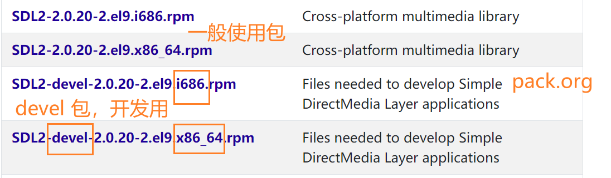
- 很多软件会以函数库的方式释放出部分功能以供其他软件调用
- 如安装 httpd 时有如下几个包
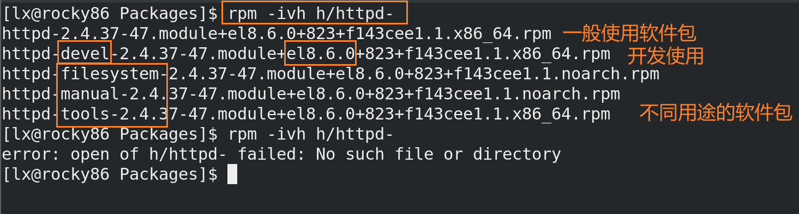


# 软件包管理
- 为了更好安装、卸载软件等，不用每次都要通过源码编译安装软件
- 将软件所有相关文件打包成一个特殊格式的文件
- 打包的文件包含**预先侦测系统**和**相依赖的脚本**
- 打包的文件会记录软件提供的所有文件信息等
- 安装软件时会进行环境检查，查看当前环境是否满足
- 安装软件时会进行属性依赖检查，即安装某个软件可能需要依赖其它一些软件，不安装依赖则无法安装该软件


# 软件安装方式
linux 中软件安装最常见的有两种：
- dpkg
debian/ubuntu 
- rpm
redhat/fedora


# 软件包依赖解决工具
- apt
debian/ubuntu 
针对 dpkg 包
- yum
redhat/fedora
针对 rpm 包
还有更新的管理工具 dnf 代替 yum


# RPM 包管理器
- 最早由 Red Hat 开发的包管理器
- 软件已经事先被编译过，因此软件安装时对主机环境有要求
- 安装软件前检查硬盘容量、操作系统版本等环境
- RPM 文件提供软件版本信息、相关依赖、软件用途、所含文件等信息
- RPM 文件使用数据库记录软件安装时必须具备的依赖属性软件以及其他参数等，便于软件升级、移除、验证、查询等
- 通常不同的 distribution 所释出的 RPM 文件不能用在其他的 distributions 上


## RPM 包文件命令
> [Package filename and label](https://en.wikipedia.org/wiki/RPM_Package_Manager#Package_filename_and_label)


- 版本号后面的 release 第一个数字为相同的版本 rebuilt 的次数，可能是修复一些小 bug 或重设一些编译参数等
- release 中的 `el` 时 `Red Hat Enterprise Linux` 的缩写，`8.7.0` 是适配 red hat 以及 centos 8.7.0 以上的版本 
- 硬件操作平台常用种类
  - i386
  - i686
  - x86_64
  - noarch
  没有硬件平台的限制


## RPM 仓库
> [The Origin of RPM Content](https://docs.pulpproject.org/en/2.19/plugins/pulp_rpm/tech-reference/rpm.html#)


- 根据功能不同将软件放在不同的仓库中，如 `AppStream` 和 `BaseOS`
- 仓库中，如 `AppStrem` 中有两个目录
	- Packages
	rpm 安装包
	- repodata
	存放元数据，用来描述 RPM 包的信息


## RPM 数据库目录 /var/lib/rpm
> [What is the purpose of the '/var/lib/rpm' directory?](https://access.redhat.com/solutions/439953)

- `/var/lib/rpm` 目录中包含 RPM 数据库
- RPM 数据库包含系统中安装的 RPM 包的信息
- 当使用 rpm 命令时会用到 RPM 数据库
- 当安装或移除 rpm 包时会修改数据库
- 但软guanguan其释放的软件内的文件放在其他目录中，如软件的使用手册说明放在 `/usr/share/doc` 目录中

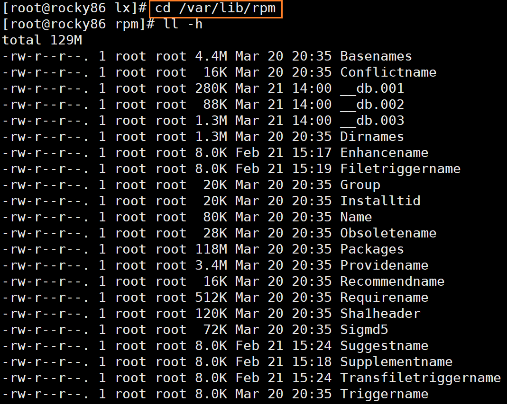


## 安装软件包
环境
- rocky 8.6
- 虚拟机

### 从光盘安装包
- rocky 8.6
- 从系统的光盘中获取 rpm 包
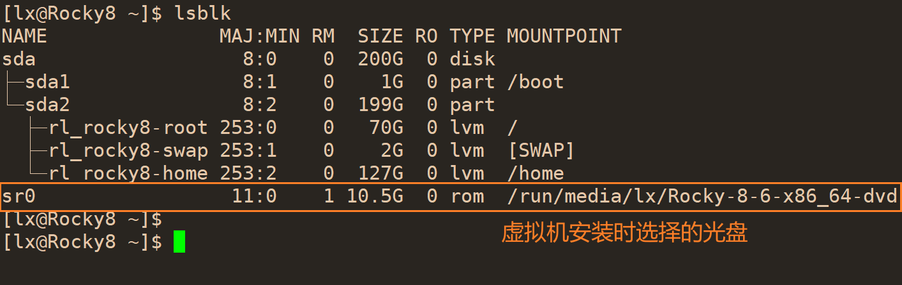


- 将光盘挂载到一个空目录
	- `lsblk` 查看光盘的文件
	
	- 光盘文件在 `/dev/cdrom` （`/dev/sr0` 软连接）
	
	- 新建一个目录 `/mnt/cdrom`，利用 `mount /dev/sr0 /mnt/cdrom` 挂载光盘 
	
	
	
	- 查看光盘的内容，包主要在两个仓库中：BaseOS 和 AppStream
		- BaseOS 放操作系统核心安装包
		- AppStream 仓库放用户常用的安装包

- 利用 rpm 安装，需要指定安装包的完整路径和文件名

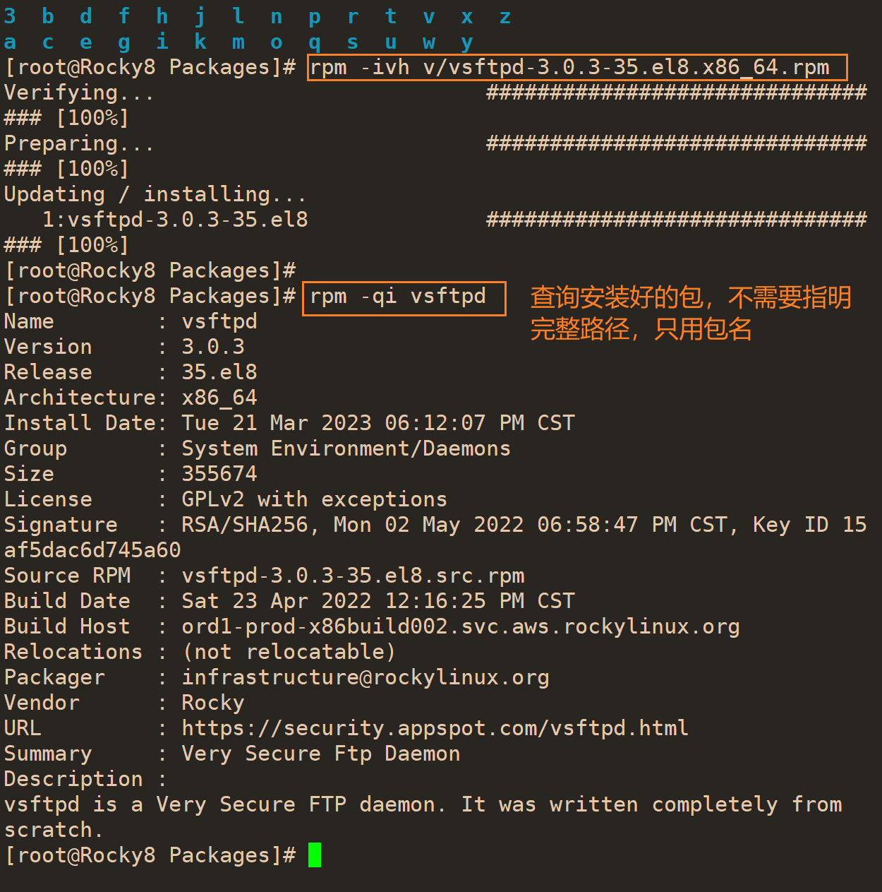

- 如果安装的包需要依赖，则 rpm 不能装成功

  

### rpm -i 安装软件
- 如果安装包需要依赖则安装不成功

- 从本地仓库安装需要写明完整路径


- rpm -i 安装软件包

- 加上 `-v` 选项显示 
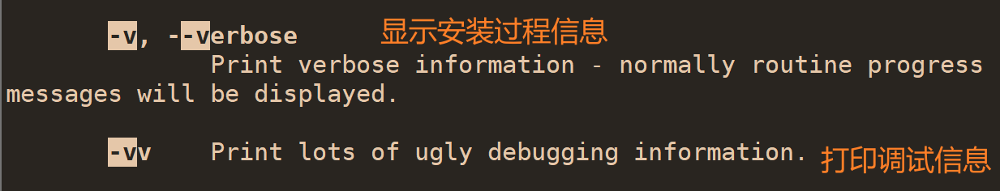

- 加上 `-h` 选项显示安装进度条


- 安装选项
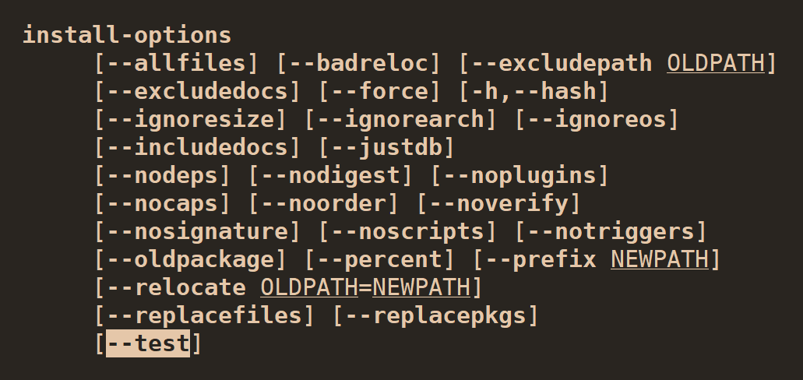

#### --test 安装前检查
- `-i` 选项后可以加一些选项，`--test` 可以不安装，仅检查能否安装


#### --replacepkgs 安装已经装过的软件


#### --replacefiles 覆盖文件
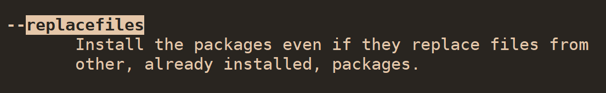


#### --justdb 更新数据库
- 如果 RPM 数据库破损或产生错误时，该选项可更新软件在数据库中的信息
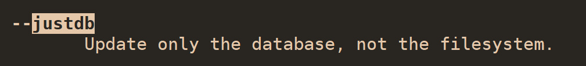


#### --nosignature 跳过数字签名检查

#### --noscripts 不执行某些脚本
- RPM 在软件安装过程中会自动执行一些操作，可加该选项禁止执行
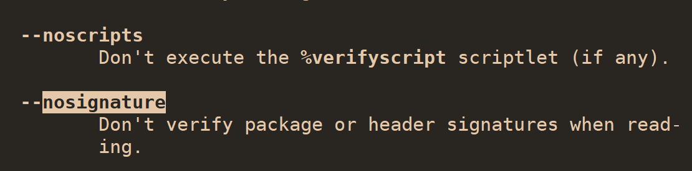


## 升级与更新
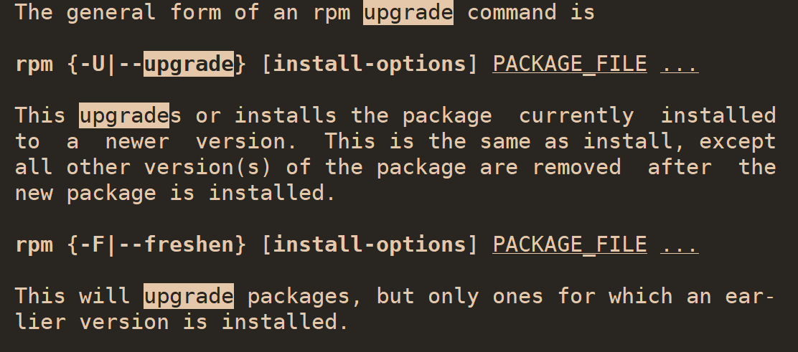

- rpm -Uvh 
	- 如果软件没安装过，则安装，和 `-i` 相同，除了安装后会删除其他版本

- rpm -Fvh
	- freshen
	- 只有软件安装过才更新，不会安装未安装的软件

## 安装旧版本
- rpm -Uvh --oldpackage packageName.rpm

## rpm -q 查询 RPM 包
- 查询是在 `/var/lib/rpm` 目录中查找数据库文件

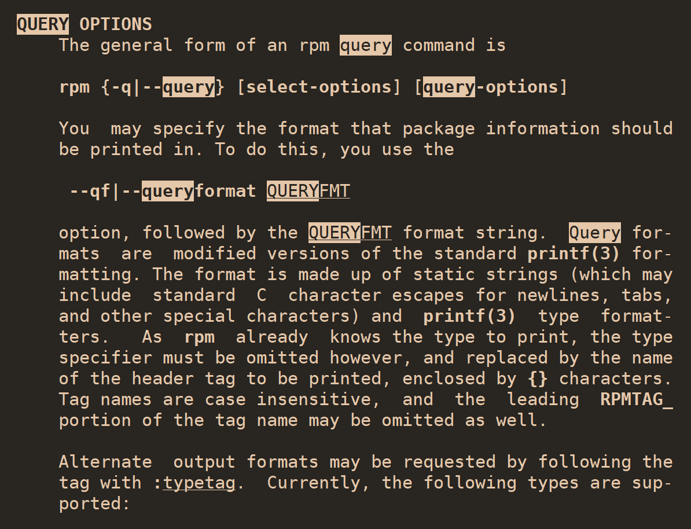

### rpm -qa 查询已安装的全部软件
- `rpm -qa` 不加文件名则查找全部已安装的软件
- 支持通配符查找某个软件
- 查找软件安装包时只用写包名字，不用写路径

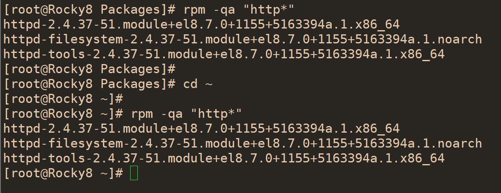

### rpm -q 查询某个软件是否已安装
- 后面接软件包的名字，不用写全路径
- 软件包的名字必须写对，不用写后面的版本号，只用写包名
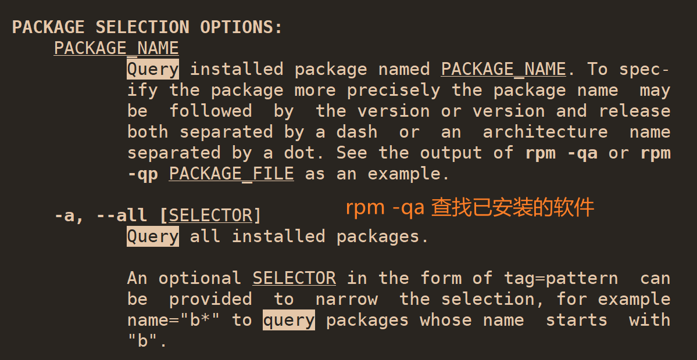
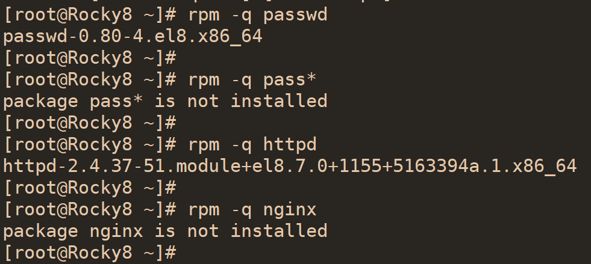

### rpm -qi 列出软件的详细信息
- `--info` 
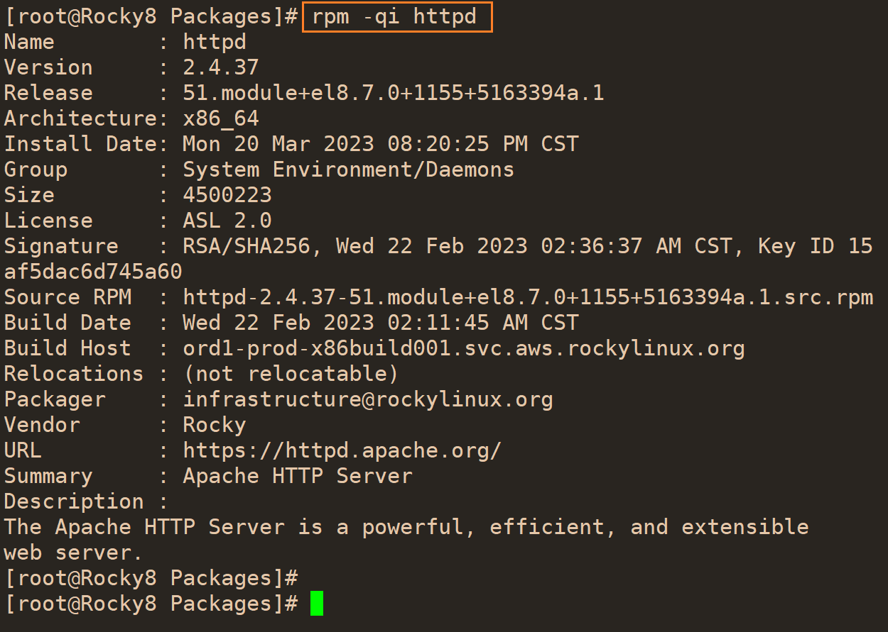

### rpm -ql 列出软件中的全部文件
- 列出软件安装完后释放出的文件列表以及完整的路径
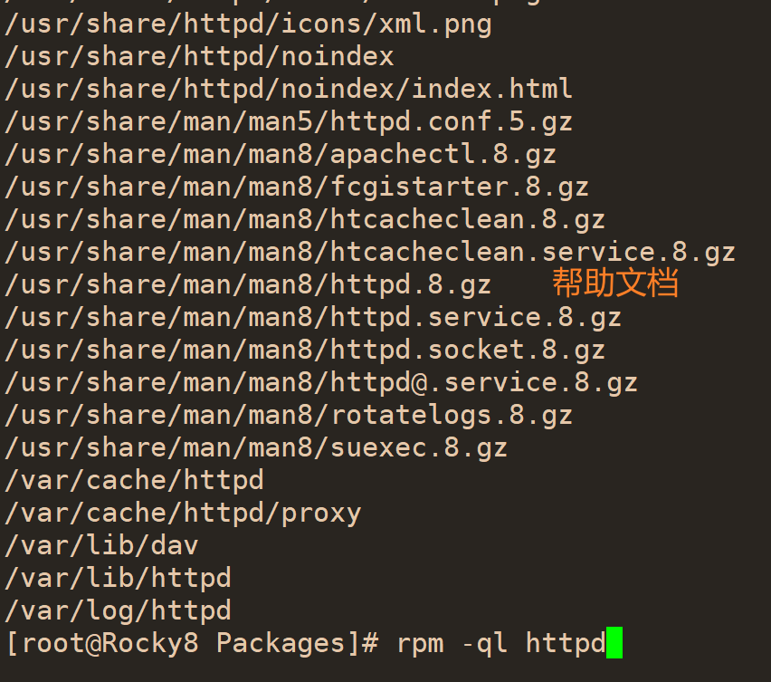

### rpm -qc 列出软件中的配置文件
- `--configfiles` 仅列出配置文件，即 `/etc/`目录下的文件


### rpm -qd 列出说明文档
- `--artifactfiles` 仅列出说明文档，`/usr/share/doc` 和 `/usr/share/man` 目录中的文档

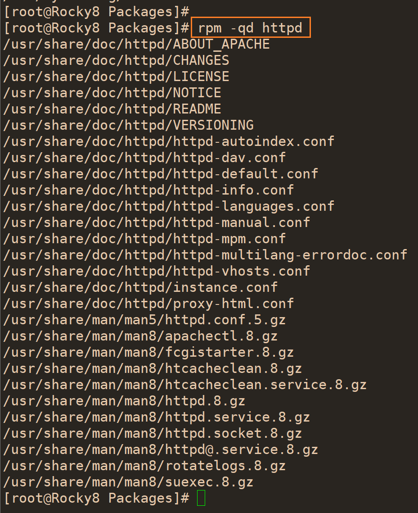

### rpm -qR 列出软件依赖
- `--requires` 


## Verify 校验文件
- `man rpm` 搜索 `Verify`
- 校验功能用于检查文件是否修改过
- 软件安装包中的文件修改后卸载后会备份
  
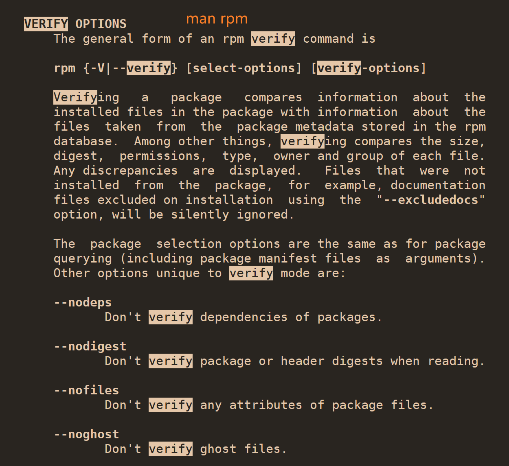


# SRPM
- Source RPM，即 RPM 文件里含的未编译的源代码
- 文件的扩展名为 `*.src.rpm`
- SRPM 中包含了软件所需的相关依赖性说明以及 RPM 文件提供的数据
- 提供了参数配置文件，如 configure 与 makefile
- 要以 RPM 管理的方式编译成 RPM 文件再安装
- SRPM 可以通过修改配置参数来编译生成适合自己的 RPM 文件


# YUM
> [yum](https://en.wikipedia.org/wiki/Yum_(software))

- Yellow Dog Updater, Modified
- The YUM is a free and open-source command-line package-management utility for computers running the Linux operating system using the **RPM Package Manager**.
- 为了解决 RPM 属性相依的问题
- 安装软件时可自动装上需要的依赖


## rocky 配置私有 yum 仓库
环境：rocky 8.6

- 安装 httpd
```bash
sudo yum install -y httpd
```
- 开启 httpd 服务
```bash
systemctl restart httpd.service
```
- 关闭防火墙
```bash
sudo systemctl stop firewalld.service
```

## yum repolist 显示仓库列表
```bash
[root@mysql ~]$ yum repolist
repo id                                           repo name
appstream                                         Rocky Linux 8 - AppStream
baseos                                            Rocky Linux 8 - BaseOS
extras                                            Rocky Linux 8 - Extras
```

## yum list 显示程序包
- `--all` 显示已安装和 repo 源中可用的包

```bash
[root@mysql ~]$ yum list | grep httpd
```

## yum install 安装程序包
- `--installroot` 指定安装目录
- `--downloadonly` 只下载，不安装

## 卸载程序包
- yum remove
- yum erase 卸载多个程序包

## 升级和降级
- yum update 升级
- yum downgrade 降级
- yum check-update 检查可用升级

## 查询
### yum info 查看软件包的信息
仓库中有但还未安装的软件包也能查询

```bash
root@Rocky8 ~ $ yum search virt-manager
Last metadata expiration check: 1:00:22 ago on Tue 06 Jun 2023 01:59:45 PM CST.
======================================== Name Exactly Matched: virt-manager ========================================
virt-manager.noarch : Desktop tool for managing virtual machines via libvirt
============================================ Name Matched: virt-manager ============================================
virt-manager-common.noarch : Common files used by the different Virtual Machine Manager interfaces
root@Rocky8 ~ $
root@Rocky8 ~ $ rpm -q virt-manager
package virt-manager is not installed
root@Rocky8 ~ $
root@Rocky8 ~ $ yum info virt-manager
Last metadata expiration check: 1:01:00 ago on Tue 06 Jun 2023 01:59:45 PM CST.
Available Packages
Name         : virt-manager
Version      : 3.2.0
Release      : 4.el8
Architecture : noarch
Size         : 620 k
Source       : virt-manager-3.2.0-4.el8.src.rpm
Repository   : appstream
Summary      : Desktop tool for managing virtual machines via libvirt
URL          : https://virt-manager.org/
License      : GPLv2+
Description  : Virtual Machine Manager provides a graphical tool for administering virtual
             : machines for KVM, Xen, and LXC. Start, stop, add or remove virtual devices,
             : connect to a graphical or serial console, and see resource usage statistics
             : for existing VMs on local or remote machines. Uses libvirt as the backend
             : management API.
```

### yum provides 检查文件由哪个包提供

### yum search 根据关键字查询

### yum deplist 查询包依赖

## 仓库缓存
### yum clean 清空缓存

### yum makecache 构建缓存

# dpkg 包管理器
- Debian 社区开发的包管理器
- Debian Package
- 软件包后缀为 .deb


## dpkg-query 查询 dpkg 包
- `dpkg-query --help | less` 简要查看命令帮助
- `man dpkg-query`

## dpkg-query -l 查询已安装的包
- `dpkg-query -l` 或 `dpkg-query --list` 显示全部已安装的包
- `dpkg-query -l | less` 搜索安装包
- `dpkg -l packageName` 查询具体某个安装包的简要说明
指明具体包名时查询会忽略包的状态？如未安装的包？

```bash
[root@ubunut22:~]$ dpkg-query -l mysql
dpkg-query: no packages found matching mysql
```
```bash
[root@ubunut22:~]$ dpkg-query -l mysql*
Desired=Unknown/Install/Remove/Purge/Hold
| Status=Not/Inst/Conf-files/Unpacked/halF-conf/Half-inst/trig-aWait/Trig-pend
|/ Err?=(none)/Reinst-required (Status,Err: uppercase=bad)
||/ Name                  Version                 Architecture Description
+++-=====================-=======================-============-===================================================================
un  mysql-client-5.7      <none>                  <none>       (no description available)
ii  mysql-client-8.0      8.0.32-0ubuntu0.22.04.2 amd64        MySQL database client binaries
un  mysql-client-core-5.7 <none>                  <none>       (no description available)
ii  mysql-client-core-8.0 8.0.32-0ubuntu0.22.04.2 amd64        MySQL database core client binaries
ii  mysql-common          5.8+1.0.8               all          MySQL database common files, e.g. /etc/mysql/my.cnf
un  mysql-common-5.6      <none>                  <none>       (no description available)
ii  mysql-server          8.0.32-0ubuntu0.22.04.2 all          MySQL database server (metapackage depending on the latest version)
un  mysql-server-5.5      <none>                  <none>       (no description available)
un  mysql-server-5.7      <none>                  <none>       (no description available)
ii  mysql-server-8.0      8.0.32-0ubuntu0.22.04.2 amd64        MySQL database server binaries and system database setup
un  mysql-server-core-5.7 <none>                  <none>       (no description available)
ii  mysql-server-core-8.0 8.0.32-0ubuntu0.22.04.2 amd64        MySQL database server binaries
```
```bash
[root@ubunut22:~]$ dpkg-query -l | grep -E "\bmysql"
ii  mysql-client-8.0                           8.0.32-0ubuntu0.22.04.2                 amd64        MySQL database client binaries
ii  mysql-client-core-8.0                      8.0.32-0ubuntu0.22.04.2                 amd64        MySQL database core client binaries
ii  mysql-common                               5.8+1.0.8                               all          MySQL database common files, e.g. /etc/mysql/my.cnf
ii  mysql-server                               8.0.32-0ubuntu0.22.04.2                 all          MySQL database server (metapackage depending on the latest version)
ii  mysql-server-8.0                           8.0.32-0ubuntu0.22.04.2                 amd64        MySQL database server binaries and system database setup
ii  mysql-server-core-8.0                      8.0.32-0ubuntu0.22.04.2                 amd64        MySQL database server binaries
```


## dpkg-query -s 列出包的状态 

> -s, --status [<package>...]      Display package status details.


```bash
[root@ubunut22:~]$ dpkg-query -s mysql-common 
Package: mysql-common
Status: install ok installed
Priority: optional
Section: database
Installed-Size: 34
Maintainer: Ubuntu Developers <ubuntu-devel-discuss@lists.ubuntu.com>
Architecture: all
Multi-Arch: foreign
Source: mysql-defaults (1.0.8)
Version: 5.8+1.0.8
Replaces: mariadb-server-5.5, mysql-common-5.6, mysql-server-5.5, percona-xtradb-cluster-common-5.5
Provides: mysql-common-5.6
Breaks: mariadb-common (<< 10.0.20-3~)
Conflicts: mariadb-server-5.5, mysql-common-5.6, mysql-server-5.5, percona-xtradb-cluster-common-5.5
Conffiles:
 /etc/mysql/conf.d/mysql.cnf 61e0993270966cc6bc96b46c01ade21f
 /etc/mysql/conf.d/mysqldump.cnf 20890decb4486ce539753193908fb356
 /etc/mysql/my.cnf.fallback cfe2bc1819d5e200eca8ca6912f714af
Description: MySQL database common files, e.g. /etc/mysql/my.cnf
 MySQL is a fast, stable and true multi-user, multi-threaded SQL database
 server. SQL (Structured Query Language) is the most popular database query
 language in the world. The main goals of MySQL are speed, robustness and
 ease of use.
 .
 This package includes files needed by all versions of the client library,
 e.g. /etc/mysql/my.cnf.
Original-Maintainer: Debian MySQL Maintainers <pkg-mysql-maint@lists.alioth.debian.org>
```

## dpkg-query -L 列出包中全部文件

>  -L, --listfiles <package>...     List files 'owned' by package(s).

```bash
[root@ubunut22:~]$ dpkg -L mysql-common 
/.
/etc
/etc/mysql
/etc/mysql/conf.d
/etc/mysql/conf.d/mysql.cnf
/etc/mysql/conf.d/mysqldump.cnf
/etc/mysql/my.cnf.fallback
/usr
/usr/share
/usr/share/doc
/usr/share/doc/mysql-common
/usr/share/doc/mysql-common/changelog.gz
/usr/share/doc/mysql-common/copyright
/usr/share/doc/mysql-common/frozen-mode
/usr/share/doc/mysql-common/frozen-mode/README
/usr/share/doc/mysql-common/frozen-mode/downgrade
/usr/share/lintian
/usr/share/lintian/overrides
/usr/share/lintian/overrides/mysql-common
/usr/share/mysql-common
/usr/share/mysql-common/configure-symlinks
```

# apt 

## apt install 安装软件

## apt remove 移除软件

## apt purge 移除软件以及配置文件

## apt autoremove 自动删除不需要的包

## apt update 刷新存储库索引

## apt upgrade 升级可升级的软件包

## apt full-upgrade 升级时自动处理依赖关系

## apt search 搜索应用程序

## apt show 显示安装细节

# 修改软件仓库的镜像源
例如安装 ubuntu22.04 后，进入 `/etc/apt` 目录下可以看到 ` sources.list` 的文件
初始部分内容为：
```bash
# See http://help.ubuntu.com/community/UpgradeNotes for how to upgrade to
# newer versions of the distribution.
deb http://cn.archive.ubuntu.com/ubuntu jammy main restricted
# deb-src http://cn.archive.ubuntu.com/ubuntu jammy main restricted

## Major bug fix updates produced after the final release of the
## distribution.
deb http://cn.archive.ubuntu.com/ubuntu jammy-updates main restricted
# deb-src http://cn.archive.ubuntu.com/ubuntu jammy-updates main restricted

## N.B. software from this repository is ENTIRELY UNSUPPORTED by the Ubuntu
## team. Also, please note that software in universe WILL NOT receive any
## review or updates from the Ubuntu security team.
deb http://cn.archive.ubuntu.com/ubuntu jammy universe
# deb-src http://cn.archive.ubuntu.com/ubuntu jammy universe
deb http://cn.archive.ubuntu.com/ubuntu jammy-updates universe
# deb-src http://cn.archive.ubuntu.com/ubuntu jammy-updates universe

deb http://cn.archive.ubuntu.com/ubuntu jammy-security main restricted
```

1. 其中 `deb http://cn.archive.ubuntu.com/ubuntu jammy-security main restricted` 的含义如下：
The line `deb http://security.ubuntu.com/ubuntu/ jammy-security main restricted` in the `/etc/apt/sources.list` file on Ubuntu adds a software repository to the system that contains security updates for the current release of Ubuntu which is "Jammy" in this case. Here is what each component of the line means:

- `deb`: Indicates that this is a binary package repository.
- `http://security.ubuntu.com/ubuntu/`: Specifies the URL of the repository. In this case, it is the URL for the Ubuntu security repository.
- `jammy-security`: Specifies the repository's distribution name. In this case, it refers to the security updates for Ubuntu Jammy.
- `main restricted`: Specifies the components of the repository that should be used. In this case, it is set to use `main` and `restricted` components, which includes packages that are officially supported by Ubuntu.

With this repository added to the system's `sources.list` file, the `apt` package manager will be able to download and install any security updates that are available for the installed packages on the system, helping to keep the system secure and up to date with the latest security patches.

2. `deb http://cn.archive.ubuntu.com/ubuntu jammy-security main restricted` 和 
`deb http://archive.ubuntu.com/ubuntu/ jammy main restricted` 的区别为：
The main difference between the two lines in the `/etc/apt/sources.list` file is that they reference different Ubuntu repositories.

The line `deb http://archive.ubuntu.com/ubuntu/ jammy main restricted` is pointing to the main Ubuntu repository, which contains the packages that are officially supported by Ubuntu. `main` and `restricted` are two of the four main components of this repository.

On the other hand, `deb http://security.ubuntu.com/ubuntu/ jammy-security main restricted` is pointing to the Ubuntu security repository, which contains security updates for packages in the main Ubuntu repository. This repository only contains security patches and does not include all packages available in the main repository.

In other words, the first line references the main repository while the second line references the security repository. The main repository contains all packages that are officially supported by Ubuntu, while the security repository contains only security patches for the packages in the main repository.


可以将仓库地址改为其他镜像源地址
如清华大学镜像网站 ubuntu 网站为：[https://mirrors.tuna.tsinghua.edu.cn/ubuntu/](https://mirrors.tuna.tsinghua.edu.cn/ubuntu/)，其内容和 ubuntu 官网相同，因此替换源只用将 `cn.archive.ubuntu.com` 替换为 `mirrors.tuna.tsinghua.edu.cn`

```bash
[root@docker apt]$ sed -i.orig 's/cn.archive.ubuntu.com/mirrors.tuna.tsinghua.edu.cn/g' sources.list
```

