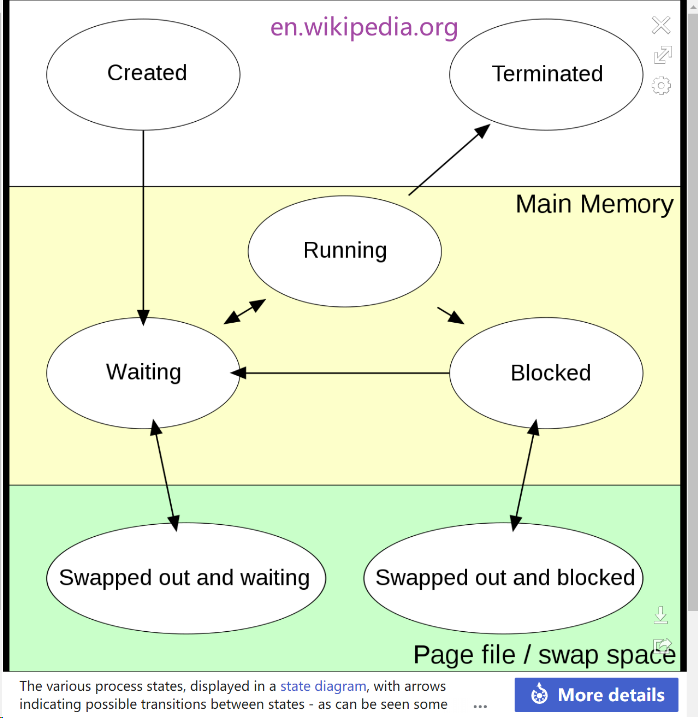
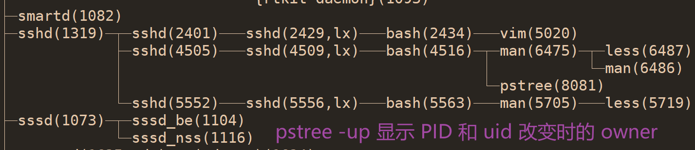
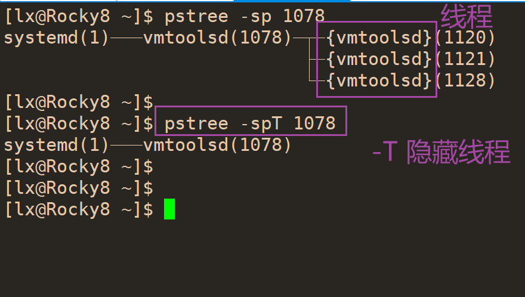
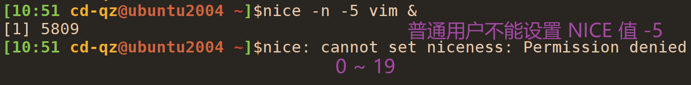

进程管理

> 鸟哥的 Linux 私房菜基础学习篇第四版 第 16 章 进程管理与 SELinux 初探

结合 **深入理解计算机系统——第八章 Exceptional Control Flow** 理解进程


# 进程与程序（process & program）
- 程序放在存储媒介中，如硬盘、光盘等，以物理文件形式存在
- 用户执行程序进行触发后，程序的代码以及所需的数据，执行者的权限和属性等被加载到内存中，成为进程，即运行中的程序
操作系统给内存中该进程一个标识符 PID
操作系统根据 PID 判断进程是否有执行权限
- 有些程序执行完就退出了，如 `ls` 命令
- 有些常驻在内存中的进程，如 crond 在后台持续运行，这种即为服务（daemon）


# 进程的状态
> [Process state](https://en.wikipedia.org/wiki/Process_state)
> [States of a Process in Operating Systems](https://www.geeksforgeeks.org/states-of-a-process-in-operating-systems/)

> These distinct states may not be recognized as such by the operating system kernel. However, they are a useful abstraction for the understanding of processes.
> &nbsp;
> 

## Created
- The process awaits admission to the "ready" state.
- Admission will be approved or delayed by a long-term, or admission, scheduler.

- 需要申请一个空白的 PCB，完成资源分配

## Ready
- A "ready" or "waiting" process has been loaded into main memory and is awaiting execution on a CPU. 

## Running
- A process moves into the running state when it is chosen for execution.
- There is at most one running process per CPU or core.
- A process can run in either of the two modes, namely kernel mode or user mode.

## Blocked
- A process transitions to a blocked state when it cannot carry on without an external change in state or event occurring.
- For example, a process may block on a call to an I/O device such as a printer, if the printer is not available.
- Processes also commonly block when they require user input, or require access to a critical section which must be executed [atomically](https://stackoverflow.com/questions/15054086/what-does-atomic-mean-in-programming).
- Such critical sections are protected using a synchronization object such as a semaphore or mutex.


## Terminated
- A process may be terminated, either from the "running" state by completing its execution or by explicitly being killed.
- The terminated process remains in the process table as a zombie process until its parent process calls the `wait` system call to read its exit status, at which point the process is removed from the process table, finally ending the process's lifetime.
- If the parent failes to call `wait`, this process continues to consume the process table entry (concretely the process identifier or PID), and causes a resource leak.


## Additional process states
> Two additional states are available for processes in systems that support virtual memory. 
> In both of these states, processes are "stored" on secondary memory (typically a hard disk).

- 进程被**挂起**（suspended）且**不会被调度**。
A process **stops** as a result of receiving a **SIGSTOP**, **SIGTSTP**, **SIGTTIN**, or **SIGTTOU** signal, 
and it **remains** **stopped** **until** it receives a **SIGCONT** signal, at which point it becomes running again.

- 按 `Ctrl z` 可以让进程处于 suspended 的状态，相当于发送信号 `SIGSTOP` 


### Swapped out and waiting
- suspended and waiting
- The process is removed from main memory and placed on external storage by the scheduler.
- It may be swapped back into the waiting state.
### Swapped out and blocked
- suspended and blocked
- The process is both blocked and swapped out
- It may be swapped back in again under the same circumstances as a swapped out and waiting process.


# 进程使用的内存问题

## 内存泄漏 Memory Leak
如用 new 或 malloc 申请内存却没有释放，导致内存一直处于占用状态

## 内存溢出 Memory Overflow
如程序访问超过申请空间以外的内存区域

## 内存不足 Out of Memory
OOM，如 java 程序中常见，系统会选择一个进程将之杀死


# LRU 算法
- Least Recently Used 近期最少使用算法
- 一种内存淘汰策略，让进程依据某种规则管理内存空间，防止内存因耗尽而无法工作

# IPC 进程间通信
> [Chapter 5 Interprocess Communication Mechanisms](https://tldp.org/LDP/tlk/ipc/ipc.html)
> [5.2 进程间有哪些通信方式？](https://www.xiaolincoding.com/os/4_process/process_commu.html)
> [Linux 进程间通信（IPC）总结](https://www.cnblogs.com/huansky/p/13170125.html)

- Inter Process Communication 

## pipe 
- 管道，单向传输
- 管道，是内核中的一串缓存
- shell 中使用管道符 `|` 时，管道左右两边都是在子进程中运行，即创建两个子进程来运行左右两边的程序
这种匿名管道通过 fork 父进程创建的子进程

- 匿名管道
```bash
root@Rocky8 ~ $ ss -ntupl | grep rpcbind
```

- 命名管道
用 `mkfifo` 创建管道文件
```bash
root@Rocky8 ~ $ mkfifo pipe_1
root@Rocky8 ~ $ ll pipe_1
prw-r--r-- 1 root root 0 Sep 14 20:04 pipe_1
```
一个终端向管道文件写入数据，从另一个终端取出管道文件的数据

## socket
套接字，双工通信
## memory-maped file
文件映射，将文件中的一段数据映射到物理内存，多个进程共享该内存数据
## shm shared memory
共享内存
## signal

## lock
## semaphore
信号量，保证同一时刻最多有 N 个线程访问，保护受限资源

## RPC
remote procedure call

## MQ
- message queue，消息队列
- 消息队列是保存在内核中的消息链表

# 作业管理（job control）
- 每个作业（任务）都是当前 shell 的子进程
- 这些作业所触发的进程必须来自用户自己 shell 的子进程
- bash 只能管理自己的作业而不能管理其他 bash 的作业

## 前台（foreground）作业
- 终端启动，启动后一直占据终端
- 可以控制与执行命令

## 后台（background）作业
- 终端启动，启动后转入后台运行，不占据终端
- 放入后台的作业不能与用户交互，如 vim
- 放入后台的作业不能通过 ctrl+c 终止

### 后台作业状态
- 暂停 stop
- 运行 running


## 让作业后台运行
### & 让命令后台执行
> [Linux 命令中的 & 符号](https://blog.csdn.net/weixin_45505313/article/details/103749523)

- 命令后加 `&` 让作业转到后台运行
```bash
[root@ubuntu22-c0 ~]$ sleep 100 &
[1] 3160
[root@ubuntu22-c0 ~]$ jobs
[1]+  Running                 sleep 100 &
[root@ubuntu22-c0 ~]$ ps aux | grep sleep
root        3160  0.0  0.0   8856  1008 pts/1    S    15:03   0:00 sleep 100
root        3162  0.0  0.1   9564  2316 pts/1    S+   15:04   0:00 grep --color=auto sleep
```
- 另一个终端查看
另一个终端直接输入 `jobs` 看不到其他终端的作业，通过 `ps` 命令可以查看进程
```bash
[root@ubuntu22-c0 ~]$ jobs
[root@ubuntu22-c0 ~]$ ps_v sleep
USER         PID %CPU %MEM    VSZ   RSS TTY      STAT START   TIME COMMAND
root        3160  0.0  0.0   8856  1008 pts/1    S    15:03   0:00  |       \_ sleep 100
root        3170  0.0  0.1   9564  2348 pts/2    S+   15:05   0:00  |       \_ grep --color=auto -i sleep
[root@ubuntu22-c0 ~]$ alias ps_v
alias ps_v='ps auxf | head -n1; ps auxf | grep -i '
```

- 关闭作业执行的终端窗口
1) 终端一中建立一个作业，后台执行
```bash
root@ubuntu2204c12:~# ping 10.0.0.82 &> /root/ping.txt &
[1] 4390
root@ubuntu2204c12:~# jobs
[1]+  Running                 ping 10.0.0.82 &> /root/ping.txt &
root@ubuntu2204c12:~# ps aux | grep ping
root        4390  0.0  0.0   7716  1292 pts/6    S    16:14   0:00 ping 10.0.0.82
root        4392  0.0  0.0   6476  2364 pts/6    S+   16:14   0:00 grep --color=auto ping
```
可以看到作业的 PID 为 4390

2) 另一个终端用 tail -f 跟踪文件 /root/ping.txt
能看到不断有数据生成

第三个终端可用 ps aux 查看作业的 PID

3）第一个终端关闭
关闭前可用 ps 和 w 命令查看每个终端不一样的
```bash
root@ubuntu2204c12:~# ps
    PID TTY          TIME CMD
   4326 pts/6    00:00:00 bash
   4390 pts/6    00:00:00 ping
   4405 pts/6    00:00:00 ps
root@ubuntu2204c12:~# w
 16:19:20 up  3:40,  6 users,  load average: 0.10, 0.14, 0.17
USER     TTY      FROM             LOGIN@   IDLE   JCPU   PCPU WHAT
root     pts/0    10.0.0.1         09:34    4:37m  0.05s  0.05s -bash
root     pts/1    10.0.0.1         15:03    1:15m  0.01s  0.01s -bash
root     pts/2    10.0.0.1         15:01    1:15m  0.00s  0.00s -bash
root     pts/4    10.0.0.1         16:05    8.00s  0.04s  0.00s tail -f ping.txt
root     pts/5    10.0.0.1         16:07   29.00s  0.01s  0.01s -bash
root     pts/6    10.0.0.1         16:08    0.00s  0.11s  0.00s w
```
第一个终端为 /pts/6，关闭后在第三个终端查看，少了一个终端
第三个终端用 ps aux 仍能看到之前作业的 PID
第二个终端用 tail -f 跟踪文件发现作业仍在运行，数据依旧在更新

第三个终端用 kill 杀掉作业进程后文件不再有新数据，作业结束


- 如果作业有标准输出或错误输出但未重定向到某个文件，则会在当前终端输出
此时如果终端关闭，则在其他窗口查看该作业的进程也关闭
如果该作业没有标准输出和错误输出，如 sleep，则终端窗口关闭后该作业仍继续运行


### ctrl + z 将作业暂停放到后台
- 作业在后台处于暂停 stopped 状态
```bash
root@ubuntu2204c12:~# ping 10.0.0.82 &> /root/ping.txt
^Z
[1]+  Stopped                 ping 10.0.0.82 &> /root/ping.txt
```
```bash
root@ubuntu2204c12:~# ps aux | grep ping
root        4569  0.0  0.0   7716  1256 pts/3    T    16:24   0:00 ping 10.0.0.82
root        4573  0.0  0.0   5800  1036 pts/4    S+   16:24   0:00 tail -f ping.txt
root        4575  0.0  0.0   6476  2344 pts/5    S+   16:24   0:00 grep --color=auto ping
```

- 关闭终端，后台作业关闭
关闭终端，另一个终端用 ps aux 查看，作业进程消失


## 脱机管理
作业到后台执行写与终端脱离

### nohup CMD &
- 终端窗口关闭，作业仍旧运行，其他终端可以看到进程
```bash
root@ubuntu2204c12:~# nohup ping 10.0.0.82 &> /root/ping.txt &
[1] 4749
root@ubuntu2204c12:~# jobs
[1]+  Running                 nohup ping 10.0.0.82 &> /root/ping.txt &
root@ubuntu2204c12:~# pgrep -a ping
4749 ping 10.0.0.82
```

- 如果有标准输出和错误输出，不会输出到终端，与终端解绑，输出到当前用户家目录的 nohup.out 文件中
```bash
root@ubuntu2204c12:~# nohup ping 10.82 &
[1] 5433
root@ubuntu2204c12:~# nohup: ignoring input and appending output to 'nohup.out'
```


### screen 


### tmux
> [Tmux使用手册](http://louiszhai.github.io/2017/09/30/tmux/)
> [Tmux 使用教程](https://www.ruanyifeng.com/blog/2019/10/tmux.html)


## jobs 查看后台作业
只查看当前 bash 中的后台作业
```bash
jobs: jobs [-lnprs] [jobspec ...] or jobs -x command [args]
    Options:
      -l        lists process IDs in addition to the normal information
      -n        lists only processes that have changed status since the last
                notification
      -p        lists process IDs only
      -r        restrict output to running jobs
      -s        restrict output to stopped jobs

    If -x is supplied, COMMAND is run after all job specifications that
    appear in ARGS have been replaced with the process ID of that job's
    process group leader.

    Exit Status:
    Returns success unless an invalid option is given or an error occurs.
    If -x is used, returns the exit status of COMMAND.
```

```bash
root@ubuntu2204c12:~# jobs -l
[1]+  5433 Running                 nohup ping 10.82 &
```
- 第一列的数字 `[1]` 表示 job number
- `+` 表示最近被放到后台的程序，当输入 fg 时默认被移到前台的作业
如果是 `-` 表示最近第二个被放到后台执行的作业
- `5433` 为 PID，加上 `-l` 才显示


## fg 将后台作业移到前台执行
- fg %jobnumber
- fg - 将 `-` 哪个作业移到前台
- fg 后面没有参数则将 `+` 作业移到前台
- % 可以不写


## bg 将后台作业变为运行状态
- ctrl + z 会让作业后台，但处于 stopped 状态，可以用 bg 使其变为运行状态
```bash
root@ubuntu2204c12:~# jobs
[1]+  Stopped                 nohup ping 10.82
[2]-  Stopped                 sleep 10000
root@ubuntu2204c12:~# bg
[1]+ nohup ping 10.82 &
root@ubuntu2204c12:~# jobs
[1]-  Running                 nohup ping 10.82 &
[2]+  Stopped                 sleep 10000
root@ubuntu2204c12:~# bg 2
[2]+ sleep 10000 &
root@ubuntu2204c12:~# jobs
[1]-  Running                 nohup ping 10.82 &
[2]+  Running                 sleep 10000 &
```

但有些作业，如 vim 即使用 bg 也不能让其在后台运行，因为 vim 需要交互操作

## kill 管理后台作业
- kill -signal %jobnumber
```bash
-s sig    SIG is a signal name
-n sig    SIG is a signal number
-l        list the signal names; if arguments follow `-l' they are
          assumed to be signal numbers for which names should be listed
-L        synonym for -l
```

- kill -l 列出全部信号
用 `man 7 signal` 查看信号说明

`kill -2` 相当于 ctrl + c
`kill -9` 强行杀死进程
`kill -15` 正常方式结束进程

```bash
root@ubuntu2204c12:~# jobs
[1]-  Running                 nohup ping 10.82 &
[2]+  Running                 sleep 10000 &
root@ubuntu2204c12:~#
root@ubuntu2204c12:~# kill -n 9 %2
root@ubuntu2204c12:~# jobs
[1]-  Running                 nohup ping 10.82 &
[2]+  Killed                  sleep 10000
root@ubuntu2204c12:~# jobs
[1]+  Running                 nohup ping 10.82 &
```

```bash
root@ubuntu2204c12:~# kill -9 %1
root@ubuntu2204c12:~# jobs
[1]+  Killed                  nohup ping 10.82
root@ubuntu2204c12:~# jobs
```

# 搜索进程
## pidof 获取进程 PID
名字精确匹配
```bash
[root@ubuntu22-c0 ~]$ whatis pidof
pidof (8)            - find the process ID of a running program.
[root@ubuntu22-c0 ~]$ pidof -h
pidof usage: [options] <program-name>

 -c           Return PIDs with the same root directory
 -d <sep>     Use the provided character as output separator
 -h           Display this help text
 -n           Avoid using stat system function on network shares
 -o <pid>     Omit results with a given PID
 -q           Quiet mode. Do not display output
 -s           Only return one PID
 -x           Return PIDs of shells running scripts with a matching name
 -z           List zombie and I/O waiting processes. May cause pidof to hang.
```
```bash
[root@ubuntu22-c0 ~]$ pidof bash
4237 4176 3884 3823
```

## pgrep 查看进程
> [pgrep Command Examples in Linux](https://www.thegeekdiary.com/pgrep-command-examples-in-linux/)

- 支持模式匹配
- 比 pidof 搜索更灵活

```bash
[root@ubuntu22-c0 ~]$ pgrep -a ping
4580 ping 10.0.0.82
[root@ubuntu22-c0 ~]$ pgrep -a pin*
129 acpi_thermal_pm
4505 pickup -l -t unix -u -c
4580 ping 10.0.0.82
```

- `-t` 可以知道终端搜索
- `-u` 根据 effective UID 搜索
- `-U` 根据 real UID 搜索


# 查看进程

## ps 查看某个时间点进程的状态
- report a snapshot of the current process

> By default, ps selects all processes with the same effective user ID (euid=EUID) as the
> current user and associated with the same terminal as the invoker.  

- 如果用 `su -l` 切换到另一个用户，用 `ps -l` 看不到之前用户所在 bash 的进程，
  只看到进程 UID 和当前用户 UID 相同的进程 
- 用 `sudo` 命令以 root 身份执行一个命令，`ps` 也看不到，因为 UID 不同
- 当前 bash 相关，如果在当前终端 bash 中又输入 bash 打开一个子进程，也会显示出来，
  后面的为当前 bash 的子进程，同属于一个终端


### ps -l 查询当前 bash 相关程序
- `ps` 命令的长格式

```bash
root@ubuntu2204c12:~# ps -l
F S   UID     PID    PPID  C PRI  NI ADDR SZ WCHAN  TTY          TIME CMD
4 S     0    5313    5238  0  80   0 -  2386 do_wai pts/0    00:00:00 bash
4 R     0    5548    5313  0  80   0 -  2517 -      pts/0    00:00:00 ps
```

- F
进程标志，process flags
	- 4：表示进程的权限为 root
	- 1：forked but didn't exec

- S
process stat codes，进程的状态
```bash
D    uninterruptible sleep (usually IO)
I    Idle kernel thread
R    running or runnable (on run queue)
S    interruptible sleep (waiting for an event to complete)
T    stopped by job control signal
t    stopped by debugger during the tracing
W    paging (not valid since the 2.6.xx kernel)
X    dead (should never be seen)
Z    defunct ("zombie") process, terminated but not reaped by its parent

For BSD formats and when the stat keyword is used, additional characters may be displayed:
<    high-priority (not nice to other users)
N    low-priority (nice to other users)
L    has pages locked into memory (for real-time and custom IO)
s    is a session leader
l    is multi-threaded (using CLONE_THREAD, like NPTL pthreads do)
+    is in the foreground process group
```
其中 `S` 可中断睡眠指进程在睡眠状态下等待特定时间发生，也可以通过其他方式，如信号等唤醒
`D` 不可中断睡眠只能被特定时间唤醒

- UID
该进程被该 UID 拥有，如果执行的文件有 SUID，权限有可能和执行的用户不同，

- PID
进程 ID

- PPID
父进程 PID

- C
CPU 使用率，百分比

- PRI/NI
Priority/Nice，表示进程被 CPU 调度的优先顺序，数值越小则优先级越高，越快被 CPU 执行

- ADDR
kernel function，指出程序在内存的哪个部分
running 的程序，显示 `-`

- SZ
表示程序用掉多少内存

- WCHAN
表示目前程序是否运行中，`-` 表示在运行中

- TTY
登陆者终端机的位置，用 `tty` 命令看到的结果

- TIME
进程实际使用 CPU 的时间

-CMD
造成次进程的触发指令


### ps -A 显示所有进程

### ps -a 不与 terminal 有关的所有 process

### ps -u 有效使用者（effective user）相关进程

### ps auxf 查看系统所有进程
设置别名，显示进程同时显示标头
```bash
[root@ubuntu22-c0 ~]$ alias ps_v
alias ps_v='ps auxf | head -n1; ps auxf | grep -i '
[root@ubuntu22-c0 ~]$ ps_v bash
USER         PID %CPU %MEM    VSZ   RSS TTY      STAT START   TIME COMMAND
root        3823  0.0  0.2  11820  5460 pts/1    Ss+  16:50   0:00  |   \_ -bash
root        3884  0.0  0.2  11820  5500 pts/3    Ss+  16:50   0:00  |   \_ -bash
root        4176  0.0  0.2  11940  5724 pts/0    Ss   19:24   0:00  |   \_ -bash
root        4353  0.0  0.1   9564  2284 pts/0    S+   19:39   0:00  |       \_ grep --color=auto -i bash
root        4237  0.0  0.2  11820  5536 pts/2    Ss+  19:24   0:00  |   \_ -bash
```

## 查看进程的 user 和 group
```bash
[ubuntu@VM-8-8-ubuntu ~]$ ps -eo user,group,args | grep nginx
root     root     nginx: master process /usr/local/nginx/sbin/nginx -c /usr/local/nginx/conf/nginx.conf
www-data www-data nginx: worker process
www-data www-data nginx: worker process
ubuntu   ubuntu   vim conf/nginx.conf
ubuntu   ubuntu   grep --color=auto nginx
```

## prtstat 显示进程信息
```bash
[root@ubuntu22-c0 ~]$ whatis prtstat
prtstat (1)          - print statistics of a process
```

先获取进程 PID
```bash
[root@ubuntu22-c0 ~]$ pidof bash
4237 4176 3884 3823
```

```bash
[root@ubuntu22-c0 ~]$ prtstat 4237
Process: bash                   State: S (sleeping)
  CPU#:  0              TTY: 136:2      Threads: 1
Process, Group and Session IDs
  Process ID: 4237                Parent ID: 4077
    Group ID: 4237               Session ID: 4237
  T Group ID: 4237

Page Faults
  This Process    (minor major):     1339         0
  Child Processes (minor major):     1535         0
CPU Times
  This Process    (user system guest blkio):   0.00   0.01   0.00   0.00
  Child processes (user system guest):         0.00   0.00   0.00
Memory
  Vsize:       12 MB
  RSS:         5668 kB                   RSS Limit: 18446744073709 MB
  Code Start:  0x55807ff28000            Code Stop:  0x558080006f0d
  Stack Start: 0x7ffe62e3bb80
  Stack Pointer (ESP):          0        Inst Pointer (EIP):          0
Scheduling
  Policy: normal
  Nice:   0              RT Priority: 0 (non RT)
```

```bash
[root@ubuntu22-c0 ~]$ prtstat -r 4237
         pid: 4237                                comm: bash
       state: S                                   ppid: 4077
        pgrp: 4237                             session: 4237
      tty_nr: 34818                              tpgid: 4237
       flags: 400100                            minflt: 1339
     cminflt: 1535                              majflt: 0
     cmajflt: 0                                  utime: 0
       stime: 1                                 cutime: 0
      cstime: 0                               priority: 20
        nice: 0                            num_threads: 1
 itrealvalue: 0                              starttime: 2163934
       vsize: 12103680                             rss: 1384
      rsslim: 18446744073709551615                   startcode: 94010390773760
     endcode: 94010391686925                startstack: 140730557512576
     kstkesp: 0                                kstkeip: 0
       wchan: 1                                  nswap: 0
      cnswap: 1                            exit_signal: 17
   processor: 0                            rt_priority: 0
      policy: 0                  delayaccr_blkio_ticks: 0
  guest_time: 0                            cguest_time: 0
```

## top 动态观察进程的变化
相比 ps 只能查看此刻的进程状态，top 可以动态持续的查看进程状态

top 上半部分显示内容：
- up 系统上线时间
位于当前时间后面，开机到现在所经过的时间

- load average 系统平均负载
三个指分别显示 1、5、15 分钟的平均负载，即系统平均要负责运行几个进程

- Tasks 
total 显示进程总数

- %Cpu(s) CPU 整体负载
按 1 显示详细每个 CPU 的负载

```bash
%Cpu0  :  0.0 us,  0.0 sy,  0.0 ni,100.0 id,  0.0 wa,  0.0 hi,  0.0 si,  0.0 st
%Cpu1  :  0.0 us,  0.0 sy,  0.0 ni,100.0 id,  0.0 wa,  0.0 hi,  0.0 si,  0.0 st
```

```bash
us, user    : time running un-niced user processes
sy, system  : time running kernel processes
ni, nice    : time running niced user processes
id, idle    : time spent in the kernel idle handler
wa, IO-wait : time waiting for I/O completion
hi : time spent servicing hardware interrupts
si : time spent servicing software interrupts
st : time stolen from this vm by the hypervisor
```

nice 值越高优先级越低，一般用户仅能将 nice 指调高
因此 `ni` 表示优先级被调低过的用户进程
`us` 为未修改优先级的用户进程

- KiB Mem 物理内存使用
```bash
MiB Mem :   1928.3 total,   1007.6 free,    316.5 used,    604.2 buff/cache
```
`MiB` 代表二进制单位，为 1024 KiB，1 KiB 为 1024 字节
`total` 为物理内存总量
`free`（空闲）指的是当前系统中完全没有被使用的物理内存量
`buff` 为缓存的内存

- MiB Swap 交换区大小
```bash
MiB Swap:   2048.```bash
0 total,   2048.0 free,      0.0 used.   1444.1 avail Mem
```

top 下半部分显示标头：
- RES 常驻内存
- S 进程状态
```bash
29. S  --  Process Status
The status of the task which can be one of:
    D = uninterruptible sleep
    I = idle
    R = running
    S = sleeping
    T = stopped by job control signal
    t = stopped by debugger during trace
    Z = zombie
```
- TIME+ CPU 使用时间累加

### ?|h 查看帮助
- `top` 进入页面后按 `?` 或 `h` 查看帮助


### top -d 指定刷新的秒数
- 指定以多少秒刷新一次，rocky8.6 默认 3 秒，可以通过最上面一行第一个当前时间看到刷新频率
ubuntu 22.04 默认 3 秒刷新


### top -p PID 查看指定进程的数据
- `echo $$` 可以查看当前 bash 的PID

```bash
[root@ubuntu22-c0 ~]$ echo $$
4176
[root@ubuntu22-c0 ~]$ top -d 5 -p 4176
```

### 实时修改排序
排序是从大到小排序
- 默认排序是 CPU 使用率
- `P` 大写，以 CPU 使用率排序，%CPU 字段
- `M` 大写，以内存使用率排序，%MEM 字段
- `T` 大写，以 CPU 使用时长排序，TIME+ 字段
- `N` 大写，以 PID 排序

### 实时修改 NI 数值
- 在数据显示界面，按 `r` 修改 NI 值，即 renice
- 需要先输入要修改的 PID，不输入则默认修改第一个进程
- 然后输入要改的 NI 值

### top -b -n num > file 将 top 执行多次保存到文件
将 top 执行 2 次保存到文件中，默认两次直接时间间隔为 3 秒 (ubuntu 22.04)
```bash
[root@ubuntu22-c0 ~]$ top -b -n 2 > /root/top.txt
```

## pstree 进程树显示程序的相关性


### pstree -A 以 ASCII 字符 
- 不同语系可能出现乱码问题，用 `-A` 克服线段乱码问题


### pstree -u 列出 uid 
- 只有和父进程 uid 不同时才会列出，在小括号中显示
- 如果同时指定了 `-p` 选项，即显示 PID，则和父进程 uid 不同时列在 PID 后面


### pstree -sp 列出 PID
- `pstree -p` 列出进程树时显示 PID
- `pstree -sp PID` 列出某个指定进程的信息，加上 `-s` 可以列出其父进程信息




### pstree -T 不显示线程
- `--hide-threads`
- 默认显示线程，用 `{}` 显示




# 进程管理
- 进程可以通过信号管理
- 常用信号
  - 1 SIGHUP 
  启动被终止的信号，可以让 PID 重新读自己的配置文件，类似重新启动
  - 2 SIGINT 
  相当于从键盘输入 ctrl c 来终端进程的运行
  - 9 SIGKILL
  强制中断进程的执行
  - 15 SIGTERM
  以正常方式中断进程，但可能有些情况进程无法正常中断
  - 19 SIGSTOP
  相当于键盘输入 ctrl z 暂停进程


## kill -signal PID
The **/bin/kill** program **sends** an **arbitrary signal** to another **process**. 

下面命令发送信号 9（SIGKILL）到进程 15213：
```bash
linux> /bin/kill -9 15213
```

**PID为负数时**：下面命令发送信号 9（SIGKILL）到进程组 15213 中的每个信号：
```bash
linux> /bin/kill -9 -15213
```

- 找到进程 rsyslogd 并重读配置文件
```bash
[root@ubuntu22-c0 ~]$ pgrep -a rsyslogd
826 /usr/sbin/rsyslogd -n -iNONE
```
```bash
[root@ubuntu22-c0 ~]$ pgrep -a rsyslogd | cut -d" " -f1
826
[root@ubuntu22-c0 ~]$ pgrep -a rsyslogd | awk '{print $1}'
826
```
```bash
[root@ubuntu22-c0 ~]$ kill -1 $(pgrep -a rsyslogd | awk '{print $1}')
```
```bash
[root@ubuntu22-c0 ~]$ kill -SIGHUP $(pgrep -a rsyslogd | awk '{print $1}')
```

## killall -signal 命令名称
- `-i` 杀死进程前交互式确认
- `-I` 忽略大小写
- `-e` 精确匹配名字

重读 rsyslogd 配置文件
```bash
[root@ubuntu22-c0 ~]$ killall -1 rsyslogd
```

# 进程执行优先级 Priority 和 NICE
- Linux 给予一个进程的 Priority，即 PRI，该值越低优先级越高，即更快被执行
- PRI 由 CPU 动态调整，使用者无法直接调整 PRI 的值
- 使用者可以通过调整 NICE 的值来修改优先级，PRI (new) = PRI (old) + NICE

## NICE 值的范围
- -20 ~ 19
- root 可以随意调整自己或他人程序的 NICE 值，且范围 -20 ~ 19
- 一般使用者仅可调整自己程序的 NICE 值，范围为 0 ~ 19，避免一般用户抢占系统资源
- 一般使用者仅可将 NICE 值调高，即降低优先级，不能调低

## 设置 NICE 值
### 执行程序时设置 NICE 值
- `nice [-n num] command`，普通用户数值 num 为 0 ~ 19，不在该范围会设置失败



### 调整某个已存在的 PID 的 NICE 值
- renice 
`renice [num] PID`
可通过 `ps -l` 查看 PID

- top
`top -p PID` 查看进程信息，按 `r` 后根据指示调整 NICE，只能调高不能调低


# 查看系统资源
## free 观察内存使用
```bash
Usage:
 free [options]

Options:
 -b, --bytes         show output in bytes
     --kilo          show output in kilobytes
     --mega          show output in megabytes
     --giga          show output in gigabytes
     --tera          show output in terabytes
     --peta          show output in petabytes
 -k, --kibi          show output in kibibytes
 -m, --mebi          show output in mebibytes
 -g, --gibi          show output in gibibytes
     --tebi          show output in tebibytes
     --pebi          show output in pebibytes
 -h, --human         show human-readable output
     --si            use powers of 1000 not 1024
 -l, --lohi          show detailed low and high memory statistics
 -t, --total         show total for RAM + swap
 -s N, --seconds N   repeat printing every N seconds
 -c N, --count N     repeat printing N times, then exit
 -w, --wide          wide output

     --help     display this help and exit
 -V, --version  output version information and exit
```

```bash
[11:10 lx@ubunut22 ~]$free -ht
               total        used        free      shared  buff/cache   available
Mem:           3.8Gi       1.8Gi       1.0Gi        27Mi       1.0Gi       1.7Gi
Swap:          3.8Gi          0B       3.8Gi
Total:         7.6Gi       1.8Gi       4.8Gi
[11:11 lx@ubunut22 ~]$
```

在输出结果中，"free" 和 "available" 都是与系统内存相关的指标，但它们有不同的含义：

- "free"（空闲）指的是当前系统中完全没有被使用的物理内存量

- "available"（可用）则是指系统中除了空闲内存之外，还可以被应用程序使用的内存总量。这个值考虑了被系统缓存和缓冲区占用的内存，它们可以根据需要迅速释放给应用程序使用

简而言之，"free"表示尚未被任何内容占用的物理内存量，而"available"则考虑了系统缓存和缓冲区，表示可供应用程序使用的内存总量

## uname 查看系统和内核相关信息

```bash
Usage: uname [OPTION]...
Print certain system information.  With no OPTION, same as -s.

  -a, --all                print all information, in the following order,
                             except omit -p and -i if unknown:
  -s, --kernel-name        print the kernel name
  -n, --nodename           print the network node hostname
  -r, --kernel-release     print the kernel release
  -v, --kernel-version     print the kernel version
  -m, --machine            print the machine hardware name
  -p, --processor          print the processor type (non-portable)
  -i, --hardware-platform  print the hardware platform (non-portable)
  -o, --operating-system   print the operating system
      --help     display this help and exit
      --version  output version information and exit
```

```bash
[11:15 lx@ubunut22 ~]$uname -a
Linux ubunut22 5.19.0-38-generic #39~22.04.1-Ubuntu SMP PREEMPT_DYNAMIC Fri Mar 17 21:16:15 UTC 2 x86_64 x86_64 x86_64 GNU/Linux
[11:15 lx@ubunut22 ~]$
[11:15 lx@ubunut22 ~]$uname -s
Linux
[11:15 lx@ubunut22 ~]$
[11:15 lx@ubunut22 ~]$uname -n
ubunut22
[11:15 lx@ubunut22 ~]$
[11:15 lx@ubunut22 ~]$uname -r
5.19.0-38-generic
[11:15 lx@ubunut22 ~]$uname -v
#39~22.04.1-Ubuntu SMP PREEMPT_DYNAMIC Fri Mar 17 21:16:15 UTC 2
[11:16 lx@ubunut22 ~]$
[11:16 lx@ubunut22 ~]$uname -m
x86_64
[11:16 lx@ubunut22 ~]$uname -p
x86_64
[11:16 lx@ubunut22 ~]$uname -i
x86_64
[11:16 lx@ubunut22 ~]$uname -o
GNU/Linux
[11:16 lx@ubunut22 ~]$
```

## uptime 观察系统启动时间和负载
```bash
Usage:
 uptime [options]

Options:
 -p, --pretty   show uptime in pretty format
 -h, --help     display this help and exit
 -s, --since    system up since
 -V, --version  output version information and exit
```

```bash
[11:19 lx@ubunut22 ~]$uptime
 11:19:18 up 27 min,  2 users,  load average: 0.14, 0.17, 0.18
[11:19 lx@ubunut22 ~]$
[11:19 lx@ubunut22 ~]$uptime -p
up 28 minutes
[11:19 lx@ubunut22 ~]$uptime -s
2023-04-13 10:51:23
```
显示系统已经运行的时间和 CPU 1, 5, 15 分钟内的平均负载，和 top 看到的第一行中的信息相同

## dmesg 分析内核产生的消息
> [8.1. What is the kernel ring buffer](https://access.redhat.com/documentation/en-us/red_hat_enterprise_linux/9/html/managing_monitoring_and_updating_the_kernel/getting-started-with-kernel-logging_managing-monitoring-and-updating-the-kernel#what-is-the-kernel-ring-buffer_getting-started-with-kernel-logging)


- 需要 root 权限才能查看
- 系统开机和运行过程中内核产生的信息会记录到一个保护区段，可以通过 `dmesg` 查看
- print or control the kernel ring buffer

### dmesg 查看内核检测到的网卡信息
- `ip link` 查看网卡名
```bash
[root@rocky8-2 ~]$ ip link
1: lo: <LOOPBACK,UP,LOWER_UP> mtu 65536 qdisc noqueue state UNKNOWN mode DEFAULT group default qlen 1000
    link/loopback 00:00:00:00:00:00 brd 00:00:00:00:00:00
2: eth0: <BROADCAST,MULTICAST,UP,LOWER_UP> mtu 1500 qdisc mq state UP mode DEFAULT group default qlen 1000
    link/ether 00:0c:29:5c:56:b0 brd ff:ff:ff:ff:ff:ff
    altname enp3s0
    altname ens160
3: virbr0: <NO-CARRIER,BROADCAST,MULTICAST,UP> mtu 1500 qdisc noqueue state DOWN mode DEFAULT group default qlen 1000
    link/ether 52:54:00:cb:9e:93 brd ff:ff:ff:ff:ff:ff
```

- `dmesg` 查看网卡信息，根据网卡名搜索
可以看到网卡模块为 `vmxnet3`，是虚拟机上的虚拟网卡
```bash
[root@rocky8-2 ~]$ dmesg | grep -in eth0
1380:[    4.158289] vmxnet3 0000:03:00.0 eth0: NIC Link is Up 10000 Mbps
1473:[    9.374186] IPv6: ADDRCONF(NETDEV_UP): eth0: link is not ready
1474:[    9.377756] vmxnet3 0000:03:00.0 eth0: intr type 3, mode 0, 3 vectors allocated
1475:[    9.379277] vmxnet3 0000:03:00.0 eth0: NIC Link is Up 10000 Mbps
```


## lspci 查看内核检测到的硬件信息

### lspci 查看网卡硬件信息
- `ip link` 查看网卡名
```bash
[root@rocky8-2 ~]$ ip link
1: lo: <LOOPBACK,UP,LOWER_UP> mtu 65536 qdisc noqueue state UNKNOWN mode DEFAULT group default qlen 1000
    link/loopback 00:00:00:00:00:00 brd 00:00:00:00:00:00
2: eth0: <BROADCAST,MULTICAST,UP,LOWER_UP> mtu 1500 qdisc mq state UP mode DEFAULT group default qlen 1000
    link/ether 00:0c:29:5c:56:b0 brd ff:ff:ff:ff:ff:ff
    altname enp3s0
    altname ens160
3: virbr0: <NO-CARRIER,BROADCAST,MULTICAST,UP> mtu 1500 qdisc noqueue state DOWN mode DEFAULT group default qlen 1000
    link/ether 52:54:00:cb:9e:93 brd ff:ff:ff:ff:ff:ff
```

- `lspci` 查看网卡信息，根据网卡名搜索
可以看到网卡模块为 `vmxnet3`，是虚拟机上的虚拟网卡
```bash
03:00.0 Ethernet controller: VMware VMXNET3 Ethernet Controller (rev 01)
```

## lsmod 查看内核中模块的状态


## modprobe 加载或移除模块
```bash
[root@rocky8-3 eth0]$ whatis modprobe
modprobe (8)         - Add and remove modules from the Linux Kernel
```
### 查看网卡模块是否已成功加载 
- 找到网卡模块名
- 用 `lsmod` 查看
```bash
[root@rocky8-2 ~]$ lsmod  | grep -i vmxnet3
vmxnet3                65536  0
```

## modinfo 查看内核中模块的信息

### 查看网卡模块的状态
- 找到网卡模块名
- 用 `modinfo` 查看
`filename` 中的目录是驱动程序所在位置，`4.18.0-425.19.2.el8_7.x86_64` 为内核版本
不同内核一般使用的驱动程序不同
```bash
[root@rocky8-2 ~]$ modinfo vmxnet3
filename:       /lib/modules/4.18.0-425.19.2.el8_7.x86_64/kernel/drivers/net/vmxnet3/vmxnet3.ko.xz
version:        1.7.0.0-k
license:        GPL v2
description:    VMware vmxnet3 virtual NIC driver
author:         VMware, Inc.
rhelversion:    8.7
srcversion:     31BA0DAC822BE8660B7A98B
alias:          pci:v000015ADd000007B0sv*sd*bc*sc*i*
depends:
intree:         Y
name:           vmxnet3
vermagic:       4.18.0-425.19.2.el8_7.x86_64 SMP mod_unload modversions
sig_id:         PKCS#7
signer:         Rocky kernel signing key
sig_key:        31:6B:5A:38:DC:7F:D6:69:81:FF:0E:A0:F3:A0:40:1F:9E:9D:02:27
sig_hashalgo:   sha256
signature:      8C:76:B2:7C:61:85:D4:B2:74:AD:F0:B0:F7:F6:58:3C:20:74:AB:2E:
                6C:E8:C3:36:7B:FC:BE:2C:43:22:AC:EC:70:C1:E0:29:EB:42:6F:C5:
                AE:B0:98:E4:47:6C:94:46:92:F3:6E:81:92:C6:94:90:57:34:A0:C2:
                CE:0D:81:7D:07:15:B1:8A:39:45:64:8A:41:10:98:A4:B4:0C:42:AB:
                D4:7F:24:65:0A:8C:91:96:1D:E9:0E:6D:A2:52:90:62:09:D5:E4:7E:
                B3:B1:70:95:7A:EA:98:15:CF:88:77:53:0F:DF:CD:89:88:D8:8F:CE:
                B8:E0:70:C3:11:6C:25:0F:FE:23:F4:52:94:05:E5:C9:20:0A:46:78:
                71:96:14:78:6E:13:7B:28:DF:8B:30:27:80:45:26:4B:77:39:C7:9B:
                D0:D1:69:67:08:4D:2B:1E:98:B0:A8:9A:6B:FD:4E:86:E2:73:3A:88:
                5C:2E:6A:F5:B2:1D:5C:62:F4:28:E2:55:32:F7:1E:86:75:3A:0E:1B:
                2E:98:AA:39:07:A5:9E:6F:62:AA:02:A5:18:C1:9D:37:42:9C:92:12:
                0D:F8:F7:91:98:AA:3B:4D:37:3F:27:16:C0:13:6A:CC:A4:11:75:5D:
                30:E6:68:FF:6D:A4:A8:52:B7:DB:33:81:63:B3:83:39:AF:48:AF:4A:
                AF:D2:47:17:53:F7:BF:67:E6:E1:F9:51:5E:ED:00:6B:7E:54:61:28:
                88:2B:DD:F2:E3:3C:CD:07:CE:93:B1:A6:B3:F3:87:50:75:8D:DF:7C:
                0B:C4:C2:F6:7D:19:E7:F6:7A:FA:A0:47:DB:E5:1D:D6:3A:42:75:38:
                4A:23:B0:5A:DC:50:5E:AB:45:1F:65:44:15:F2:84:E1:40:85:73:FD:
                76:11:0E:C3:43:A7:23:EB:A7:26:76:A6:C5:7D:26:13:4F:F1:2A:8B:
                85:5B:73:67:43:8F:4F:FB:63:27:8D:8C:F4:92:CC:EA:52:41:1B:4C:
                86:F0:2B:7F
```

## vmstat 查看虚拟内存的状态
```bash
Usage:
 vmstat [options] [delay [count]]

Options:
 -a, --active           active/inactive memory
 -f, --forks            number of forks since boot
 -m, --slabs            slabinfo
 -n, --one-header       do not redisplay header
 -s, --stats            event counter statistics
 -d, --disk             disk statistics
 -D, --disk-sum         summarize disk statistics
 -p, --partition <dev>  partition specific statistics
 -S, --unit <char>      define display unit
 -w, --wide             wide output
 -t, --timestamp        show timestamp

 -h, --help     display this help and exit
 -V, --version  output version information and exit

For more details see vmstat(8)
```

```bash
[11:36 lx@ubunut22 ~]$vmstat
procs -----------memory---------- ---swap-- -----io---- -system-- ------cpu-----
 r  b   swpd   free   buff  cache   si   so    bi    bo   in   cs us sy id wa st
 0  0      0 715812  56024 1297232    0    0   189    73   92  155  1  1 97  0  0
[11:36 lx@ubunut22 ~]$
[11:36 lx@ubunut22 ~]$whatis vmstat
vmstat (8)           - Report virtual memory statistics
```

## /proc 目录中查看进程信息
> [/proc/* 代表的含义](http://cn.linux.vbird.org/linux_basic/0440processcontrol_4.php#proc)

```bash
[root@ubuntu22-c0 ~]$ jobs -l
[1]+  4580 Running                 nohup ping 10.0.0.82 &
[root@ubuntu22-c0 ~]$ grep -i threads /proc/4580/status
Threads:        1
```

```bash
[root@ubuntu22-c0 ~]$ cat /proc/cmdline
BOOT_IMAGE=/vmlinuz-5.15.0-79-generic root=/dev/mapper/ubuntu--vg-ubuntu--lv ro net.ifnames=0
[root@ubuntu22-c0 ~]$ cat /proc/loadavg
0.07 0.02 0.00 1/242 4757
[root@ubuntu22-c0 ~]$ cat /proc/swaps
Filename                                Type            Size            Used            Priority
/swap.img                               file            2097148         0               -2
[root@ubuntu22-c0 ~]$ cat /proc/version
Linux version 5.15.0-79-generic (buildd@lcy02-amd64-011) (gcc (Ubuntu 11.3.0-1ubuntu1~22.04.1) 11.3.0, GNU ld (GNU Binutils for Ubuntu) 2.38) #86-Ubuntu SMP Mon Jul 10 16:07:21 UTC 2023
```


# fuser 查找使用文件的进程
```bash
[root@ubuntu22-c0 ~]$ fuser -uv nohup.out
                     USER        PID ACCESS COMMAND
/root/nohup.out:     root       4580 F.... (root)ping
```

# lsof 查看被进程使用的文件
```bash
[root@ubuntu22-c0 ~]$ whatis lsof
lsof (8)             - list open files
```

```bash
[root@ubuntu22-c0 ~]$ lsof -u root | grep bash | head -n2
bash      4176 root  cwd       DIR              253,0     4096    1572865 /root
bash      4176 root  rtd       DIR              253,0     4096          2 /
```
